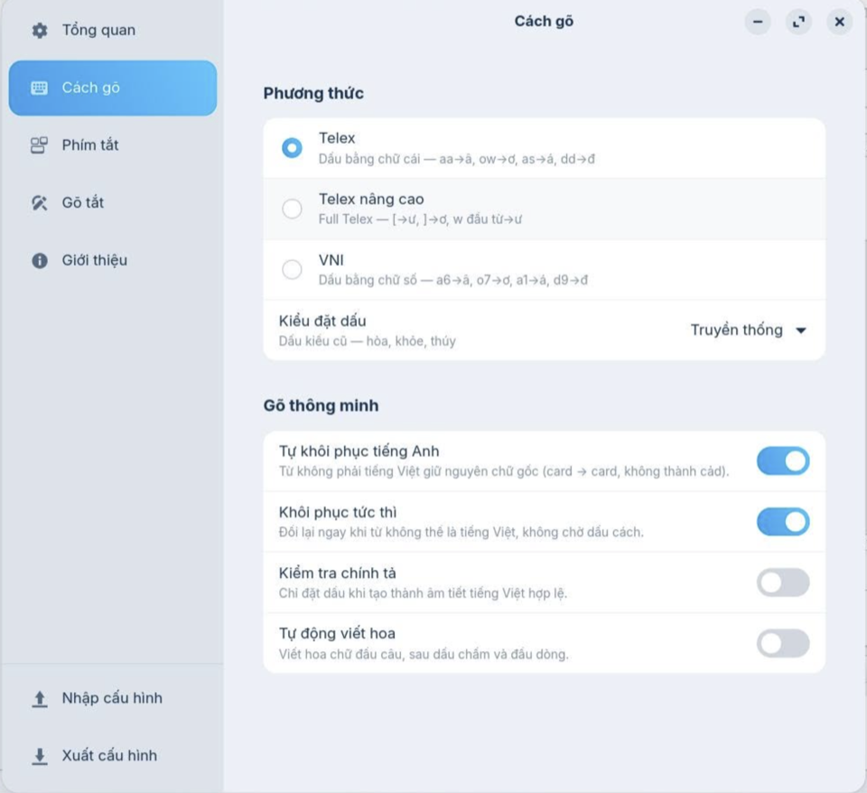

  <a href="README.md">Tiếng Việt</a> · <strong>English</strong>

  

---

  <strong>Funput</strong> is an open-source Vietnamese input method and keyboard that is lightweight and privacy-focused. 
  It supports Telex and VNI across iOS, Android, macOS, Windows, and Linux, delivering a familiar and consistent Vietnamese typing experience across all your devices.

## Get started

  
  
  

## Install by platform

  <table>
    <tr>
      <td align="center" valign="top" width="20%">
        <a href="https://apps.apple.com/vn/app/id6788829996">
          <picture>
            <source media="(prefers-color-scheme: dark)" srcset="https://funput.app/ios-dark.svg">
            
          </picture>
           <strong>iOS</strong> 
          App Store
        </a>
      </td>
      <td align="center" valign="top" width="20%">
        <a href="https://play.google.com/store/apps/details?id=app.funput.funput">
          <picture>
            <source media="(prefers-color-scheme: dark)" srcset="https://funput.app/android-dark.svg">
            
          </picture>
           <strong>Android</strong> 
          Google Play
        </a>
      </td>
      <td align="center" valign="top" width="20%">
        <a href="https://github.com/Funput/Funput/releases/latest">
          <picture>
            <source media="(prefers-color-scheme: dark)" srcset="https://funput.app/apple-dark.svg">
            
          </picture>
           <strong>macOS</strong> 
          Download
        </a>
      </td>
      <td align="center" valign="top" width="20%">
        <a href="https://github.com/Funput/Funput/releases/latest">
          <picture>
            <source media="(prefers-color-scheme: dark)" srcset="https://funput.app/windows-dark.svg">
            
          </picture>
           <strong>Windows</strong> 
          Download
        </a>
      </td>
      <td align="center" valign="top" width="20%">
        <a href="https://docs.funput.app/docs/install/linux">
          <picture>
            <source media="(prefers-color-scheme: dark)" srcset="https://funput.app/linux-dark.svg">
            
          </picture>
           <strong>Linux</strong> 
          Install guide
        </a>
      </td>
    </tr>
  </table>

## Interface

  <table>
    <tr>
      <td align="center" valign="middle" width="50%">
        
         <strong>iOS</strong>
      </td>
      <td align="center" valign="middle" width="50%">
        
         <strong>Android</strong>
      </td>
    </tr>
  </table>
  <table>
    <tr>
      <td align="center" valign="middle" width="33%">
        
         <strong>macOS</strong>
      </td>
      <td align="center" valign="middle" width="33%">
        
         <strong>Windows</strong>
      </td>
      <td align="center" valign="middle" width="33%">
        
         <strong>Linux</strong>
      </td>
    </tr>
  </table>

## Architecture

All five platforms share one Rust core. Each shell talks to the core through the
right bridge: [`funput-ffi`](crates/funput-ffi) (C ABI) for iOS, macOS, and Linux;
[`funput-jni`](crates/funput-jni) for Android; a direct
[`funput-engine`](crates/funput-engine) link for Windows.

  
   
  <a href="assets/design/architecture.png">Click for full-size image</a>

## Project status

Funput is under active development. Features and architecture may continue to
evolve during the project's early releases.

Bug reports, discussions, and contributions are welcome.

## Support

Funput is a community project — free for everyone.
If you find Funput useful, you're welcome to support the project via [GitHub Sponsors](https://github.com/sponsors/Funput) or bank transfer — or simply open the [repo](https://github.com/Funput/Funput) and click Star in the top right.

  
  

  
   
  Made with ❤️ by Funput

## Acknowledgements

Funput exists thanks to the community.
Special thanks to:

  <table>
    <tr>
      <td align="center" valign="top" width="33%">
        <a href="https://github.com/zenfas">
          
           <strong>zenfas</strong>
        </a>
      </td>
      <td align="center" valign="top" width="33%">
        <a href="https://github.com/quyleanh">
          
           <strong>Quy Le Anh</strong> 
          @quyleanh
        </a>
      </td>
      <td align="center" valign="top" width="33%">
        <a href="https://github.com/huyle0406">
          
           <strong>huyle0406</strong>
        </a>
      </td>
    </tr>
  </table>

## License

[MIT](LICENSE) — © Funput

