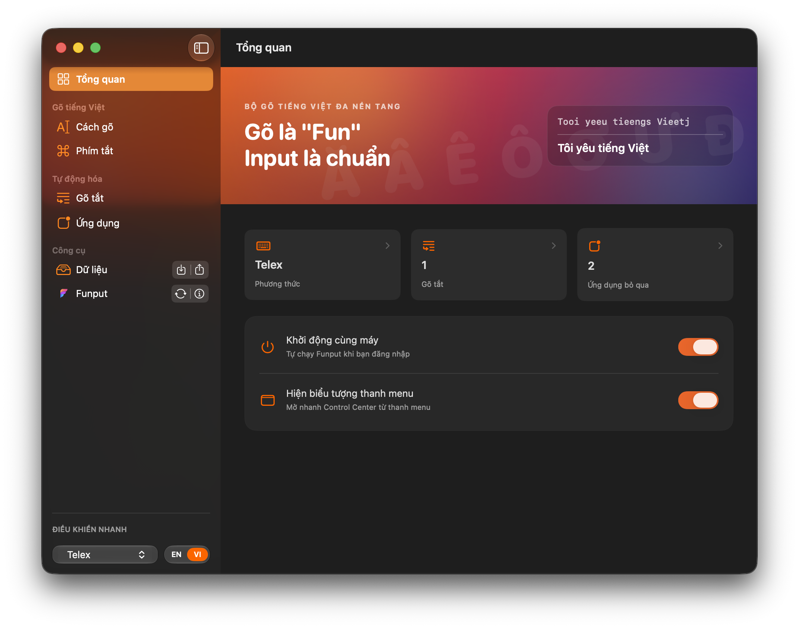

  <a href="README.md">Tiếng Việt</a> · <strong>English</strong>

  

<pre align="center">
   ███████╗██╗   ██╗███╗   ██╗██████╗ ██╗   ██╗████████╗
   ██╔════╝██║   ██║████╗  ██║██╔══██╗██║   ██║╚══██╔══╝
█████╗  ██║   ██║██╔██╗ ██║██████╔╝██║   ██║   ██║
██╔══╝  ██║   ██║██║╚██╗██║██╔═══╝ ██║   ██║   ██║
██║     ╚██████╔╝██║ ╚████║██║     ╚██████╔╝   ██║
╚═╝      ╚═════╝ ╚═╝  ╚═══╝╚═╝      ╚═════╝    ╚═╝
</pre>

---

**Funput** is an open-source Vietnamese input method released for macOS,
Windows, and Linux. Android is in closed testing on Google Play, with iOS
planned next. Every platform shares the same processing core to provide
consistent typing behavior across operating systems.

## Get started

  
  
  

## Supported platforms

  
  
  
   
  
  

## Interface

  
   
  Configure the input method, tone placement, and smart typing features on macOS.

## Performance

The core is written in Rust. Per-keystroke cost, measured with Criterion on a
release build:

| Component / API | Measured scope | Telex | VNI |
|---|---|---:|---:|
| [`funput-core::apply`](crates/funput-core) | Telex/VNI transformation core | 0.230 µs/key | 0.204 µs/key |
| [`funput-engine::Engine::process_char`](crates/funput-engine) | Full pipeline (boundaries + English restore) | 1.50 µs/key | 1.53 µs/key |
| [`funput-ffi::{funput_process_char, funput_buffer}`](crates/funput-ffi) | Engine through the C ABI + composed-buffer reads | 1.54 µs/key | 1.53 µs/key |

> Measured from a release build on an Apple M-series machine; covers Funput's own
> processing only (excludes OS keyboard-event delivery and host-app rendering).
> Numbers depend on hardware — re-run on yours.

See the [benchmark methodology, source code, and reproduction instructions](benchmarks/README.md).

## Project status

Funput is under active development. Features and architecture may continue to
evolve during the project's early releases.

Bug reports, discussions, and contributions are welcome.

## License

[MIT](LICENSE) — © Funput
