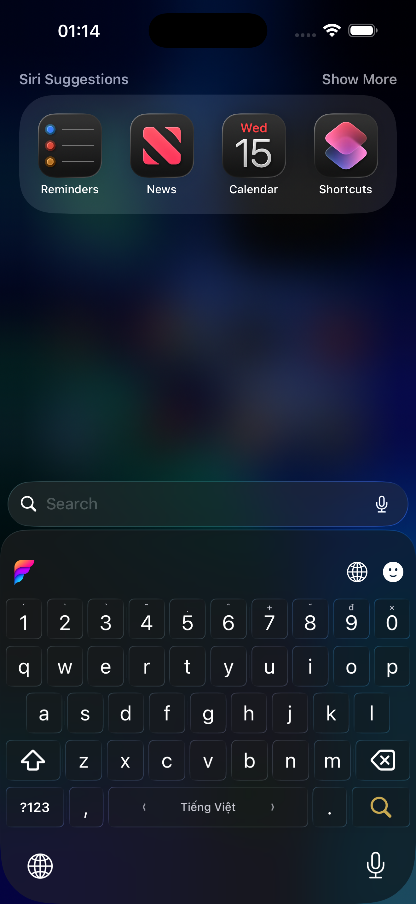

  <strong>Tiếng Việt</strong> · <a href="README.en.md">English</a>

  

<pre align="center">
   ███████╗██╗   ██╗███╗   ██╗██████╗ ██╗   ██╗████████╗
   ██╔════╝██║   ██║████╗  ██║██╔══██╗██║   ██║╚══██╔══╝
█████╗  ██║   ██║██╔██╗ ██║██████╔╝██║   ██║   ██║
██╔══╝  ██║   ██║██║╚██╗██║██╔═══╝ ██║   ██║   ██║
██║     ╚██████╔╝██║ ╚████║██║     ╚██████╔╝   ██║
╚═╝      ╚═════╝ ╚═╝  ╚═══╝╚═╝      ╚═════╝    ╚═╝
</pre>

---

**Funput** là bộ gõ tiếng Việt mã nguồn mở, hiện đã phát hành trên macOS,
Windows và Linux; phiên bản Android đang kiểm thử khép kín trên Google Play,
còn phiên bản iOS đang ở giai đoạn TestFlight beta. Mọi nền tảng dùng chung
một lõi xử lý để giữ hành vi gõ nhất quán.

## Bắt đầu

  
  
  

## Cài đặt theo nền tảng

| Nền tảng | Trạng thái | Cài đặt |
|---|---|---|
| macOS | Đã phát hành | [Tải bản mới nhất](https://github.com/Funput/Funput/releases/latest) |
| Windows | Đã phát hành | [Tải bản mới nhất](https://github.com/Funput/Funput/releases/latest) |
| Linux | Đã phát hành | [Xem hướng dẫn](https://docs.funput.app/) |
| Android | Kiểm thử khép kín | Chưa mở đăng ký công khai |
| iOS | TestFlight beta | [Tham gia TestFlight](https://testflight.apple.com/join/E8YRd3sy) |

## Giao diện

  
  &nbsp;&nbsp;
  
   
  Bàn phím Funput trên iOS và giao diện cài đặt trên macOS.

## Hiệu năng

Lõi xử lý viết bằng Rust. Chi phí mỗi phím, đo bằng Criterion trên release build:

| Thành phần / API | Phạm vi đo | Telex | VNI |
|---|---|---:|---:|
| [`funput-core::apply`](crates/funput-core) | Lõi biến đổi Telex/VNI | 0,054 µs/phím | 0,047 µs/phím |
| [`funput-engine::Engine::process_char`](crates/funput-engine) | Pipeline đầy đủ (boundary + English restore) | 0,11 µs/phím | 0,10 µs/phím |
| [`funput-ffi::{funput_process_char, funput_buffer}`](crates/funput-ffi) | Engine qua C ABI + đọc composed buffer | 0,12 µs/phím | 0,11 µs/phím |

> Đo trên release build, máy Apple M-series; chỉ gồm phần xử lý của Funput (không
> tính OS chuyển sự kiện bàn phím hay app đích render). Số phụ thuộc phần cứng —
> nên chạy lại trên máy bạn.

Xem [phương pháp đo benchmark](benchmarks/README.md).

## Trạng thái

Funput đang được phát triển tích cực. Tính năng và kiến trúc có thể tiếp tục thay đổi trong các phiên bản đầu.

Bug report, thảo luận và đóng góp đều được chào đón.

## License

[MIT](LICENSE) — © Funput
