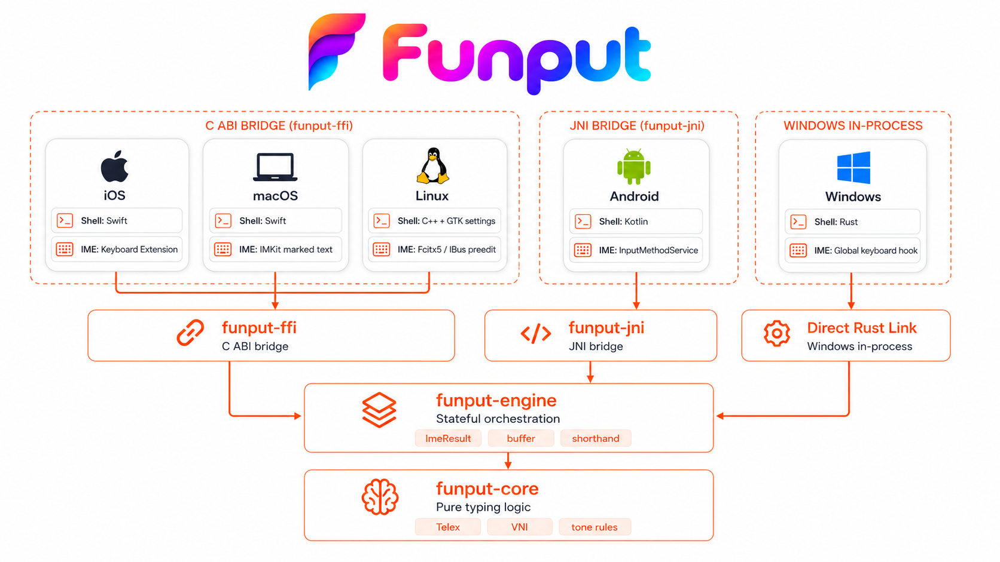

  <strong>Tiếng Việt</strong> · <a href="README.en.md">English</a>

  

---

  <strong>Funput</strong> là bộ gõ / bàn phím tiếng Việt mã nguồn mở, nhẹ và ưu tiên quyền riêng tư. 
  Hỗ trợ Telex và VNI trên iOS, Android, macOS, Windows và Linux, mang lại trải nghiệm gõ tiếng Việt quen thuộc và nhất quán trên mọi thiết bị.

## Bắt đầu

  
  
  

## Cài đặt theo nền tảng

| Nền tảng | Trạng thái | Cài đặt |
|---|---|---|
| iOS | Đã phát hành | [Tải trên App Store](https://apps.apple.com/vn/app/id6788829996) |
| macOS | Đã phát hành | [Tải bản mới nhất](https://github.com/Funput/Funput/releases/latest) |
| Windows | Đã phát hành | [Tải bản mới nhất](https://github.com/Funput/Funput/releases/latest) |
| Linux | Đã phát hành | [Xem hướng dẫn](https://docs.funput.app/docs/install/linux) |
| Android | Kiểm thử khép kín | [Gửi email để tham gia](mailto:hello@funput.app) |

> [!NOTE]
> Google Play yêu cầu kiểm thử khép kín đủ **14 ngày** với số tester tối thiểu trước khi xuất bản. Vòng trước chưa đạt ngưỡng đó, nên Funput phải chạy lại vòng 14 ngày.
>
> Nếu bạn dùng Android và muốn giúp đưa Funput lên Play Store, hãy gửi email tới [hello@funput.app](mailto:hello@funput.app) (nên dùng Gmail gắn với tài khoản Google Play). Chúng tôi sẽ mời bạn vào nhóm kiểm thử khép kín.

## Giao diện

  
  &nbsp;&nbsp;
  
   
  Bàn phím Funput trên iOS và Android.

  
  &nbsp;&nbsp;
  
   
  Giao diện cài đặt trên macOS và Windows.

## Kiến trúc

Năm nền tảng dùng chung lõi Rust. Mỗi shell giao tiếp với core qua bridge phù hợp:
[`funput-ffi`](crates/funput-ffi) (C ABI) cho iOS, macOS và Linux;
[`funput-jni`](crates/funput-jni) cho Android; link trực tiếp
[`funput-engine`](crates/funput-engine) cho Windows.

  
   
  <a href="assets/design/architecture.png">Nhấn để xem ảnh gốc</a>

## Trạng thái

Funput đang được phát triển tích cực. Tính năng và kiến trúc có thể tiếp tục thay đổi trong các phiên bản đầu.

Bug report, thảo luận và đóng góp đều được chào đón.

## Ủng hộ

Funput là dự án vì cộng đồng — miễn phí cho tất cả mọi người.
Nếu thấy Funput hữu ích, bạn có thể ủng hộ dự án qua [GitHub Sponsors](https://github.com/sponsors/Funput) hoặc chuyển khoản:

  

  
   
  Made with ❤️ by Funput

## License

[MIT](LICENSE) — © Funput

