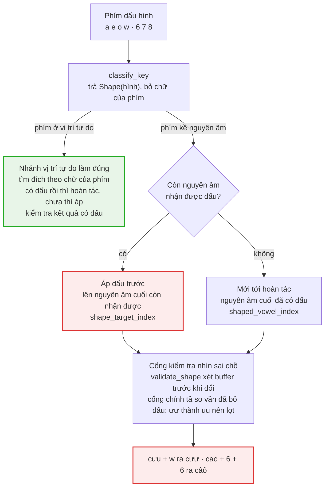
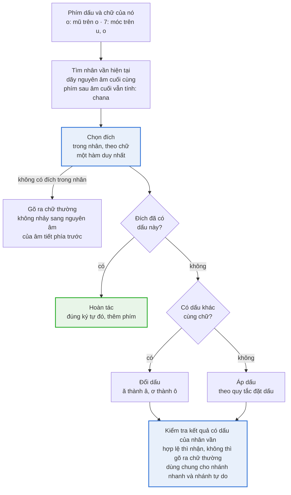
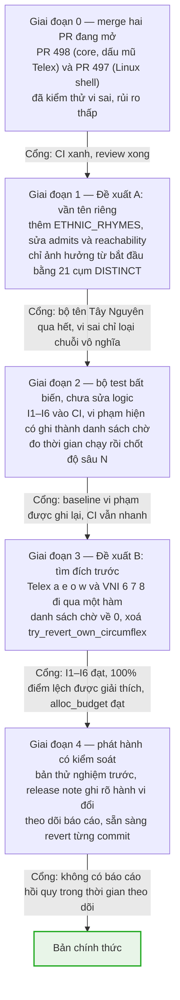

# Funput core: lỗi hoàn tác dấu & bộ kiểm tra âm tiết — hiện trạng và đề xuất

Cập nhật: 2026-09-28 · Trạng thái: đề xuất, chờ maintainer chốt D1–D6 (xem
[Các điểm cần quyết định](#các-điểm-cần-quyết-định))

## Tóm tắt

Rust core (`funput-core`) có hai lỗi liên quan tới nhau. PR #498 mới vá một biểu hiện;
nguyên nhân gốc vẫn còn, gặp ở cả Telex lẫn VNI, kể cả khi bật kiểm tra chính tả.

- **Lỗi 1 — phím dấu đặt sai đích, không hoàn tác.** Gõ lại một phím dấu lẽ ra hoàn tác
  dấu vừa đặt. Core lại đặt dấu lên nguyên âm khác: Telex `cuuww` → `cưư`, VNI `cao66` →
  `câô`, `khoe66` → `khôê`.
- **Lỗi 2 — bộ kiểm tra âm tiết chấp nhận chuỗi vô nghĩa** như `xrêô`, `hrâô`. Nguyên
  nhân là ngoại lệ cho tên riêng Tây Nguyên: sau cụm phụ âm đặc thù (`hr`, `rs`, `xr`,
  `kp`…), mọi vần đều được chấp nhận. Thực tế chỉ 4 tên cần nới vần.
- **Hai lỗi độc lập về nguyên nhân.** Lỗi 1 không do phần Tây Nguyên; chúng chỉ gặp nhau
  ở chỗ bộ kiểm tra lỏng không chặn được kết quả sai.

**Khuyến nghị:**

1. **A** — thay "mọi vần" bằng danh sách vần tên riêng có dẫn chứng. Nhỏ, cô lập, làm trước.
2. **B** — chuyển mọi phím dấu hình (Telex `a`/`e`/`o`/`w`, VNI `6`/`7`/`8`) sang mô hình
   "tìm đích trước, quyết định sau", giới hạn trong nhân vần hiện tại.
3. **C** — khoá hành vi bằng bộ test bất biến duyệt toàn bộ và kiểm thử vi sai với `main`.
   Mỗi bước một PR, một vòng beta.

## Bối cảnh

Tài liệu này chỉ bàn về `crates/funput-core`. Core dùng chung cho mọi nền tảng (Linux
IBus/Fcitx5, Windows, macOS, iOS, Android), nên mỗi thay đổi ở đây đến tay mọi người dùng
cùng lúc.

**Báo cáo gốc** (người dùng Debian, IBus): gõ Telex bị đặt dấu lung tung, "chữ `a` cạnh
chữ `o` thì thành `âô`". Ảnh chụp cho thấy `# Copy Hâdôp` trong VS Code, tức người dùng
gõ `Hadoop`. Họ cũng báo lỗi dấu cách và lặp chữ trong terminal; phần đó chưa tái hiện
được và nằm ngoài tài liệu này.

**Đã xác định:** engine chỉ ra `Hâdôp` khi nhận `Hadooop` (một chữ `o` bị nhận đúp), với
eager restore tắt và kiểm tra chính tả tắt. Phím `o` thứ ba lẽ ra hoàn tác `ô`, nhưng core
đặt dấu mũ lên `a`.

**Các PR liên quan:**

| PR | Phạm vi | Trạng thái |
| --- | --- | --- |
| [#498](https://github.com/Funput/Funput/pull/498) `fix(core)` | Telex: gõ lại `a`/`e`/`o` ngay sau nguyên âm có dấu mũ cùng chữ thì hoàn tác trước (`try_revert_own_circumflex`) | Mở, chờ review |
| [#497](https://github.com/Funput/Funput/pull/497) `fix(linux)` | Shell Linux, chế độ Gõ thẳng: ⌫⌫ liên tiếp trên Chrome ra `goõ`. Không chạm core | Mở, chờ review |

PR #498 an toàn để merge: kiểm thử vi sai trên khoảng 56,8 triệu chuỗi phím cho thấy mọi
thay đổi đều đúng mẫu dự kiến. Nhưng nó chỉ chữa dấu mũ Telex; đề xuất B bên dưới sẽ bao
trùm nó.

## Hiện trạng lỗi 1 — phím dấu đặt sai đích

Với cấu hình mặc định, gõ đúp phím dấu móc (Telex `w`) hoặc bất kỳ phím dấu hình nào của
VNI (`6`/`7`/`8`) đều có thể ra chữ sai. Đây là thao tác người dùng cố ý làm để bỏ dấu,
và cũng là điều xảy ra khi bàn phím hoặc IBus gửi phím hai lần.

**Tái hiện qua engine** (nhánh `fix/core-telex-circumflex-revert`, đã có PR #498):

| Kiểu gõ | Phím | Mặc định | Tắt eager restore | Đúng ra |
| --- | --- | --- | --- | --- |
| Telex | `cuuww` | `cưư` | `cưư` | `cuuw` |
| Telex | `huouww` | `hươư` | `hươư` | `huouw` |
| VNI | `cuu77` | `cưư` | `cưư` | `cuu7` |
| VNI | `cuu277` | `cừư` | `cừư` | `cùu7` |
| VNI | `hoe66` | `hôê` | `hôê` | `hoe6` |
| VNI | `khoe66` | `khôê` | `khôê` | `khoe6` |
| VNI | `cao66` | `câô` | `câô` | `cao6` |
| VNI | `toa66` | `tôâ` | `tôâ` | `toa6` |
| VNI | `hado66` | `hado66` | `hâdô` | `hado6` |

Bật kiểm tra chính tả không chặn được các ca này: gọi thẳng `apply_checked` với
`spell_check = true` cho cùng kết quả. Ca dấu mũ Telex của báo cáo gốc (`Hadooop`,
`caooo`) đã được PR #498 sửa.

**Đo toàn bộ.** Duyệt mọi buffer đạt được bằng tối đa 5 phím, kiểm bất biến "áp dấu xong,
gõ lại đúng phím đó thì hoàn tác đúng vị trí vừa đổi". Có 121.652 vi phạm trên 770.329
lần áp dấu khi tắt kiểm tra chính tả, và 17.810 trên 75.111 khi bật.

| Nhóm phím (tắt kiểm tra chính tả) | Vi phạm | Ghi chú |
| --- | --- | --- |
| VNI `6` | 44.235 | Dấu mũ thứ hai trong nhân: `coè` → `coề` → `côề` |
| VNI `7` | 21.506 | Dấu móc thứ hai: `cùu` → `cừu` → `cừư` |
| Telex `w` | 19.196 | Cùng kiểu với VNI `7` |
| VNI `8` | 8.166 | Dấu trăng thứ hai: `uaa` → `uaă` → `uăă` |
| Telex / VNI chữ thường | 897 | Phần lớn là đổi dấu có chủ đích (`ă` + `a` → `â`), cần lọc |
| Telex `z` | 27.652 | Không phải lỗi: `z` xoá thanh, không có khái niệm hoàn tác |

Con số trên là cận trên: phép đo còn gộp cả hành vi có chủ đích. Bộ bất biến chính xác ở
phần [Bất biến và chiến lược kiểm thử](#bất-biến-và-chiến-lược-kiểm-thử) sẽ tách rõ hai
loại.

## Nguyên nhân gốc lỗi 1

Core tách bước chọn đích và bước quyết định áp hay hoàn tác, mỗi bước dùng một hàm tìm
đích riêng. Phím dấu thứ hai vì thế tìm ra một đích mới thay vì quay lại đích cũ.



Nhánh xanh là mô hình đúng đã có sẵn trong core; nhánh nhanh (phím gõ ngay sau nguyên âm)
không dùng lại nó.

**Bốn điểm gây lỗi, kèm vị trí trong code** (đường dẫn tính từ `crates/funput-core/src/`):

1. **Mất chữ của phím.** `input_method/telex/modifiers/circumflex.rs::classify` biết phím
   là `o` nhưng trả `KeyAction::Shape(Circumflex)`. Telex `w` và VNI `6`/`7`/`8` đi cùng
   đường đó.
2. **Áp dấu được xét trước hoàn tác, với hai hàm tìm đích khác nhau.**
   `composition/transform/action.rs::shape()` gọi `shape_apply_target_exists` rồi
   `apply_shape_key`, tức `unicode/shapes.rs::shape_target_index` (nguyên âm cuối còn nhận
   được dấu). Chỉ khi không còn đích đó mới tới `composition/revert.rs::try_revert_shape`,
   tức `shaped_vowel_index` (nguyên âm cuối đã có dấu). Ví dụ `cưu` + `w`: `ư` không nhận
   thêm móc, nhưng `u` cuối thì được, nên ra `cưư`.
3. **Không giới hạn đích trong nhân vần.** `shape_target_index` duyệt cả buffer. Dấu có thể
   nhảy qua phụ âm sang "âm tiết" trước (`hadô` → `hâdô`), hoặc thành dấu thứ hai trong
   cùng nhân (`câô`).
4. **Cổng kiểm tra nhìn sai chỗ.** `validation/syllable/modifier.rs::validate_shape` xét
   buffer *trước* khi đổi. `composition/transform/gates.rs::spell_check` gọi
   `is_definitely_invalid`, vốn so vần *đã bỏ dấu* (`plain_base`): `ưư` thành `uu`, trùng
   dạng bỏ dấu của `ưu`, nên lọt qua.

**Mô hình đúng đã có sẵn.** `composition/intent/kinds/circumflex.rs::resolve` tìm đích bằng
`rightmost_stem` theo chữ của phím. Đích đã có mũ thì hoàn tác; chưa có thì dựng ứng viên
và kiểm tra bằng `is_viable_shape_candidate`, so vần có dấu chính xác. PR #498 chỉ chèn một
bước hoàn tác riêng cho dấu mũ Telex vào nhánh nhanh.

## Hiện trạng lỗi 2 — bộ kiểm tra âm tiết quá lỏng

`is_complete_syllable` coi `xrêô`, `hrâô`, `rsêÔ` là âm tiết hoàn chỉnh. Kiểm thử vi sai
tìm ra 48 chuỗi như vậy, đều có dạng cụm `hr`/`rs`/`xr` cộng hai nguyên âm mang dấu mũ.

**Cơ chế.** `validation/ethnic/clusters.rs` chia cụm phụ âm của tên riêng Tây Nguyên làm
hai loại, mỗi cụm kèm một tên thật (xem thêm [place-names.md](../features/place-names.md)):

- **`SHARED`** (12 cụm tiếng Anh cũng có: `kr`, `pl`, `dr`…): vần vẫn phải là vần tiếng
  Việt, để `draw` còn khôi phục được.
- **`DISTINCT`** (21 cụm tiếng Anh không có: `hr`, `rs`, `xr`, `kp`, `xt`…):
  `ethnic::admits()` trả `true`, và `validation/syllable/status.rs` chấp nhận **mọi vần**.
  `validation/reachability.rs::is_name_rhyme` cũng vậy, nên eager restore không bao giờ
  kích hoạt sau những cụm này.

Phần "cụm đặc thù chứng tỏ đây là tên riêng" là đúng. Phần sai là suy ra "nên vần nào
cũng được".

**Tên nào thực sự cần nới vần?** Tắt quy tắc "mọi vần" rồi kiểm danh sách tên trong
module: chỉ 4 tên mất hiệu lực.

| Tên | Cụm | Vần | Vì sao bảng vần tiếng Việt không có |
| --- | --- | --- | --- |
| Kpă | `kp` | `ă` | `ă` chỉ đứng trước phụ âm cuối (`ăn`, `ăm`) |
| Dliê | `dl` | `iê` | `iê` cần phụ âm cuối hoặc `u` (`iên`, `iêu`) |
| Tbuăn | `tb` | `uăn` | tiếng Việt viết `oăn` |
| Hning | `hn` | `ing` | tiếng Việt viết `inh` |

Các tên còn lại (Hrê, Xrê, Ia Rsươm, Xtiêng, Rlâm, Kđrao…) đều dùng vần có sẵn. `Mđhur`
và `Ktul` đi đường âm cuối `h`/`l`/`r` riêng của VNI (`closes_with_name_final`), không phụ
thuộc quy tắc này. `Hning` có trong `clusters.rs` nhưng chưa có trong test, nên hiện chỉ
sống nhờ quy tắc "mọi vần".

**Mức ảnh hưởng:** thấp, vì chỉ từ bắt đầu bằng một trong 21 cụm mới bị ảnh hưởng. Lỗi 1
không đi qua đường này: `cưư` lọt vì cổng chính tả so vần đã bỏ dấu, không phải vì ngoại
lệ tên riêng.

## Đề xuất A — thu hẹp ngoại lệ tên Tây Nguyên

Giữ nguyên hai danh sách cụm phụ âm. Thay quy tắc "sau cụm `DISTINCT` thì mọi vần đều hợp
lệ" bằng "sau cụm `DISTINCT`, vần phải là vần tiếng Việt hoặc vần tên riêng đã có dẫn
chứng".

**Thay đổi**

1. Thêm danh sách vần tên riêng vào `validation/ethnic/`, cùng phong cách `clusters.rs`:
   mỗi vần kèm tên cần nó, chỉ thêm khi có tên.
2. Đổi `admits(onset)` thành `admits(onset, rhyme)`: đúng khi onset là cụm `DISTINCT`
   **và** vần nằm trong `ETHNIC_RHYMES`. Vần tiếng Việt đã được `is_valid_rhyme` chấp nhận
   từ trước.
3. `validation/syllable/status.rs` truyền vần không thanh vào `admits`.
4. `validation/reachability.rs::is_name_rhyme` kiểm tiền tố **đã bỏ dấu** của
   `ETHNIC_RHYMES`, giống cách nó kiểm bảng vần chính. Thiếu bước này, eager restore sẽ
   giết `Hning` giữa chừng, vì `ing` không là tiền tố của vần tiếng Việt nào.
5. `SHARED` giữ nguyên.

```rust
/// Rhymes only Tây Nguyên names use. Every entry cites the name that needs it;
/// a rhyme is added only with one.
const ETHNIC_RHYMES: &[&str] = &[
    "ă",   // Kpă
    "iê",  // Cư Dliê M'nông
    "uăn", // Tbuăn
    "ing", // Hning
];
```

**Kiểm chứng trước khi merge**

- Test hiện có `place_names_are_complete_syllables` vẫn qua; thêm `Hning` vào danh sách.
- Test mới: `hrâô`, `xrêô`, `rsêÔ`, `kpâô`, `hrưư` không còn là âm tiết hoàn chỉnh, và
  `is_definitely_invalid` trả `true`.
- Kiểm thử vi sai `is_complete_syllable` / `is_definitely_invalid` với `main` trên mọi
  chuỗi sinh ra: mọi khác biệt phải là "hoàn chỉnh → không", với onset `DISTINCT` và vần
  ngoài hai bảng.
- `tests/spellcheck_corpus.rs` và corpus Telex không đổi.

**Rủi ro**

| Rủi ro | Hậu quả | Giảm thiểu |
| --- | --- | --- |
| Có tên thật dùng vần chưa liệt kê | Tên đó bị khôi phục về phím thô | Lập bộ tên xã/huyện của 5 tỉnh Tây Nguyên làm test trước khi merge |
| Kiểm tiền tố sai ở `reachability` | Eager restore cắt tên giữa chừng | Test gõ từng phím cho cả 4 tên, cả Telex lẫn VNI |

Phạm vi ảnh hưởng chỉ gồm chuỗi bắt đầu bằng 21 cụm `DISTINCT`. Không từ tiếng Việt chuẩn
nào đi qua đường này, vì onset gốc không bao giờ là cụm.

## Đề xuất B — tìm đích trước, quyết định sau

Mọi phím dấu hình đi qua một hàm duy nhất: xác định nhân vần hiện tại, chọn đích trong nhân
theo chữ của phím, rồi mới quyết định hoàn tác, đổi dấu hay áp dấu. Gõ lại cùng phím vì
thế luôn quay về đúng ký tự vừa đổi.



Nhánh nhanh (phím gõ ngay sau nguyên âm) chỉ còn là đường tắt của cùng hàm này, và phải
cho kết quả giống hệt.

**Quy tắc chi tiết**

| Bước | Quy tắc | Ví dụ phải giữ nguyên |
| --- | --- | --- |
| Phân loại phím | `KeyAction::Shape` mang theo chữ của phím. Telex `a`/`e`/`o`: mũ trên đúng chữ đó. Telex `w`: móc trên `u`/`o`, trăng trên `a`. VNI `6`: mũ trên `a`/`e`/`o`; `7`: móc; `8`: trăng | Bảng phím không đổi |
| Nhân vần | Dãy nguyên âm cuối của buffer, sau onset (kể cả glide `qu`/`gi`). Phím đến sau phụ âm cuối vẫn nhắm nhân đó | `chana` → `chân`, `tieengs` → `tiếng` |
| Hoàn tác | Nhân đã có dấu này trên chữ phù hợp: bỏ dấu đúng ký tự đó, thêm phím, trả `Reverted` | `aaa` → `aa`, `ươ` + `7` → `uo7` |
| Đổi dấu | Cùng chữ nhưng mang dấu khác: đổi | `ă` + `a` → `â`, `chặn` + `a` → `chận` |
| Áp dấu | Chưa có: áp theo quy tắc đặt dấu hiện có | `muoi6` → `muôi`, `cuu` + `w` → `cưu`, `uo` + `w` → `ươ` |
| Không có đích | Gõ ra chữ thường; không bao giờ nhảy sang nguyên âm ngoài nhân | Mới |
| Kiểm tra | Kiểm tra **kết quả có dấu** của nhân vần, không xét buffer trước khi đổi hay dạng đã bỏ dấu | Mới cho nhánh nhanh |

**Gợi ý hiện thực** (để agent cân nhắc, không bắt buộc):

- Mở rộng `composition/intent/` (đã có `Target`, `rightmost_stem`, `candidate`) thành nơi
  duy nhất quyết định. `transform/action.rs::shape()` gọi vào đó thay cho cặp
  `shape_apply_target_exists` / `try_revert_shape`.
- Thêm hàm xác định phạm vi nhân vần (dãy nguyên âm cuối, trừ nguyên âm thuộc glide
  `qu`/`gi`). `rightmost_stem` hiện quét cả buffer; giới hạn nó vào phạm vi này.
- Giữ nguyên các quy tắc đặt dấu: `apply_uo_compound`, `try_revert_uo_compound`,
  `reposition_existing_tone`, `normalize_horned_uo_open`, đích móc trên `uu` là `u` đầu.
- `try_revert_own_circumflex` của PR #498 trở thành một trường hợp của bước Hoàn tác và có
  thể xoá.
- Đây là đường nóng mỗi phím: không cấp phát thêm ngoài chuỗi kết quả.
  `crates/funput-engine/tests/alloc_budget.rs` phải qua.

**Ngoài phạm vi B:** dấu thanh (`s f r x j`, `1`–`5`) đã dùng một hàm vị trí chung cho cả
áp và hoàn tác; phím `d`/`9`; phím `z`; phím tắt `[` `]` của Telex+. Bộ bất biến ở phần sau
vẫn chạy trên chúng để bắt lỗi nếu có.

## Bất biến và chiến lược kiểm thử

Mọi hành vi mới được khoá bằng bất biến chạy trên toàn bộ buffer có thể đạt tới. Mọi khác
biệt so với `main` phải được giải thích trước khi merge.

**Bất biến**

| Mã | Phát biểu | Áp dụng cho | Hiện trạng |
| --- | --- | --- | --- |
| I1 — Phạm vi | Phím dấu hình không đổi ký tự nào ngoài nhân vần hiện tại | Telex `a` `e` `o` `w`, VNI `6` `7` `8` | Vi phạm: `hado66` → `hâdô` |
| I2 — Đúng chữ | Telex `a`/`e`/`o` chỉ đổi nguyên âm cùng chữ | Telex, Telex+ | Đạt sau PR #498 |
| I3 — Hoàn tác | `apply(b, k)` là `Applied` và chỉ thêm dấu hình, thì `apply(t, k)` là `Reverted`, chỉ đổi lại đúng các vị trí đó rồi thêm `k` | Phím dấu hình, trừ đổi dấu có chủ đích | Vi phạm: `cưu` + `w`, `coề` + `6` |
| I4 — Một dấu | Một nhân vần không có hai nguyên âm cùng mang mũ, cùng mang trăng, hay cùng mang móc (trừ cặp `ươ`) | Mọi kết quả `Applied` | Vi phạm: `cưư`, `câô`, `hôê` |
| I5 — Không thoái lui | Mọi từ trong corpus cho kết quả y hệt `main` | `tests/telex/data/telex_corpus.tsv`, `tests/spellcheck_corpus.rs` | Đạt |
| I6 — Vần có thật | `is_complete_syllable` đúng thì vần nằm trong `VALID_RHYMES` hoặc `ETHNIC_RHYMES` | Bộ kiểm tra âm tiết | Vi phạm: 48 chuỗi |

**Ba lớp kiểm thử**

1. **Test theo ca.** Bảng tái hiện ở phần Hiện trạng trở thành test trong
   `tests/telex/basic.rs` và `tests/vni/basic.rs`, chạy cả khi bật và tắt kiểm tra chính
   tả. Thêm test qua engine (`crates/funput-engine/tests/`) cho tương tác với eager
   restore: hoàn tác đồng bộ lại `keys`, và `text`, `cool`, `draw` vẫn khôi phục về tiếng
   Anh.
2. **Test bất biến duyệt toàn bộ.** Sinh mọi buffer đạt được bằng tối đa N phím trên bảng
   chữ rút gọn (Telex `hadoeuiwsfrxjznc`, VNI `hadoeuinc6789123`), kiểm I1–I4 ở mỗi lần áp
   dấu. CI chạy N = 4; trước mỗi PR core chạy tay N = 6 bằng
   `cargo test --release -- --ignored`. Đặt trong `crates/funput-core/tests/`, vốn không
   tính vào giới hạn 150 dòng.
3. **Kiểm thử vi sai với `main`.** Sinh mọi chuỗi phím tối đa 6 phím cho cả ba kiểu gõ, bật
   và tắt chính tả (khoảng 56,8 triệu chuỗi). Chạy qua core cũ và mới, lọc **điểm lệch đầu
   tiên** rồi phân loại. Không đưa vào CI vì quá nặng; kết quả dán vào mô tả PR.

**Tiêu chí merge:** 100% điểm lệch phải thuộc nhóm "trước đây vi phạm I1–I4 hoặc I6", hoặc
một nhóm được liệt kê có chủ đích trong PR. PR #498 đã qua tiêu chí này: cả 93.914 điểm lệch
đầu tiên đều đúng mẫu dự kiến.

## Kế hoạch triển khai và giảm rủi ro khi release

Chia thành năm giai đoạn, mỗi giai đoạn một PR và một cổng kiểm tra. Test đi trước code: bộ
bất biến vào CI trước khi đổi logic, để thấy rõ mỗi thay đổi sửa được gì.



Giai đoạn 1 và 2 độc lập với nhau, có thể làm song song. Giai đoạn 3 chỉ bắt đầu khi giai
đoạn 2 đã vào `main`.

**Nguyên tắc giảm impact**

- **Mỗi PR một thay đổi hành vi.** Commit nhỏ, revert được độc lập. Không gộp A với B.
- **Không đổi API công khai của `funput-core`** (`apply`, `apply_checked`,
  `is_complete_syllable`, `is_reopenable_syllable`, `is_definitely_invalid`…).
  `funput-ffi`, `funput-jni` và các nền tảng đều gọi chúng.
- **Không đổi English restore.** `text`, `cool`, `draw`, `know` phải khôi phục y như cũ; có
  test riêng cho từng từ.
- **Mọi hành vi đổi đều được liệt kê** trong mô tả PR và release note, kèm ví dụ trước/sau
  như bảng ở phần Hiện trạng.
- **Kiểm trên nền tảng thật trước khi merge B.** Tối thiểu Linux IBus và Fcitx5 (đã có quy
  trình build gói thử `+retonefixN`), cộng một nền tảng khác; gõ lại bảng ca tái hiện bằng
  tay.
- **Sau phát hành:** gom báo cáo "đặt dấu sai / hoàn tác" dưới một nhãn issue riêng. Nếu có
  hồi quy, revert commit của giai đoạn tương ứng thay vì vá nóng.

## Các điểm cần quyết định

Sáu câu hỏi cần maintainer chốt trước khi agent bắt đầu. Agent không tự chọn thay; mục nào
còn "Chưa chốt" thì dừng lại hỏi.

| Mã | Câu hỏi | Khuyến nghị | Quyết định |
| --- | --- | --- | --- |
| D1 | Merge PR #498 ngay hay đợi Đề xuất B? | Merge ngay: an toàn, sửa đúng lỗi người dùng báo; B sẽ bao trùm sau | Chưa chốt |
| D2 | Khi **tắt** kiểm tra chính tả, có kiểm tra nhân vần sau khi áp dấu không? | Lúc này chỉ chặn hai dấu cùng loại (I4): `câô` bị chặn, `caô` giữ nguyên. Kiểm tra đầy đủ (`caoo` ra `caoo`) để thành quyết định riêng sau | Chưa chốt |
| D3 | Lấy danh sách tên Tây Nguyên ở đâu để test Đề xuất A? | Danh mục đơn vị hành chính cấp xã của Đắk Lắk, Đắk Nông, Gia Lai, Kon Tum, Lâm Đồng, cộng tên các dân tộc; maintainer chỉ nguồn | Chưa chốt |
| D4 | Có kênh phát hành thử nghiệm cho từng nền tảng không? | Nếu có, B đi kênh đó trước. Nếu không, phát hành B trong một bản vá riêng, không kèm tính năng khác | Chưa chốt |
| D5 | Độ sâu N của test bất biến trong CI và ngân sách thời gian | N = 4 trong CI; N = 6 chạy tay trước mỗi PR core. Chốt sau khi đo ở giai đoạn 2 | Chưa chốt |
| D6 | Phạm vi B có gồm phím tắt `[` `]` của Telex+ không? | Không. Chỉ để bất biến theo dõi; sửa nếu bất biến báo lỗi | Chưa chốt |

## Hướng dẫn cho AI agent thực hiện

Làm đúng một giai đoạn mỗi lần, theo thứ tự ở phần Kế hoạch. Trước khi viết code, đọc lại
phần Các điểm cần quyết định; mục nào còn "Chưa chốt" thì hỏi maintainer, không tự chọn.

**Repo và vị trí**

- Repo `Funput/Funput`; workspace Cargo nằm ở gốc repo. Mọi đường dẫn dưới đây tính từ gốc
  repo.
- Tạo nhánh mới từ `main` mới nhất cho mỗi giai đoạn, ví dụ `fix/core-ethnic-rhymes`,
  `test/core-modifier-invariants`, `fix/core-shape-target-first`.

| Giai đoạn | File chính (trong `crates/funput-core/`) | Test |
| --- | --- | --- |
| 1 — Đề xuất A | `src/validation/ethnic/mod.rs`, `src/validation/ethnic/clusters.rs` (hoặc file mới cùng thư mục), `src/validation/syllable/status.rs`, `src/validation/reachability.rs` | `src/validation/ethnic/tests.rs` |
| 2 — Bất biến | Không sửa `src/` | Thư mục mới trong `tests/`, ví dụ `tests/invariants/` |
| 3 — Đề xuất B | `src/composition/transform/action.rs`, `src/composition/intent/` (`target.rs`, `kinds/`), `src/composition/revert.rs`, `src/input_method/telex/modifiers/`, `src/input_method/vni.rs`, `src/unicode/shapes.rs` | `tests/telex/basic.rs`, `tests/vni/basic.rs`, `crates/funput-engine/tests/` |

**Lệnh phải qua trước mỗi commit**

```bash
cargo fmt --all -- --check
cargo clippy --workspace --all-targets -- -D warnings
cargo test --workspace
bash scripts/check-loc.sh
```

Nếu có thư mục build CMake với `FUNPUT_BUILD_TESTS=ON`, chạy thêm bộ test Linux chung
(`platforms/linux/common/tests`). Bộ này gọi core thật qua FFI.

**Ràng buộc của repo**

- `scripts/check-loc.sh`: mỗi file nguồn Rust và C++ Linux tối đa 150 dòng code. Module test
  nội tuyến `#[cfg(test)]` ở cuối file và thư mục `tests/` không tính. File vượt thì tách
  submodule, không nén code.
- Comment trong code viết bằng tiếng Anh, giải thích *vì sao*, kèm ví dụ phím cụ thể, theo
  phong cách sẵn có của core.
- Commit theo Conventional Commits bằng tiếng Anh (`fix(core): …`, `test(core): …`), thân
  commit giải thích nguyên nhân và cách sửa.
- Tiêu đề PR bằng tiếng Anh, **mô tả PR bằng tiếng Việt**, theo thứ tự: triệu chứng, nguyên
  nhân, thay đổi, phạm vi, kiểm tra. Mô tả PR phải có bảng trước/sau và kết quả kiểm thử vi
  sai.

**Không được làm**

- Đổi chữ ký hoặc ý nghĩa hàm công khai của `funput-core` hay `funput-engine`.
- Sửa `VALID_RHYMES`, danh sách cụm `SHARED`/`DISTINCT`, hoặc hành vi English restore.
- Gộp hai giai đoạn vào một PR, hoặc sửa logic trong PR của giai đoạn 2.
- Tắt, xóa hay nới test có sẵn để PR xanh. Test cũ fail thì dừng lại và báo cáo.
- Commit thẳng lên `main`, tự merge, hoặc bật auto-merge.
- Thêm dependency mới vào `funput-core`.

**Khi xong mỗi giai đoạn,** báo lại: link PR, số điểm lệch khi so với `main` theo từng nhóm,
và mọi hành vi đổi ngoài dự kiến.

## Phụ lục — số liệu, lệnh và script tái hiện

Mọi số liệu trong tài liệu đo trên Ubuntu 26.04, rustc 1.98.1, `main` tại `ee98fb6d` và
nhánh `fix/core-telex-circumflex-revert` tại `d9741727` (PR #498).

| Phép đo | Kết quả |
| --- | --- |
| Vi sai `main` với PR #498, chuỗi ≤ 6 phím | 56.843.400 chuỗi; 197.766 khác kết quả; 93.914 điểm lệch đầu tiên, 100% đúng mẫu; VNI không đổi |
| Bất biến hoàn tác (I3), buffer ≤ 5 phím, tắt chính tả | 121.652 vi phạm / 770.329 lần áp dấu |
| Bất biến hoàn tác (I3), bật chính tả | 17.810 vi phạm / 75.111 lần áp dấu |
| Chuỗi vô nghĩa được coi là âm tiết hoàn chỉnh | 48 (đều sau `hr`/`rs`/`xr`) |
| Tên mất hiệu lực khi bỏ quy tắc "mọi vần" | 4: Kpă, Dliê, Tbuăn, Hning |

**Kiểm thử vi sai.** Đặt file dưới đây làm example tạm
`crates/funput-core/examples/zz_diffgen.rs` ở cả hai bản (bản `main` lấy bằng
`git worktree add <thư mục> main`), chạy mỗi bản ra một file TSV, rồi `paste` hai file và
giữ dòng có cột kết quả khác nhau. Điểm lệch đầu tiên là dòng khác mà chuỗi phím bỏ phím
cuối không khác. Xoá example trước khi commit.

```rust
use funput_core::{apply_checked, InputMethod, ToneStyle};
use std::io::Write;
fn main() {
    let alphabet: Vec<char> = "hadoeOAsfjrxwz6".chars().collect();
    let out = std::io::stdout();
    let mut out = std::io::BufWriter::new(out.lock());
    for (name, m) in [("telex", InputMethod::Telex), ("adv", InputMethod::TelexAdvanced), ("vni", InputMethod::Vni)] {
        for spell in [false, true] {
            let mut stack: Vec<(String, String)> = vec![(String::new(), String::new())];
            while let Some((keys, buf)) = stack.pop() {
                if !keys.is_empty() {
                    writeln!(out, "{name}\t{spell}\t{keys}\t{buf}").unwrap();
                }
                if keys.len() >= 6 { continue; }
                for &c in &alphabet {
                    if m != InputMethod::Vni && c == '6' { continue; }
                    let r = apply_checked(&buf, c, m, ToneStyle::Modern, spell);
                    let mut k = keys.clone();
                    k.push(c);
                    stack.push((k, r.text));
                }
            }
        }
    }
}
```

```bash
cargo run -q --release -p funput-core --example zz_diffgen > new.tsv
(cd <worktree main> && cargo run -q --release -p funput-core --example zz_diffgen > old.tsv)
paste old.tsv new.tsv | awk -F'\t' '$4 != $8 {print $1"\t"$2"\t"$3"\told="$4"\tnew="$8}' > diff.tsv
```

**Bất biến hoàn tác (I3), bản đo nhanh.** Bản này còn gộp cả `z` và đổi dấu có chủ đích;
bản trong CI phải loại chúng ra.

```rust
use funput_core::{apply_checked, InputMethod, ToneStyle, TransformKind};
use std::collections::HashSet;
fn main() {
    let spell = std::env::args().nth(1).as_deref() == Some("spell");
    for (m, alpha) in [(InputMethod::Telex, "hadoeuiwsfrxjznc"), (InputMethod::Vni, "hadoeuinc6789123")] {
        let keys: Vec<char> = alpha.chars().collect();
        let (mut seen, mut stack) = (HashSet::new(), vec![(String::new(), 0usize)]);
        let (mut checked, mut bad) = (0usize, 0usize);
        while let Some((buf, depth)) = stack.pop() {
            if !seen.insert(buf.clone()) { continue; }
            for &k in &keys {
                let r1 = apply_checked(&buf, k, m, ToneStyle::Modern, spell);
                if depth < 5 { stack.push((r1.text.clone(), depth + 1)); }
                if r1.kind != TransformKind::Applied { continue; }
                let (b, t): (Vec<char>, Vec<char>) = (buf.chars().collect(), r1.text.chars().collect());
                if b.len() != t.len() { continue; }
                let changed: Vec<usize> = (0..b.len()).filter(|&i| b[i] != t[i]).collect();
                if changed.is_empty() { continue; }
                checked += 1;
                let r2 = apply_checked(&r1.text, k, m, ToneStyle::Modern, spell);
                let mut r: Vec<char> = r2.text.chars().collect();
                let ok = r2.kind == TransformKind::Reverted
                    && r.pop() == Some(k)
                    && r.len() == t.len()
                    && (0..t.len()).filter(|&i| t[i] != r[i]).all(|i| changed.contains(&i));
                if !ok { bad += 1; }
            }
        }
        println!("{m:?} spell={spell}: {bad} vi phạm / {checked}");
    }
}
```

**Tái hiện nhanh bằng engine.** Gọi `Engine::new()`, `set_method(...)`, rồi `process_char`
từng phím. Áp `ImeResult` vào một chuỗi: `Action::None` thì nối phím, ngược lại xoá
`backspace` ký tự rồi nối `output`. Chuỗi cuối cùng chính là thứ người dùng thấy; bảng ở
phần Hiện trạng được đo theo cách này.
