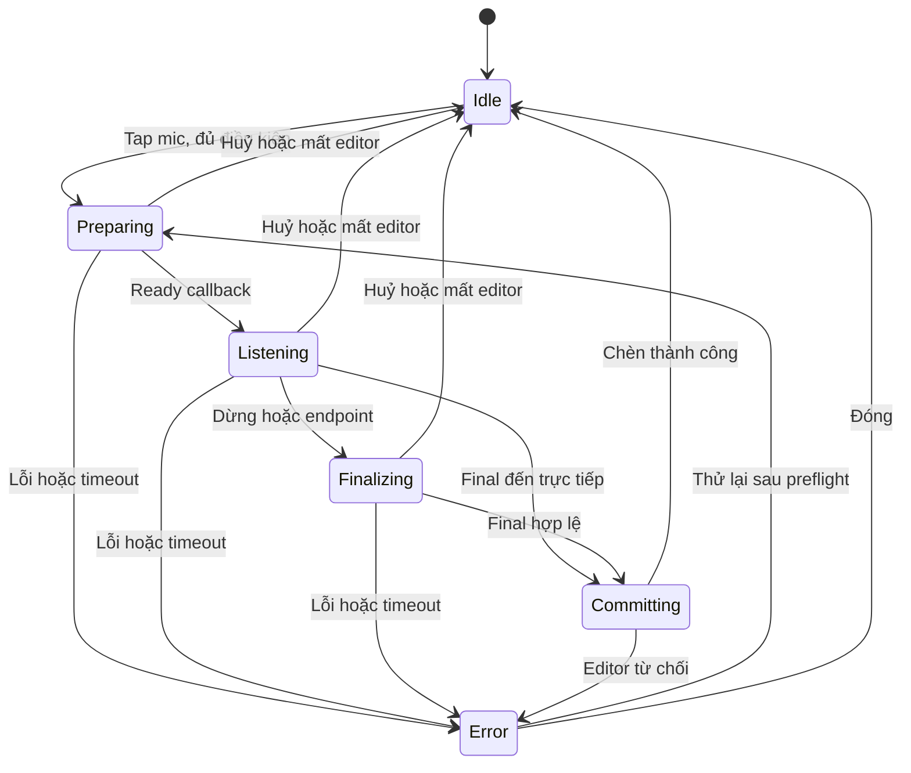
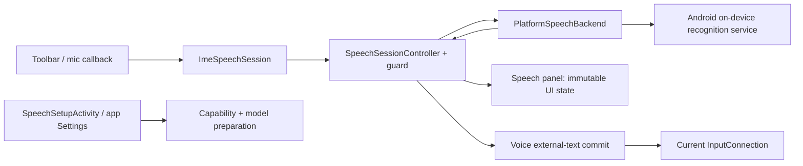

# Nhập bằng giọng nói trên Android

## Trạng thái và cách dùng tài liệu

**Thiết kế trước khi code — chưa hiện thực.** Phạm vi đã chốt: Android trước,
iOS chưa làm. Công nghệ cho bản đầu là `android.speech.SpeechRecognizer` với
recognizer **on-device**; ML Kit GenAI chỉ là hướng thử nghiệm sau này.

Ngày đối chiếu source và tài liệu nền tảng: **02/10/2026**. Những hành vi ghi là
“Funput chọn” là quyết định sản phẩm trong thiết kế này, không phải bảo đảm của
Android. Các tên class mới bên dưới là đề xuất để lập plan; không mô tả code đã có.
Khi hiện thực thay đổi một quyết định, cập nhật tài liệu trong cùng PR.

## 1. Mục tiêu

Người dùng đang nhập trong một app khác có thể bấm microphone trên bàn phím
Funput, nói tiếng Việt hoặc tiếng Anh, xem kết quả tạm thời trong bàn phím và
nhận văn bản ở ô nhập hiện tại khi kết thúc câu nói. Ví dụ: bấm mic → nói
“chiều nay mình gặp nhau lúc ba giờ” → văn bản được chèn, không phải gõ Telex/VNI.

Thứ tự ưu tiên: không chèn nhầm ô nhập, không thu âm ngoài thao tác chủ động của
người dùng, không tự chuyển sang cloud, không làm chậm đường gõ thông thường.
Độ chính xác tiếng Việt và độ phủ thiết bị phải được đo trước khi phát hành.

## 2. Phạm vi bản đầu

| Trong phạm vi | Ngoài phạm vi |
| --- | --- |
| Android, nút mic trong toolbar và panel giọng nói trong cửa sổ IME | iOS, desktop |
| Phiên ngắn, bắt đầu bằng tap; Dừng và Huỷ | Thu liên tục, tự bắt đầu lại, thu nền, wake word |
| VI → `vi-VN`; EN → `en-US` | Tự nhận diện/chuyển ngôn ngữ, locale tuỳ chỉnh |
| Partial để xem trước; final tự chèn một lần | Partial trực tiếp sửa document, trình biên tập transcript |
| Quyền microphone, kiểm tra hỗ trợ và hướng dẫn/tải model | Cloud fallback, Google Cloud STT, server Funput |
| Ô văn bản và tìm kiếm hợp lệ | Password/PIN, number/phone, email |
| Settings trạng thái và hướng dẫn chuẩn bị | Lịch sử audio/transcript, import file, đồng bộ |

Không tăng `minSdk` của app. Android 8–11 vẫn gõ bình thường; tính năng giọng nói
của thiết kế này chỉ có đường nhận dạng từ Android 12/API 31 trở lên.

## 3. Công nghệ và quyết định

| Thành phần | Chọn cho bản đầu | Lý do |
| --- | --- | --- |
| Nhận dạng | `SpeechRecognizer.createOnDeviceSpeechRecognizer(context)` | Đường API riêng cho nhận dạng trên thiết bị |
| Sự kiện | `RecognitionListener` → event của controller Kotlin | Tách callback nền tảng khỏi logic phiên và UI |
| Chèn văn bản | Đường external-text của IME → `InputConnection.commitText(text, 1)` | Transcript đã là Unicode, không cần engine chuyển dấu |
| Panel bàn phím | `:keyboard-ui`, theo host/panel hiện tại | Không đưa speech SDK vào bộ vẽ phím |
| Màn chuẩn bị/quyền | Activity/Compose của `:app`, dùng FunputUI | IME không phải Activity xin runtime permission |
| Lưu cài đặt | Preferences DataStore hiện có trong `:ime/settings` | App và IME dùng chung tuỳ chọn, không thêm kho transcript |
| Rust/JNI | Không thêm API nhận dạng | Giọng nói thuộc integration Android, không thuộc thuật toán gõ |

Các mốc nền tảng cần guard: factory on-device **API 31**; kiểm tra request và
khởi tạo tải model **API 33**; download listener **API 34**. Availability dịch vụ
không bảo đảm ngôn ngữ sẵn sàng. Client cần được giải phóng khi kết thúc sử dụng.
[Tham chiếu SpeechRecognizer](https://developer.android.com/reference/android/speech/SpeechRecognizer).

**Funput chọn:** tuyệt đối không dùng `createSpeechRecognizer()` để cứu lỗi;
không mở Activity `ACTION_RECOGNIZE_SPEECH` của bên khác. `EXTRA_PREFER_OFFLINE`
không đủ để bảo đảm offline vì implementation có thể bỏ qua.
[Tham chiếu RecognizerIntent](https://developer.android.com/reference/android/speech/RecognizerIntent).

### Vị trí của ML Kit GenAI

Google phát hành API ngày 28/01/2026; phiên bản công bố hiện là
`com.google.mlkit:genai-speech-recognition:1.0.0-alpha1`.
[Release notes](https://developers.google.com/ml-kit/release-notes#january_28_2026).

Basic dùng model truyền thống, hỗ trợ phần lớn thiết bị API 31+; Advanced dùng
GenAI và hiện liệt kê Pixel 10/11. `vi-VN` ở cả hai chế độ được đánh dấu beta.
Mức tối thiểu của SDK là API 26 không có nghĩa mọi máy Android 8 nhận dạng được.
[Tài liệu ML Kit](https://developers.google.com/ml-kit/genai/speech-recognition/android).

**Funput chọn:** chưa thêm dependency ML Kit vào production, chưa thêm UI chọn
engine. Nếu thử sau này, benchmark cùng corpus/thiết bị trước khi đổi backend.
Chỉ giữ một interface backend nhỏ; không dựng hệ plugin hoặc nhiều tầng fallback.

## 4. Hỗ trợ thiết bị, ngôn ngữ và model

Không hardcode “máy có Google thì hỗ trợ tiếng Việt”. ROM, dịch vụ nhận dạng và
model đã cài quyết định khả năng sử dụng. Emulator chỉ giúp kiểm tra integration;
máy thật mới là bằng chứng cho nhận dạng offline.

| Điều kiện | Trạng thái Funput | Hành vi |
| --- | --- | --- |
| API <31 | `UnsupportedOs` | Ẩn mic; Settings giải thích cần Android 12+ |
| Không có dịch vụ on-device | `ServiceUnavailable` | Ẩn mic; Settings báo máy chưa hỗ trợ |
| API 31–32, có dịch vụ | `UnknownReadiness` | Cho thử on-device sau tap; không hứa locale đã sẵn sàng |
| API 33+, locale đã cài | `Ready` | Cho bắt đầu sau khi đủ quyền/editor hợp lệ |
| Locale đang chờ tải | `PendingDownload` | Hiện hướng dẫn chuẩn bị, không mở microphone |
| Locale có thể tải | `Downloadable` | Hiện nút mở chuẩn bị; chỉ tải theo yêu cầu |
| Locale không được hỗ trợ offline | `LanguageUnsupported` | Giải thích theo ngôn ngữ; không đổi sang EN/cloud |
| Check không được dịch vụ hỗ trợ hoặc hết thời gian | `UnknownReadiness` | Cho thử on-device; lỗi phiên được xử lý rõ ràng |

Phân loại API 33 theo đúng request dùng để nhận dạng: installed là dùng được,
pending là đã lên lịch tải, supported là cần tải; không dùng online làm điều kiện
cho phép. Ưu tiên `installed > pending > supported`; không có locale trong ba
danh sách offline của response thành công thì `LanguageUnsupported`.
[RecognitionSupport](https://developer.android.com/reference/android/speech/RecognitionSupport).

Tag được chuẩn hoá bằng `Locale.forLanguageTag(...).toLanguageTag()` để so khớp
không phân biệt hoa/thường. Không tự gộp `en`, `en-US`, `en-GB` thành một locale.
Snapshot ngôn ngữ từ `ImeKeyActionHandler.language` khi bắt đầu; không lấy locale
của UI app hoặc của điện thoại thay cho VI/EN trên bàn phím.

`ERROR_CANNOT_CHECK_SUPPORT` đi vào Unknown, không phải kết luận máy không hỗ trợ.
[RecognitionSupportCallback](https://developer.android.com/reference/android/speech/RecognitionSupportCallback).
Quyền, khả năng dịch vụ, model và điều kiện editor là các trục độc lập; không gộp
“chưa cấp mic” vào “máy không hỗ trợ”.

Probe API và availability dịch vụ một lần khi input view hợp lệ được mở để quyết
định hiện mic ngay lần đầu; chưa tạo client hoặc query model trong probe này.
Check request/locale bằng client chỉ khi mở Settings giọng nói, đổi locale hoặc
tap mic. Cache trong RAM theo locale tối đa 5 phút; tap mic vẫn kiểm tra quyền/
dịch vụ. Recheck sau chuẩn bị model, quay về Settings và sau lỗi ngôn ngữ. Không
query ở mỗi phím, không persist `Ready` làm sự thật lâu dài.

Mọi factory/command nền tảng (create/check/download/start/stop/cancel/destroy)
chạy main thread. Mỗi client tạm dùng check capability phải destroy sau response,
error, timeout hoặc khi owner đóng; chỉ giữ DTO capability trong cache.

### Luồng tải model

Tải model nằm trong app Funput, không trong phiên đang nghe. Màn chuẩn bị hiển thị
riêng VI và EN, dịch vụ/locale sẵn sàng và CTA phù hợp. Chỉ gọi download sau tap
“Tải dữ liệu nhận dạng”; nói rõ bước tải cần mạng, bước nhận dạng chạy trên máy.
Không thêm `INTERNET` chỉ để tải model qua dịch vụ hệ thống.

API 33: gửi yêu cầu rồi cho “Kiểm tra lại”, không hiển thị phần trăm giả.
API 34+: progress nếu có; `onScheduled()` chuyển sang “Đang chờ hệ thống tải” và
không chờ callback tiếp; success kích hoạt recheck trước khi báo Ready. Lỗi không
có download-event support có thể thử overload API 33 một lần, rồi recheck.
[ModelDownloadListener](https://developer.android.com/reference/android/speech/ModelDownloadListener).

Đóng màn không đồng nghĩa huỷ được download của hệ thống; Funput invalidate token,
bỏ cập nhật UI và destroy recognizer do màn setup sở hữu. API không có thao tác
unregister download listener; callback đã xếp hàng vẫn phải qua guard. Không
polling nền hoặc tự retry download. API 31–32 chỉ hướng
dẫn chuẩn bị trong cài đặt của dịch vụ nếu có; không hardcode deep link Google/OEM.

## 5. Luồng sử dụng và giao diện

### Điểm vào

Mic chỉ hiện khi tính năng bật, API/dịch vụ có đường on-device và policy editor
cho phép. Thiếu quyền/thiếu model vẫn có điểm vào để giải thích và chuẩn bị.
Mic có nhãn TalkBack “Nhập bằng giọng nói, Tiếng Việt/Tiếng Anh”. Preview bàn phím
trong app/catalog chỉ vẽ icon ở trạng thái inert; không kiểm tra capability, xin
quyền hoặc mở microphone khi người dùng đang thử giao diện.

Trong toolbar, mic là action ưu tiên cạnh Emoji, vẫn hiện khi có candidates;
Clipboard/placement tiếp tục nhường chỗ như hiện tại. Khi thiếu rộng: bớt candidates
trước, rồi bỏ utility không bắt buộc; không thu nhỏ vùng chạm mic hoặc làm phím
chồng nhau. Khi layout không có toolbar thì mic cũng ẩn; Settings vẫn là nơi chuẩn
bị. **Tắt “Gợi ý từ” không ẩn mic**: toolbar/Emoji vẫn còn theo thiết kế hiện tại.
Không thêm cử chỉ giữ Space vì Space đã có đổi ngôn ngữ/trackpad.

### Phiên bình thường

1. Tap mic; kiểm tra setting, API, service, quyền, locale và editor.
2. Thiếu chuẩn bị thì hiển thị lý do/CTA, chưa mở mic. Đủ điều kiện thì hoàn tất
   composition đang gõ, xoá state gợi ý tạm và tạo anchor cho ô nhập.
3. Mở panel Speech lazy trong cửa sổ IME, giữ chiều cao bàn phím hiện tại. Hiện
   “Đang chuẩn bị…”; chỉ đổi sang “Đang nghe…” khi nhận ready callback.
4. Partial thay thế preview trong panel. Document chưa bị sửa bởi lời nói.
5. Endpoint của dịch vụ hoặc tap “Dừng” kết thúc nghe; UI “Đang xử lý…”.
6. Final hợp lệ được chèn một lần rồi quay về panel Letters. Không tự Send/Search.

Nút “Huỷ”/Back/đóng panel huỷ ngay, bỏ preview, không chèn partial cuối. Khi bấm
Dừng không chuyển về Letters ngay; vẫn có thể Huỷ trong lúc chờ final.
Sau lỗi, panel còn thông báo và nút “Thử lại”/“Quay lại bàn phím” phù hợp.
Thử lại tạo phiên mới; không chạy vòng lặp tự nghe.

RMS chỉ làm hiệu ứng nếu có; không dựa vào waveform để quyết định đã thu âm.
TalkBack thông báo thay đổi trạng thái, không đọc lại mỗi partial. Tôn trọng
reduced motion, theme sáng/tối và kích thước phông; transcript có vùng cuộn giới hạn.

### Text final và khoảng trắng

Funput chọn chính sách tối thiểu cho v1: lấy hypothesis đầu tiên không rỗng,
trim khoảng trắng hai đầu, giữ nguyên Unicode, dấu câu, chữ hoa và khoảng trắng
bên trong. Chèn đúng chuỗi đó; **không tự thêm dấu cách, dấu chấm, xuống dòng hoặc
viết hoa**. Nếu trước đó đã có chữ, người dùng đặt khoảng trắng/con trỏ như khi
dán văn bản. Chính sách này cần được nêu trong test cạnh composition và có thể
đổi sau đánh giá UX; không tự thêm smart spacing trong plan đầu.

Lời nói “xuống dòng”, dấu câu bằng giọng nói và định dạng số do dịch vụ quyết định;
Funput không hứa chúng hoạt động, không tự parse thành lệnh. Không có undo riêng
cho speech; sau khi chèn dùng thao tác sửa/xoá của editor và bàn phím như văn bản thường.

## 6. Editor policy và bảo vệ vị trí chèn

Thêm `allowsVoiceInput` ở policy IME, không dùng `allowsPersonalSuggestions` để
quyết định. Cho phép văn bản thường, multiline và SEARCH. URI hiện được resolver
ánh xạ sang SEARCH cho omnibox, nên cho phép tìm kiếm ở đó; không tự chạy Search
hoặc chuyển lời nói thành địa chỉ. Chặn password/PIN, numeric/phone, email, null
input/non-text dù layout hoặc suggestion bar vẫn xuất hiện.

`IME_FLAG_NO_PERSONALIZED_LEARNING` và `NO_SUGGESTIONS` không tự chặn giọng nói.
**Transcript không được đưa vào kho học cá nhân trong v1**, kể cả editor cho học.
Đường speech bypass Telex/VNI, gõ tắt và áp dụng Shift. Gõ thường sau đó vẫn tuân
theo policy hiện tại.

Chặn thêm `compositionRenderMode == KEY_EVENT`: repo đã có các host WPS/OEM
bỏ qua text API, nên `commitText` không đủ để chèn transcript an toàn. V1 ẩn mic
ở nhóm editor này, Settings/help ghi rõ giới hạn. `COMPOSING`, `COMMITTED` và
`COMMITTED_KEY_DELETE` vẫn có thể dùng nếu các điều kiện khác đạt; không gửi
transcript dưới dạng chuỗi key events để cứu lỗi.

V1 chỉ bắt đầu khi có selection đã biết và thu gọn tại một caret. Nếu đang bôi
đen hoặc không xác nhận được caret: báo “Đặt con trỏ tại nơi muốn chèn rồi thử lại”.
Không tự thay thế selection bằng transcript. Đây là policy thận trọng của Funput,
không phải giới hạn API.

Mỗi phiên giữ `sessionId`, `editorGeneration`, `editRevision`, locale và vị trí
caret sau khi composition được hoàn tất. Không lưu toàn bộ surrounding text,
package name hoặc transcript vào anchor. Tăng editorGeneration trên mọi
`onStartInput`, kể cả restarting; tăng editRevision trên thao tác sửa, đổi
selection hoặc thay đổi context được IME quan sát.

Trước nhận final và ngay trước commit phải xác nhận: cùng session đang chờ final,
cùng generation/revision, input view còn hiện, policy vẫn cho phép, quyền còn đủ,
selection chưa đổi và `currentInputConnection` còn hợp lệ. Không chỉ kiểm tra
package name/fieldId vì hai ô có thể cùng giá trị. Không dùng identity object
`InputConnection` làm chứng cứ duy nhất vì Android có thể đổi wrapper.

Selection tracker bắt đầu từ `EditorInfo.initialSelStart/initialSelEnd` và cập
nhật bằng `onUpdateSelection`. Khi finish không thay caret và tracker đã xác nhận
vị trí hợp lệ thì dùng lại vị trí đó; không bắt buộc đợi callback mới mà host có
thể không gửi. Nếu có cập nhật đang chờ, chỉ tiếp tục khi reconcile được.
Khi chuẩn bị anchor, callback selection do chính việc finish composition không
được bị coi nhầm là người dùng di chuyển con trỏ: xác nhận caret đã ổn định, rồi
mới start recognizer. Nếu host không xác nhận kịp thì huỷ chuẩn bị, chưa thu âm.
Đổi caret đi rồi quay lại vẫn huỷ, không khôi phục phiên cũ. Không lấy caret mới
để chèn final của phiên cũ.

Host vẫn sở hữu document; IME không có transaction nguyên tử để chứng minh mọi
thay đổi ngoài app. Guard phải dựa trên lifecycle/selection/editor events và xử lý
connection failure; không tuyên bố phát hiện được host sửa nội dung mà không báo.

## 7. Máy trạng thái và ràng buộc

Capability/setup và phiên nghe là hai state riêng; download không phải Listening.



| Event | Hành vi Funput |
| --- | --- |
| Ready | Listening; không start client thứ hai |
| Partial | Thay preview, không append partial và không commit |
| End of speech | Finalizing, chưa coi là final |
| Results | Chỉ nhận một terminal result của session hợp lệ |
| Stop | Gọi stop một lần, chờ results/error |
| Cancel hoặc invalidation | Đánh dấu session hết hiệu lực trước, rồi cancel/close |
| Error/exception | Giải phóng client; không chèn preview thay final |
| Tap mic liên tiếp | Không mở nhiều phiên; bỏ tap khi đang Preparing/Finalizing |

Partial và RMS có thể không xuất hiện; final có thể đến khi chưa thấy end event.
Không dựa vào confidence score bắt buộc. Listener chuyển dữ liệu thành immutable
event rồi controller xử lý tuần tự trên main thread.
[RecognitionListener](https://developer.android.com/reference/android/speech/RecognitionListener).

Giới hạn **đề xuất cho v1**, đưa vào constants có clock/scheduler giả để test:

- Preflight/anchor ổn định: 3 giây; timeout capability → Unknown, timeout anchor
  → lỗi editor và không start mic.
- Start đến ready: 5 giây; timeout cancel/destroy, không lặp tự động.
- Một phiên tối đa 60 giây kể từ start; hết hạn gọi Stop một lần.
- Chờ final sau Stop/endpoint: 5 giây; hết hạn huỷ, không chèn partial.
- Preview/final tối đa 4.096 UTF-16 code units; vượt thì lỗi, không cắt giữa Unicode
  và không chèn một đoạn rút gọn. Không nối nhiều phiên thành transcript dài.

Đây là giới hạn tài nguyên/UX của Funput, không phải SLA hay giới hạn Android.
UI chỉ giữ một preview/latest final tạm trong RAM; terminal event xoá preview
khỏi state kể cả khi layout đang dùng view cũ.

## 8. Lifecycle và cạnh tranh với gõ thường

Tạo client lazy cho từng phiên, listener gắn sessionId không thay đổi; destroy
sau mọi terminal path. Không giữ một listener thay token để callback phiên cũ
trông như của phiên mới. `stopListening()` chờ kết quả; `cancel()` bỏ phiên. Dừng,
Huỷ và destroy idempotent trong adapter/controller.

Invalidate **trước** khi gõ/action tiếp theo hoặc lifecycle chuyển editor:

- `onStartInput`, `onFinishInputView`, `onFinishInput`, `onWindowHidden`, `onDestroy`.
- Đổi selection/caret; editor/context bị restart; `currentInputConnection` mất.
- Đổi VI/EN, input method, panel sang Emoji/Clipboard/Symbols hoặc mở Settings.
- Phím cứng, paste, chọn suggestion, thao tác trackpad/backspace hay gõ text khác.
- Đổi cấu hình màn hình/đóng view; setting tắt; khoá màn hình hoặc mất quyền mic.

Panel speech che phím để tránh gõ đồng thời; phím cứng vẫn phải đi qua guard rồi
dispatch bình thường. Huỷ speech không nuốt phím hoặc làm mất chữ đang gõ.
Selection update do final commit được xử lý sau khi session đã tiêu thụ terminal
result, nên không tạo commit thứ hai. Late partial/final/error/support/download
callback bị bỏ theo token; không dựng lại panel khi người dùng đã đóng.

Chỉ thu khi bàn phím visible, editor hợp lệ và vừa có tap mic. Không thêm
foreground service, notification thu âm hay giữ microphone khi keyboard ẩn.
Không suy ra IME được chọn luôn có quyền thu nền từ ngoại lệ khởi động FGS.
[Giới hạn foreground service](https://developer.android.com/develop/background-work/services/fgs/restrictions-bg-start).

## 9. Quyền microphone và manifest

Thêm vào manifest ứng dụng đã merge:

```xml
<uses-permission android:name="android.permission.RECORD_AUDIO" />
<uses-feature android:name="android.hardware.microphone" android:required="false" />
<queries>
    <intent>
        <action android:name="android.speech.RecognitionService" />
    </intent>
</queries>
```

Không xin quyền lúc mở app/cài bàn phím. Chỉ xin khi tap mic hoặc nút thiết lập
giọng nói; kiểm tra quyền lại mỗi phiên, kể cả đã từng cấp, vì có quyền một lần
hoặc thu hồi. Từ chối không chặn bất kỳ chức năng gõ hiện có nào.
[Runtime permissions](https://developer.android.com/training/permissions/requesting).

Đề xuất `SpeechSetupActivity` trong `:app`, `exported=false`, mở bằng explicit
intent từ IME: chỉ nhận action `REQUEST_MICROPHONE` hoặc `PREPARE_MODEL` cùng locale
allowlist; không nhận transcript, editor token hoặc lệnh bắt đầu thu âm. Activity
này xin quyền qua Activity Result API hoặc hiển thị màn chuẩn bị bằng FunputUI.
`:ime` không import class của `:app`; contract component/extra tập trung một nơi,
không nối tên class rải rác. Không thêm deep link exported.

Tap CTA trước hết huỷ phiên IME; việc mở Activity làm mất input không được giữ
anchor. Sau cấp quyền người dùng quay lại app đang nhập và **tap mic lần nữa**.
Không tự bắt đầu thu từ permission callback, không persist pending dictation để
resume sau process death. Khi không thể mở Activity, hiện lỗi và hướng dẫn mở
Funput thủ công.

Activity giải thích khi hệ thống yêu cầu rationale. Khi không thể xin lại, cho
mở trang quyền của Funput trong Settings. `shouldShowRequestPermissionRationale`
false riêng lẻ không chứng minh “từ chối vĩnh viễn”; cần biết đã từng request và
trạng thái thực tế. Cờ request history nếu cần nằm cùng DataStore hiện có, không
lưu trạng thái “đã cấp” thay cho kiểm tra hệ thống.

Cuộc gọi, app khác dùng mic hoặc privacy toggle có thể làm phiên lỗi/không có âm
thanh. Không chiếm audio focus để dừng nhạc/cuộc gọi trong v1; báo thử lại và kiểm
tra trên máy thật. Bluetooth/headset do dịch vụ chọn route; chưa có UI chọn input.
[Chia sẻ audio input](https://developer.android.com/media/platform/sharing-audio-input).

## 10. Commit transcript và ranh giới engine

Đường hiện có: `ImeKeyActionHandler.onClipboardSelected()`/`onEmojiSelected()` →
`ImeTypingHandler.commitExternal()` → `InputConnectionEditor.execute()`.
`commitExternal()` hiện trả Unit và bỏ kết quả Boolean của editor; không dùng nó
nguyên trạng để báo “chèn thành công” cho speech.

Thêm seam `onVoiceTextCommitted(text): Boolean` hoặc đổi helper external-text trả
Boolean, giữ semantics Emoji/Clipboard bằng regression test. Voice phải:

1. Xác nhận guard, normalize final và giới hạn độ dài.
2. Đánh dấu terminal result đã tiêu thụ **trước** khi gọi editor.
3. Clear composition/shortcut tail/suggestion context qua đường finish hiện có;
   không gọi `process_char`, adopt transcript hoặc learn từng token.
4. Commit final một lần với cursor sau văn bản; batch edit nếu có nhiều thao tác,
   luôn end batch trong finally. Không xoá suffix hoặc selection để “sửa” partial.
5. Nếu editor trả false/connection mất, báo lỗi; không retry commit tự động vì
   host có thể đã nhận một phần thao tác. Không gọi editor action Send/Search.
6. Thành công: reset session speech, về Letters, cập nhật capitalization cho lần
   gõ kế tiếp qua runtime; không đổi chữ hoa của transcript vừa nhận.

Huỷ chỉ bỏ nội dung voice chưa chèn. Chữ Telex đang compose trước khi mở mic đã
được finish vẫn phải còn nguyên. Một final duplicate, hoặc final đến sau cancel,
không được gọi commit kể cả nó chứa chuỗi khác.

## 11. Kiến trúc đề xuất và điểm nối trong repo



Giữ code production mới trong bốn module hiện có, chưa tạo Gradle module mới:

| Ranh giới | Trách nhiệm |
| --- | --- |
| `:ime/speech/model` | Capability/session state, locale, event, error và limits |
| `:ime/speech/platform` | On-device factory, intent factory, listener adapter, capability/download bridge |
| `:ime/speech/session` | Controller, token/anchor guard, watchdog và lifecycle binding |
| `:ime/settings/speech` | `voiceInputEnabled` và request history nếu cần |
| `:keyboard-ui/.../speech` | Panel/state binding, Dừng/Huỷ/Thử lại; không Android speech client |
| `:keyboard-renderer` | Mic role/icon/geometry/hit target/accessibility, callback thuần |
| `:app/.../settings/speech` | Status/setup UI; Activity thực hiện request permission |

Contract tối thiểu: backend có `checkCapability(locale)`, `start(sessionId,
locale, onEvent)`, `stop()`, `cancel()`, `close()`; platform download là collaborator
chuẩn bị riêng. Controller nhận backend, editor gateway, clock/scheduler và cập
nhật UI qua callback. Backend fake phát event theo thứ tự tuỳ ý để test race.
UI chỉ gửi intent người dùng, không tự gọi recognizer khi recomposition/attach.

`:app` hiện phụ thuộc `:ime`, nhưng không truy cập được class `internal` trong
module đó. Chuẩn bị model/đọc trạng thái từ app đi qua facade public nhỏ
`SpeechPreparationService` và DTO công khai; controller, editor guard, client và
listener cụ thể vẫn internal. Facade không có hàm start thu âm. Store setting
dùng wrapper public theo pattern các Settings hiện có, không expose IME session.

Factory intent dùng cùng cấu hình cho check, download và start:
`Intent(RecognizerIntent.ACTION_RECOGNIZE_SPEECH)`,
`EXTRA_LANGUAGE_MODEL=LANGUAGE_MODEL_FREE_FORM`, `EXTRA_LANGUAGE` theo snapshot,
`EXTRA_PARTIAL_RESULTS=true`, `EXTRA_MAX_RESULTS=1`.
Có thể đặt `EXTRA_PREFER_OFFLINE=true` như intent hint, nhưng offline chỉ được
quyết định bởi factory on-device. Không thêm segmented mode, autodetect language,
bias từ nội dung document hoặc formatting options trong v1.

### Source hiện có cần nối

Các prefix dưới đây tính từ root repo `app/`; phần sau prefix là đường file thật.
Dùng `rg --files` để xác nhận lại khi lập plan nếu repo đã thay đổi:

| Prefix | Đường dẫn |
| --- | --- |
| `IME` | `platforms/android/ime/src/main/java/app/funput/funput/ime` |
| `RENDER` | `platforms/android/keyboard-renderer/src/main/java/app/funput/funput/keyboard` |
| `UI` | `platforms/android/keyboard-ui/src/main/java/app/funput/funput/keyboard/ui` |
| `APP` | `platforms/android/app/src/main/java/app/funput/funput` |

| File/nhóm hiện có | Thay đổi cần lập plan |
| --- | --- |
| `IME/FunputInputMethodService.kt` | Forward lifecycle/selection/configuration vào speech, không chứa toàn bộ state machine |
| `IME/ImeEditingSession.kt` | Sở hữu speech session, bind panel và close theo service |
| `IME/ImeKeyboardCallbackBinder.kt` | Mic callback và invalidation trước thao tác gõ/panel/settings |
| `IME/editing/ImeKeyActionHandler.kt`, `IME/editing/typing/ImeTypingHandler.kt`, `IME/editing/InputConnectionEditor.kt` | Locale snapshot, finish composition, commit external có kết quả |
| `IME/editing/EditorInfoPolicy.kt`, `IME/editing/EditorInfoPolicyResolver.kt`, `IME/editing/CompositionRenderMode.kt` | Policy voice riêng, raw input type và loại host KEY_EVENT |
| `IME/clipboard/controller/ClipboardSessionGuard.kt` | Tham khảo pattern generation; không dùng chung mutable guard cho hai feature |
| `IME/settings/FunputSettingsDataStore.kt`, `IME/ImeSettingsController.kt` | Wrapper setting và quan sát thay đổi |
| `RENDER/KeyboardCallbacks.kt`, `RENDER/model/KeyRole.kt`, `RENDER/model/KeyboardLayout.kt` | Role/callback/spec mic; không speech dependency |
| `RENDER/layout/letters/QwertyLayoutFactory.kt`, `RENDER/layout/toolbar/ToolbarGeometry.kt` | Mic cạnh Emoji, capacity và hành vi khi toolbar có gợi ý |
| `RENDER/KeyboardSurfaceSuggestionState.kt`, `RENDER/KeyboardSurfaceView.kt` | Mic không bị ẩn theo `utilityKeysVisible` của Clipboard/placement |
| `RENDER/layout/ResolvedKeyboard.kt`, `RENDER/layout/geometry/KeyboardHitTargetResolver.kt`, `RENDER/interaction/KeyboardUtilityActionRouter.kt`, `RENDER/rendering/UtilityKeyIconRenderer.kt`, `RENDER/accessibility/KeyboardAccessibilitySnapshot.kt` | Mic phải có trong draw, dispatch và TalkBack cùng một geometry |
| `UI/FunputKeyboardView.kt`, `UI/FunputKeyboardCallbacks.kt`, `UI/KeyboardPanel.kt` | Panel `SPEECH`, UI state và callback mới |
| `UI/panel/KeyboardPanelCoordinator.kt`, `UI/panel/FunputPanelFactory.kt` | Lazy panel, Back/close và giữ height/theme/placement |
| `APP/MainActivity.kt`, `APP/ui/FunputApp.kt`, `APP/ui/navigation/AppDestination.kt`, `APP/ui/navigation/AppNavigator.kt` | Thêm `SPEECH_SETTINGS` thuộc tab Settings, depth 1; entry từ setup contract |
| `APP/ui/SettingsRoute.kt`, `APP/ui/settings/SettingsScreenState.kt`, `APP/ui/settings/SettingsScreenSections.kt`, `APP/ui/FunputSettingsStores.kt`, `APP/ui/FunputSettingsState.kt` | Row Settings → Speech; thêm stores/state theo pattern hiện tại |
| `app/src/main/AndroidManifest.xml` | Permission, optional hardware feature, package query, nonexported setup Activity |

Dòng manifest tính từ `platforms/android/`. Bảng là các điểm nối cần kiểm tra;
không phải tất cả file đều phải sửa nếu tách adapter đủ nhỏ. Route
`SPEECH_SETTINGS` và `SpeechSetupActivity` dùng cùng nội dung setup, tránh hai màn
chuẩn bị model có hành vi khác nhau.

Renderer hiện vẽ Canvas, không Compose; mic không được kéo permission, storage,
network hoặc `InputMethodService` vào renderer. App Settings dùng FunputUI, không
import Material trực tiếp. Theo cổng repo: tối đa 150 dòng/Kotlin file; thư mục
tính năng mới chia nhóm tối đa 5 file và đăng ký root tương ứng ở layout checker.

## 12. Settings và dữ liệu

Thêm mục **“Nhập bằng giọng nói”** trong Settings. Nội dung gồm:

- “Hiện nút microphone”: `voiceInputEnabled`, mặc định **true**, chỉ hiệu lực ở
  editor/thiết bị hợp lệ. Bật không đồng nghĩa cấp quyền hoặc bắt đầu thu âm.
- Quyền microphone: trạng thái đọc từ hệ thống, CTA cấp/mở Settings khi cần.
- Tiếng Việt/Tiếng Anh: trạng thái model, CTA tải/kiểm tra lại theo API.
- Giải thích: “Nhận dạng trên thiết bị. Có thể cần tải dữ liệu trước lần dùng đầu.”

Không có tuỳ chọn Online/Offline hoặc chọn công nghệ trong bản đầu. Không tự làm
tính năng “hoạt động” bằng cách đổi thiết lập sang online. Setting tắt trong lúc
đang nghe lập tức huỷ phiên. Settings không ghi capability/model version thành
trạng thái vĩnh viễn, không thêm model binary vào APK.

Audio do dịch vụ on-device quản lý; Funput không ghi file thu âm. Transcript chỉ
ở RAM đến terminal event, không vào log/crash breadcrumb/analytics/clipboard/
DataStore hoặc suggestions store. Logs debug chỉ chứa state, error code, API và
thời gian; không dùng `Bundle.toString()` vì bundle có văn bản. Không sửa Rust,
FFI/JNI hoặc schema dữ liệu gợi ý chỉ để nhận giọng nói.

Cam kết sản phẩm dựa trên contract on-device của nền tảng và kiểm tra thực tế;
không quảng cáo “hoạt động trên mọi Android” hoặc “không bao giờ cần Internet”.
Phân biệt rõ download/setup có thể dùng mạng với phiên nhận dạng sau chuẩn bị.

## 13. Lỗi và thông báo

| Lỗi/tình huống | UI và hành động |
| --- | --- |
| `ERROR_LANGUAGE_NOT_SUPPORTED` | “Thiết bị chưa hỗ trợ nhận dạng offline cho ngôn ngữ này”; về Settings/Letters |
| `ERROR_LANGUAGE_UNAVAILABLE` | “Dữ liệu nhận dạng chưa sẵn sàng”; recheck và CTA chuẩn bị |
| `ERROR_INSUFFICIENT_PERMISSIONS`/SecurityException | Dừng, kiểm tra quyền; CTA cấp lại, không tự bật mic sau cấp |
| `ERROR_NO_MATCH`, `ERROR_SPEECH_TIMEOUT` | “Chưa nhận được lời nói. Thử lại”; không chèn partial |
| `ERROR_AUDIO` | “Không dùng được microphone lúc này”; gợi ý kiểm tra app khác/privacy switch |
| `ERROR_RECOGNIZER_BUSY`, `ERROR_TOO_MANY_REQUESTS` | Đóng client, Thử lại do người dùng; không tự restart |
| `ERROR_CLIENT`, `ERROR_SERVER_DISCONNECTED`, lỗi network/server hoặc mã chưa biết | Lỗi dịch vụ; không suy ra đã chạy cloud, không fallback; chỉ cho thử lại sau cleanup |
| Start/final timeout của Funput | “Nhận dạng chưa phản hồi. Thử lại”; bỏ preview |
| Null connection/caret đổi/editor từ chối commit | “Ô nhập đã thay đổi hoặc không nhận văn bản”; không chuyển kết quả sang ô mới |
| Transcript quá dài | “Đoạn nói quá dài. Hãy nói từng đoạn ngắn”; không chèn đoạn cắt |

Đây là mapping UX của Funput; handler vẫn phải nhận mọi integer code mới mà SDK
chưa biết. Không hiển thị stack trace/tên API trong giao diện người dùng.

## 14. Kiểm thử và tiêu chí nghiệm thu

### Test tự động không phụ thuộc model/mạng

| Nhóm | Trường hợp bắt buộc |
| --- | --- |
| Capability | API 26–30 từ chối; 31–32 Unknown; 33 installed/pending/downloadable/unsupported; cannot-check/timeout Unknown; online-only không Ready |
| Locale | VI/EN snapshot, chuẩn hoá tag, không dùng locale UI, không đổi sang EN khi VI thiếu model |
| Phiên | Partial 0/1/n lần; partial sửa toàn câu; final không có end event; Stop chờ final; Cancel bỏ mọi late event; duplicate final commit tối đa một lần |
| Race/editor | Đổi editor cùng package/fieldId, restarting, caret đổi rồi quay lại, phím cứng trong lúc chờ final, final sau hide/permission Activity, token cũ sau phiên mới |
| Commit | Telex đang compose vẫn giữ; transcript dấu Việt/emoji/surrogate pair không qua engine; false/null không báo success/không retry; không học hoặc expand shortcut |
| Policy | TEXT/SEARCH/URI cho phép; password/PIN/email/number/phone/non-text/KEY_EVENT chặn; selection không thu gọn/không biết chặn; no-learning vẫn cho voice nhưng không học |
| Resource | Mọi client phiên/check/setup đều destroy khi xong/đóng/timeout; timer huỷ; spam tap không tạo nhiều client; limits không cắt Unicode; ordinary typing không tạo recognizer |
| Permission/setup | Chưa xin/denied/rationale/không xin lại/one-time revoke; không auto-resume; scheduled/no-progress/download error; recheck và bỏ callback màn cũ |
| UI/geometry | Mic hiện ngay lần mở view đầu trên máy có service; vẫn hiện khi có candidates hoặc tắt Gợi ý từ; narrow/one-hand/floating; password/KEY_EVENT không có mic; Back=Huỷ; TalkBack/preview inert |

Test controller bằng backend/editor/clock fake; integration dùng giả
`InputConnection` để đếm lần commit và quan sát engine/suggestion state. Test UI
không kiểm tra độ chính xác nhận dạng bằng text giả. Service speech và accuracy
không được coi là đã kiểm chứng chỉ vì JVM test pass.

### Ma trận máy thật

- Một máy API 31–32 để xác nhận Unknown + local trial; một máy API 33 để thử
  chuẩn bị model không progress; một máy API 34+ cho download listener. Có thể
  dùng emulator cho nhánh phiên bản chưa có máy, nhưng ghi rõ còn thiếu chứng cứ.
- Ít nhất hai tổ hợp thiết bị/dịch vụ thực tế có VI offline; ưu tiên Samsung đang
  dùng kiểm tra Funput (SM-G998B nếu còn sẵn) và một Pixel, không mặc định chúng
  hỗ trợ chỉ vì model tên máy. Một thiết bị/ROM không có service là negative case.
- VI/EN; model có/chưa có; airplane mode sau chuẩn bị; microphone privacy toggle,
  denied/one-time/revoked; app khác thu âm/cuộc gọi/headset.
- Editor native, WebView/browser omnibox và app nhắn tin; selection/cursor,
  đổi focus, hide/show, screen lock, rotate, process death và hardware keyboard.
- Theme sáng/tối, chữ 200%, TalkBack, portrait/landscape, one-hand/floating; không
  vỡ toolbar và không cản các gesture hiện có.

### Đo chất lượng trước khi quyết định phát hành

Chuẩn bị corpus do người thử tự nói: 40 câu VI giao tiếp rõ trong phòng yên tĩnh,
10 câu tên riêng/số/ngày giờ, 10 câu có nhiễu nhẹ; thêm 20 câu EN. Không đưa bản
ghi của người dùng thật vào repo. Đo WER theo token cách trắng của tiếng Việt
(âm tiết), ghi rõ quy tắc chuẩn hoá case/punctuation/số trước khi chạy; giữ bảng
đánh giá lỗi dấu/tên/số riêng để không che lỗi có ý nghĩa.

Ghi API, thiết bị, phiên bản dịch vụ, locale, trạng thái model, tỉ lệ start lỗi,
độ trễ ready/final p50/p95 và kết quả airplane mode. Không tự gán model version
nếu API không cung cấp. Ngưỡng **đề xuất để chốt ở spike trước khi đo**: WER nhóm
40 câu VI rõ ≤20%, ≥90% câu dùng được mà không phải gõ lại phần lớn, ready p95
≤3 giây và final p95 ≤3 giây sau Dừng trên hai tổ hợp được hỗ trợ. Đây là gate
sản phẩm dự kiến, không phải số đo đã đạt hoặc bảo đảm SDK.

Gate bắt buộc bất kể accuracy: 0 commit sai phiên/duplicate trong bộ race test;
Huỷ không chèn, ẩn bàn phím dừng thu, không fallback cloud, gõ thường không có
khởi tạo speech/binder trên mỗi phím. Chỉ quảng bá locale/thiết bị đã xác minh;
nếu độ phủ VI thấp, đánh giá lại giá trị phát hành trước khi đầu tư hoàn thiện UI.

## 15. Thứ tự hiện thực để lập plan code

Mỗi bước tạo một phần kiểm chứng được; không coi việc thêm icon là hoàn thành
feature. Bước 0 là gate trước các bước product; ML Kit không chặn bản đầu.

| Bước | Đầu ra | Điều kiện xong |
| --- | --- | --- |
| 0. Spike trong debug | On-device VI/EN chạy từ IME visible, thử quyền và API/OEM/model; corpus/biên bản đo | Xác minh offline và lifecycle trên máy; chốt gate chất lượng, không suy ra quyền thu nền |
| 1. Domain/platform seam | State/event/locale/error/limits, backend on-device và intent factory, capability | Unit test API guards/lists/Unknown; không generic recognizer hoặc dependency ML Kit |
| 2. Setup/quyền/settings | Manifest, `SpeechSetupActivity`, status/model setup, setting wrapper + app route | Cấp/từ chối/revoke/download/recheck đúng; gõ không phụ thuộc quyền; không auto-start |
| 3. Session/editor safety | Controller, generation/revision/anchor, watchdog, success-aware external commit | Race/duplicate/cancel/editor/Unicode/no-learning tests pass với fake |
| 4. Mic và panel | Renderer plumbing, priority/capacity/accessibility, lazy speech panel, UI binding | Mic không biến mất khi gợi ý; preview inert; Back=Huỷ; height/theme/placement ổn |
| 5. IME integration | Nối service/session/binder/hardware/selection, toàn bộ lifecycle close | Speech đi hết luồng thật, regular typing/clipboard/emoji/shortcuts không regression |
| 6. Nghiệm thu/phát hành | Ma trận máy, số đo/gate, lint/build/tests, README/help/privacy/release notes | Ghi rõ hỗ trợ Android 12+, giới hạn VI theo service và setup mạng; đạt các gate |
| Sau v1, độc lập | Benchmark ML Kit Basic/Advanced dùng cùng corpus | Chỉ đề xuất đổi backend sau chứng cứ chất lượng, độ phủ và độ ổn định |

Bước 0 có thể làm Activity debug phụ trợ để xem capability, nhưng nghiệm thu spike
phải thu từ phiên IME thật khi bàn phím đang hiện. Nếu capture ở IME bị hạn chế
trên nhóm máy mục tiêu, ghi rõ và điều chỉnh scope; không tự chuyển toàn bộ feature
sang thu trong app hoặc thêm FGS để né lỗi.

Lệnh dành cho bước code (không cần chạy Gradle chỉ vì sửa tài liệu), từ
`platforms/android/`:

```bash
bash scripts/check-kotlin-loc.sh
bash scripts/check-kotlin-layout.sh
bash scripts/check-app-material-free.sh
./gradlew :ime:testDebugUnitTest :keyboard-renderer:testDebugUnitTest :keyboard-ui:testDebugUnitTest :app:testDebugUnitTest --console=plain
./gradlew lintDebug :app:assembleDebug --console=plain
```

Khi cần test IME trên thiết bị đã chuẩn bị:

```bash
./gradlew :ime:connectedDebugAndroidTest :keyboard-ui:connectedDebugAndroidTest --console=plain
```

Sau integration chạy
`./gradlew testDebugUnitTest --console=plain` như CI để bao phủ các module liên quan.
Không gọi cloud/model download trong unit test. Không thay đổi release version
hoặc deploy chỉ để hoàn thành feature plan.

## 16. Các điểm cần xác minh ở spike, không tự giả định

1. VI offline có thực sự sẵn trên dịch vụ của các máy mục tiêu? API nào trả Unknown?
2. Capture từ IME visible và quyền một lần có ổn trên target SDK 37/OEM không?
3. Host editor cập nhật selection sau finish composition thế nào; đủ để dựng
   anchor an toàn mà không từ chối quá nhiều ô nhập hợp lệ không?
4. Partial, ready và final có đủ nhanh cho câu ngắn? Thiếu partial thì UI còn rõ?
5. Chính sách chèn nguyên văn không auto-space có đủ dễ dùng cạnh chữ đang gõ?
6. Mic cố định cạnh Emoji có đủ chỗ trên các kích thước bàn phím hỗ trợ không?

Các câu hỏi này tạo task kiểm chứng trong plan, không phải lý do trì hoãn viết
backend/domain. Kết quả spike được bổ sung vào tài liệu trước khi gắn nhãn feature
“đã triển khai” hoặc mô tả hỗ trợ trong README.

## 17. Hiện thực P0 và bằng chứng ngày 03/10/2026

**Trạng thái: đã có code spike debug; gate P0 chưa đạt. Dừng trước P1.** Chưa
hoàn thành feature production, chưa bật production và chưa hiện thực P1–P6.
Người dùng đã xác nhận nhận dạng tiếng Việt từ IME thật hoạt động và đánh giá
nhận diện tốt trên bản debug đang thử. Còn thiếu corpus/số đo chất lượng, EN,
airplane mode, lifecycle khi đang thu và tổ hợp máy/service thứ hai. Không dùng
smoke test, capability probe hoặc unit test thay cho các bằng chứng này.

### Code đã có

| Phần | Vị trí dưới `platforms/android/` | Phạm vi P0 |
| --- | --- | --- |
| Locale/event/recording contracts | `ime/src/main/java/app/funput/funput/ime/speech/model/` | VI/EN cố định; `open` chưa tạo client/phát event |
| On-device adapter/request | `ime/src/main/java/app/funput/funput/ime/speech/platform/` | API 31 guard, listener cố định, callback main, immutable text event, cleanup idempotent |
| Pilot controller và timers | `ime/src/main/java/app/funput/funput/ime/speech/session/` | Không Android; fake scheduler/editor/backend; ready 5s, phiên 60s, final 5s |
| Eligibility/caret tracker | `ime/src/main/java/app/funput/funput/ime/speech/editor/` | Generation mới trên mọi start/restart; revision ngăn caret đi rồi quay lại |
| IME gateway và debug controls | `ime/src/debug/java/app/funput/funput/ime/speech/integration/` | Start/Stop/Cancel/Permission, guard quyền/visible/lock/connection/editor; không đưa final vào engine |
| Release bridge | `ime/src/release/java/app/funput/funput/ime/speech/integration/` | No-op; không tạo speech client hoặc UI spike |
| Permission và editor tổng hợp | `app/src/debug/java/app/funput/funput/speech/` | Activity không exported; grant không thu âm; hai ô TEXT và một ô password để kiểm tra IME thật |
| Capability diagnostic | `ime/src/androidTest/java/app/funput/funput/ime/speech/preparation/` | Chỉ check availability/support, không recording/download |

Final được consume trước commit để chặn duplicate/reentrancy. Chỉ trim hai đầu;
partial thay toàn preview và không chèn; final quá 4.096 UTF-16 units bị từ chối,
commit false không retry. Gateway finish composition theo đường hiện tại, lấy
selection nếu editor hỗ trợ và đối chiếu anchor/connection trước `commitText`.
Offset selection của snapshot cộng với `startOffset` theo
[contract ExtractedText](https://developer.android.com/reference/android/view/inputmethod/ExtractedText).
Đường commit transcript không gọi Telex/VNI, shortcuts hoặc personal learning.

Hide/finish/start/restart/configuration, screen-off, đổi selection, touch bàn
phím, utility/panel callbacks và hardware key đều invalidate trước thao tác
editor. Callback accessibility được bọc riêng vì có thể không phát touch.
Các guard này đã có code và unit tests; **dừng microphone khi đang thu trên máy
thật vẫn chưa được nghiệm thu**.

`speech_feature_available` ở main là `false`, debug override `true`. Permission,
microphone feature optional, RecognitionService query và setup/editor Activity
chỉ nằm trong debug manifest. Merged release manifest không có quyền micro hay
Activity spike. Không thay minSdk, version, dependency hoặc thêm Gradle module.

Để thêm hooks mà không vượt LOC, chỉ wiring tạo editing session/settings/input
view được chuyển sang ba factory nhỏ trong `ime/lifecycle/`; service còn 146
dòng và giữ thứ tự framework callbacks/engine teardown. Đây là extraction cần
cho P0, chưa phải toàn bộ refactor P1. Source/test/debug/release subtrees mới đều
được đăng ký trong layout checker; không tăng giới hạn 150 dòng/5 files.

### Bằng chứng tự động và trên Samsung

Máy duy nhất đang có là **Samsung SM-G998B, Android 15/API 35**. App debug được
cập nhật cùng chữ ký Android Debug, giữ nguyên dữ liệu và version 1.2026.70/code
27. On-device service cấu hình là Android System Intelligence
`com.google.android.as/com.google.android.apps.miphone.aiai.app.AiAiSpeechRecognitionService`,
version `V.41.playstore.oemfull.843410720`, code `12872254`. API không cung cấp
model version; không suy đoán model version từ version service.

| Kiểm tra | Kết quả thực tế | Giới hạn bằng chứng |
| --- | --- | --- |
| LOC/layout/FunputUI gates | PASS | ≤150 dòng/file, ≤5 Kotlin files/thư mục được đăng ký |
| `testDebugUnitTest` toàn bộ modules | PASS; 59 test speech mới | Fake backend/editor, không phải nhận dạng tiếng nói |
| `lintDebug`, `:app:assembleDebug` | PASS | IME lint không có issue; app còn warnings có sẵn |
| `:ime:compileReleaseKotlin`, release manifest merge | PASS | Chưa phải nghiệm thu P6/APK release |
| Availability trên máy, 00:47 Asia/Ho_Chi_Minh | `true` | Chỉ API capability, chưa capture |
| VI support probe | installed `[vi-VN]`, pending `[]` | Có model được API báo, chưa đo offline ASR |
| EN support probe | `en-US` thuộc supported, chưa installed; pending `[]` | Cần chuẩn bị model trước corpus EN |
| Ownership probe | Hai temporary clients đã đóng | Probe không mở microphone |
| Thanh spike từ IME thật, khoảng 00:54–00:55 | Hiện cùng bàn phím trong editor tổng hợp | Lượt UI check này không thu âm |
| Start với permission denied | Hiện hướng dẫn cấp quyền, editor không đổi | Chưa thử grant/revoke hoặc capture |
| Permission CTA từ IME | Mở đúng setup Activity, thiếu quyền, không tự thu | AppOps `RECORD_AUDIO: ignore`; quyền vẫn `granted=false` |
| Khôi phục sau UI check | Đã trả default IME về Samsung và rời host thử | Chỉ cài cập nhật debug; không xoá data hoặc tải model |
| VI smoke test do người dùng thực hiện | Người dùng báo hoạt động chuẩn, tiếng Việt nhận diện tốt sau hướng dẫn thử từ IME | PASS chức năng theo phản hồi người dùng; chưa có corpus, timing hoặc xác nhận airplane mode |

Phản hồi người dùng xác nhận đường nhận dạng tiếng Việt từ IME đã hoạt động
trong thử nghiệm thực tế, vượt mức bằng chứng capability/UI ban đầu. Đánh giá
“nhận diện tốt” là cảm nhận sau thử, chưa phải WER/usable/p95 theo corpus. Không
lưu lời nói, transcript hoặc tự điền số đo từ phản hồi này. Chưa suy ra EN,
offline, Stop/Cancel/hide/lock/đổi editor hoặc thiết bị khác đã đạt.

Lệnh kiểm chứng từ `platforms/android/`:

```bash
bash scripts/check-kotlin-loc.sh
bash scripts/check-kotlin-layout.sh
bash scripts/check-app-material-free.sh
./gradlew testDebugUnitTest lintDebug :app:assembleDebug :ime:compileReleaseKotlin :app:processReleaseMainManifest --console=plain
./gradlew :ime:connectedDebugAndroidTest :keyboard-ui:connectedDebugAndroidTest --console=plain
```

**Connected suite chưa pass:** IME 51 tests/4 failures, keyboard-ui 14 tests/8
failures. Speech capability probe pass. Đã đối chiếu source của các failure:

- Tám UI failures dùng fixture lấy surface/panel từ child trực tiếp, trong khi
  HEAD đã đặt chúng trong `contentHost: FrameLayout`. Fixture tạo
  `FunputKeyboardView` trực tiếp, không qua service hoặc wrapper spike.
- `ExtraOnsetsNativeInstrumentedTest` mong buffer `zoo` sau khi tắt engine;
  contract English path hiện tại không điền composing buffer khi shortcuts tắt.
- `LexiconEngineInstrumentedTest` và `LexiconWorkerInstrumentedTest` học token
  chưa nhận biết hai lần; cấu hình Rust hiện tại cần bốn lần để promote.
- Performance test `warmQueryMeetsReleaseLatencyAndMemoryBudgets` có guard
  `assumeFalse(FLAG_DEBUGGABLE)`. Runner xuất assumption này thành failure;
  release performance benchmark chưa chạy.

Các source UI/native/suggestion nói trên không được sửa trong P0. Chưa chạy
baseline checkout trên máy để so sánh, nên không gọi regression gate là xanh.
Reports nằm dưới `ime/build/reports/androidTests/connected/debug/` và
`keyboard-ui/build/reports/androidTests/connected/debug/`; cần giải quyết các
fixture/contract mismatches trước gate regression ở phase sau.

### Việc còn thiếu trước khi qua P0

Corpus 80 câu tự viết, CSV mẫu, quy trình tay và công cụ WER/latency nằm tại
[android-speech-spike/README.md](android-speech-spike/README.md). Công cụ chỉ đọc
dữ liệu đo thủ công, không thu âm, gọi mạng hoặc tự ghi transcript. Template
rỗng trả Pending; numeric gate không thay thế nghiệm thu lifecycle/product.

Tiếp tục kiểm chứng VI và thử EN từ IME thật sau chuẩn bị model, airplane mode, Stop/Cancel, hide,
đổi editor và khoá màn hình khi đang thu trên **hai máy vật lý**. Đo giữ nguyên
ngưỡng WER VI rõ ≤20%, usable ≥90%, ready/final p95 ≤3s. Chưa có corpus run,
WER, usable hoặc latency thực tế trong repository; không coi chúng đã đạt.

P0 chưa có preparation/download facade production, DataStore voice setting,
route Settings speech, mic renderer, Compose panel production hoặc preflight
async/anchor watchdog 3s của P3. Pilot dùng prepare anchor đồng bộ và từ chối
an toàn nếu finish composition làm thay đổi phiên trong lúc chuẩn bị; case
finish có/không có selection callback cần được hoàn thiện/test thêm ở P3.
Ngày 03/10/2026, sau smoke test VI thành công, người dùng yêu cầu bắt đầu
bước tiếp theo thay vì chờ các kiểm chứng P0 còn thiếu. Quyết định này cho phép
triển khai P1; không coi numeric/offline/lifecycle gate đã đạt. Các bằng chứng
chưa có vẫn bắt buộc trước nghiệm thu P6 và bật production.


## 18. P1 — kiến trúc và contracts đã hiện thực (03/10/2026)

P1 được triển khai theo yêu cầu chuyển bước của người dùng sau VI smoke test.
Các cổng tự động và regression dưới đây đã pass. P0 numeric/offline/lifecycle
vẫn chưa nghiệm thu đầy đủ; quyết định chuyển phase không thay các số đo đó.
Production giữ `speech_feature_available=false`, debug override `true`.

### Ranh giới code sau refactor

| Thành phần | Trách nhiệm hiện tại |
| --- | --- |
| `lifecycle/ImeEditingSessionFactory` | Tạo engine, composition, runtime, suggestions, clipboard và letter return; session chỉ điều phối vòng đời editing |
| `lifecycle/ImeRuntimeFactory` | Tạo bundle session/settings/shortcuts/hardware; bắt đầu quan sát settings sau khi service đã lưu runtime |
| `lifecycle/ImeInputViewBinder` | Sở hữu view, tạo/bind callbacks/panels/placement, cập nhật theme/editor/settings và bỏ tham chiếu view khi teardown |
| `editing/mode/ImeTypingMode` | Giữ language và policy composition/suggestions/shortcuts; không gọi editor hoặc native engine |
| `keyboard-ui/.../host/KeyboardHostMeasure` | Resolve width/content width/height/insets/placement theo đúng thứ tự cũ |
| `keyboard-renderer/.../surface/geometry` | Resolve geometry/utility visibility và surface measurement; không biết transcript/recognizer |
| `keyboard-renderer/.../utility/KeyboardUtilityDispatcher` | Một contract cho emoji, placement, settings, clipboard panel/paste xuyên interaction pipeline |
| `settings/speech/VoiceInputSettings` | DataStore wrapper, `voiceInputEnabled` mặc định `true`; độc lập với feature gate |
| `speech/integration/settings/ImeSpeechSettingsBinding` | Quan sát preference riêng, bỏ emission trùng; scope service sở hữu job |
| `speech/preparation/SpeechPreparationService` | Public contract cho app đọc availability/check locale/download; chưa có platform implementation P2 |

Các callback public hiện có của `KeyboardCallbacks` được giữ để host không cần
đổi API. Nội bộ chỉ truyền một `KeyboardUtilityDispatcher` xuyên factory,
surface interaction, controller và utility router. Thêm utility sau này không
cần thêm một callback parameter vào từng constructor. Alternate picker và
accessibility vẫn đi qua cùng dispatch. Chưa thêm mic role hoặc đổi chính sách
nhường utility cho candidates: đó là P4.

Preparation DTO tách availability dịch vụ khỏi readiness của locale. Operation
có `start()`/`close()` để owner lưu handle trước khi nhận callback; đóng download
operation chỉ kết thúc observation/client, không có nghĩa huỷ download hệ
thống. Facade không cung cấp recording API. `SpeechLocale` public chỉ có VI/EN;
`SpeechBackend`, recording, event, controller/editor internals vẫn internal.
Recording giữ contract open không phát callback trước start từ P0. Fake
backend/editor/scheduler và các kiểm thử callback đồng bộ/reentrant giữ nguyên.

Khi preference đổi sang false, debug bridge invalidate/cancel phiên ngay. Khi
true trở lại không tự thu. Release bridge no-op và release manifest vẫn không
có permission/Activity spike. Chưa thêm route Settings speech: P2 sẽ nối wrapper
và preparation facade vào UI. Quan sát setting không tạo recognizer client;
client chỉ được tạo khi recording start. Không thêm module, SDK/model hoặc
storage cho transcript.

Giữ đường finish composition hiện tại, semantics emoji/clipboard, language
qua thay editor và thứ tự teardown: speech close trước framework teardown;
engine close sau `super.onDestroy()` vì Android có thể gọi lại finish input.
Không sửa `AndroidCompositionSession` để phục vụ speech.

### Regression fixtures và bằng chứng

Các fixture connected cũ được cập nhật theo contract hiện có thay vì đổi hành
vi production để đáp ứng fixture:

- UI tìm view theo type qua cây descendant để hỗ trợ placement container;
  kiểm tra panel lazy/reuse và theme/clipboard swipe vẫn giữ assertion hành vi.
- Engine disabled trả buffer rỗng khi English shortcuts tắt; test xác nhận
  backspace không có composition và bật lại vẫn nhận dạng Telex.
- Token chưa nhận biết, gồm token marked giả dùng để tạo store 200 từ, cần
  bốn lần học để promote theo Rust. Worker test kiểm tra cả trước và sau ngưỡng.
- Benchmark latency/memory chuyển nguyên ngưỡng sang
  `ime/src/androidTestRelease/.../PersonalSuggestionPerformanceInstrumentedTest`.
  Suite debug không đánh giá JNI release. Release test đã compile; benchmark
  máy thật chưa chạy, không coi các budget performance đã đạt.

| Kiểm tra sau P1 | Kết quả |
| --- | --- |
| LOC/layout/FunputUI | PASS; mọi Kotlin file ≤150 dòng, các subtree mới ≤5 files/thư mục, không tăng giới hạn |
| `testDebugUnitTest` toàn bộ modules | PASS; thêm 10 test P1 cho typing policy, preference/binding lifecycle và utility contract |
| `lintDebug`, `:app:assembleDebug` | PASS; không có lint error mới |
| `:ime:compileReleaseKotlin`, `:app:processReleaseMainManifest` | PASS; gate release vẫn false, manifest không có quyền mic/spike Activity |
| `:ime:compileReleaseAndroidTestKotlin` | PASS; benchmark giữ trong source set release riêng |
| IME connected, Samsung SM-G998B API 35 | 50/50 PASS, 0 skipped; benchmark release không thuộc số này |
| Keyboard UI connected, cùng Samsung | 14/14 PASS, 0 skipped, chạy lại sau extraction surface measurement cuối |
| Debug APK và framework IME | Update cùng signer, giữ data/quyền/version; framework báo input/view started và input view shown cho editor tổng hợp Funput |

Sau smoke check không bắt đầu ghi âm; đã rời host thử và giữ default IME Funput
đúng trạng thái trước lượt kiểm tra. Nhận dạng VI thực tế vẫn dựa vào phản hồi
người dùng ở P0, không tự tạo thêm bằng chứng ASR từ regression tests.

Reports tự động ở `platforms/android/ime/build/reports/` và
`platforms/android/keyboard-ui/build/reports/`; APK debug ở
`platforms/android/app/build/outputs/apk/debug/app-debug.apk`.

Bước tiếp theo là P2: platform preparation implementation/API guards, classifier,
operation ownership/cache/timeout, permission/setup Activity production và
Settings route dùng chung nội dung. P3 hoàn thiện reducer/editor/watchdog, P4
mic và Compose speech panel, P5 integration production flow; P6 vẫn cần corpus,
ma trận máy/editor/quyền/lifecycle và đầy đủ bằng chứng trước khi bật release.

## 19. P2 — platform preparation, quyền và Settings (03/10/2026)

P2 đã có implementation và các cổng tự động pass. Bản debug cuối đã update lên
Samsung SM-G998B API 35 cùng chữ ký, giữ dữ liệu/quyền/version hiện có.
Production vẫn `speech_feature_available=false`; iOS, ML Kit và cloud fallback
chưa được thêm. Đây chưa phải nghiệm thu tính năng hoàn chỉnh P6.

### Ranh giới implementation

| Thành phần | Trách nhiệm |
| --- | --- |
| `OnDeviceSpeechPreparationService` | Public facade availability/check/download; không có recording API, không tạo client khi khởi tạo facade |
| `SpeechCapabilityClassifier` | Exact locale VI/EN, installed → Ready, pending → Pending, supported → Downloadable; không dùng online languages |
| `SpeechCapabilityCache` | RAM theo locale, TTL tối đa 5 phút; không cache Unknown; revision ngăn kết quả cũ ghi lại cache sau invalidation |
| `preparation/platform` | Chỉ tạo on-device recognizer, snapshot immutable từ support callback; cùng request factory với recording; API guards 31/33/34 |
| `preparation/operations` | Mỗi operation sở hữu client/deadline; lưu ownership trước command; cleanup trước terminal callback; close idempotent, bỏ callback muộn |
| `preparation/navigation/SpeechSetupRequest` | Intent explicit với reason Permission/Model và locale VI/EN; không nhận lệnh recording hoặc locale tuỳ ý |
| `ImeSpeechPreparationBinding` (debug) | Probe availability khi view hiện, preflight locale khi người dùng tap Start; huỷ preflight khi hide/đổi editor/caret/Stop/Cancel |
| `SpeechSetupActivity` | Host không exported, feature gate trong manifest và runtime; dùng chung `SpeechSetupRoute` với Settings |
| `ui/settings/speech` | UI FunputUI, route thuộc tab Settings depth 1; model/permission/operation ownership riêng, không mở rộng settings collector chung |

API <31 trả Unsupported OS. API 31–32 có thể có on-device service nhưng readiness
locale là Unknown, không tạo temporary client để gọi API chưa tồn tại. Từ API
33, check có deadline 3 giây; lỗi không xác định/không kiểm tra được/timeout trả
Unknown. Language-not-supported trả Unsupported. Không coi mọi lỗi là thiếu model.
Availability được probe lại trước dùng cache; không tạo client trên mỗi phím.

Download có deadline tuyệt đối 60 giây, kể cả khi service vẫn gửi progress.
API 33 không có completion listener: adapter kết nối bằng support check trước,
gửi trigger rồi chờ một lượt main looper để trả Requested và giải phóng client.
Cách này tránh `destroy()` xoá command còn chờ trong SDK Android 13; Requested
chỉ xác nhận gửi yêu cầu, không khẳng định model đã tải xong. Người dùng cần
**Kiểm tra lại**. Xem [mã nguồn SDK Android 13](https://raw.githubusercontent.com/aosp-mirror/platform_frameworks_base/android-13.0.0_r1/core/java/android/speech/SpeechRecognizer.java).

API 34 theo dõi progress/scheduled/success/error. Scheduled kết thúc observation,
UI hiển thị Pending và cho kiểm tra lại. Success invalidates cache rồi check
locale trước khi báo Ready. Nếu service trả cannot-listen-to-download-events,
fallback về lệnh tải không listener đúng một lần, vẫn on-device; callback cũ
của observation trước đó bị bỏ. Đóng operation/màn hình chỉ đóng observation
và client, không coi đó là huỷ tải của hệ thống. Xem
[SpeechRecognizer](https://developer.android.com/reference/android/speech/SpeechRecognizer)
và [ModelDownloadListener](https://developer.android.com/reference/android/speech/ModelDownloadListener).

### Quyền, UI và lifecycle

Manifest chính của `:ime` đã khai báo RECORD_AUDIO, microphone optional và query
RecognitionService. Khác snapshot P1, permission nay cũng có trong merged release
manifest; release vẫn không có điểm vào hoạt động vì feature gate false và
setup Activity disabled. Không thêm INTERNET, dependency speech/model hay module.

Settings chỉ check locale khi màn hiện và service available. Tải model chỉ theo
tap; xin quyền chỉ theo tap bằng Activity Result API. Quyền bị từ chối không
ảnh hưởng gõ thường; khi không thể hỏi lại, tap dẫn tới app settings hệ thống.
Grant quyền không tự thu hoặc tải. Nội dung nhắc quay lại bàn phím và tap lần
nữa. Preference `voiceInputEnabled` vẫn mặc định true, lưu qua wrapper DataStore
riêng; lỗi ghi preference có presentation riêng.

Pause/dispose đóng mọi operation, invalidate token trước close; callback cũ
không đổi UI. Resume idempotent trong một lần màn active, tránh refresh hai lần
do observer replay và initial sync. Pause → Resume mới kiểm tra lại. Trong smoke
check đầu, duplicate refresh làm lượt check đầu trả Unknown; manual recheck trả
đúng. Đã thêm regression test cho duplicate resume; bản sửa mở cả route Settings
và Activity từ IME đều trả VI Ready/EN Downloadable ngay, không cần recheck tay.

Debug strip hiện Start/Stop/Cancel/**Chuẩn bị**; setup mới thay permission Activity
tạm của P0. Setup chỉ chuẩn bị; recording vẫn trong IME theo contract P0.
Mic renderer và Compose speech panel chính thức thuộc P4, controller/editor/
watchdog đầy đủ thuộc P3, integration production thuộc P5.

### Bằng chứng kiểm chứng và giới hạn

| Kiểm tra P2 | Kết quả |
| --- | --- |
| LOC/layout/FunputUI, `git diff --check` | PASS; giữ ≤150 dòng/file và ≤5 Kotlin files/thư mục đã đăng ký |
| `testDebugUnitTest` toàn bộ modules | PASS; thêm 51 test P2: 34 preparation, 16 app speech, 1 navigation; IME tổng 468 và app tổng 165, không failure |
| `lintDebug`, `:app:assembleDebug` | PASS sau sửa lifecycle cuối |
| `:ime:compileReleaseKotlin`, `:app:processReleaseManifest`, AndroidTest compile | PASS; feature release false, private setup host, không INTERNET/ML Kit/model dependency mới |
| IME connected trên Samsung API 35 | 51/51 PASS, 0 skipped; gồm public preparation facade máy thật |
| Keyboard UI connected trên cùng Samsung | Lượt đầu 13/14, clipboard swipe chưa phát remove callback; chạy lại suite độc lập 14/14 PASS, không sửa production. Có dấu hiệu test timing chưa ổn định, chưa kết luận nguyên nhân |
| Support/facade máy thật | Availability true; VI Ready, EN Downloadable. Chỉ probe metadata, không ghi âm hoặc tải model |
| Settings và CTA từ IME | Route Settings depth 1 và private SpeechSetupActivity hiển thị cùng nội dung quyền/model; đã có quyền mic từ người dùng, Back hoạt động; bản sửa check VI/EN ngay khi mở |
| Quyền và microphone trong smoke check | Giữ nguyên permission; AppOps không có recording mới/running. Không bấm Start, không tải model hoặc thay default IME Funput |

Unit tests bao phủ API guards, exact locale/classifier, cache TTL/invalidation/
callback cũ, callback đồng bộ/reentrant, close/timeout/client ownership, bounded
progress, scheduled/success/error, fallback download một lần và callback cũ sau
fallback. App tests kiểm tra thao tác quyền/download chỉ theo tap, feature gate,
save failure, pause/close/recheck, intent parsing và điều hướng Settings.

Chưa có máy API 31–33 hoặc lượt tải model thực tế API 34, scheduled/progress từ
provider thật, denial/revoke/one-time permission trên bản P2. Những ca này hiện
có fake tests nhưng cần kiểm tra máy thật trước P6. Không coi support API là bằng
chứng EN nhận dạng được hoặc offline. Corpus/timing, máy thứ hai và lifecycle ASR
P0 vẫn chưa đủ bằng chứng; ngưỡng trong phần 17 không thay đổi.

Reports hiện tại ở `platforms/android/{ime,keyboard-ui,app}/build/reports/`;
debug APK ở `platforms/android/app/build/outputs/apk/debug/app-debug.apk`.
Không lưu audio/transcript/log lời nói. Bước tiếp theo là P3: reducer/controller,
editor anchor/revision và watchdog deterministic trước khi nối panel production.

## 20. P3 — session, editor guard và watchdog (03/10/2026)

P3 thay controller/timer/editor tracker của pilot bằng các thành phần internal
dùng được cho integration tiếp theo. Debug strip dùng domain mới; release vẫn
tắt tính năng và bridge no-op. Không đổi `AndroidCompositionSession`, semantics
emoji/clipboard, dependency, version hoặc thứ tự teardown engine sau framework.

Source P0–P3 được commit theo cụm trên nhánh `feat/android-speech-to-text`;
implementation hoàn tất tại `72a98798`. Bằng chứng build/test dưới đây được thu
từ cùng source trước khi chia commit; không phải revision được nhúng vào APK.

### Contracts và ownership hiện tại

| Thành phần | Trách nhiệm |
| --- | --- |
| `speech/session/SpeechSessionController` | Session ID, recording/preparation ownership, tuần tự side effects và terminal commit; không import Android hoặc chọn dispatcher |
| `SpeechSessionReducer` | Pure transitions và effects; Preparing → Listening → Finalizing → Committing → Idle/Error; partial thay preview |
| `SpeechOwnedSession` | Sở hữu một recording, một anchor preparation handle và watchdog; idempotent cleanup, không chia listener giữa các phiên |
| `SpeechFinalDelivery` | Editor validation và Boolean commit; không retry, không lấy partial thay final, không giữ final trong terminal state |
| `session/watchdog/SpeechWatchdog` | Deadline slots với clock/scheduler inject; slot identity chặn timer cũ, kể cả callback inline trong test |
| `editor/SpeechEditorTracker` | Generation, edit revision, invalidation stamp, selection và pending selection; seed từ EditorInfo |
| `editor/SpeechAnchorResolver` | Finish composition và reconcile selection; handle cancel, callback sync/async, không thu âm khi anchor còn pending |
| Debug editor gateway | Main-thread Android adapter: visibility, quyền, screen lock, connection và selection thực tế; không dùng wrapper identity làm guard duy nhất |
| `ImeKeyActionHandler.commitVoiceText` | Đường external text riêng trả Boolean; bypass engine, shortcut tracking và authored suggestion tracking |

`SpeechEditorGateway.prepareAnchor(listener)` trả `SpeechCancellation` để owner
có thể đóng việc chờ. Callback có thể đồng bộ; controller đã lưu session/token/
Preparing state trước khi gọi. Recording vẫn giữ contract `open()` không phát
event; handle được lưu trước `start()`. Tap Start khi đang có phiên hoặc đang
Committing bị bỏ, không thay phiên hiện tại hoặc tự mở một lượt nghe khác.

### Reconcile editor và commit

Generation tăng trên mọi start input, kể cả restart cùng package/fieldId. Edit
revision tăng khi có input/invalidation hoặc selection thay đổi; caret đi rồi
quay lại vẫn làm anchor cũ mất hiệu lực. Callback selection xác nhận một edit
đang pending, kể cả vị trí không đổi. Policy vẫn chặn password/PIN/email/number/
phone/non-text và KEY_EVENT; không dùng learning/suggestion flags để chặn speech.

Anchor cần caret đã biết và thu gọn. Trong finish composition, selection callbacks
được reconcile trong preparation thay vì huỷ nhầm phiên. Generation hoặc một
invalidation khác thay đổi trong finish/query vẫn làm preparation thất bại.
Extracted selection hợp lệ xác nhận caret hiện tại; nếu host không cung cấp nó,
caret đã xác nhận và không pending có thể dùng ngay mà không cần callback mới.
Nếu đang chờ selection của edit trước, resolver chờ callback trong budget anchor;
timeout không mở recognizer. Reentrant selection read không resolve đệ quy hoặc
phát anchor hai lần. Không giữ surrounding text trong anchor/storage.

Gateway kiểm tra lại editor trước mở recording và tại đường commit: view còn
hiện, màn hình interactive/unlocked, quyền còn đủ, connection còn tồn tại,
generation/revision/caret còn khớp; selection được đọc lại nếu host hỗ trợ.
Thay wrapper InputConnection trong cùng editor không tự làm thất bại guard.
Host thay document mà không báo vẫn là giới hạn trong phần 6; không tuyên bố có
transaction nguyên tử hoặc phát hiện mọi thay đổi ngoài IME.

Final được kiểm tra 4.096 UTF-16 units trước trim; giữ nguyên Unicode, dấu câu,
chữ hoa và khoảng trắng bên trong. Controller tiêu thụ ownership trước đóng
client, publish Committing hoặc gọi editor; final lặp/tái nhập không chèn lần hai.
Huỷ trong Committing presentation hoặc validation ngăn write tiếp theo. False/
exception từ editor trở thành CommitRejected; không retry. Terminal Idle/Error
xoá preview, không giữ final trong UI state. Gõ tiếp sau voice vẫn dùng policy
Telex/VNI/suggestions hiện có; transcript không tạo authored update để học từ.

### Deadline và hành vi dừng

- Capability preflight ở P2 có deadline 3 giây riêng; anchor preparation của
  controller có deadline 3 giây, kể cả callback đến muộn trước timer queued.
- Ready tối đa 5 giây tính từ bắt đầu recording, không tính thời gian chờ anchor.
- Phiên tối đa 60 giây tính từ recording start; hết hạn gọi Stop đúng một lần,
  chuyển Finalizing và chờ final tối đa 5 giây. Khác pilot P0, không huỷ ngay tại
  giây 60 và bỏ một final dịch vụ đang xử lý.
- Stop trước Ready đợi Ready rồi gửi Stop một lần; Ready muộn không đổi ngược
  Finalizing thành Listening. Stop khi anchor còn pending huỷ preparation và
  không mở microphone. Endpoint không gửi Stop thêm.
- Final timeout hoặc Cancel bỏ phiên; partial không bao giờ thành text chèn.

Production clock adapter dùng monotonic elapsed time; domain không gọi framework.
Ngoài scheduled timer, controller kiểm tra deadline bằng clock trước nhận
anchor/recognition/Stop, nên callback không vượt deadline chỉ vì timer chưa được
main queue chạy. Ready timer được bỏ và final timer được thiết lập trước gọi
presentation observer để an toàn khi observer tái nhập. Main thread vẫn là nơi
thực hiện command; deadline không phải cơ chế preempt một framework call đang block.

### Kiểm chứng P3

| Kiểm tra | Kết quả |
| --- | --- |
| Unit tests toàn bộ modules | PASS; thêm 40 tests P3, IME tổng 508, app 165, không failure |
| LOC/layout/FunputUI và `git diff --check` | PASS; mọi Kotlin file ≤150 dòng, subtree mới giữ ≤5 files/thư mục; test voice được đăng ký riêng, speech subtrees được checker bao phủ đệ quy |
| `lintDebug`, `:app:assembleDebug`, `:ime:compileReleaseKotlin` | PASS; không bật production |
| IME connected trên Samsung API 35 | 53/53 PASS, 0 skipped; thêm 2 tests editor thật + JNI cho voice insertion và finish/reconcile |
| Keyboard UI connected cùng Samsung | 14/14 PASS, 0 skipped ở lượt P3; lịch sử clipboard timing của P2 vẫn giữ ở phần 19 |
| Debug APK và IME visible | Update giữ data/quyền/version; đã xem dải debug Idle và keyboard trong editor tổng hợp, không bấm Start, AppOps không có recording mới; giữ default IME Funput |

Các test P0 được giữ và cập nhật theo contract P3: active Start bị bỏ; Stop trước
anchor không thu; giới hạn 60 giây Stop rồi chờ final; terminal không giữ preview.
Tests mới bao phủ async/duplicate/stale anchor, generation restart, selection
pending, finish với/không có callback, reentrant query/close/commit, clock vượt
deadline khi timer chưa chạy, Unicode limit, commit false, engine bypass và không
authored learning. Scheduler/clock fake không cần Android Main dispatcher.

Integration tests chỉ dùng text tổng hợp trên EditText/InputConnection thật,
không mô phỏng kết quả ASR thành một phép đo chất lượng. ASR VI smoke vẫn dựa
vào phản hồi người dùng P0; corpus/offline/máy thứ hai và ma trận quyền/mic/lifecycle
còn thiếu trước P6. Không ghi audio/transcript vào log, clipboard hoặc storage.
P4 tiếp theo là mic renderer và panel Compose inert theo state, rồi P5 nối toàn
bộ presentation/lifecycle production flow. Release vẫn phải chờ nghiệm thu P6.
