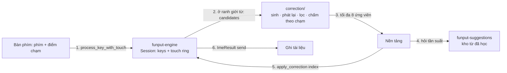

# Tự sửa lỗi gõ nhầm phím

## Trạng thái

**Thiết kế — chờ duyệt, chưa có code.** Mọi quyết định hành vi sống ở tài liệu này; khi hiện
thực lệch khỏi bản viết, cập nhật lại tài liệu trong cùng PR.

Tài liệu này viết đủ chi tiết để một người (hoặc một agent) khác lập kế hoạch hiện thực mà
không cần đọc lại toàn bộ điều tra: mọi điểm nối đều ghi rõ file, hàm và thứ tự gọi.

## 1. Vì sao

Người gõ tiếng Việt không nhìn bàn phím thấy bàn phím hệ thống iOS "nhận phím chuẩn hơn"
Funput. Điều tra 17–18/09/2026 (XCUITest trên bàn phím Telex hệ thống, iOS 27) cho thấy khác
biệt **không nằm ở vùng chạm**:

- Vùng chạm của bàn phím Telex hệ thống **cố định**, không đổi theo ngữ cảnh (sau `ng`, sau
  `gh` hay đầu từ đều như nhau; chỉ lệch cố định ~2pt). Bàn phím tiếng Anh thì có đổi, 3–8pt.
- Ở ô nhập cho phép autocorrect — mặc định của Tin nhắn, Ghi chú, Zalo, Messenger — bàn phím
  hệ thống **sửa lỗi gõ nhầm phím bên cạnh khi kết thúc từ**. Tắt autocorrect thì không sửa.

Chi tiết số đo: [KEY_ACCURACY_INVESTIGATION.md](../../platforms/ios/docs/KEY_ACCURACY_INVESTIGATION.md).

### Hiện trạng Funput còn xấu hơn "gõ ra chữ sai"

Kiểm chứng bằng `funput dev run` (bản `target/release/funput`, 18/09/2026):

| Chuỗi phím (Telex) | Funput hôm nay | Bàn phím hệ thống |
|---|---|---|
| `dduwowfnh ` | `dduwowfnh ` | đường |
| `tpoi ` | `tpoi ` | tôi |
| `khpong ` | `khpong ` | không |
| `vieeyj ` | `vieeyj ` | việt |
| `dduowxj ` | `đuợ ` | được |
| `minhg ` | `minhg ` | mình |

Vì âm tiết không hợp lệ, `should_restore` trong
[boundary/mod.rs](../../crates/funput-engine/src/compose/boundary/mod.rs) trả chuỗi phím thô
(English restore). Người dùng nhận ra một chuỗi ký tự vô nghĩa, tệ hơn một từ sai dấu.

## 2. Mục tiêu và ràng buộc

Khi kết thúc một từ mà từ vừa gõ **không phải âm tiết tiếng Việt hợp lệ**, Funput thay nó bằng
âm tiết hợp lệ gần nhất theo **vị trí chạm thật** của từng phím.

Ràng buộc, theo thứ tự ưu tiên:

1. **Không bao giờ sửa một từ hợp lệ.** Điều kiện cứng, không phải ngưỡng điểm.
2. **Không sửa khi không chắc.** Hai ứng viên sát điểm nhau thì để nguyên, chỉ gợi ý.
3. **Tôn trọng ô nhập và người dùng.** Tắt khi host cấm autocorrect hoặc cài đặt tắt.
4. **Hoàn tác một chạm**, và từ đã hoàn tác không bị sửa lại.
5. **Không làm chậm luồng gõ.** Chỉ chạy ở ranh giới từ, trần phép thử cố định, không I/O.
6. **Một bản lõi cho mọi nền tảng**, trong Rust.

### Không thuộc phạm vi (bản đầu)

- Sửa từ **hợp lệ** nhưng sai ngữ cảnh (`bán` ↔ `bạn`, `đưởng` ↔ `đường`). Cần mô hình ngôn ngữ.
- Sửa tiếng Anh, hoặc sửa khi đang ở chế độ tiếng Anh.
- Thêm/bớt/đảo phím. Bản đầu chỉ **thay phím** (xem §11 để mở rộng).
- Vùng chạm đổi theo ngữ cảnh (bàn phím hệ thống cũng không làm cho tiếng Việt).
- Bảng tần suất tiếng Việt đóng gói kèm app (đã chốt 18/09/2026: xếp hạng bằng điểm chạm + từ
  người dùng đã học).
- Desktop tự động sửa — xem §10.

## 3. Hành vi

### 3.1. Điều kiện chạy

Cần đủ **tất cả**:

| Điều kiện | Kiểm ở đâu |
|---|---|
| Phím vừa gõ là ranh giới từ (dấu cách, dấu câu, Enter) | `is_word_boundary` trong `boundary/mod.rs` |
| Chế độ tiếng Việt, method Telex / Telex nâng cao / VNI | `session.config` |
| Buffer **không** là âm tiết hoàn chỉnh | `funput_core::is_complete_syllable` |
| Không rơi vào nhánh "keystrokes intend Vietnamese" đã có | `keystrokes_intend_vietnamese` |
| Không phải gõ tắt (shortcut khớp) | `boundary/shortcut.rs` chạy trước |
| Từ không chứa chữ số, không toàn chữ hoa | luật mới trong `correction/` |
| Cài đặt `typo_correction` bật | `EngineConfig` |
| Host cho phép autocorrect | nền tảng, §8.1 và §9.1 |
| Có dữ liệu chạm cho từ này | nền tảng gửi kèm, §6 |

### 3.2. Khi sửa

- Thay phần từ đang hiển thị bằng ứng viên thắng, **giữ nguyên ký tự ranh giới**.
- Giữ kiểu chữ theo từ gốc: `Nhsf ` → `Nhà `, `NHSF ` không bị sửa (toàn hoa → bỏ qua).
- Thanh gợi ý hiện chip hoàn tác `↩ dduwowfnh` cho tới khi người dùng gõ phím tiếp theo.

### 3.3. Hoàn tác

- **Xoá ngay sau khi sửa**: trả lại đúng chuỗi người dùng đã gõ (bao gồm ký tự ranh giới), và
  đánh dấu từ đó "không sửa lại" cho tới hết phiên gõ từ (`suppress_next_correction`).
- Gõ phím khác: mất khả năng hoàn tác một chạm, như iOS.
- Chạm chip trên thanh gợi ý: tương đương bấm Xoá.

### 3.4. Ví dụ (đã kiểm bằng engine)

**Sửa** — từ không hợp lệ, một phím kề:

| Gõ | Hôm nay | Sau tính năng | Phép sửa |
|---|---|---|---|
| `dduwowfnh ` | `dduwowfnh ` | **đường** | h → g |
| `tpoi ` | `tpoi ` | **tôi** | p → o |
| `khpong ` | `khpong ` | **không** | p → o |
| `vieeyj ` | `vieeyj ` | **việt** | y → t |
| `dduowxj ` | `đuợ ` | **được** | x → c |
| `minhg ` | `minhg ` | **mình** | g → f |
| `d9u7o7nh2 ` (VNI) | `d9u7o7nh2 ` | **đường** | h → g |

**Hai ứng viên** — `nhad `: `d→f` ra **nhà**, `d→s` ra **nhá**. Ngón lệch về `f` chọn nhà, lệch
về `s` chọn nhá, chạm giữa `d` thì **không sửa** và đưa cả hai lên thanh gợi ý.

**Không đụng** — `bans ` → bán, `banj ` → bạn, `d9u7o7ng3 ` → đưởng: đều hợp lệ.

## 4. Kiến trúc



Hai vòng qua nền tảng giữ `funput-engine` **không phụ thuộc** `funput-suggestions`, đúng như
quan hệ hiện nay giữa hai crate.

| Tầng | Thêm gì |
|---|---|
| `crates/funput-engine/src/correction/` (mới) | Sinh ứng viên, phát lại, lọc, chấm theo chạm |
| `crates/funput-engine/src/model/session.rs` | Ring điểm chạm; `pending_correction`; `last_correction`; `suppress_next_correction` |
| `crates/funput-engine/src/model/config.rs` | `typo_correction: bool` (mặc định `false` cho tới khi bật theo nền tảng) |
| `crates/funput-engine/src/compose/boundary/mod.rs` | Gọi correction **trước** English restore |
| `crates/funput-ffi/src/engine/` | 3 hàm C mới (§7) |
| `crates/funput-jni/src/engine/` | 3 hàm JNI tương ứng |
| `crates/funput-suggestions/src/engine/query.rs` | `pub fn frequency(&self, word: &str) -> u32` |
| iOS `KeyboardTouchUIKit`, `KeyboardRenderer`, `KeyboardInput`, `FunputEngine` | §8 |
| Android `keyboard-renderer`, `ime` | §9 |

## 5. Thuật toán

### 5.1. Đầu vào

Mỗi phím trong từ đang gõ mang theo tối đa 3 phím thay thế kèm khoảng cách, tính theo **bước
phím** (pitch = bề rộng phím + khe):

```rust
/// One typed key and the keys the finger was near, nearest first.
pub struct KeyTouch {
    pub typed: char,
    /// Distance from the touch point to the centre of `typed`, in key pitches.
    pub typed_distance: f32,
    pub alternates: [Option<(char, f32)>; 3],
}
```

Nền tảng tự tính danh sách này từ hình học đang hiển thị; lõi không biết bố cục bàn phím. Phím
nào không có dữ liệu chạm (gõ tắt, dán, bàn phím vật lý) thì `alternates` rỗng và phím đó không
bao giờ bị thay.

### 5.2. Sinh ứng viên

```
cho mỗi tập con S các vị trí trong từ, |S| ≤ 2:
    cho mỗi tổ hợp phím thay tại S:
        phát lại toàn bộ chuỗi phím qua một Session nháp (cùng config)
        nếu kết quả là âm tiết hoàn chỉnh hợp lệ → giữ làm ứng viên
```

- **Trần:** từ dài tối đa 10 phím; tối đa 3 thay thế mỗi phím; tối đa 2 phím thay.
  Số chuỗi phải phát lại tối đa `1 + 10×3 + C(10,2)×9 = 436`.
- **Phát lại** dùng chính `Engine`/`Session` nên mọi luật Telex, VNI, Telex nâng cao, đặt dấu
  kiểu cũ/mới đều đúng theo cấu hình hiện tại. Không có bản sao luật thứ hai.
- Phím dấu (`s f r x j w z`, nhân đôi nguyên âm, chữ số VNI) được đối xử như mọi phím khác;
  nhờ vậy `dduowxj → dduowcj` và `nhsf → nhaf` nằm trong cùng một cơ chế.

### 5.3. Chấm điểm

```
score = Σ_i  log P(chạm_i | phím_i)  +  log prior(từ)  −  λ × số phím thay
P(chạm | phím) = exp(−d² / (2σ²)),  d tính theo bước phím
```

| Hằng số | Giá trị khởi điểm | Ý nghĩa |
|---|---|---|
| `σ` | 0,45 pitch | Độ tản của điểm chạm quanh tâm phím |
| `λ` | 1,2 | Phạt mỗi phím thay, để 1 phím luôn hơn 2 phím |
| `Δ` | 1,0 | Biên tối thiểu giữa ứng viên nhất và nhì để dám sửa |
| `prior` nền | 0,5 | Điểm cho âm tiết hợp lệ chưa từng gõ |

- `prior(từ)` = `ln(1 + số lần người dùng đã gõ từ đó)` + nền, lấy từ `funput-suggestions`.
- **Không sửa** nếu `best − runner_up < Δ`; khi đó gửi cả hai lên thanh gợi ý.
- `σ`, `λ`, `Δ` là hằng số khởi điểm, chỉnh bằng bộ kiểm thử ở §12.

### 5.4. Thứ tự ở ranh giới từ

Trong `boundary/mod.rs`, khi gặp phím ranh giới:

1. **Gõ tắt** (`shortcut.rs`) — nếu khớp, dừng.
2. **Âm tiết hợp lệ** — dừng, không đụng.
3. **`keystrokes_intend_vietnamese`** — giữ nguyên hành vi hiện tại, không sửa.
4. **Correction** — nếu bật, có dữ liệu chạm, không bị `suppress_next_correction`:
   trả về danh sách ứng viên cho nền tảng và **chờ bước 5** trước khi sinh `ImeResult`.
5. **English restore** — như hôm nay, khi không có ứng viên hoặc nền tảng từ chối.

## 6. Giao thức hai bước

Vì lõi không được phụ thuộc kho từ, ranh giới từ chạy hai bước **đồng bộ, trong cùng một
keystroke**, không có `Task`, không chờ I/O:

1. Nền tảng gọi `process_key` cho phím ranh giới như hôm nay.
2. Nếu engine có ứng viên, nó **chưa** ghi tài liệu: trả `Action::None` kèm cờ
   `has_pending_correction`.
3. Nền tảng đọc ứng viên (`funput_engine_correction_candidates`), hỏi tần suất từng ứng viên ở
   `funput-suggestions`, chọn chỉ số thắng (hoặc `-1` nghĩa là bỏ qua).
4. Nền tảng gọi `funput_engine_apply_correction(index)`; engine sinh `ImeResult::send` cuối cùng
   (xoá buffer hiện tại, chèn từ đã sửa + ký tự ranh giới) hoặc, với `-1`, chạy English restore
   như cũ.

**Nếu nền tảng không gọi bước 4** (phiên bản cũ, hoặc lỗi), engine tự chốt bằng English restore
ở keystroke kế tiếp. Không có trạng thái treo.

## 7. API

### 7.1. Rust (`funput-engine`)

```rust
pub struct CorrectionCandidate {
    pub text: String,
    /// Touch-only score; the platform adds the word prior.
    pub touch_score: f32,
    pub edits: u8,
}

impl Engine {
    /// Records the keys the finger was near, for the key about to be processed.
    pub fn set_next_key_touch(&mut self, touch: KeyTouch);

    /// Candidates for the word that just hit a boundary, best touch score first.
    pub fn correction_candidates(&self) -> &[CorrectionCandidate];

    /// Applies the candidate at `index`, or `None` to fall back to the current
    /// behaviour (English restore). Returns the result for this keystroke.
    pub fn apply_correction(&mut self, index: Option<usize>) -> ImeResult;
}
```

### 7.2. C ABI (`funput-ffi`)

```c
void     funput_engine_set_next_key_touch(FunputEngine*, const FunputKeyTouch*);
uint32_t funput_engine_correction_candidates(FunputEngine*, FunputCorrectionCandidate* out, uint32_t cap);
void     funput_engine_apply_correction(FunputEngine*, int32_t index, FunputResult* out);
```

`FunputKeyTouch` và `FunputCorrectionCandidate` là `#[repr(C)]`, chuỗi UTF-32 cố định như
`FunputResult` hiện có (`chars: [u32; 64]`). JNI phản chiếu đúng ba hàm này.

### 7.3. `funput-suggestions`

```rust
impl SuggestionEngine {
    /// How many times the user typed `word`, 0 when unknown. Read-only, no I/O.
    pub fn frequency(&self, word: &str) -> u32;
}
```

## 8. iOS

### 8.1. Điểm nối

| Việc | File |
|---|---|
| Phím kề + khoảng cách từ điểm chạm | `KeyboardTouchUIKit/Geometry/KeyboardGeometrySnapshot.swift` — thêm `func alternates(at:limit:) -> [(KeySpec, CGFloat)]` |
| Mang điểm chạm theo sự kiện phím | `KeyboardRenderer/.../KeyboardTouchCoordinator.swift` (đã có `hits`, `beganAt`) → thêm vào `KeyboardKeyEvent` |
| Gọi engine | `FunputEngine/FunputComposer+Text.swift` (đang gọi `funput_process_key_text`) |
| Ranh giới từ và ghi tài liệu | `KeyboardInput/Coordinator/KeyboardInputCoordinator+Actions.swift`, `Transactions/` |
| Tần suất từ | `PersonalSuggestions` (module Swift) |
| Cờ autocorrect của host | `Keyboard/Controller/KeyboardViewController+Traits.swift` — `applyTextInputTraits` đã đọc trait, thêm `autocorrectionType` |
| Chip hoàn tác | `KeyboardRenderer/.../KeyboardToolbarView` (đang có suggestion bar) |
| Công tắc | `Funput/Settings/KeyboardSettingsSections.swift` nhóm "Thông minh" + `FunputConfiguration` (schema v14) |

### 8.2. Ghi tài liệu

Dùng đúng đường đã có cho smart restore: `ImeResult.send(backspace, output)` chạy qua
`InputTransactionBuilder`. Không thêm đường ghi thứ hai, nên `KeyboardDocumentSynchronizer` và
bộ chống echo hiện tại vẫn đúng.

### 8.3. Hoàn tác

Phím Xoá ngay sau khi sửa: `KeyboardInputCoordinator` đã có `reopensPreviousWord` cho Backspace;
correction cắm vào đó, phát `ImeResult::send` trả lại chuỗi gốc và bật `suppress_next_correction`.

## 9. Android

| Việc | File |
|---|---|
| Điểm chạm | `keyboard-renderer/.../interaction/KeyboardTouchHandler.kt` — đã truyền `x, y` ở `onKeyReleased` |
| Phím kề | `keyboard-renderer/.../layout/KeyboardHitTester.kt` — thêm hàm trả phím gần nhất kèm khoảng cách |
| Gọi engine | `ime/.../nativebridge/FunputNative` (đã có `nativeProcess`, `nativeAdopt`) |
| Ghi tài liệu | `ime/.../editing/CommittedBufferWriter.kt` — một batch edit, như retone |
| Tần suất từ | `PersonalSuggestionNative` (đã có `nativeQuery`) |
| Cờ autocorrect | `EditorInfo.inputType` — bỏ qua khi có `TYPE_TEXT_FLAG_NO_SUGGESTIONS` hoặc ô mật khẩu |

## 10. Desktop

Lõi dùng lại được, nhưng **hai vế chấm điểm biến mất**:

- Không có điểm chạm (bàn phím vật lý) → chỉ còn phím kề với trọng số bằng nhau.
- `funput-desktop` không nối `funput-suggestions` → không có tần suất.

Còn lại chỉ là "âm tiết hợp lệ + ít phím thay nhất", quá yếu để tự thay chữ. Ngược lại, ghi chữ
lại dễ hơn: macOS, fcitx5 và ibus giữ âm tiết trong preedit tới lúc chốt, nên sửa chỉ là chốt một
preedit khác; Windows dùng inject kèm bản sao văn bản đã gõ, khó ngang iOS.

**Quyết định:** desktop không tự sửa ở bản đầu. Khi làm, chỉ **gợi ý** (gạch chân preedit hoặc
đưa vào danh sách chọn), và trước đó phải nối kho từ đã học cho desktop. Lỗi trên bàn phím vật
lý cũng khác (đảo thứ tự, gõ lặp), nên tập phép sửa phải thiết kế riêng.

## 11. Mở rộng về sau

Xếp theo thứ tự giá trị trên mỗi đơn vị rủi ro:

1. **Thêm/bớt một phím** (`ddleer` → `để`): mở rộng tập phép sửa, giữ nguyên phần chấm điểm.
2. **Đảo hai phím kề** (`nhaf` ↔ `nhfa`): rẻ, hay gặp khi gõ nhanh hai ngón.
3. **Bảng tần suất âm tiết đóng gói**: gắn vào đúng chỗ `prior`, không đụng phần còn lại.
4. **Sửa từ hợp lệ theo ngữ cảnh** (`bán` → `bạn`): cần bigram; rủi ro cao nhất, làm sau cùng.

## 12. Kiểm thử và cổng gác

1. **Kho lỗi tổng hợp** (`crates/funput-engine/tests/`): lấy danh sách âm tiết hợp lệ từ bộ phủ
   `funput dev coverage`, mô phỏng chạm có nhiễu Gauss quanh tâm phím để sinh chuỗi gõ nhầm.
   - Đo: tỉ lệ sửa đúng, **tỉ lệ sửa sai**, tỉ lệ bỏ qua.
   - Cổng: sửa sai **< 1%** số lần sửa; sửa đúng ≥ 70% ở nhiễu σ = 0,45.
2. **Bất biến**: mọi âm tiết hợp lệ gõ đúng phím không bao giờ bị đổi (property test toàn tập).
3. **Ca đã đo trên iOS** (§3.4) thành test bảng, gồm cả ca `nhad` hai ứng viên: lệch trái ra
   `nhá`, lệch phải ra `nhà`, chạm giữa không sửa.
4. **Hoàn tác**: sửa → Xoá → đúng chuỗi gốc; gõ lại từ đó trong cùng phiên không bị sửa lần hai.
5. **Hiệu năng**: p99 < 2ms cho một từ 10 phím trên thiết bị cũ nhất hỗ trợ; benchmark trong
   `benchmarks/`.
6. **UI test iOS**: gõ `dduwowfnh ` trong ô bật autocorrect ra `đường `; trong harness (tắt
   autocorrect) ra `dduwowfnh `; Xoá ngay sau khi sửa trả lại `dduwowfnh `.
7. **Differential**: chạy bộ 70k chuỗi phím hiện có với `typo_correction` **tắt** để chứng minh
   không đổi hành vi cũ (xem `docs` của `funput dev coverage`).

## 13. Chỉ số

`correctionsApplied`, `correctionsReverted`, `correctionsSkippedAmbiguous`,
`correctionCandidatesMax`, `correctionMicrosecondsMax`. Chỉ đếm, không lưu nội dung. Tỉ lệ hoàn
tác cao nghĩa là `Δ` đặt thấp quá.

## 14. Thứ tự hiện thực

| PR | Nội dung | Cổng |
|---|---|---|
| 1 | `funput-engine::correction` + `KeyTouch` + phát lại + lọc, prior đều, `typo_correction` mặc định tắt | Kho lỗi tổng hợp, property test |
| 2 | `SuggestionEngine::frequency` + C ABI + JNI | Test round-trip FFI |
| 3 | iOS: phím kề từ hình học, mang điểm chạm qua pipeline, hai bước ở ranh giới từ, ghi tài liệu | Test đơn vị + UI test §12.6 |
| 4 | iOS: hoàn tác, chip trên thanh gợi ý, công tắc Cài đặt, tôn trọng `autocorrectionType` | UI test hoàn tác |
| 5 | Android: cùng lõi, batch edit | Instrumented test |
| 6 | Chỉnh `σ`, `λ`, `Δ` theo kho lỗi và phản hồi TestFlight | Số liệu §13 |

## 15. Câu hỏi còn mở

1. **Mặc định bật hay tắt** ở bản phát hành đầu? Đề xuất: bật cho người cài mới, tắt cho người
   đang dùng, kèm thông báo một lần.
2. **Thanh gợi ý khi không chắc**: chiếm khe gợi ý đang có, hay thêm một hàng? Đề xuất: dùng
   đúng khe hiện có, vì lúc đó chưa có gợi ý nào khác.
3. **Học từ đã sửa**: từ được sửa có nên được `learn` như từ người dùng tự gõ? Đề xuất: có, nhưng
   chỉ khi người dùng không hoàn tác trong từ kế tiếp.
4. **Tên hiển thị** của cài đặt: "Tự sửa lỗi gõ" hay "Sửa lỗi phím bấm"?
