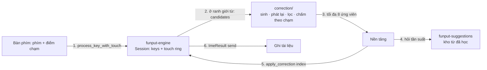

# Tự sửa lỗi gõ nhầm phím

## Trạng thái

**Rust và iOS đã hiện thực** trên nhánh `feat/typo-correction`: lõi
(`crates/funput-engine/src/correction/`), hai câu truy vấn ở `funput-suggestions`, cầu nối C ABI
+ JNI, và bàn phím iOS (bật sẵn, tắt được trong Cài đặt). Engine để mặc định tắt; mỗi nền tảng
tự bật. Android chưa làm. Mọi quyết định hành vi sống ở tài liệu này; khi hiện thực lệch khỏi bản
viết, cập nhật lại tài liệu trong cùng PR — các mục dưới đây đã được sửa theo đúng những gì
code làm, chỗ nào lệch đều ghi rõ lý do.

Tài liệu này viết đủ chi tiết để một người (hoặc một agent) khác lập kế hoạch hiện thực mà
không cần đọc lại toàn bộ điều tra: mọi điểm nối đều ghi rõ file, hàm và thứ tự gọi.

## 1. Vì sao

Người gõ tiếng Việt không nhìn bàn phím thấy bàn phím hệ thống iOS "nhận phím chuẩn hơn"
Funput. Điều tra 17–18/09/2026 (XCUITest trên bàn phím Telex hệ thống, iOS 27) cho thấy khác
biệt **không nằm ở vùng chạm**:

- Vùng chạm của bàn phím Telex hệ thống **cố định**, không đổi theo ngữ cảnh (sau `ng`, sau
  `gh` hay đầu từ đều như nhau; chỉ lệch cố định ~2pt). Bàn phím tiếng Anh thì có đổi, 3–8pt.
- Ở ô nhập cho phép autocorrect — mặc định của Tin nhắn, Ghi chú, Zalo, Messenger — bàn phím
  hệ thống **sửa lỗi gõ nhầm phím bên cạnh khi kết thúc từ**. Tắt autocorrect thì không sửa.

Chi tiết số đo: [KEY_ACCURACY_INVESTIGATION.md](../../platforms/ios/docs/KEY_ACCURACY_INVESTIGATION.md).

### Hiện trạng Funput còn xấu hơn "gõ ra chữ sai"

Kiểm chứng bằng `funput dev run` (bản `target/release/funput`, 18/09/2026):

| Chuỗi phím (Telex) | Funput hôm nay | Bàn phím hệ thống |
|---|---|---|
| `dduwowfnh ` | `dduwowfnh ` | đường |
| `tpoi ` | `tpoi ` | tôi |
| `khpong ` | `khpong ` | không |
| `vieeyj ` | `vieeyj ` | việt |
| `dduowxj ` | `đuợ ` | được |
| `minhg ` | `minhg ` | mình |

Trong số này **`dduowxj ` nằm ngoài tầm với của bản đầu**: nó ra `đuợ`, mà
`funput_core::is_complete_syllable` nhận là âm tiết hoàn chỉnh. Sửa nó nghĩa là sửa cả những từ
hợp lệ — đúng thứ §11 xếp cuối vì rủi ro cao nhất. Xem §3.4.

Vì âm tiết không hợp lệ, `should_restore` trong
[boundary/mod.rs](../../crates/funput-engine/src/compose/boundary/mod.rs) trả chuỗi phím thô
(English restore). Người dùng nhận ra một chuỗi ký tự vô nghĩa, tệ hơn một từ sai dấu.

## 2. Mục tiêu và ràng buộc

Khi kết thúc một từ mà từ vừa gõ **không phải âm tiết tiếng Việt hợp lệ**, Funput thay nó bằng
âm tiết hợp lệ gần nhất theo **vị trí chạm thật** của từng phím.

Ràng buộc, theo thứ tự ưu tiên:

1. **Không bao giờ sửa một từ hợp lệ.** Điều kiện cứng, không phải ngưỡng điểm.
2. **Không sửa khi không chắc.** Hai ứng viên sát điểm nhau thì để nguyên, chỉ gợi ý.
3. **Tôn trọng ô nhập và người dùng.** Tắt khi host cấm autocorrect hoặc cài đặt tắt.
4. **Hoàn tác một chạm**, và từ đã hoàn tác không bị sửa lại.
5. **Không làm chậm luồng gõ.** Chỉ chạy ở ranh giới từ, trần phép thử cố định, không I/O.
6. **Một bản lõi cho mọi nền tảng**, trong Rust.

### Không thuộc phạm vi (bản đầu)

- Sửa từ **hợp lệ** nhưng sai ngữ cảnh (`bán` ↔ `bạn`, `đưởng` ↔ `đường`). Cần mô hình ngôn ngữ.
- Sửa tiếng Anh, hoặc sửa khi đang ở chế độ tiếng Anh.
- Thêm/bớt/đảo phím. Bản đầu chỉ **thay phím** (xem §11 để mở rộng).
- Vùng chạm đổi theo ngữ cảnh (bàn phím hệ thống cũng không làm cho tiếng Việt).
- Bảng tần suất tiếng Việt đóng gói kèm app (đã chốt 18/09/2026: xếp hạng bằng điểm chạm + từ
  người dùng đã học).
- Desktop tự động sửa — xem §10.

## 3. Hành vi

### 3.1. Điều kiện chạy

Cần đủ **tất cả**:

| Điều kiện | Kiểm ở đâu |
|---|---|
| Phím vừa gõ là ranh giới từ (dấu cách, dấu câu, Enter) | `is_word_boundary` trong `boundary/mod.rs` |
| Chế độ tiếng Việt, method Telex / Telex nâng cao / VNI | `session.config` |
| Buffer **không** là âm tiết hoàn chỉnh | `boundary::judge` (một lần cho cả restore lẫn correction) |
| Buffer không phải nguyên âm trần (`ă`, `â`) | `funput_core::is_bare_shaped_vowel` |
| Người dùng chưa tự lật dạng chữ cho từ này | `session.restore_override` |
| Không phải gõ tắt (shortcut khớp) | `boundary/shortcut.rs` chạy trước |
| Từ không chứa chữ số (trừ VNI), không toàn chữ hoa | `correction::eligible` |
| Từ chưa bị người dùng hoàn tác | `correction::undone_before` |
| Cài đặt `typo_correction` bật | `EngineConfig` |
| Host cho phép autocorrect | nền tảng, §8.1 và §9.1 |
| Có dữ liệu chạm cho **mọi** phím của từ, khớp với `session.keys` | `TouchLog::matches` |

**Đã bỏ so với bản thiết kế:** điều kiện "không rơi vào `keystrokes_intend_vietnamese`". Chính
hai ca phải sửa của §3.4 lại bị nó bắt — `dduowxj` có `đ` trong buffer, `d9u7o7nh2` có chữ số
trong keys. Hàm đó trả lời "có nên quay về chữ Latin thô không", không phải "từ này đã xong
chưa". Riêng chữ số: VNI dùng chữ số làm phím dấu nên luật "có chữ số thì bỏ qua" chỉ áp cho
Telex.

### 3.2. Khi sửa

- Thay phần từ đang hiển thị bằng ứng viên thắng, **giữ nguyên ký tự ranh giới**.
- Giữ kiểu chữ theo từ gốc: `Nhad ` → `Nhà `, `NHAD ` không bị sửa (toàn hoa → bỏ qua).
  (Bản thiết kế viết `Nhsf `; chuỗi đó không có nguyên âm nên Telex không ra `Nhà`.)
- Thanh gợi ý hiện chip hoàn tác `↩ dduwowfnh` cho tới khi người dùng gõ phím tiếp theo.

### 3.3. Hoàn tác

- **Xoá ngay sau khi sửa**: trả lại đúng chuỗi người dùng đã gõ (bao gồm ký tự ranh giới), và
  đánh dấu từ đó "không sửa lại". Dấu này **tiêu thụ một lần**: gõ lại từ đó lần nữa trong cùng
  phiên vẫn được đề nghị sửa, giống bàn phím hệ thống.
- Gõ phím khác: mất khả năng hoàn tác một chạm, như iOS.
- Chạm chip trên thanh gợi ý: tương đương bấm Xoá.

### 3.4. Ví dụ (đã kiểm bằng engine)

**Sửa** — từ không hợp lệ, một phím kề:

| Gõ | Hôm nay | Sau tính năng | Phép sửa |
|---|---|---|---|
| `dduwowfnh ` | `dduwowfnh ` | **đường** | h → g |
| `tpoi ` | `tpoi ` | **tôi** | p → o |
| `khpong ` | `khpong ` | **không** | p → o |
| `vieeyj ` | `vieeyj ` | **việt** | y → t |
| `minhg ` | `minhg ` | **mình** | g → f |
| `quaa ` | `quâ ` | **quá** | a → s |
| `d9u7o7nh2 ` (VNI) | `d9u7o7nh2 ` | **đường** | h → g |

`quaa ` là ca *đang hiển thị dạng đã ghép*: thứ phải xoá là `quâ` (3 ký tự) chứ không phải 4
phím đã gõ. Bảng test `tests/correction/table.rs` giữ đúng các hàng này.

**Hai ứng viên** — `nhad `: `d→f` ra **nhà**, `d→s` ra **nhá**. Ngón lệch về `f` chọn nhà, lệch
về `s` chọn nhá, chạm giữa `d` thì **không sửa** và đưa cả hai lên thanh gợi ý.

**Không đụng** — `bans ` → bán, `banj ` → bạn, `d9u7o7ng3 ` → đưởng: đều hợp lệ.

**`dduowxj ` không sửa được ở bản đầu.** Nó ra `đuợ`, và `is_complete_syllable("đuợ")` là
`true`, nên luật cứng "không bao giờ sửa một từ hợp lệ" (§2) chặn lại. Muốn sửa phải mở sang
"sửa từ hợp lệ theo ngữ cảnh" — mục rủi ro nhất ở §11 — nên nó ở lại danh sách không đụng cho
tới lúc đó.

## 4. Kiến trúc



Hai vòng qua nền tảng giữ `funput-engine` **không phụ thuộc** `funput-suggestions`, đúng như
quan hệ hiện nay giữa hai crate.

| Tầng | Thêm gì |
|---|---|
| `crates/funput-engine/src/correction/` (mới) | Sinh ứng viên, phát lại, lọc, chấm theo chạm |
| `crates/funput-engine/src/model/session.rs` | Đúng một trường `correction: Option<Box<CorrectionState>>` (`model/` đã đủ 5 file; state nằm trong `correction/state.rs`). Box vì state ~900 B — `size_of::<Engine>()` chỉ tăng một con trỏ 8 byte (cùng `NumberGlue` của gõ tắt sau số: 136 → 152) |
| `crates/funput-engine/src/model/config.rs` | `typo_correction: bool` (mặc định `false` cho tới khi bật theo nền tảng) |
| `crates/funput-engine/src/compose/boundary/mod.rs` | Gọi correction **trước** English restore |
| `crates/funput-ffi/src/engine/` | 3 hàm C mới (§7) |
| `crates/funput-jni/src/engine/` | 3 hàm JNI tương ứng |
| `crates/funput-suggestions/src/engine/query.rs` | `pub fn frequency(&self, word: &str) -> u32` |
| iOS `KeyboardTouchUIKit`, `KeyboardRenderer`, `KeyboardInput`, `FunputEngine` | §8 |
| Android `keyboard-renderer`, `ime` | §9 |

## 5. Thuật toán

### 5.1. Đầu vào

Mỗi phím trong từ đang gõ mang theo tối đa 3 phím thay thế kèm khoảng cách, tính theo **bước
phím** (pitch = bề rộng phím + khe):

```rust
/// One typed key and the keys the finger was near, nearest first.
let touch = KeyTouch::new('h', 0.35)
    .with_alternate('g', 0.15)
    .with_alternate('j', 0.60);
```

Trường để riêng tư và dựng bằng builder, vì bên trong engine chúng được lượng tử hoá: `Session`
derive `Eq`, mà `f32` thì không. Khoảng cách lưu Q8.8 (`u16`), điểm lưu milli-nat (`i32`);
`CorrectionCandidate::touch_score()` đổi ngược khi nền tảng đọc.

Nền tảng tự tính danh sách này từ hình học đang hiển thị; lõi không biết bố cục bàn phím. Phím
nào **không** có dữ liệu chạm (gõ tắt, dán, bàn phím vật lý) làm **cả từ** mất khả năng sửa —
bằng chứng khuyết một nửa còn tệ hơn không có. Cũng vậy khi chuỗi phím bị viết lại sau lưng
(phím dấu bị revert, `adopt`, Xoá): log tự đánh dấu không dùng được, và hệ quả luôn là *không
sửa*, không bao giờ là sửa sai.

### 5.2. Sinh ứng viên

```
cho mỗi tập con S các vị trí trong từ, |S| ≤ 2:
    cho mỗi tổ hợp phím thay tại S:
        phát lại toàn bộ chuỗi phím qua một Session nháp (cùng config)
        nếu kết quả là âm tiết hoàn chỉnh hợp lệ → giữ làm ứng viên
```

- **Trần:** từ dài 2–10 phím; tối đa 3 thay thế mỗi phím; tối đa 2 phím thay.
  Số chuỗi phải phát lại tối đa `10×3 + C(10,2)×9 = 435` (không tính chuỗi gốc — nó đã được
  biết là không hợp lệ). Đo thật: một từ 9 phím, mỗi phím 3 phím kề, tốn 4509 lần cấp phát —
  đúng cỡ một lần cho mỗi phím được phát lại, và chỉ trả một lần cho mỗi từ được sửa.
- **Phát lại** chạy thẳng `compose::pipeline::process` trên một `Session` nháp dùng lại (không
  qua `Engine`, để không chạm `prepare_key`, ranh giới từ hay trạng thái viết hoa), nên mọi luật
  Telex, VNI, Telex nâng cao, đặt dấu kiểu cũ/mới đều đúng theo cấu hình hiện tại. Không có bản
  sao luật thứ hai.
- Config nháp **ép tắt** `smart_restore`, `eager_restore`, `spell_check`, `auto_capitalize`:
  nếu không, chính cơ chế English restore sẽ biến một ứng viên hợp lệ thành chữ thô giữa chừng
  và bước kiểm tra sẽ chấm nhầm chuỗi phím thay vì âm tiết. Vòng phát lại cũng phải tự làm hai
  việc `process_key` làm quanh pipeline: chặn chữ số mở đầu từ, và đẩy phím vào `keys`.
- Phím dấu (`s f r x j w z`, nhân đôi nguyên âm, chữ số VNI) được đối xử như mọi phím khác;
  nhờ vậy `dduowxj → dduowcj` và `nhsf → nhaf` nằm trong cùng một cơ chế.

### 5.3. Chấm điểm

```
score = Σ_i  log P(chạm_i | phím_i)  +  log prior(từ)  −  λ × số phím thay
P(chạm | phím) = exp(−d² / (2σ²)),  d tính theo bước phím
```

| Hằng số | Giá trị khởi điểm | Ý nghĩa |
|---|---|---|
| `σ` | 0,45 pitch | Độ tản của điểm chạm quanh tâm phím |
| `λ` | 1,2 | Phạt mỗi phím thay, để 1 phím luôn hơn 2 phím |
| `Δ` | **1,5** | Biên tối thiểu giữa ứng viên nhất và nhì để dám sửa (đo ở §12.1) |
| `prior` nền | 0,5 | Điểm cho âm tiết hợp lệ chưa từng gõ |

- `prior(từ)` = `ln(1 + số lần người dùng đã gõ từ đó)` + nền, lấy từ `funput-suggestions`.
- **Chữ nguyên như đã gõ cũng là một ứng viên**, điểm = điểm chạm gốc − `INVALID_COST` (**3,0**,
  đo ở §12.1). `runner_up` bắt đầu từ điểm đó, không phải âm vô cực. Trước đợt 2, một ứng viên
  duy nhất luôn thắng dù ngón đặt ngay giữa phím — nên `ko`, `atlas`, `robot` gõ đúng vẫn bị đổi.
- **Không sửa** nếu `best − runner_up < Δ`; khi đó gửi cả hai lên thanh gợi ý. Nếu thứ cản là
  chữ nguyên thì engine đếm vào `kept_as_typed`, nếu là ứng viên thứ hai thì `skipped_ambiguous`.
- `σ`, `λ` là hằng số khởi điểm. **`Δ` đã chốt ở 1,5** sau khi đo (§12.1): nó là knob **yếu**
  — đẩy tiếp lên 2,5 chỉ hạ sửa sai từ 3,9% xuống 2,3% mà mất thêm một phần tư số lần sửa đúng
  — nhưng 1,0 → 1,5 là đoạn duy nhất đáng đổi. Thứ thật sự quyết định vẫn là mức nhiễu của ngón.
- **Mặt nạ `allowed`**: nền tảng nói ứng viên nào từ điển của nó công nhận. Việc lọc nằm trong
  cùng hàm quyết định chứ không ở phía gọi, vì chỉ số trả về trỏ vào danh sách **chưa lọc**.

  **Ứng viên bị từ chối không được thắng, nhưng vẫn tranh biên Δ.** Đây là tính chất an toàn của
  một từ điển *chưa đầy đủ*, và nó được đo chứ không phải suy đoán: với danh sách 569 âm tiết,
  để ứng viên bị từ chối rơi hẳn khỏi phép so sánh đưa tỉ lệ sửa sai lên **59,6%** — một từ
  thông dụng nhưng sai thắng *không cần tranh* vì đáp án đúng vừa bị gạt. Giữ nó lại trong phép
  so sánh thì còn **5,3%**: từ điển biết quá ít sẽ **sửa ít đi**, chứ không sửa bậy.

**Cửa chặn tiếng Anh là việc của nền tảng.** Một từ tiếng Anh gõ có chủ ý kết thúc ở đúng trạng
thái mà một từ tiếng Việt gõ nhầm kết thúc: chữ thô, không phải âm tiết. `text ` chẳng hạn có
thể với tới `tẻ` (phím `r` ngay cạnh `t`). Lõi không có từ điển tiếng Anh nên nó **giao lại**
danh sách ứng viên; thứ giữ `text` nguyên vẹn là `SuggestionEngine::is_known_word` ở phía nền
tảng, cộng biên Δ và tần suất từ. Test `an_english_word_the_user_typed_on_purpose_still_reaches_the_platform`
ghim đúng sự phân vai này.

### 5.4. Thứ tự ở ranh giới từ

Trong `boundary/mod.rs`, khi gặp phím ranh giới:

1. **Gõ tắt** (`shortcut.rs`) — nếu khớp, dừng.
2. **`judge`** — một lần `is_complete_syllable` trả lời cho cả hai việc còn lại. Nó chỉ chạy khi
   có người cần: English restore còn cửa, hoặc correction có dữ liệu chạm dùng được. Nhờ vậy
   host không gửi điểm chạm thì chi phí bằng đúng hôm nay (đo bằng `alloc_budget_correction`).
3. **Correction** — nếu qua hết §3.1: ghi ứng viên vào chỗ chờ, rồi vẫn `session.clear()` và
   trả về đúng `ImeResult` như hôm nay (`Action::None`). Keystroke này **không** đổi văn bản.
4. **English restore** — như hôm nay, khi correction không nhận từ này.

Thứ tự này khác bản thiết kế ở một điểm quan trọng: correction **không** treo dưới nhánh
`should_restore`. Với `dduwowfnh` và `d9u7o7nh2`, eager restore trong `pipeline` đã đổi buffer
thành chuỗi phím thô từ một phím trước đó, nên tới ranh giới `buffer == keys` và
`should_restore` là **false** — đúng với những từ mà tính năng này sinh ra để sửa.

## 6. Giao thức hai bước

Vì lõi không được phụ thuộc kho từ, ranh giới từ chạy hai bước **đồng bộ, trong cùng một
keystroke**, không có `Task`, không chờ I/O:

1. Nền tảng gọi `process_key` cho phím ranh giới như hôm nay, và **áp dụng kết quả như hôm
   nay** — kể cả khi đó là `Action::None`, nghĩa là chính nền tảng chèn ký tự ranh giới.
2. Nền tảng hỏi `has_pending_correction()`. Đây là **một truy vấn riêng**, không phải cờ gắn
   vào `ImeResult`: `FunputResult` là `#[repr(C)]` truyền theo giá trị, `size_of` 268 byte đã bị
   test ghim và header đã phát hành — thêm trường vào là vỡ ABI âm thầm.
3. Nền tảng đọc ứng viên (`correction_candidates`), hỏi tần suất từng ứng viên ở
   `funput-suggestions`, rồi `choose_correction(&uses)` trả chỉ số thắng hoặc `None` khi hai
   ứng viên đầu sát nhau (biên Δ).
4. Nền tảng gọi `apply_correction(index)`. Với `Some(i)` engine sinh `ImeResult::send`; với
   `None` nó chạy nốt việc ranh giới đã hoãn (English restore, hoặc không gì cả).

**Số ký tự phải xoá đã tính cả ký tự ranh giới**: bước 1 trả `Action::None` nên ký tự đó *đã*
nằm trong tài liệu. Vì vậy `backspace = số ký tự đang hiển thị của từ + 1`, và nhánh English
restore ở đây nhiều hơn `boundary::english_restore_result` đúng 1 — đường kia nuốt phím ranh
giới, đường này thì không. `pending_correction_backspace()` trả sẵn con số đó cho host cần dựng
batch edit trước khi quyết định.

**Nếu nền tảng không gọi bước 4** (phiên bản cũ, hoặc lỗi), keystroke kế tiếp tự chốt: nó phát
lại đúng việc ranh giới đã hoãn rồi gộp vào kết quả của chính nó. Không có trạng thái treo, và
không mất chữ. Thắt lưng thứ hai là `typo_correction` mặc định tắt, nên không host nào đang chạy
bị ảnh hưởng.

## 7. API

### 7.1. Rust (`funput-engine`)

```rust
impl CorrectionCandidate {
    pub fn text(&self) -> &str;
    /// Touch evidence only, in nats; the platform adds the word prior.
    pub fn touch_score(&self) -> f32;
    pub fn edits(&self) -> usize;
}

impl Engine {
    pub fn set_next_key_touch(&mut self, touch: KeyTouch);
    pub fn has_pending_correction(&self) -> bool;
    pub fn correction_candidates(&self) -> &[CorrectionCandidate];
    /// The word plus the boundary character the platform already echoed.
    pub fn pending_correction_backspace(&self) -> usize;
    /// `uses` is parallel to the candidates; `&[]` gives the touch-only ranking.
    pub fn choose_correction(&self, uses: &[u32]) -> Option<usize>;
    pub fn apply_correction(&mut self, index: Option<usize>) -> ImeResult;
    /// While Backspace would still undo the last correction.
    pub fn has_correction_undo(&self) -> bool;
    pub fn correction_undo_text(&self) -> Option<&str>;
}
```

`choose_correction` nằm trong Rust chứ không để mỗi nền tảng tự viết, để công thức prior và
luật Δ chỉ tồn tại một bản. `has_correction_undo` là bắt buộc với host nào đang để phím Xoá tự
đi qua: từ nay `on_backspace` có lúc trả `Action::Send`.

### 7.2. C ABI (`funput-ffi`)

Đã hiện thực (`crates/funput-ffi/src/engine/correction/`), trả `FunputResult` theo giá trị như
mọi hàm engine khác:

```c
void         funput_engine_set_next_key_touch(FunputEngine*, const FunputKeyTouch*);
bool         funput_engine_has_pending_correction(const FunputEngine*);
uint32_t     funput_engine_correction_candidates(const FunputEngine*, FunputCorrectionCandidate* out, uint32_t cap);
uint32_t     funput_engine_pending_correction_backspace(const FunputEngine*);
int32_t      funput_engine_choose_correction(const FunputEngine*, const uint32_t* uses, uint32_t len);
FunputResult funput_engine_apply_correction(FunputEngine*, int32_t index);
uint32_t     funput_engine_correction_undo_text(const FunputEngine*, uint32_t* out, uint32_t cap);
void         funput_set_typo_correction(FunputEngine*, bool);
```

`funput_set_typo_correction` là setter riêng: `FunputConfig` là `#[repr(C)]` truyền theo giá
trị, thêm trường vào là vỡ ABI — đúng lối `funput_set_shortcuts_enabled` đã đi.

Hai điều học được khi làm:

- `funput_engine_choose_correction` **không** dùng được `with_engine_ref`: fallback của nó là
  `Default`, tức `0` — handle null sẽ nói "áp dụng ứng viên đầu tiên". Sentinel là `-1`, nên hàm
  này tự bọc guard. Test `every_call_is_null_safe` bắt được đúng lỗi này.
- Hằng số trong header không được trỏ sang crate khác: cbindgen đặt `parse_deps = false`, nên
  `TOUCH_ALTERNATE_CAP = MAX_ALTERNATES` sinh ra một `#define` gọi tên macro không tồn tại. Viết
  số thẳng, và `const _: () = assert!(...)` giữ hai bên khớp nhau.

`FunputKeyTouch` và `FunputCorrectionCandidate` là `#[repr(C)]`, chuỗi UTF-32 cố định như
`FunputResult` hiện có (`chars: [u32; 64]`). JNI phản chiếu đúng ba hàm này.

### 7.3. `funput-suggestions`

Cả hai đều có mặt ở C ABI (`funput_suggestion_frequency`, `funput_suggestion_is_known_word`)
và JNI (`nativeFrequency`, `nativeIsKnownWord`) — không có chúng thì nền tảng chỉ truyền được
mảng rỗng vào `choose_correction`, tức đúng trường hợp prior đều mà §12.1 đo được là nguy hiểm.


```rust
impl SuggestionEngine {
    /// How many times the user typed `word`, 0 when unknown. Read-only, no I/O.
    pub fn frequency(&self, word: &str) -> u32;

    /// A word the user has typed, or one in the shipped English list — the veto.
    pub fn is_known_word(&self, word: &str) -> bool;
}
```

### 7.4. JNI (`funput-jni`)

Một lệnh sửa về Android dưới dạng `IntArray` `[backspace, codepoint…]` — đúng dáng `nativeStats`
đã dùng cho số — nên một lần gọi mang cả hai nửa và không có thứ tự nào để gọi sai:

```kotlin
external fun nativeSetNextKeyTouch(handle: Long, typed: Int, typedDistance: Float,
                                   a1: Int, d1: Float, a2: Int, d2: Float, a3: Int, d3: Float)
external fun nativeHasPendingCorrection(handle: Long): Boolean
external fun nativeCorrectionCandidates(handle: Long): Array<String>
external fun nativePendingCorrectionBackspace(handle: Long): Int
external fun nativeChooseCorrection(handle: Long, uses: IntArray): Int
external fun nativeApplyCorrection(handle: Long, index: Int): IntArray
external fun nativeHasCorrectionUndo(handle: Long): Boolean
external fun nativeCorrectionUndoText(handle: Long): String
external fun nativeUndoCorrection(handle: Long): IntArray
external fun nativeSetTypoCorrection(handle: Long, on: Boolean)
```

`nativeUndoCorrection` tách khỏi `nativeBackspace` và là no-op khi `nativeHasCorrectionUndo` sai,
nên một phím Xoá bình thường không bao giờ bị nuốt ở đường này: IME hỏi trước rồi gọi một trong
hai. `String(edit, 1, edit.size - 1)` dựng lại chữ từ phần đuôi.

## 8. iOS

### 8.1. Điểm nối

| Việc | File |
|---|---|
| Phím kề + khoảng cách từ điểm chạm | `KeyboardTouchUIKit/Geometry/KeyboardGeometrySnapshot.swift` — thêm `func alternates(at:limit:) -> [(KeySpec, CGFloat)]` |
| Mang điểm chạm theo sự kiện phím | `KeyboardRenderer/.../KeyboardTouchCoordinator.swift` (đã có `hits`, `beganAt`) → thêm vào `KeyboardKeyEvent` |
| Gọi engine | `FunputEngine/FunputComposer+Text.swift` (đang gọi `funput_process_key_text`) |
| Ranh giới từ và ghi tài liệu | `KeyboardInput/Coordinator/KeyboardInputCoordinator+Actions.swift`, `Transactions/` |
| Tần suất từ | `PersonalSuggestions` (module Swift) |
| Cờ autocorrect của host | `Keyboard/Controller/KeyboardViewController+Traits.swift` — `applyTextInputTraits` đã đọc trait, thêm `autocorrectionType` |
| Chip hoàn tác | `KeyboardRenderer/.../KeyboardToolbarView` (đang có suggestion bar) |
| Công tắc | `Funput/Settings/KeyboardSettingsSections.swift` nhóm "Thông minh" + `FunputConfiguration` (schema v14) |

### 8.2. Ghi tài liệu

Dùng đúng đường đã có cho smart restore: `ImeResult.send(backspace, output)` chạy qua
`InputTransactionBuilder`. Không thêm đường ghi thứ hai, nên `KeyboardDocumentSynchronizer` và
bộ chống echo hiện tại vẫn đúng.

### 8.3. Hoàn tác

✅ Đã hiện thực. Một chỗ phải cẩn thận hơn bản viết: khi hoàn tác nổ, phím Xoá **không được**
đi tiếp vào tài liệu — engine đã nói chính xác xoá bao nhiêu và chèn lại gì, xoá thêm một ký tự
nữa là ăn mất dấu cách người dùng không hề chạm vào. Và `reopenPreviousWord` phải bị chặn cho
đúng lượt đó, nếu không `adopt` sẽ mở lại chính từ vừa bị người dùng từ chối.

Ngoài ra ngữ cảnh tài liệu phải kiểm **trước** khi hỏi engine, vì hỏi là tiêu thụ luôn lệnh hoàn
tác: hỏng sau đó thì engine tin là đã trả chữ về trong khi tài liệu vẫn đang hiện bản sửa.

Phím Xoá ngay sau khi sửa: `KeyboardInputCoordinator` đã có `reopensPreviousWord` cho Backspace.
Việc hoàn tác nằm **trong engine** — `Engine::on_backspace` trả thẳng `ImeResult::send` với chuỗi
gốc và tự bật cờ "không sửa lại". Host chỉ cần hỏi `has_correction_undo()` trước khi để phím Xoá
đi qua, và áp dụng kết quả như mọi `ImeResult` khác.

## 9. Android

| Việc | File |
|---|---|
| Điểm chạm | `keyboard-renderer/.../interaction/KeyboardTouchHandler.kt` — đã truyền `x, y` ở `onKeyReleased` |
| Phím kề | `keyboard-renderer/.../layout/KeyboardHitTester.kt` — thêm hàm trả phím gần nhất kèm khoảng cách |
| Gọi engine | `ime/.../nativebridge/FunputNative` (đã có `nativeProcess`, `nativeAdopt`) |
| Ghi tài liệu | `ime/.../editing/CommittedBufferWriter.kt` — một batch edit, như retone |
| Tần suất từ | `PersonalSuggestionNative` (đã có `nativeQuery`) |
| Cờ autocorrect | `EditorInfo.inputType` — bỏ qua khi có `TYPE_TEXT_FLAG_NO_SUGGESTIONS` hoặc ô mật khẩu |

**Đã giải quyết:** `nativeBackspace` và `nativeBoundary` chỉ trả `String` và vứt `ImeResult`
đi, nên chúng không tải nổi một lệnh sửa. Thay vì đổi hai hàm đó (và đổi cả chữ ký Java của
chúng), phần correction có đường riêng trả `IntArray` — xem §7.4.

## 10. Desktop

Lõi dùng lại được, nhưng **hai vế chấm điểm biến mất**:

- Không có điểm chạm (bàn phím vật lý) → chỉ còn phím kề với trọng số bằng nhau.
- `funput-desktop` không nối `funput-suggestions` → không có tần suất.

Còn lại chỉ là "âm tiết hợp lệ + ít phím thay nhất", quá yếu để tự thay chữ. Ngược lại, ghi chữ
lại dễ hơn: macOS, fcitx5 và ibus giữ âm tiết trong preedit tới lúc chốt, nên sửa chỉ là chốt một
preedit khác; Windows dùng inject kèm bản sao văn bản đã gõ, khó ngang iOS.

**Quyết định:** desktop không tự sửa ở bản đầu. Khi làm, chỉ **gợi ý** (gạch chân preedit hoặc
đưa vào danh sách chọn), và trước đó phải nối kho từ đã học cho desktop. Lỗi trên bàn phím vật
lý cũng khác (đảo thứ tự, gõ lặp), nên tập phép sửa phải thiết kế riêng.

## 11. Mở rộng về sau

Xếp theo thứ tự giá trị trên mỗi đơn vị rủi ro:

1. **Thêm/bớt một phím** (`ddleer` → `để`): mở rộng tập phép sửa, giữ nguyên phần chấm điểm.
2. **Đảo hai phím kề** (`nhaf` ↔ `nhfa`): rẻ, hay gặp khi gõ nhanh hai ngón.
3. **Bảng tần suất âm tiết đóng gói**: gắn vào đúng chỗ `prior`, không đụng phần còn lại.
4. **Sửa từ hợp lệ theo ngữ cảnh** (`bán` → `bạn`): cần bigram; rủi ro cao nhất, làm sau cùng.

## 12. Kiểm thử và cổng gác

1. **Kho lỗi tổng hợp**: ✅ `funput dev typos` (`crates/funput-cli/src/dev/typos/`). Lấy âm tiết
   hợp lệ từ đúng bộ ngữ liệu của `funput dev coverage`, gõ lại với ngón trượt theo nhiễu Gauss
   quanh tâm phím trên lưới QWERTY so le, rồi đếm.

   **Đã tách hai chữ σ.** Bản thiết kế dùng một chữ σ cho hai thứ khác nhau: độ tản *thật* của
   ngón tay, và độ tản engine *tin* là có khi chấm điểm. Bộ đo gọi cái đầu là `--noise`, vì đúng
   chỗ hai cái lệch nhau mới đáng đo.

   **Số thật, trên Viet74K (8 955 âm tiết).** `benchmarks/sample.txt` chỉ có 137 âm tiết nên kho
   từ học từ nó gần như luôn phân biệt được đúng/sai — số ở đó quá lạc quan, đừng dùng để quyết
   định:

   | Nhiễu ngón | Kho từ | Sửa đúng | **Sửa sai** |
   |---|---|---|---|
   | 0,20 | không | 54,6% | 0,8% |
   | 0,20 | Viet74K | 57,3% | **0,6%** |
   | 0,25 | không | 48,7% | 8,8% |
   | 0,25 | Viet74K | 51,9% | **6,8%** |
   | 0,30 | Viet74K | 42,9% | **14,8%** |

   Quét Δ và các bộ lọc, ở nhiễu 0,25 với kho từ Viet74K:

   | | Sửa đúng | Sửa sai |
   |---|---|---|
   | Δ = 1,0 | 51,9% | 6,83% |
   | Δ = 1,0 + chỉ từ có thật | 54,4% | 5,63% |
   | **Δ = 1,5 + chỉ từ có thật** ← đã chốt | **50,3%** | **3,87%** |
   | Δ = 2,0 + chỉ từ có thật | 42,6% | 2,86% |
   | Δ = 2,5 + chỉ từ có thật | 35,9% | 2,28% |
   | Δ = 1,0 + chỉ 1 phím thay | 47,8% | 6,42% |

   **Bộ lọc cần độ phủ, không cần bắt đầu sớm.** Đo trên Viet74K ở nhiễu 0,25, so ba cỡ từ điển:

   | Từ điển dùng làm bộ lọc | Sửa đúng | Sửa sai |
   |---|---|---|
   | không lọc | 41,9% | 5,66% |
   | danh sách ship (569 âm tiết) | 4,4% | 5,30% |
   | Viet74K (8 955 âm tiết) | 46,3% | 3,77% |

   Danh sách nhỏ **không phải bước đệm** tới danh sách lớn: ở 569 âm tiết nó cắt chín phần mười
   số lần sửa mà gần như không hạ được tỉ lệ sửa sai. Nên nền tảng **để bộ lọc tắt** cho tới khi
   độ phủ đủ lớn, và ngưỡng đó phải đo bằng `funput dev typos --prior shipped --known-only` chứ
   không đoán. Dùng danh sách nhỏ làm **prior** cũng không đổi gì (5,88% so với 5,66%), vì
   `ln(1 + uses)` quá nhỏ bên cạnh biên Δ.

   Với Δ = 1,5 (hằng số hiện tại) và bộ lọc từ-có-thật, cả đường cong nhiễu là:

   | Nhiễu ngón | Sửa đúng | Sửa sai |
   |---|---|---|
   | 0,20 | 54,6% | **0,42%** |
   | 0,25 | 50,3% | **3,87%** |
   | 0,30 | 43,0% | **8,93%** |

   Ba điều đọc được, và cả ba đều quan trọng hơn con số:

   - **Cổng "σ = 0,45" của bản thiết kế không đạt được.** Ở mức đó gần như từ nào cũng trượt
     nhiều hơn một phím và gần nửa số lần sửa là sửa hỏng.
   - **Δ có đòn bẩy kém.** Đẩy Δ lên 2,5 đánh đổi một nửa số lần sửa đúng mà vẫn còn 2,3% sửa
     sai. Sửa sai không đến từ chỗ hai ứng viên sát nhau, mà từ chỗ mô hình **tự tin mà sai**.
   - **Giới hạn 1 phím thay không giúp** (6,42% so với 6,83%). Một phím trượt duy nhất cũng đủ
     rơi vào một từ thật khác — bản chất bài toán, không phải chuyện chỉnh tham số.

   Nên **vùng an toàn duy nhất là nhiễu ≈ 0,20** (0,6% sửa sai, vá 57%). Ở 0,25 thì cứ 15 lần
   sửa có 1 lần viết lại một từ người dùng cố ý gõ.

   **Đã đo trên máy thật (20/09/2026, iPhone 15 Pro, iOS 27, VNI):** σ ≈ **0,174 ± 0,011** trên
   135 phím, hai phiên gõ tự nhiên. Chạy bộ đo đúng mức đó trên Viet74K: 2,5% số từ có phím
   trượt, vá được 1,1% số từ, và **viết sai 0,01% số từ — 1 trên 8 955**. Kể cả ở cận trên của
   khoảng tin cậy (0,19) vẫn là 0,02%.

   Hai lưu ý để người đọc sau không tin quá mức: mẫu nhỏ (135 phím, một người, hai phiên), và
   con số quy từ khoảng cách tới tâm phím sang σ mỗi trục theo phân phối Rayleigh — hai ước
   lượng độc lập (từ trung bình và từ độ lệch) ra 0,155/0,162 và 0,186/0,182, khớp nhau, nên mô
   hình Gauss hai chiều là hợp lý chứ không phải giả định suông.

   Cùng lần đo: tìm ứng viên nặng nhất **568 µs** trên iPhone 15 Pro — dưới xa ngưỡng 2 ms, và
   thấp hơn ước lượng ~1,5 ms tôi đưa cho máy đời cũ.

   Trước khi có số này thì **chưa ai biết nhiễu thật của người dùng Funput là bao nhiêu** — và
   đó là con số quyết định.
   `KEY_ACCURACY_INVESTIGATION.md` đo *vùng chạm*, không đo độ phân tán của ngón; chỉ biết nửa
   phím ≈ 20pt, tức pitch ≈ 40pt, nên 0,20 là 8pt và 0,25 là 10pt — gõ hai ngón cái trên điện
   thoại nằm đúng quanh khoảng đó. **Việc đầu tiên của đợt iOS phải là đo con số này trên máy
   thật.**

   - Cổng trong CI (trên `sample.txt`, nơi chạy được không cần tải ngữ liệu): sửa sai **< 1%**
     số lần sửa ở nhiễu 0,25, và sửa đúng ≥ 50% số từ trượt ở **nhiễu đo trên máy (0,174)**,
     cộng 10 seed. Cổng sửa đúng từng đặt ở 0,25 — con số đoán trước khi đo; đợt 2 dời nó về
     nhiễu thật (xem dưới). Một test riêng ghi lại vách 0,45 khi không có kho từ, thay vì giả vờ
     nó an toàn.

   **Đợt 2 (26/09/2026): chữ gõ có chủ ý.** Thử trên máy thật lộ ra một lỗ mà bộ đo cũ không
   nhìn thấy, vì nó chỉ gõ âm tiết tiếng Việt: một ứng viên duy nhất **luôn thắng**, nên chữ không
   phải tiếng Việt nhưng gõ đúng ý — viết tắt khi chat, tên hãng, từ mượn — bị đổi. Ba việc:

   - **Chữ nguyên tham gia so sánh** (`INVALID_COST`, §5.3). Đo bằng chế độ mới
     `funput dev typos --keep` trên `crates/funput-suggestions/data/correction/keep.txt` (chữ
     viết tắt, tên hãng, tên không dấu — tự viết, MIT), 40 seed, nhiễu 0,174, không có từ điển
     chặn; cột phải là Viet74K, 8 seed, không có kho từ:

     | `INVALID_COST` | Chữ cố ý bị đổi, VNI / Telex | Sửa đúng, VNI / Telex |
     |---|---|---|
     | không có (trước đợt 2) | 24,5% / 26,4% | 66,9% / 51,7% |
     | 4,0 | 4,5% / 5,1% | 66,5% / 51,5% |
     | **3,0** ← đã chốt | **0,3% / 0,5%** | **64,3% / 50,2%** |
     | 2,5 | 0,1% / 0,1% | 45,8% / 37,1% |

     Một phần tư chữ gõ có chủ ý từng bị đổi. 3,0 là điểm gãy: thấp hơn một nấc là mất một phần
     ba số lần sửa. Có kho từ (`--prior corpus`) thì cái giá gần như bằng 0 ở nhiễu thật (VNI
     69,6% → 69,2%) và khoảng 5 điểm ở 0,25. Phần còn lọt (`tl → to`, `hk → hi`, `haha → hây`)
     là chạm gần mép phím, trông y hệt một lần trượt thật — **chỉ danh sách mới chặn được**, nên
     bàn phím coi mọi chữ trong `keep.txt` là chữ có thật.
   - **Phím số ở đầu từ làm mất một chữ cái.** Phép phát lại bỏ qua chữ số mở đầu từ (VNI không
     cho chữ số mở từ), nên thay `t` bằng phím kề `5` cho ra `rước` thay vì `trước`. Giờ ứng viên
     như vậy bị loại (`search::replay`). Ví dụ đo được trước đó: `quạt → ũa`, `Quắc → ắc`.
   - **Bộ đo so chữ bỏ qua vị trí dấu thanh.** Hơn nửa cột "sửa sai" cũ là `khóa → khoá`,
     `tọa → toạ` — cùng một chữ. Giờ còn đúng 1 lần sửa sai VNI trên 71 640 từ ở nhiễu 0,174.
     "Bỏ sót" cũng được chia theo lý do: không có ứng viên / vướng Δ / chữ nguyên thắng / bị
     chặn.

   Differential trên toàn bộ âm tiết Viet74K, dấu thanh gõ ở mọi vị trí (22 426 chuỗi Telex,
   22 501 VNI), điểm chạm đúng tâm kèm đủ phím kề: **bật tính năng cho ra y hệt lúc tắt, 0 khác
   biệt**. Engine trước đợt 2 đổi 591 chuỗi trong số đó — toàn từ mượn gõ đúng (`ampe → smoe`,
   `atlas → stoá`, `robot → rổn`, `camera → cẩm`, `Latin → Lặn`).
2. **Bất biến**: mọi âm tiết hợp lệ gõ đúng phím không bao giờ bị đổi (property test toàn tập).
   ✅ `tests/correction_property.rs`, cùng với: không ứng viên nào trùng chữ đang hiển thị, ứng
   viên luôn xếp giảm dần, sửa rồi Xoá trả lại đúng tài liệu cũ, và **từ chối thì ra đúng kết
   quả của engine khi tắt tính năng**.
3. **Ca đã đo trên iOS** (§3.4) thành test bảng, gồm cả ca `nhad` hai ứng viên: lệch trái ra
   `nhá`, lệch phải ra `nhà`, chạm giữa không sửa.
4. **Hoàn tác**: sửa → Xoá → đúng chuỗi gốc; gõ lại từ đó trong cùng phiên không bị sửa lần hai.
5. **Hiệu năng**: p99 < 2ms cho một từ 10 phím trên thiết bị cũ nhất hỗ trợ.
   ✅ `benches/correction.rs`. Đo trên máy dev (Apple Silicon, release): từ 9 phím **356 µs**,
   từ 10 phím **496 µs** ở trường hợp nặng nhất — mọi phím đều có đủ 3 phím kề. Gõ thường có
   kèm điểm chạm: **0,14 µs/phím**, không đo được khác lúc tắt.

   Con số 496 µs là trên máy dev; một iPhone đời cũ chậm hơn cỡ 3 lần, tức ~1,5 ms — vẫn dưới
   ngưỡng nhưng không dư dả. **Cách rẻ nhất để lấy lại biên**: nền tảng chỉ gửi phím kề khi
   khoảng cách thật sự đáng ngờ (ví dụ < 1,2 pitch). Phím nào gõ giữa tâm thì không có phím kề
   nào, và mỗi vị trí bị loại như vậy cắt cả một tầng của vòng lặp ghép đôi.
6. **UI test iOS**: ✅ `FunputUITests/Correction/TypoCorrectionUITests.swift`, chạy qua đúng
   bàn phím thật với VNI `d9u7o7ng2` và ngón đáp lệch sang `h`.

   Hai điều bản viết chưa lường:

   - **Không ô nào trong harness cho phép autocorrect** — cả hai đều đặt `.no` để test cũ khỏi
     bị hệ thống chen vào. Thêm cờ `-uitest-autocorrect` để một lượt chạy xin được autocorrect;
     mọi tính năng thông minh khác vẫn tắt.
   - **Dạng chưa sửa không phải chuỗi phím thô** mà là `đườnh`, vì harness ghim
     `eagerRestore = false` cho xác định, và ranh giới từ cũng không khôi phục (VNI đánh vần
     bằng chữ số nên `keystrokes_intend_vietnamese` đọc ra là cố ý). Hoàn tác vì thế trả về
     `đườnh `, tức đúng thứ đang hiển thị trước khi sửa.
7. **Differential**: ✅ `tests/correction_off.rs` chạy lại toàn bộ fixture với `typo_correction`
   **bật** ở cả ba dáng một nền tảng có thể mang: không gửi điểm chạm (phải ra đúng từng bước
   instruction cũ), gửi điểm chạm rồi từ chối mọi đề nghị, và gửi rồi không trả lời (cả hai phải
   ra đúng văn bản cũ).
8. **Ngân sách cấp phát**: ✅ `tests/alloc_budget_correction.rs` — host không gửi điểm chạm thì
   số lần cấp phát *bằng đúng* lúc tắt; gửi điểm chạm thì tốn thêm nhiều nhất một lần kiểm âm
   tiết cho mỗi từ; một từ được sửa nằm trong trần 5000. `tests/alloc_budget.rs` cũ không đụng tới.

## 13. Chỉ số

`correctionsApplied`, `correctionsReverted`, `correctionsSkippedAmbiguous`, `keptAsTyped`,
`correctionCandidatesMax`, `correctionMicrosecondsMax`. Chỉ đếm, không lưu nội dung. Lõi đếm
trong `CorrectionMetrics`, iOS in ra log category `typo`. Tỉ lệ hoàn tác cao nghĩa là `Δ` đặt
thấp quá; `keptAsTyped` cao nghĩa là `INVALID_COST` đặt thấp quá.

## 14. Thứ tự hiện thực

| PR | Nội dung | Cổng |
|---|---|---|
| 1 ✅ | `funput-engine::correction` + `KeyTouch` + phát lại + lọc + hoàn tác, `typo_correction` mặc định tắt | Differential, property test, ngân sách cấp phát, `check-loc.sh` |
| 2 ✅ | `SuggestionEngine::frequency` + `is_known_word` (cửa chặn tiếng Anh) | Test đơn vị + ngân sách 0 cấp phát |
| 2b ✅ | C ABI + JNI (đường edit riêng trả `IntArray` cho Android) + header cbindgen | Test round-trip FFI, `gen-header.sh --check` |
| 2c ✅ | `funput dev typos` — bộ đo tỉ lệ sửa đúng / sửa sai | Sửa sai < 1%, sửa đúng ≥ 50% ở nhiễu ngón 0,25 |
| 3 ✅ | iOS: phím kề từ hình học, mang điểm chạm qua pipeline, hai bước ở ranh giới từ, ghi tài liệu | Test đơn vị + UI test §12.6 |
| 4 ✅ | iOS: hoàn tác bằng phím Xoá, công tắc Cài đặt, tôn trọng `autocorrectionType` (chip trên thanh gợi ý: chưa) | UI test hoàn tác |
| 4b ✅ | An toàn đợt 2: chữ nguyên tham gia so sánh, loại chữ số mở từ, bộ đo `--keep` | `--keep` < 1%, differential bật = tắt khi gõ đúng |
| 4c | iOS: danh sách giữ nguyên, hoàn tác thì nhớ, đếm lý do bỏ sót, nhật ký từng chữ (Debug) | Test đơn vị + thử trên máy |
| 5 | Android: cùng lõi, batch edit | Instrumented test |
| 6 | Chỉnh `σ`, `λ`, `Δ` theo kho lỗi và phản hồi TestFlight | Số liệu §13 |

## 15. Câu hỏi còn mở

1. **Mặc định bật hay tắt** ở bản phát hành đầu? Đề xuất: bật cho người cài mới, tắt cho người
   đang dùng, kèm thông báo một lần.
2. **Thanh gợi ý khi không chắc**: chiếm khe gợi ý đang có, hay thêm một hàng? Đề xuất: dùng
   đúng khe hiện có, vì lúc đó chưa có gợi ý nào khác.
3. **Học từ đã sửa**: từ được sửa có nên được `learn` như từ người dùng tự gõ? Đề xuất: có, nhưng
   chỉ khi người dùng không hoàn tác trong từ kế tiếp.
4. **Tên hiển thị** của cài đặt: "Tự sửa lỗi gõ" hay "Sửa lỗi phím bấm"?
