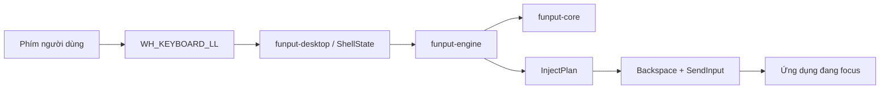
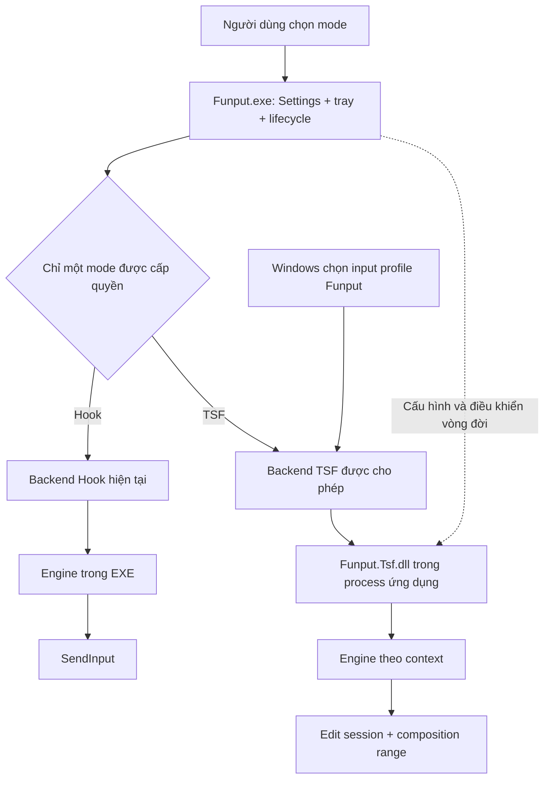
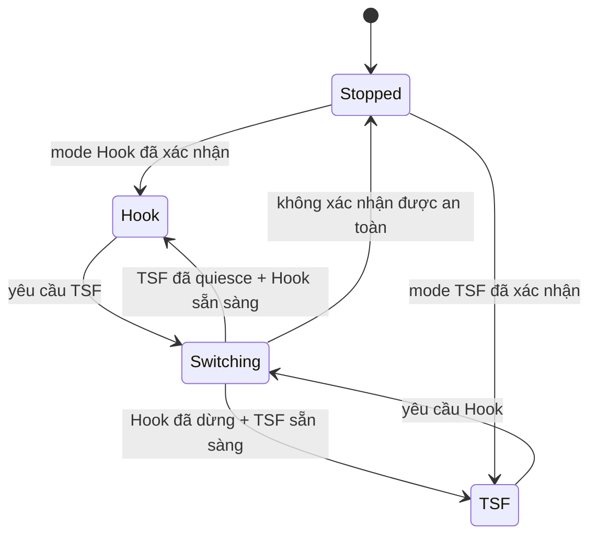

# RFC — TSF như một chế độ nhập riêng trên Windows

> **Hai chế độ nhập · Một lõi tiếng Việt · Giữ vững luồng Hook**
>
> Funput bổ sung backend TSF độc lập. Người dùng chọn **Hook hoặc TSF**;
> hai backend không cùng xử lý nhập liệu trong một phiên Windows.

| Thuộc tính | Nội dung |
| :--- | :--- |
| Trạng thái | **Đề xuất thiết kế — chưa triển khai** |
| Cập nhật | 09/09/2026 |
| Phạm vi | Funput trên Windows |
| Đối tượng | Người dùng quan tâm kiến trúc, maintainer và contributor |
| Quyết định đã thống nhất | TSF là mode riêng; giữ luồng Hook hiện tại; không chạy hai backend song song |
| Cần xác minh bằng prototype | Chuyển mode liên tiến trình, edit session, quyền truy cập cấu hình, tương thích ứng dụng |

## 1. Đề xuất trong một phút

**Giữ `Funput.exe`, bổ sung `Funput.Tsf.dll`, dùng chung engine Rust.**
EXE tiếp tục cung cấp tray, Settings và chế độ Hook. DLL chỉ thực hiện nhiệm vụ
text service TSF, được Windows nạp vào ứng dụng đang sử dụng input profile Funput.

| Chế độ | Cách nhập văn bản | Trải nghiệm dự kiến |
| :--- | :--- | :--- |
| **Hook — mặc định** | Chặn phím, gọi engine, gửi Backspace/Unicode như hiện tại | Giữ hành vi quen thuộc và bản portable |
| **TSF — tuỳ chọn** | Gọi engine rồi sửa vùng văn bản đang soạn qua TSF | Tích hợp với input profile và composition của Windows |

**Phần lớn nghiệp vụ tiếng Việt đã có.** Công việc mới tập trung vào cầu nối TSF,
quản lý composition, chuyển mode an toàn, đóng gói và kiểm thử tương thích.

> [!IMPORTANT]
> “Không ảnh hưởng luồng hiện tại” nghĩa là giữ thuật toán và cách xử lý phím của
> Hook, không ép Hook đi qua abstraction mới, không thêm IPC vào mỗi phím của Hook.
> Khi tích hợp chọn mode, vẫn cần sửa có giới hạn ở startup, lifecycle, Settings
> và đóng gói. Prototype TSF ban đầu có thể phát triển độc lập hoàn toàn.

### Những điều không nằm trong thiết kế này

- Không tự đổi Hook/TSF theo từng ứng dụng và không tự fallback từ TSF sang Hook.
- Không thay engine tiếng Việt hoặc viết một engine thứ hai cho TSF.
- Không coi TSF là lời bảo đảm gõ được trong mọi ứng dụng, game hay cửa sổ elevated.
- Không thêm hệ thống plugin backend động, candidate UI hay reconversion đầy đủ cho bản đầu.

## 2. Kiến trúc hiện tại: nền tảng đã sẵn sàng đến đâu?



Process nền giữ keyboard hook, mouse hook, foreground event và tray.
Các cửa sổ Slint được mở trong process con. Engine được link trực tiếp bằng Rust.
Sự kiện tự tạo có `INJECT_TAG` để hook bỏ qua, tránh lặp lại chính đầu ra của mình.

`ShellState` đang giữ một engine cùng trạng thái VI/EN, cấu hình và phần văn bản
đã gõ gần caret (`CommittedTail`). Vì Hook không đọc tài liệu trực tiếp, phần đuôi
này giúp mở lại từ khi người dùng Backspace. Đó là giả định của backend Hook;
không nên mang nguyên mô hình này sang TSF.

| Thành phần trong repo ứng dụng | Vai trò hiện tại | Hướng sử dụng cho TSF |
| :--- | :--- | :--- |
| `crates/funput-core` | Quy tắc và biến đổi tiếng Việt | Tái sử dụng |
| `crates/funput-engine` | Session, buffer, Telex/VNI, gõ tắt, restore, flip, `adopt()` | Tái sử dụng; engine riêng cho từng context phù hợp |
| `crates/funput-config` | Mô hình cấu hình và dữ liệu dùng chung | Tái sử dụng schema; tách cách đọc/ghi khỏi DLL |
| `crates/funput-desktop` | Phân loại phím, ShellState và kế hoạch inject | Giữ cho Hook; chỉ tái dùng phần thuần khi phù hợp |
| `platforms/windows/src/background` | Hook, keymap, inject, tray | Giữ đường Hook; tách quyền sở hữu tray khỏi việc khởi động hook |
| `platforms/linux/common/compose` | Composer và kế hoạch preedit/commit | Tham khảo semantics và test; hiện là C++, không cắm thẳng vào Rust |
| `platforms/windows/src/ui` | Settings, onboarding, control center | Mở rộng lựa chọn mode, giữ UI ngoài DLL |

### Chi tiết quan trọng: engine chưa phải adapter composition

`ImeResult` mô tả đầu ra bằng `action`, `backspace`, `output`. Tuy nhiên engine
cũng cung cấp `buffer()`, `on_backspace()`, `flip_composing()` và `adopt()`.
TSF có thể lấy buffer để cập nhật composition mà không giả lập phím.

Không được hiểu `Action::None` là “TSF không cần làm gì” trong mọi trường hợp:
engine có thể đã ghi ký tự vào buffer dù không cần inject ở mô hình Hook.
Adapter phải xét buffer, phím và ranh giới từ để quyết định consume/preedit/commit.
Composer Linux đã thể hiện cách phân biệt này.

## 3. Kiến trúc đề xuất



**Hai nhánh trong sơ đồ là lựa chọn loại trừ nhau.** EXE có thể vẫn chạy để hiện
tray trong mode TSF, nhưng không cài keyboard/mouse hook phục vụ backend Hook.
Các DLL có thể còn được Windows nạp khi chuyển về Hook; điều kiện cần là chúng
đã ngừng nhận và thực hiện thao tác nhập liệu, không phải mọi DLL đều đã unload.

Theo tài liệu Microsoft, TSF text service cần đăng ký COM và language profile;
IME DLL được nạp vào process ứng dụng và chịu giới hạn của host.
Vì vậy không nên nhúng Slint, updater hoặc thao tác mạng vào DLL.
[Đăng ký text service](https://learn.microsoft.com/en-us/windows/win32/tsf/text-service-registration),
[yêu cầu IME](https://learn.microsoft.com/en-us/windows/apps/develop/input/input-method-editor-requirements).

### Ranh giới module

| Module đề xuất | Sở hữu | Không sở hữu |
| :--- | :--- | :--- |
| **Host EXE** | Tray, UI, startup, lựa chọn mode, cập nhật, ghi cấu hình | Composition của ứng dụng trong TSF |
| **Backend Hook** | Callback và inject hiện tại | Quyết định chuyển sang TSF |
| **TSF adapter** | COM, key sink, edit session, range, focus và composition | UI Settings, cập nhật, ghi settings trực tiếp |
| **Composition logic thuần** | Ánh xạ engine → kế hoạch composition có thể unit-test | Windows handle, COM pointer, IPC |
| **Control protocol** | Mode, generation, phiên bản protocol, snapshot cấu hình | Nội dung người dùng gõ |

Ưu tiên DLL Rust `cdylib` link thẳng `funput-engine` và dùng binding Windows/COM.
Đây là lựa chọn phù hợp stack hiện tại, cần prototype xác nhận ergonomics của
COM trước khi chốt. C++ với `funput-ffi` là phương án dự phòng nếu có trở ngại cụ thể.

Không tạo interface `InputBackend` quá tổng quát buộc Hook phải viết lại.
Phần chung ban đầu chỉ cần lifecycle: khởi động, dừng, báo trạng thái.
Logic composition có thể bắt đầu dưới module thuần của TSF; chỉ tách thành crate
chung khi có consumer thứ hai thật sự.

## 4. Chỉ một mode: quy tắc và chuyển đổi

### Phân biệt ba trạng thái

| Khái niệm | Ví dụ | Ý nghĩa |
| :--- | :--- | :--- |
| Backend được chọn | Hook hoặc TSF | Funput dùng cơ chế nào để nhập |
| Trạng thái tiếng Việt | VI hoặc EN | Engine có biến đổi tiếng Việt hay không |
| Input profile Windows | Funput hoặc bàn phím khác | Trong mode TSF, Windows có chuyển phím cho Funput hay không |

Tắt VI không có nghĩa là backend đã dừng: hiện tại gõ tắt trong EN vẫn có thể
cần xử lý phím. Việc loại trừ phải kiểm soát toàn backend, không dựa vào cờ VI/EN.
Trong mode TSF, chọn bàn phím khác bằng Windows không tự bật lại Hook.

### Invariant bắt buộc

> **Trong một phiên người dùng Windows, tối đa một loại backend Funput có quyền
> tiêu thụ phím hoặc sửa tài liệu. Nhiều TSF context được phép cùng tồn tại.**

Phạm vi điều phối gồm các bản Funput mới tuân thủ protocol trong cùng phiên.
Không thể bảo đảm một bản portable cũ, chưa biết cơ chế này, tự tuân thủ.
Installer/onboarding cần phát hiện và yêu cầu đóng bản cũ trước khi dùng TSF;
giới hạn này phải được ghi trong release notes.



### Giao thức chuyển mode đề xuất

1. Kiểm tra backend đích đã được cài và protocol tương thích; chưa dừng backend cũ
   nếu kiểm tra chuẩn bị này thất bại.
2. Chuyển sang `Switching`, chặn backend đích bắt đầu; thu hồi quyền nhận input mới
   của backend cũ.
3. Kết thúc thao tác đang chạy. Với Hook: dừng hook và đợi callback/inject hoàn tất.
   Với TSF: kết thúc composition hợp lệ và xử lý hoặc huỷ edit session còn chờ.
4. Chỉ khi xác nhận backend cũ đã yên mới cấp generation mới cho backend đích.
5. Khởi động backend đích; cập nhật mode hiệu lực và lưu lựa chọn đã hoàn tất.
   Nếu lỗi xảy ra sau bước dừng, hiển thị trạng thái dừng/lỗi; người dùng chọn thử lại.

**Không tự bật Hook khi TSF lỗi.** Không mất chữ, không commit lặp và không có
khoảng thời gian hai backend được cấp quyền là tiêu chí quan trọng hơn chuyển nhanh.

### Cách giữ điều phối nhỏ và đúng

Host EXE là bên ghi trạng thái mode duy nhất. Các TSF instance đọc quyền hoạt động
qua control channel cục bộ và kiểm tra generation trước khi nhận phím lẫn trước
khi thực hiện edit session đã hẹn. Không gửi nội dung phím qua channel này.

Một giá trị JSON, cờ atomic hoặc named mutex singleton đơn lẻ **không đủ**:
edit session có thể đã được xếp hàng trong process khác. Protocol phải có cơ chế
đăng ký participant, thu hồi quyền và xác nhận không còn thao tác đang chạy;
không được dùng kiểm tra generation đơn thuần thay cho đồng bộ thao tác đang thực thi.
Nhiều DLL TSF cùng mode phải cùng được hoạt động, nên không dùng một mutex độc
quyền cho từng DLL như thể chỉ được có một TSF instance.

**Thiết kế chi tiết IPC/lease là deliverable của prototype**, bao gồm ACL theo
user/session, AppContainer, process treo, host crash và khôi phục. Không coi
timeout là xác nhận backend cũ đã dừng. Nếu không chứng minh được quiescence,
giữ trạng thái dừng và yêu cầu đóng ứng dụng liên quan hoặc đăng xuất để hoàn tất.
Bản đầu có thể yêu cầu restart ứng dụng khi đổi mode; không cần hứa chuyển tức thì.

Host crash không được khiến một process mới mặc định khởi động Hook khi TSF
còn có thể sửa tài liệu. Host khởi động lại phải thực hiện reconciliation trước
khi cấp quyền. TSF không nhận input mới khi không xác minh được quyền còn hiệu lực;
composition đang có được kết thúc theo khả năng host, không tự phát lại văn bản.

## 5. Vòng đời composition của TSF

**Composition** là vùng văn bản vẫn đang được sửa trong lúc gõ. Kết thúc composition
là xác nhận vùng đó; không mặc định chèn thêm một bản sao của từ.
Ứng dụng cũng có thể yêu cầu chấm dứt composition.
[Microsoft: Compositions](https://learn.microsoft.com/en-us/windows/win32/tsf/compositions).

| Sự kiện | Hành vi đề xuất |
| :--- | :--- |
| Gõ trong một từ | Gọi engine, thay nội dung composition bằng buffer mới |
| Space/dấu câu | Xử lý kết quả boundary, restore/gõ tắt rồi kết thúc composition; dấu phân cách xuất hiện đúng một lần |
| Backspace trong composition | Cập nhật engine và range; không đồng thời để ứng dụng xoá thêm lần nữa |
| Backspace ngoài composition | Cho ứng dụng xử lý; mở lại từ cũ là tính năng riêng cần kiểm thử |
| Enter, Tab, điều hướng, shortcut | Hoàn tất composition phù hợp rồi cho phím đi qua |
| Chọn văn bản rồi gõ | Thay selection qua edit session hợp lệ; không xoá theo buffer cũ |
| Focus/context đổi hoặc host kết thúc composition | Huỷ tham chiếu cũ, đồng bộ engine; không commit lại từ đã được host giữ |
| Mode bị thu hồi | Ngừng input mới, hoàn tất/dọn composition trước khi xác nhận dừng |
| Context readonly/password hoặc không cho sửa | Không compose; chuyển tiếp phím phù hợp và không lưu nội dung |

Các điểm triển khai cần giữ rõ:

- Key-test callback chỉ quyết định khả năng xử lý; không biến đổi engine hai lần
  giữa bước kiểm tra và bước nhận phím thật.
- Sửa tài liệu trong edit session hợp lệ, bằng interface TSF của text service
  như `ITfContext`/`ITfRange`; không tự triển khai text store của ứng dụng.
- Callback bất đồng bộ phải xác minh context/range còn hợp lệ, tránh sửa vị trí
  cũ sau khi focus hoặc selection đã thay đổi.
- Xử lý chuyển đổi đơn vị: engine đếm ký tự Unicode; Windows dùng UTF-16.
  Kiểm thử surrogate pair, dấu tổ hợp và selection; không coi một ký tự luôn là một unit.
- COM boundary không để panic thoát ra host; quản lý reference và reentrancy rõ ràng.
- TSF engine ở trong process host, không đi qua IPC cho mỗi ký tự.

## 6. Cấu hình và trải nghiệm người dùng

### Giao diện dự kiến

| Chế độ nhập trên Windows | Mô tả hiển thị |
| :--- | :--- |
| **◉ Hook — mặc định** | Cơ chế gõ hiện tại của Funput. Dùng được với bản portable. |
| **○ TSF** | Tích hợp bộ gõ vào Windows. Cần cài thành phần TSF và chọn bàn phím Funput. |

UI hiển thị riêng **mode được chọn**, **mode đang hiệu lực** và trạng thái
“Đang chuyển / Cần mở lại ứng dụng / Chuyển thất bại”. TSF chưa được cài thì
giải thích điều kiện sử dụng; không giả vờ bật thành công.

Đổi Hook/TSF là thao tác Settings có chủ đích. Hotkey bật tiếng Việt tiếp tục
chỉ đổi VI/EN. Trong mode TSF, phạm vi hotkey mặc định là khi profile Funput
đang hoạt động; không cài global hook chỉ để bắt hotkey khi profile khác được chọn.

### Chính sách cấu hình

- Giữ nguyên quy tắc đường dẫn settings của bản portable Hook hiện tại.
- Bản cài có TSF dùng vị trí cấu hình người dùng xác định bởi host, kèm snapshot
  chỉ đọc cho DLL. Thiếu trường mode trong cấu hình cũ có nghĩa là Hook.
- DLL không dùng `current_exe()` để tìm settings cạnh EXE: lúc đó EXE là ứng dụng
  đích, có thể là Word hoặc trình duyệt.
- Host là bên ghi duy nhất; snapshot có schema version và revision, cập nhật
  nguyên tử. Thay đổi kiểu gõ được áp dụng tại ranh giới composition thích hợp.
- Control protocol có version riêng để DLL cũ đang được nạp không hiểu sai EXE mới.
  Version không tương thích thì không cấp quyền xử lý.
- Cấu hình không đọc được trong host hạn chế phải có hành vi rõ ràng; kênh snapshot
  hoạt động trong AppContainer là điều kiện kiểm chứng trước beta.

Nhớ VI/EN theo ứng dụng, gõ tắt trong EN và tự viết hoa có thể giữ chung dữ liệu,
nhưng semantics của TSF cần kiểm thử riêng. Không áp dụng nguyên logic dò HKL của
Hook cho profile Funput; tránh tự vô hiệu hoá chính TSF mới.

## 7. Build, cài đặt và cập nhật

### Người dùng nhận những gì?

| Gói | Thành phần | Mục đích |
| :--- | :--- | :--- |
| **Portable** | `Funput.exe` | Giữ kênh Hook hiện tại |
| **Installer có TSF** | Cùng EXE + DLL theo kiến trúc + đăng ký TSF | Cho phép chọn một trong hai mode |

Ví dụ bố trí **đề xuất**, chưa phải đường dẫn đã tồn tại:

```text
Funput/
├── Funput.exe
└── tsf/
    └── <version>/
        ├── x64/Funput.Tsf.dll
        └── x86/Funput.Tsf.dll
```

**Không cần hai EXE bộ gõ.** `Setup.exe`, nếu sử dụng, chỉ là chương trình cài đặt.
DLL x86 phục vụ host x86, DLL x64 phục vụ host x64. ARM64 là target tương lai
được thêm có chủ đích; EXE chạy qua emulation không chứng minh DLL x64 dùng được
trong ứng dụng ARM64 native.

### Chính sách phát hành

1. Portable tiếp tục dùng đường cập nhật hiện tại. Installer có TSF dùng đường
   cập nhật cả bộ thành phần, tránh tự thay riêng EXE làm lệch protocol/DLL.
2. Cài DLL theo thư mục version; chỉ đổi đăng ký sau khi gói mới đã xác minh đầy đủ.
   Không ghi đè DLL đang được ứng dụng nạp.
3. Giữ version cũ trong lúc host còn dùng; dọn sau khi có thể. Có thể cần mở lại
   ứng dụng hoặc đăng xuất, không hứa cập nhật TSF luôn tức thì.
4. Gỡ TSF phải dừng quyền xử lý, gỡ profile/COM/category đúng cách và dọn file
   sau khi được giải phóng; không chỉ xoá DLL.
5. Cài đặt không tự ép bàn phím mặc định qua registry; hướng dẫn người dùng chọn
   input profile bằng cơ chế Windows được hỗ trợ.

Phạm vi đăng ký per-user/per-machine, quyền cài và công cụ installer cần được
xác minh ở prototype. Authenticode, hash và quy trình build công khai cần được
ghi rõ trong release engineering; chữ ký updater hiện tại không đồng nghĩa DLL
đã có chữ ký Authenticode.
[Microsoft: yêu cầu IME](https://learn.microsoft.com/en-us/windows/apps/develop/input/input-method-editor-requirements).

## 8. Mở rộng và đóng góp open source

Đề xuất tổ chức code trong repo ứng dụng, không yêu cầu tạo ngay:

```text
platforms/windows/                 # EXE và backend Hook hiện tại
platforms/windows-tsf/             # Crate DLL riêng, build độc lập
    src/service/                   # COM và activation
    src/composition/               # Adapter và logic composition thuần
    src/context/                   # Focus, selection, vòng đời
    src/control/                   # Quyền hoạt động và snapshot cấu hình
    tests/                         # Test logic và integration TSF
crates/<windows-control-protocol>/ # Chỉ tách khi EXE/DLL cùng cần hợp đồng
```

| Nguyên tắc | Giá trị dài hạn |
| :--- | :--- |
| Một engine, nhiều adapter | Sửa lỗi Telex/VNI không phải nhân đôi thuật toán |
| DLL không phụ thuộc UI | Dễ kiểm thử, nhẹ hơn trong mỗi ứng dụng |
| Protocol có version | Hỗ trợ update khi DLL cũ còn sống |
| Build TSF độc lập | Contributor TSF không cần build Slint/Skia |
| Decision record và compatibility matrix trong repo | Quyết định có bằng chứng, dễ review và tiếp quản |
| Test theo hành vi người dùng | Giảm phụ thuộc cấu trúc nội bộ, thuận lợi refactor |

Mỗi PR nên thuộc một mảng: COM skeleton, composition, lifecycle, config hoặc
packaging. Không trộn refactor Hook với feature TSF. Thay đổi core dùng chung
phải có lý do riêng và chạy regression của consumer bị ảnh hưởng.

Không log phím, composition hoặc văn bản tài liệu mặc định. Issue template có
thể xin phiên bản Funput/Windows, kiến trúc ứng dụng, mode, bước tái hiện bằng
chuỗi mẫu và mã lỗi. Người đóng góp không cần chia sẻ nội dung cá nhân để báo lỗi.

## 9. Lộ trình và tiêu chí hoàn thành

| Mốc | Kết quả review được | Điều kiện qua mốc |
| :--- | :--- | :--- |
| **P0 · Chứng minh tích hợp** | DLL đăng ký được, Telex composition cơ bản, demo mode gate | Gõ/commit đúng; xác minh edit session và điều phối; chưa sửa hot path Hook |
| **P1 · Backend độc lập** | Telex/VNI, boundary, Backspace, focus, selection, flip | Không mất/lặp chữ; context độc lập; lỗi không làm host crash |
| **P2 · Tích hợp hai mode** | Settings, config snapshot, stop/start, trạng thái lỗi | Chứng minh loại trừ cả khi crash, treo, edit session trễ; Hook regression đạt |
| **P3 · Beta cài đặt** | x64/x86, install/uninstall/update, compatibility matrix | Cài sạch/nâng cấp/rollback kiểm chứng; công khai giới hạn tính năng |
| **P4 · Phát hành ổn định** | Tài liệu người dùng, CI, release artifacts | Các ứng dụng mục tiêu và vòng đời dài hạn đạt tiêu chí đã thống nhất |

### Ma trận kiểm thử tối thiểu

| Nhóm | Trường hợp cần chứng minh |
| :--- | :--- |
| Hook không hồi quy | Telex/VNI, gõ tắt EN/VI, flip, modifier/numpad, retone sau Backspace, per-app, đổi layout |
| TSF composition | Gõ nhanh, repeat, boundary, restore, shortcut expansion, Enter/Tab/Esc, focus loss |
| Văn bản và selection | Chọn rồi thay, caret giữa câu, Unicode tổ hợp, emoji quanh từ, undo/redo, paste |
| Context hạn chế | Readonly, password, host từ chối edit, AppContainer, elevated nếu thuộc phạm vi hỗ trợ |
| Ứng dụng | Win32 edit/RichEdit, Word, Chromium, Firefox, Electron/VS Code, terminal; ghi version và kiến trúc |
| Loại trừ mode | Hai lần launch, switch khi đang compose, queued edit, DLL mới xuất hiện trong lúc switch, host crash/treo |
| Phát hành | Portable cũ đang chạy, thiếu DLL, sai bitness, protocol lệch, update khi DLL đang nạp, gỡ rồi cài lại |

Prototype có thể khoảng **1–2 tuần**; beta tổng khoảng **4–8 tuần**; phát hành
ổn định tổng khoảng **2–4 tháng** cho một người quen Rust/Win32, có môi trường
Windows và ứng dụng kiểm thử. Đây là ước lượng brainstorm, các khoảng là tổng
thời gian chứ không cộng dồn; cập nhật sau P0. TSF/COM mới đối với contributor,
phạm vi ứng dụng và cơ chế đổi mode có thể làm thời gian tăng đáng kể.

## 10. Các lựa chọn đã cân nhắc

| Phương án | Đánh giá |
| :--- | :--- |
| Thay Hook bằng TSF | Không đáp ứng yêu cầu giữ đường gõ ổn định |
| Hook + TSF tự chọn theo app | Trái yêu cầu hai mode riêng; tăng rủi ro xử lý đôi |
| Hai EXE với hai engine nghiệp vụ | Không cần thiết; TSF vẫn cần text service DLL |
| Chuyển từng phím từ DLL về EXE | Thêm độ trễ và phụ thuộc IPC vào đường gõ |
| Tổng quát hoá mọi platform trước | Tăng phạm vi, gây rủi ro cho code đã ổn định |
| **EXE hiện tại + TSF DLL riêng + lifecycle chọn một mode** | **Phương án đề xuất** |

### Những quyết định còn mở

- Cơ chế mode gate nào chứng minh được quiescence qua host hạn chế và process treo?
- Chuyển mode bản đầu yêu cầu đóng ứng dụng hay đăng xuất trong những trường hợp nào?
- Installer/registration scope nào bao phủ các ứng dụng mục tiêu?
- Gõ tắt EN, nhớ theo app và retone từ đã commit đạt parity ở mốc nào?
- Những ứng dụng và kiến trúc nào là điều kiện phát hành, thay vì chỉ thử nghiệm?

Các câu hỏi này cần kết quả thử nghiệm và decision record. Chúng không thay đổi
quyết định nền: **TSF là backend riêng, chỉ chọn một mode, Hook giữ nguyên cách gõ.**

## Phụ lục · Cơ sở đánh giá

Các đường dẫn sau thuộc repository [Funput/Funput](https://github.com/Funput/Funput),
được đọc trong checkout ngày 09/09/2026. Đây là snapshot đánh giá, không phải
khẳng định mọi README cũ đều đã đồng bộ với code.

| Mã nguồn | Bằng chứng |
| :--- | :--- |
| `platforms/windows/src/main.rs` | Startup, UI process con, singleton và chạy hook |
| `platforms/windows/src/background/hook/keyboard.rs` | classify → engine → plan_inject → SendInput |
| `platforms/windows/src/shared/shell/mod.rs` | ShellState toàn cục trong process Hook |
| `platforms/windows/src/shared/settings_path.rs` | Đường dẫn cấu hình dựa vào EXE hiện hành |
| `crates/funput-desktop/src/shell/compose.rs` | Backspace và CommittedTail của Hook |
| `crates/funput-engine/src/model/result.rs` | Hợp đồng ImeResult |
| `crates/funput-engine/src/engine/config.rs` | API đọc buffer và clear |
| `crates/funput-engine/src/engine/editing.rs` | Backspace, flip và adopt |
| `platforms/linux/common/compose/composer/keys.cpp` | Semantics preedit/commit hiện có |

Tài liệu Microsoft dùng để xác minh nền tảng:

- [Text Service Registration](https://learn.microsoft.com/en-us/windows/win32/tsf/text-service-registration)
- [Compositions](https://learn.microsoft.com/en-us/windows/win32/tsf/compositions)
- [Custom Input Method Editor requirements](https://learn.microsoft.com/en-us/windows/apps/develop/input/input-method-editor-requirements)

---

*RFC này phục vụ thảo luận kiến trúc. Tên module, protocol và bố trí artifact là
đề xuất; chưa có thay đổi triển khai TSF hoặc thay đổi hành vi Hook đi kèm.*
