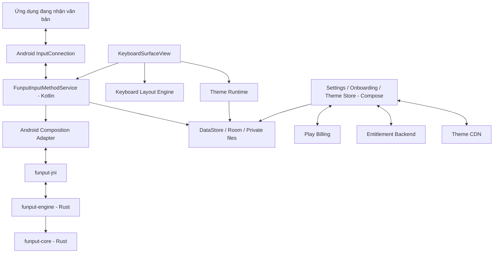

# Đề xuất kiến trúc Funput cho Android

> Trạng thái: Bản đề xuất để thảo luận, chưa phải đặc tả đóng băng  
> Cập nhật: 30/06/2026  
> Phạm vi: Bàn phím tiếng Việt Funput trên Android, sử dụng lại Rust core hiện có

## 1. Tóm tắt quyết định

Funput Android nên được xây dựng theo kiến trúc hybrid native:

| Thành phần | Công nghệ đề xuất | Vai trò |
|---|---|---|
| Android IME | Kotlin + `InputMethodService` | Tích hợp với hệ thống Android và ứng dụng đang nhập liệu |
| Bề mặt bàn phím | Custom Android `View` + `Canvas` | Vẽ phím, nhận touch, animation và theme với latency thấp |
| Hiệu ứng cao cấp | AGSL `RuntimeShader` trên Android 13+ | Refraction, sheen, noise và hiệu ứng glass bằng GPU |
| Settings/onboarding/store | Kotlin + Jetpack Compose | Giao diện ứng dụng, cấu hình và cửa hàng theme |
| Bộ máy tiếng Việt | Rust `funput-core` + `funput-engine` | Toàn bộ luật Telex, VNI và trạng thái composition |
| Cầu nối Android–Rust | JNI, ưu tiên một crate Rust riêng | Truyền lệnh nhập và trạng thái giữa Kotlin với Rust |
| Cấu hình nhẹ | Jetpack DataStore | Method, tone style, theme đang chọn, haptic và tùy chọn khác |
| Catalog/cache | Room khi thực sự cần | Cache metadata theme, entitlement và trạng thái download |
| Theme trả phí | Google Play Billing + backend xác minh | Mua một lần, bundle hoặc subscription tùy chiến lược |
| Theme assets | CDN + manifest có chữ ký/hash | Tải theme sau khi xác minh quyền sở hữu |

Không đề xuất dùng Flutter, React Native, WebView, Compose Multiplatform hoặc Slint làm bề mặt IME chính. Các framework đó vẫn phải đi qua `InputMethodService`, trong khi làm tăng độ phức tạp lifecycle, startup và debugging. Jetpack Compose rất phù hợp cho ứng dụng quản lý nhưng không cần thiết cho vùng bàn phím luôn nhạy với latency.

## 2. Mục tiêu sản phẩm

### 2.1. Mục tiêu bắt buộc

- Gõ tiếng Việt bằng Telex và VNI trên bàn phím ảo Android.
- Sử dụng lại cùng Rust core đang chạy trên macOS, Windows và Linux.
- Có giao diện cao cấp, hiện đại, lấy cảm hứng từ chất liệu kính động nhưng không sao chép máy móc giao diện iOS.
- Theme là năng lực lõi của kiến trúc, không phải lớp skin gắn thêm sau này.
- Theme preview phải dùng chính renderer của bàn phím thật.
- Bàn phím xuất hiện nhanh, phản hồi tức thời và không làm rớt ký tự.
- Không thu thập, ghi log hoặc truyền nội dung người dùng đã gõ.
- Hoạt động tốt khi mất mạng; việc gõ không được phụ thuộc server, tài khoản hoặc Play Billing.

### 2.2. Mục tiêu thương mại

- Có theme miễn phí đủ đẹp để sản phẩm không mang cảm giác “bị khóa”.
- Hỗ trợ theme mua một lần, không tiêu hao.
- Hỗ trợ collection/bundle và có thể thêm gói subscription sau này.
- Khôi phục giao dịch khi đổi hoặc cài lại máy.
- Theme trả phí có thể tải từ CDN mà không cần phát hành phiên bản ứng dụng mới.
- Có schema versioning để theme cũ tiếp tục chạy khi renderer phát triển.

### 2.3. Chưa làm trong MVP

- Swipe typing/predictive gesture phức tạp.
- Dự đoán câu bằng mô hình ngôn ngữ.
- Cloud clipboard.
- Đồng bộ lịch sử gõ.
- Theme do người dùng chạy shader hoặc mã tùy ý.
- Marketplace cho bên thứ ba tự xuất bản theme.

Các mục này không bị cấm vĩnh viễn; chúng chỉ không nên làm nhiễu vertical slice đầu tiên.

## 3. Nguyên tắc kiến trúc

1. **Rust core là nguồn sự thật duy nhất cho tiếng Việt.** Kotlin không được chứa một bộ luật Telex/VNI thứ hai.
2. **Đường gõ phải hoàn toàn local.** Không I/O mạng, database hoặc đọc file trong xử lý một lần nhấn phím.
3. **Layout, input logic và visual theme tách rời nhau.** Theme không được thay đổi hitbox hay ý nghĩa phím.
4. **Hiệu ứng là progressive enhancement.** Không có blur/shader thì theme vẫn phải đẹp và dễ đọc.
5. **Renderer dùng chung.** Bàn phím thật, preview trong store và ảnh chụp kiểm thử đều dùng cùng một renderer.
6. **Privacy by construction.** Không chỉ hứa “không lưu phím”; kiến trúc phải khiến việc thu thập phím trở nên khó xảy ra ngoài ý muốn.
7. **Không tải công việc nặng khi IME vừa mở.** Cache view, layout và theme đã giải mã; giải phóng asset lớn sau khi bàn phím ẩn đủ lâu.

## 4. Sơ đồ tổng thể



## 5. Cấu trúc source đề xuất

```text
app/
├── crates/
│   ├── funput-core/                 # hiện có
│   ├── funput-engine/               # hiện có
│   ├── funput-ffi/                  # hiện có, tiếp tục phục vụ desktop
│   └── funput-jni/                  # mới: JNI dành riêng cho Android
└── platforms/
    └── android/
        ├── app/                     # Android application module
        ├── ime/                     # IME service và InputConnection adapter
        ├── keyboard-ui/             # điều phối QWERTY, emoji và các panel sau này
        ├── keyboard-renderer/       # layout, hit testing, Canvas renderer
        ├── theme-runtime/           # schema, parser, resolver, asset cache
        ├── theme-store/             # catalog, billing, download, entitlement
        ├── benchmark/               # Macrobenchmark/benchmark nếu tách module
        ├── build.gradle.kts
        ├── settings.gradle.kts
        └── ARCHITECTURE_PROPOSAL.md
```

Có thể bắt đầu với ít Gradle module hơn để giảm overhead. Ranh giới logic vẫn nên giữ rõ từ đầu; chỉ tách thành module vật lý khi build time và ownership biện minh cho việc đó.

## 6. Công nghệ Android

### 6.1. Kotlin

Kotlin là ngôn ngữ chính cho toàn bộ Android shell:

- `InputMethodService`.
- Lifecycle và giao tiếp `InputConnection`.
- Touch handling và accessibility.
- `Canvas` renderer.
- Jetpack Compose cho app UI.
- Play Billing và download theme.
- JNI wrapper phía Android.

Không cần Java trừ khi một thư viện bắt buộc. Không cần C++ nếu crate JNI bằng Rust làm việc ổn định.

### 6.2. SDK policy

- `compileSdk`: bản Android stable mới nhất tại thời điểm bắt đầu triển khai.
- `targetSdk`: bản mới nhất mà Google Play yêu cầu hoặc cao hơn nếu đã kiểm thử.
- `minSdk`: đề xuất ban đầu là API 26; có thể nâng lên API 28 nếu số liệu thị trường cho thấy chi phí hỗ trợ máy cũ không đáng giá.
- Không đặt `minSdk` bằng API 33 chỉ để dùng AGSL. Hiệu ứng đẹp cần fallback, còn bàn phím cần độ phủ thiết bị.

Không nên đóng băng số `compileSdk` và `targetSdk` trong tài liệu kiến trúc vì chúng thay đổi hàng năm.

### 6.3. Vì sao không Compose cho keyboard surface

Compose có thể được nhúng vào `InputMethodService`, nhưng service này không có lifecycle owner giống Activity thông thường. Ta sẽ phải tự thiết lập các owner, xử lý disposal và kiểm tra nhiều edge case OEM. Bề mặt keyboard cũng có đặc điểm khác màn hình app:

- Phải xuất hiện ngay khi field nhận focus.
- Có touch liên tục, multi-touch, long press, repeat và swipe.
- Animation pressed state cần rất ít overhead.
- Kích thước và số lượng node gần như cố định.
- Theme renderer cần kiểm soát thứ tự vẽ ở mức pixel.

Một custom `View` vẽ toàn bộ bàn phím trên một `Canvas` phù hợp hơn. Compose vẫn là lựa chọn đúng cho settings/store, nơi tốc độ phát triển và state-driven UI có giá trị lớn.

## 7. `InputMethodService` và lifecycle

Class chính dự kiến:

```kotlin
class FunputInputMethodService : InputMethodService() {
    override fun onCreate() { /* load config nhẹ, tạo engine */ }
    override fun onCreateInputView(): View { /* trả KeyboardSurfaceView đã cache */ }
    override fun onStartInput(
        attribute: EditorInfo?,
        restarting: Boolean
    ) { /* reset composition, chọn input mode */ }
    override fun onStartInputView(
        info: EditorInfo?,
        restarting: Boolean
    ) { /* cập nhật layout/theme */ }
    override fun onFinishInput() { /* finish/clear composition */ }
    override fun onWindowHidden() { /* hẹn giải phóng asset lớn */ }
}
```

### 7.1. Khi bắt đầu nhập

1. Đọc `EditorInfo.inputType`.
2. Chọn layout: text, number, phone, email, URL hoặc password.
3. Reset composition Rust.
4. Đồng bộ method Telex/VNI và các setting đã cache.
5. Bật/tắt auto-capitalize dựa trên `inputType` và `imeOptions`.
6. Với password: tắt suggestion, preview text, learning và mọi loại logging.

### 7.2. Chuyển bàn phím

- Khai báo `supportsSwitchingToNextInputMethod="true"`.
- Hiển thị globe key khi `shouldOfferSwitchingToNextInputMethod()` trả về `true`.
- Gọi `switchToNextInputMethod(false)` khi người dùng chạm globe.

### 7.3. Input types

| Input type | Hành vi |
|---|---|
| Text thường | Telex/VNI, composition, auto-cap tùy setting |
| Email | Thêm `@`, `.`, thường tắt autocorrect mạnh |
| URL | Thêm `/`, `.`, `.com` tùy layout; tránh sửa ngoài ý muốn |
| Password | Không candidate/preview/log; đầy đủ ký tự cần thiết |
| Number | Numeric pad; không chạy Vietnamese composition |
| Phone | Phone pad với `+`, `*`, `#` |
| Date/time | Layout thích hợp hoặc để hệ thống/app xử lý |

## 8. Tích hợp Rust core qua JNI

### 8.1. Crate mới

Nên thêm `funput-jni` thay vì ép Android dùng trực tiếp C ABI desktop. Crate này phụ thuộc `funput-engine` và build thành `cdylib`:

```toml
[lib]
crate-type = ["cdylib"]

[dependencies]
funput-engine = { path = "../funput-engine" }
jni = "..."
```

ABI cần build:

- `arm64-v8a`: bắt buộc.
- `x86_64`: emulator và test CI.
- `armeabi-v7a`: tùy quyết định hỗ trợ thiết bị 32-bit.

### 8.2. API Kotlin đề xuất

```kotlin
internal object FunputNative {
    external fun create(): Long
    external fun destroy(handle: Long)
    external fun clear(handle: Long)
    external fun process(handle: Long, codePoint: Int): NativeResult
    external fun backspace(handle: Long): NativeResult
    external fun buffer(handle: Long): String
    external fun setMethod(handle: Long, method: Int)
    external fun setToneStyle(handle: Long, style: Int)
    external fun setEnabled(handle: Long, enabled: Boolean)
    external fun setSmartRestore(handle: Long, enabled: Boolean)
    external fun setEagerRestore(handle: Long, enabled: Boolean)
    external fun setSpellCheck(handle: Long, enabled: Boolean)
    external fun setAutoCapitalize(handle: Long, enabled: Boolean)
}
```

Không truyền `Engine` pointer trực tiếp cho code ngoài wrapper. Kotlin giữ một opaque handle dạng `Long`; Rust quản lý lifetime và phải null-safe/double-free-safe trong giới hạn hợp lý.

### 8.3. Allocation và lỗi JNI

- Không serialize JSON trên mỗi phím.
- Không gọi database/file/network từ JNI.
- Có thể trả metadata nhỏ bằng packed primitive; chỉ tạo `String` cho buffer ngắn.
- Không để panic đi xuyên FFI boundary. Bao `catch_unwind` nếu cần và chuyển thành no-op/error an toàn.
- Load native library một lần.
- Một engine cho mỗi active IME session; đường gọi nhập liệu chạy tuần tự trên main thread.
- Benchmark riêng chi phí JNI và tổng thời gian từ touch-down đến `InputConnection` update.

## 9. Android composition adapter

Desktop Funput trả về chỉ dẫn kiểu “xóa N ký tự rồi gửi output”. Android có primitive tốt hơn là composing span. Không cần đổi luật trong core; thêm adapter platform để ánh xạ đúng semantics.

### 9.1. Phím ký tự trong một từ

```text
Touch key
  → Rust Engine.process_char(codepoint)
  → đọc Engine.buffer()
  → InputConnection.setComposingText(buffer, 1)
```

Ngay cả khi Rust trả `Action::None`, buffer vẫn có thể đã được cập nhật. Android adapter không được hiểu `None` là “không làm gì”; nó phải render composition hiện tại.

### 9.2. Dấu cách và punctuation

1. Gửi boundary character vào engine để smart restore/gõ tắt có cơ hội chạy.
2. Nếu engine trả output thay thế, thay composing span bằng output đó.
3. Nếu không có thay thế, `finishComposingText()` rồi `commitText(boundary, 1)`.
4. Engine đã clear word session sau boundary.

Phải viết integration test cho các trường hợp:

- `mas ` → `má `.
- English smart restore.
- Shortcut `vn ` → `Việt Nam `.
- Telex/VNI với punctuation.
- Boundary sau emoji hoặc Unicode punctuation.

Core hiện tại coi whitespace và ASCII punctuation là boundary. Android có thể gặp smart quote, em dash và nhiều dấu Unicode; cần quyết định mở rộng core hay normalize ở adapter. Ưu tiên mở rộng test và xử lý trong core để mọi platform có hành vi nhất quán.

### 9.3. Backspace

- Nếu đang composition: gọi `engine.on_backspace()`, rồi cập nhật composing text từ buffer.
- Nếu buffer rỗng: gọi `deleteSurroundingText(1, 0)` hoặc API code-point-aware phù hợp.
- Long-press Backspace: repeat với tốc độ tăng dần nhưng không làm nghẽn main thread.
- Cần test surrogate pair, combining mark và emoji; “một ký tự người dùng nhìn thấy” không phải lúc nào cũng là một UTF-16 code unit.

### 9.4. Cursor và selection thay đổi

Nếu host app di chuyển cursor, thay đổi selection hoặc sửa text ngoài IME:

- Finish hoặc hủy composing span theo contract Android.
- Clear Rust session.
- Không tiếp tục compose dựa trên buffer cũ.

### 9.5. Fallback cho app có `InputConnection` lỗi

Một số app/webview/game xử lý composing span không chuẩn. Cần một compatibility path:

- Dùng `deleteSurroundingText()` + `commitText()` dựa trên `ImeResult`.
- Có allowlist/denylist chỉ khi thực sự thu được bug report; tránh hard-code package sớm.
- Log kỹ thuật chỉ chứa loại lỗi và package/version nếu người dùng đồng ý, tuyệt đối không chứa nội dung gõ.

## 10. Layout và interaction engine

Layout phải là data, không hard-code trong `onDraw`:

```kotlin
data class KeySpec(
    val id: KeyId,
    val output: KeyOutput,
    val widthWeight: Float,
    val alternatives: List<String> = emptyList(),
    val semanticRole: KeyRole = KeyRole.Character
)

data class KeyboardLayout(
    val rows: List<List<KeySpec>>,
    val mode: LayoutMode
)
```

### 10.1. Layout MVP

- QWERTY lowercase/uppercase.
- Symbol pages.
- Numeric/phone.
- Email/URL variations.
- Telex.
- VNI với number row dễ truy cập; không bắt người dùng đổi trang để bấm dấu số.
- Globe, emoji/symbol, settings, backspace, shift, enter và space.

### 10.2. Touch model

- Hit target tối thiểu không phụ thuộc hình vẽ của keycap.
- Sliding giữa các phím trước khi nhấc tay.
- Multi-touch cơ bản để người gõ nhanh không mất ký tự.
- Long press alternatives.
- Backspace repeat.
- Key popup có thể tắt trong password hoặc theo setting.
- Haptic dùng API platform và tôn trọng system setting.
- Sound tôn trọng âm lượng/system preference.

### 10.3. Accessibility

Vì toàn keyboard là một custom `View`, mỗi phím được phơi ra như một virtual
accessibility node qua `ExploreByTouchHelper`. Hiện trạng triển khai:

- `KeyboardAccessibilityDelegate` (subclass của `ExploreByTouchHelper`) gắn vào
  `KeyboardSurfaceView`, ánh xạ mỗi phím thành một node có label, bounds và action
  `ACTION_CLICK`; click ảo được định tuyến qua `performAccessibilityClick`.
- `KeyboardAccessibilitySnapshot` là dữ liệu bất biến, thuần Kotlin (không phụ thuộc
  Android view) nên unit-test được: lọc phím `PLACEHOLDER`, đổi label theo `ShiftState`,
  và đánh dấu `selected` cho phím Shift.
- TalkBack đọc đúng “Shift”, “Xóa”, “Dấu cách”, không chỉ đọc icon (label lấy từ
  `KeySpec.accessibilityLabel`, không phải từ glyph).
- **Snapshot được cache** trong `KeyboardSurfaceView` và chỉ dựng lại khi geometry
  hoặc semantic state đổi (`refreshAccessibilitySnapshot`). Điều này tránh cấp phát
  rác trên mỗi callback của `ExploreByTouchHelper` khi TalkBack quét, đúng với mục tiêu
  low-allocation của surface.
- `onPopulateNodeForVirtualView` chịu được virtual id cũ (khi keyboard bị dựng lại
  giữa `getVisibleVirtualViews` và populate): trả về node rỗng hợp lệ thay vì crash.

Các hạng mục accessibility còn lại (chưa nằm trong pass đầu):

- Long-click / popup key qua accessibility action.
- `stateDescription` phân biệt Shift vs Caps Lock.
- Độ tương phản không phụ thuộc transparency.
- Reduce motion tắt refraction/animation không thiết yếu.
- Font scale và display size không được làm tràn layout.
- Hỗ trợ switch access và external keyboard trong phạm vi khả thi.

## 11. Renderer bàn phím

### 11.1. Pipeline vẽ

```text
Resolve layout
  → tính geometry/hitboxes
  → resolve theme tokens
  → vẽ keyboard background
  → vẽ key shadows/materials
  → vẽ borders/highlights
  → vẽ labels/icons
  → vẽ pressed/shift states
  → vẽ popup/toolbar overlays
```

Geometry chỉ tính lại khi kích thước, orientation, layout mode hoặc density thay đổi. Không tính lại toàn bộ mỗi frame.

### 11.2. Cache

- Cache `Paint`, `Path`, typeface, decoded bitmap và shader.
- Không tạo object trong hot path `onDraw` nếu tránh được.
- Texture theme cần giới hạn kích thước và decode theo density.
- Có memory budget riêng; giải phóng theme preview assets trước asset của active keyboard.
- Khi hidden lâu, giải phóng asset lớn nhưng giữ metadata/layout nhẹ.

## 12. Thiết kế “glass” trên Android

“Liquid Glass” là tên thiết kế của Apple, không phải một component Android. Funput nên xây một ngôn ngữ material riêng: trong suốt vừa đủ, viền sáng, refraction có kiểm soát, chiều sâu và chuyển động nhẹ.

### 12.1. Ba cấp hiệu ứng

| Cấp | Điều kiện | Hiệu ứng |
|---|---|---|
| Tier A | Android 13+, GPU tốt | AGSL refraction/sheen/noise, gradient động rất nhẹ |
| Tier B | Android 12+, window blur khả dụng | Background blur + translucent overlay + highlight |
| Tier C | Mọi thiết bị hỗ trợ | Gradient tĩnh, translucent color, border, shadow và noise texture |

Cross-window blur phụ thuộc OEM/GPU và có thể bị tắt khi battery saver hoặc trạng thái hệ thống thay đổi. Vì vậy renderer phải lắng nghe khả năng blur và chuyển opacity nền ngay lập tức để giữ độ đọc được.

### 12.2. Quy tắc hiệu năng

- Không blur riêng từng key bằng nhiều layer đắt đỏ.
- Ưu tiên một background material và các keycap material nhẹ.
- Shader compile trước khi keyboard cần hiển thị nếu có thể.
- Không animation vô hạn chỉ để “trông sống động”.
- Khi thermal/battery/performance không đạt, tự hạ quality tier.
- Tôn trọng reduce motion.
- Press feedback phải xuất hiện ngay cả khi shader chưa sẵn sàng.

### 12.3. Fallback là một phần của thiết kế

Mỗi theme phải định nghĩa cả:

- Premium shader parameters.
- Static gradient fallback.
- Opaque/high-contrast fallback.

Một theme không có fallback hợp lệ không được publish.

## 13. Theme system

### 13.1. Tách ba lớp

1. **Layout:** vị trí, kích thước và chức năng phím.
2. **Theme:** material, màu, font, icon style, motion, sound và haptic.
3. **State:** pressed, disabled, shift, caps lock, special key và selected.

Theme chỉ ánh xạ từ role/state sang visual tokens; không được sửa layout hitbox hoặc input behavior.

### 13.2. Manifest minh họa

```json
{
  "schemaVersion": 1,
  "id": "com.funput.theme.aurora-glass",
  "version": 3,
  "name": "Aurora Glass",
  "author": "Funput",
  "minRendererVersion": 1,
  "capabilities": ["static", "agsl-v1", "dark", "light"],
  "preview": {
    "thumbnail": "preview/thumb.webp",
    "hero": "preview/hero.webp"
  },
  "palette": {
    "background": "#CC101522",
    "key": "#33FFFFFF",
    "keySpecial": "#4DFFFFFF",
    "label": "#FFFFFFFF",
    "labelSecondary": "#B3FFFFFF",
    "accent": "#FF8DB8FF",
    "border": "#4DFFFFFF"
  },
  "keyboardMaterial": {
    "type": "glass",
    "gradient": ["#B3141830", "#CC0C1020"],
    "noiseAsset": "textures/noise.webp",
    "noiseOpacity": 0.025,
    "blurRadiusDp": 42
  },
  "keyMaterial": {
    "cornerRadiusDp": 12,
    "borderWidthDp": 0.7,
    "shadowElevationDp": 2,
    "highlightStrength": 0.32,
    "pressedScale": 0.96,
    "pressedDurationMs": 75
  },
  "typography": {
    "family": "system",
    "labelSp": 22,
    "specialLabelSp": 14,
    "weight": 500
  },
  "effects": {
    "shaderTemplate": "liquid-glass-v1",
    "refraction": 0.08,
    "sheen": 0.18,
    "motion": 0.12
  },
  "haptics": {
    "character": "tick-light",
    "special": "tick-medium"
  },
  "assets": [
    {
      "path": "textures/noise.webp",
      "sha256": "...",
      "maxBytes": 131072
    }
  ],
  "signature": "..."
}
```

Đây chỉ là hướng schema. Trước khi đóng băng cần prototype ít nhất ba theme rất khác nhau để tránh schema chỉ phù hợp một thiết kế.

### 13.3. Theme package

Một package theme nên:

- Là archive có manifest + assets.
- Có giới hạn tổng dung lượng, số asset, kích thước bitmap và animation duration.
- Được kiểm tra path traversal khi giải nén.
- Xác minh hash từng asset và chữ ký package.
- Giải nén vào private app storage theo `themeId/version`.
- Cài atomically: tải vào temp, verify, rồi rename/swap.
- Giữ last-known-good theme để rollback nếu phiên bản mới lỗi.

### 13.4. Không cho chạy mã tùy ý

- Không JavaScript/Lua/native plugin trong theme.
- Không tải AGSL source tự do từ theme bên ngoài trong giai đoạn đầu.
- Funput cung cấp shader template đã kiểm thử; theme chỉ truyền parameter có giới hạn.
- Nếu sau này cho phép creator marketplace, renderer vẫn phải validate nghiêm ngặt và chạy trong sandbox logic của chính ứng dụng.

### 13.5. Theme preview

Theme Store nhúng cùng `KeyboardSurfaceView` ở chế độ preview:

- Không có `InputConnection` thật.
- Dùng sample text và simulated key states.
- Có toggle light/dark, portrait/landscape và quality tier.
- Có thể tạo screenshot golden từ cùng renderer trong test.

## 14. Theme Store và monetization

### 14.1. Loại sản phẩm

- **Free theme:** tải trực tiếp.
- **One-time non-consumable:** mua một lần, sở hữu lâu dài.
- **Bundle:** một entitlement mở nhiều theme.
- **Subscription tùy chọn:** mở catalog trong thời gian active.

Đề xuất ưu tiên mua một lần trong giai đoạn đầu. Theme là vật phẩm cảm xúc và quyền sở hữu vĩnh viễn dễ tạo niềm tin hơn. Subscription chỉ nên thêm khi có nhịp phát hành theme mới đủ đều.

### 14.2. Play Billing

- Dùng bản stable mới nhất khi bắt đầu triển khai; tại ngày tài liệu này được viết, release notes chính thức ghi Play Billing Library 9.1.0.
- Theme bán trong app phát hành qua Google Play là digital content và thông thường phải dùng Play Billing, trừ chương trình/ngoại lệ khu vực áp dụng.
- Sau purchase, xác minh token, cấp entitlement rồi acknowledge đúng hạn.
- Hỗ trợ pending, canceled, refunded và revoked state.
- Có nút Restore Purchases.
- Checkout không chạy trong keyboard window; mở Theme Store Activity.

### 14.3. Backend entitlement

Backend tối thiểu:

```text
POST /billing/google/verify
GET  /me/entitlements
GET  /themes/catalog
POST /themes/{id}/download-token
```

Trách nhiệm:

- Xác minh purchase token bằng Google Play Developer API.
- Lưu entitlement idempotently.
- Xử lý refund/revoke qua Real-time Developer Notifications nếu triển khai production đầy đủ.
- Cấp signed URL ngắn hạn cho theme trả phí.
- Không nhận hoặc lưu dữ liệu nội dung gõ.

MVP nội bộ có thể xác minh client-side để tiến nhanh, nhưng trước khi bán thật nên có backend verification.

### 14.4. Offline entitlement

- Cache entitlement đã xác minh với chữ ký hoặc record nội bộ.
- Theme đã mua và tải phải dùng được khi offline.
- Không khóa ngay theme chỉ vì backend tạm thời không truy cập được.
- Với subscription, định nghĩa grace period rõ ràng.

## 15. Dữ liệu local

### 15.1. DataStore

Lưu setting nhỏ:

- Telex/VNI.
- Tone style.
- Smart restore/eager restore/spell check.
- Auto-capitalize.
- Theme đang chọn.
- Haptic/sound/key popup.
- Keyboard height và one-handed preference.
- Quality tier override nếu có.

IME cần snapshot cấu hình đã parse sẵn trong memory. Không đọc DataStore đồng bộ trên mỗi key.

### 15.2. Room

Chỉ thêm Room khi catalog/store cần query có cấu trúc:

- Theme metadata.
- Download/install state.
- Entitlement cache.
- Catalog version.

Không lưu keystroke, composition history hoặc nội dung clipboard trong database này.

### 15.3. Đồng bộ giữa Settings Activity và IME

Activity và service cùng process trong MVP sẽ đơn giản nhất. Settings update DataStore; IME observe và cập nhật immutable config snapshot.

Nếu sau này tách IME sang process riêng để tăng isolation, không dựa vào SharedPreferences multi-process. Khi đó dùng một contract IPC/ContentProvider rõ ràng hoặc file snapshot atomic được thiết kế riêng.

## 16. Privacy và security

Keyboard là loại ứng dụng có mức độ tin cậy đặc biệt. Privacy phải là tính năng sản phẩm nổi bật.

### 16.1. Quy tắc bắt buộc

- Không log ký tự, word buffer, surrounding text hoặc clipboard content.
- Crash report phải scrub dữ liệu text.
- Analytics chỉ ghi event UI/store không liên quan nội dung nhập.
- Không gửi network request từ input pipeline.
- Password field không candidate, preview hoặc learning.
- Không lưu surrounding text để debug.
- Theme package không chạy code.
- Theme URL và package phải xác minh TLS, hash và signature.

### 16.2. Phân tách logic

Nên có dependency rule:

```text
IME module ───────> engine/theme runtime
Theme store ──────> billing/network/theme runtime
engine/theme runtime -X-> network/billing
```

Nếu dùng DI, graph của `FunputInputMethodService` không nên inject HTTP client hoặc Billing client. Điều này giảm nguy cơ vô tình gửi dữ liệu từ đường gõ.

### 16.3. Secure fields

- Kiểm tra các password variation trong `EditorInfo.inputType`.
- Tắt personalized learning với flag thích hợp khi host yêu cầu.
- Không hiển thị ký tự vừa bấm ở popup nếu policy UX yêu cầu.
- Không đọc quá mức text trước/sau cursor.

## 17. Hiệu năng và ngân sách kỹ thuật

Các con số dưới đây là mục tiêu ban đầu, cần hiệu chỉnh bằng benchmark thiết bị thật:

| Chỉ số | Mục tiêu |
|---|---|
| Warm keyboard view xuất hiện | Không có khựng thấy rõ; ưu tiên dưới một frame sau khi system yêu cầu |
| Xử lý Rust core + JNI mỗi phím | p95 dưới 1 ms trên máy tầm trung |
| Touch đến visual pressed state | Trong frame kế tiếp |
| Touch đến `InputConnection` update | p95 dưới 8 ms, không tính host app chậm |
| Frame rendering | 60 fps ổn định; 120 Hz khi thiết bị hỗ trợ và effect tier cho phép |
| Hot-path allocation | Gần zero ngoài string composition ngắn cần thiết |
| Theme switch | Atomic, không flash theme hỏng |

### 17.1. Benchmark cần có

- Rust benchmark hiện có tiếp tục chạy.
- JNI round-trip benchmark.
- `KeyboardSurfaceView` draw benchmark theo tier.
- Macrobenchmark thời gian mở IME nếu framework cho phép đo ổn định.
- Frame timing trên máy thấp, trung và flagship.
- Stress test gõ nhanh/multi-touch 5–10 phút.
- Memory test đổi qua lại nhiều theme.

## 18. Testing strategy

### 18.1. Rust

- Giữ toàn bộ fixture Telex/VNI hiện có.
- Thêm Android-relevant boundaries và Unicode cases.
- Fuzz/property test cho chuỗi input nếu có thời gian.
- Test panic safety của JNI wrapper.

### 18.2. Kotlin unit test

- Layout resolver.
- Hit testing.
- Shift/caps state machine.
- Input type mapping.
- Theme parser/migration/validation.
- Billing entitlement state reducer.
- Composition adapter với fake `InputConnection`.

### 18.3. Instrumentation

- `setComposingText`, `finishComposingText`, backspace và cursor movement.
- Telex/VNI end-to-end.
- Rotation, split screen và configuration changes.
- Theme download/install/rollback.
- TalkBack virtual nodes.
- Password behavior.
- App host variations: native EditText, Compose TextField, WebView và các app phổ biến.

### 18.4. Golden screenshot

Mỗi official theme nên có golden cho:

- Light/dark background.
- Tier A/B/C.
- Portrait/landscape.
- Lowercase/shift/caps.
- Text/symbol/VNI number row.
- Pressed và popup state.

Golden screenshot không thay thế test trên thiết bị thật vì blur và shader có thể khác theo GPU/OEM.

### 18.5. Device matrix tối thiểu

- Pixel/reference device trên Android mới nhất.
- Samsung flagship và tầm trung.
- Xiaomi/OPPO/Vivo hoặc thiết bị phổ biến tại Việt Nam.
- Một máy API 26–28 nếu còn hỗ trợ.
- Một máy low-RAM/GPU yếu.
- Tablet và foldable nếu sản phẩm công bố hỗ trợ.
- 60 Hz và 120 Hz.

## 19. Observability không xâm phạm riêng tư

Có thể đo:

- Thời gian mở keyboard.
- Frame jank count.
- Shader tier được chọn.
- Theme download/install failure code.
- JNI error category.
- Billing state và store funnel với consent phù hợp.

Không được đo:

- Key code hoặc ký tự.
- Độ dài word/composition nếu có thể suy ra hành vi nhạy cảm.
- Surrounding text.
- Tên field, nội dung clipboard.
- Chuỗi gõ trước crash.

## 20. CI/CD và build

### 20.1. Build Rust

- Pin Rust toolchain phù hợp workspace.
- Build `.so` cho từng ABI trong Gradle task hoặc script rõ ràng.
- Cache Cargo registry/target theo ABI.
- Strip symbol cho release nhưng giữ native symbol mapping phục vụ crash symbolication.
- Kiểm tra APK/AAB không thiếu ABI cần thiết.

### 20.2. Android pipeline

1. Format/lint Kotlin.
2. Rust fmt/clippy/test.
3. Kotlin unit test.
4. Build JNI ABIs.
5. Android lint.
6. Instrumentation smoke test.
7. Screenshot/theme validation.
8. Release bundle signing ở môi trường bảo mật.

### 20.3. Theme publishing pipeline

1. Validate schema.
2. Validate assets và budget.
3. Render preview/golden ở fallback tier.
4. Benchmark shader template/parameters.
5. Tính hash assets.
6. Ký package.
7. Upload CDN.
8. Publish catalog metadata và product mapping.

## 21. Roadmap triển khai

### Phase 0 — Spike kỹ thuật

- Tạo Android project Kotlin tối thiểu.
- Đăng ký `InputMethodService` và bật được trong system settings.
- Render QWERTY tĩnh bằng `KeyboardSurfaceView`.
- Build Rust cho `arm64-v8a` và gọi được một JNI smoke test.
- Gõ `mas` thành `má` qua `setComposingText`.

**Tiêu chí thoát:** một APK chạy trên máy thật, dùng đúng Rust core và nhập được Telex trong app khác.

### Phase 1 — Vertical slice dùng được

- Telex/VNI.
- Shift/backspace/space/enter/symbol.
- Text, number, email, URL, password layouts.
- DataStore settings cơ bản.
- Onboarding bật và chọn Funput.
- Một theme glass mặc định với fallback hoàn chỉnh.
- Không crash khi đổi app, rotate hoặc di chuyển cursor cơ bản.

### Phase 2 — Renderer và theme runtime

- Schema v1.
- Ba theme nội bộ có phong cách khác nhau để kiểm chứng schema.
- AGSL Tier A + fallback Tier C.
- Preview dùng renderer thật.
- Asset cache, atomic install và rollback.
- Accessibility pass đầu tiên.

### Phase 3 — Store và thương mại hóa

- Theme catalog.
- Play Billing one-time products.
- Backend verification và entitlement.
- CDN signed download.
- Restore purchases, refund/revoke handling.
- Store analytics không liên quan keystroke.

### Phase 4 — Product hardening

- Compatibility test trên app/OEM phổ biến.
- Performance/thermal/memory tuning.
- TalkBack, switch access, contrast và reduce motion.
- Privacy review và Play policy checklist.
- Closed beta tại Việt Nam.

### Phase 5 — Sau launch

- Candidate/suggestion strip nếu có chiến lược dữ liệu rõ ràng.
- One-handed/floating/split layouts.
- Tablet/foldable refinement.
- Theme subscription/bundle nếu catalog đủ mạnh.
- Theme creator tooling nội bộ.

## 22. Rủi ro chính và cách giảm

| Rủi ro | Ảnh hưởng | Giảm thiểu |
|---|---|---|
| Compose trong IME có lifecycle phức tạp | Startup/crash OEM | Dùng custom View cho keyboard; Compose chỉ cho Activity |
| Blur không khả dụng | Theme mất độ đọc | Ba quality tier và opaque fallback bắt buộc |
| Shader gây jank/nóng máy | Trải nghiệm gõ tệ | Parameter giới hạn, benchmark, auto downgrade |
| Host app xử lý composing sai | Mất/sai ký tự | Compatibility adapter + fallback commit/delete |
| JNI crash/panic | IME chết trên toàn hệ thống | API nhỏ, panic containment, test ABI và lifecycle |
| Theme package độc hại/hỏng | Crash, path traversal | Signature/hash/schema/size limits, atomic install |
| Piracy theme | Mất doanh thu | Backend entitlement + signed downloads, không làm hại UX offline |
| Privacy perception | Người dùng không tin bàn phím | Local input path, minh bạch, không key logging, security review |
| VNI thiếu number row | UX rất chậm | Layout VNI có number row trực tiếp |
| Scope quá lớn | Chậm ra mắt | Vertical slice trước store; không làm prediction trong MVP |

## 23. Các quyết định cần chốt trước khi code production

1. `minSdk` 26 hay 28 dựa trên thị phần mục tiêu Việt Nam.
2. Có hỗ trợ `armeabi-v7a` hay chỉ 64-bit.
3. App và IME chung process trong v1 hay tách process.
4. VNI luôn có number row hay cho phép compact mode.
5. Mua theme lẻ, bundle và subscription sẽ ra mắt theo thứ tự nào.
6. Có tài khoản Funput riêng ngay từ đầu hay entitlement chỉ gắn Google Play account.
7. Theme có cho phép custom font không; custom font tăng khác biệt nhưng kéo theo licensing, size và readability risk.
8. Sound/haptic có nằm trong theme v1 hay để setting toàn cục.
9. Có hỗ trợ wallpaper ảnh do người dùng chọn hay chỉ theme assets curated.
10. Mức độ tương thích tablet/foldable trong bản đầu.

## 24. Definition of Done cho bản alpha đầu tiên

- Bật Funput từ onboarding và chọn làm keyboard hiện tại.
- Gõ Telex và VNI đúng theo fixture cốt lõi.
- Không viết lại luật tiếng Việt bằng Kotlin.
- Password fields không để lộ hoặc lưu nội dung.
- Chuyển text/email/URL/number/password layout đúng.
- Theme mặc định đẹp ở cả AGSL và static fallback.
- Theme preview giống renderer thật.
- Warm open không có jank rõ ràng trên máy tầm trung.
- TalkBack truy cập được mọi phím thiết yếu.
- Không có network/database call trên đường xử lý phím.
- Rust/Kotlin/instrumentation smoke tests chạy trong CI.
- Privacy statement khớp đúng hành vi kỹ thuật.

## 25. Tài liệu chính thức tham khảo

Các liên kết được kiểm tra vào ngày 30/06/2026:

- Android — Create an input method:  
  <https://developer.android.com/develop/ui/views/touch-and-input/creating-input-method>
- Android — `InputMethodService` API:  
  <https://developer.android.com/reference/android/inputmethodservice/InputMethodService>
- Android — Android Graphics Shading Language:  
  <https://developer.android.com/develop/ui/views/graphics/agsl>
- Android — Using AGSL:  
  <https://developer.android.com/develop/ui/views/graphics/agsl/using-agsl>
- AOSP — Window blurs và fallback requirements:  
  <https://source.android.com/docs/core/display/window-blurs>
- Google Play Billing release notes:  
  <https://developer.android.com/google/play/billing/release-notes>
- Google Play — One-time purchase lifecycle:  
  <https://developer.android.com/google/play/billing/lifecycle/one-time>
- Google Play Payments policy:  
  <https://support.google.com/googleplay/android-developer/answer/9858738>

## 26. Kết luận

Kiến trúc đề xuất không cố dùng một framework cho mọi thứ. Nó dùng từng công nghệ ở nơi mạnh nhất:

- Android native API cho IME.
- Kotlin và Compose cho tốc độ phát triển app/store.
- Custom Canvas cho keyboard latency và visual control.
- AGSL cho hiệu ứng premium có khả năng mở rộng thành sản phẩm theme.
- Rust cho một nguồn sự thật duy nhất về tiếng Việt trên mọi platform.
- Play Billing, backend entitlement và signed theme packages cho mô hình doanh thu bền vững.

Thứ tự đúng là chứng minh đường gõ end-to-end trước, sau đó đóng băng renderer/theme schema bằng ba theme đủ khác nhau, rồi mới xây storefront. Làm như vậy giữ phần khó nhất—độ tin cậy của bàn phím—ở trung tâm, đồng thời không hy sinh mục tiêu kinh doanh dài hạn là theme.
