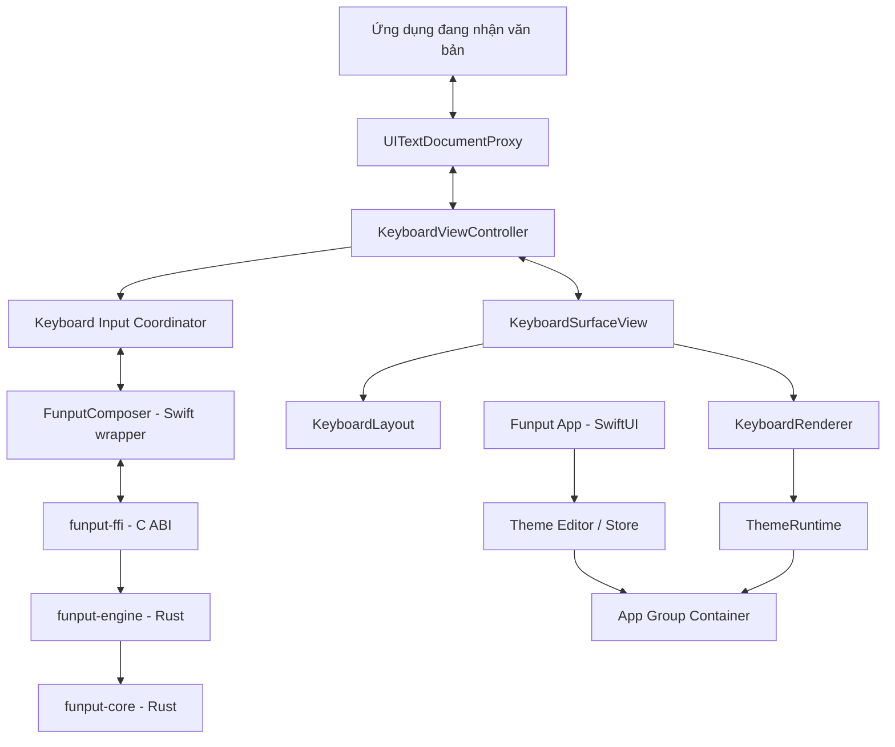
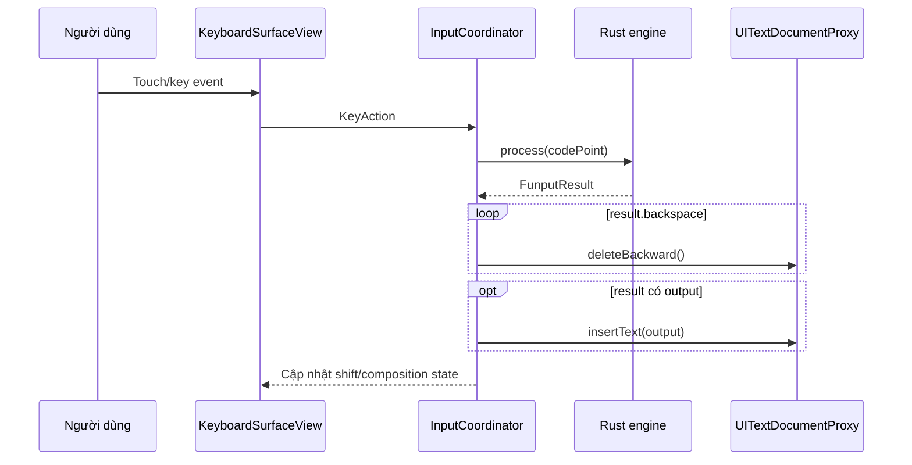
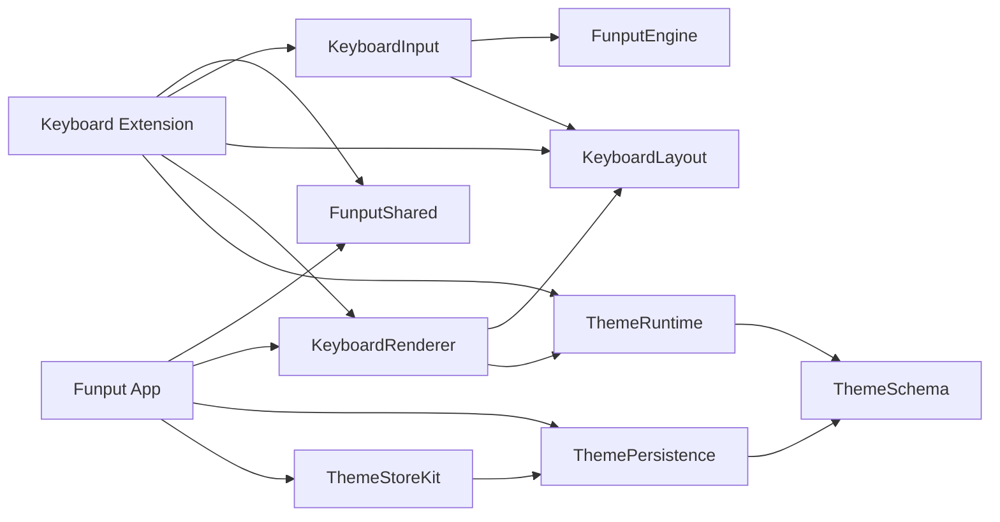
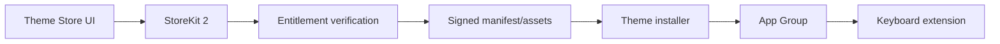
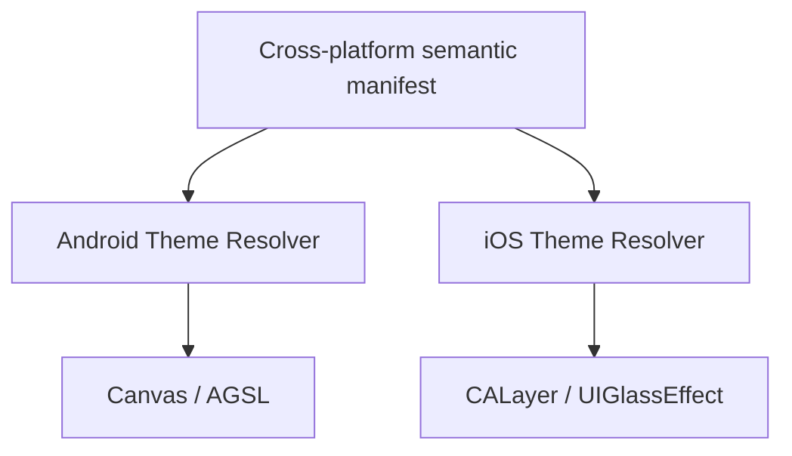

# Kiến trúc Funput cho iOS

> **Trạng thái:** Đề xuất kiến trúc để tham chiếu trong quá trình hiện thực
>
> **Cập nhật:** 11/07/2026
>
> **Phạm vi:** Containing app, custom keyboard extension, Rust engine và hệ thống theme trên iOS/iPadOS

---

## 1. Tóm tắt quyết định

Funput iOS sử dụng kiến trúc **hybrid native**: giao diện và tích hợp hệ thống được viết bằng Swift, còn toàn bộ luật gõ tiếng Việt tiếp tục dùng Rust engine chung của Funput.

| Thành phần | Công nghệ | Vai trò |
|---|---|---|
| Containing app | Swift 6.3 + SwiftUI | Onboarding, settings, theme editor và theme store |
| Keyboard extension | Swift 6.3 + UIKit | Tích hợp bàn phím hệ thống qua `UIInputViewController` |
| Keyboard surface | `UIView`/`UIControl` + Core Animation | Layout, touch, key repeat, animation và accessibility |
| Liquid Glass | `UIGlassEffect`, `UIGlassContainerEffect`, SwiftUI `glassEffect` | Giao diện native theo iOS 26 |
| Vietnamese engine | Rust `funput-engine` + `funput-core` | Telex, VNI, composition, spell check và smart restore |
| Swift–Rust bridge | C ABI từ `funput-ffi` | Biên ổn định, ít allocation và overhead thấp |
| Rust artifact | Static `XCFramework` | Link engine vào app/extension cho device và simulator |
| Cấu hình chia sẻ | App Groups + `UserDefaults(suiteName:)` | Chia sẻ settings và theme đã resolve |
| Unit/integration test | Swift Testing + Rust tests | Logic Swift, bridge và engine |
| UI/performance test | XCTest, XCUITest, Instruments | Onboarding, renderer, latency và memory |

### Toolchain tham chiếu

- **Xcode:** 26.4.1
- **Swift:** 6.3, Swift language mode 6
- **iOS SDK:** 26.4
- **Rust:** 1.97 stable, edition 2024
- **Minimum deployment:** iOS 18.0
- **Giao diện mục tiêu chính:** iOS/iPadOS 26.4

Không đóng băng toolchain vĩnh viễn. Khi bắt đầu một milestone mới, cập nhật lên bản stable mới nhất sau khi CI và test thiết bị đã xanh.

---

## 2. Mục tiêu kiến trúc

### 2.1. Mục tiêu bắt buộc

- Dùng chung Rust engine với macOS, Windows, Linux và Android.
- Bàn phím xuất hiện nhanh, không rớt ký tự và không tạo công việc nền trên mỗi lần nhấn.
- Gõ được khi offline và khi người dùng không cấp Full Access.
- Giao diện native, thích nghi tốt với iPhone, iPad, xoay màn hình và floating keyboard.
- Theme là năng lực lõi, không phải lớp skin gắn thêm sau này.
- Theme preview và bàn phím thật dùng cùng renderer.
- Không ghi log, lưu hoặc truyền nội dung người dùng đang nhập.
- Có đường nâng cấp rõ ràng cho user-created themes và Theme Store.

### 2.2. Chưa làm trong MVP

- Swipe typing hoặc gesture prediction phức tạp.
- Dự đoán câu bằng mô hình ngôn ngữ.
- Cloud clipboard hoặc đồng bộ lịch sử gõ.
- Marketplace cho bên thứ ba tự xuất bản theme.
- Theme chứa mã thực thi, JavaScript hoặc shader tùy ý.
- Network request trong keyboard extension.

---

## 3. Nguyên tắc thiết kế

1. **Rust engine là nguồn sự thật duy nhất cho tiếng Việt.** Swift không hiện thực lại luật Telex/VNI.
2. **Hot path hoàn toàn local và đồng bộ.** Không file I/O, database, network hay Swift concurrency hop khi xử lý phím.
3. **Layout, input semantics và visual theme độc lập.** Theme không được thay đổi hitbox hoặc ý nghĩa phím.
4. **Renderer dùng chung.** Keyboard thật, preview, editor và snapshot test phải render từ cùng một implementation.
5. **Progressive enhancement.** Liquid Glass chỉ bật trên hệ điều hành hỗ trợ; fallback vẫn phải rõ, đẹp và nhanh.
6. **Privacy by construction.** Kiến trúc không đưa nội dung nhập liệu vào analytics, logs hoặc shared storage.
7. **Không phụ thuộc Full Access cho chức năng cốt lõi.** Telex/VNI và theme bundled phải luôn hoạt động.
8. **Extension phải nhỏ và có thể bị hủy bất kỳ lúc nào.** Không giả định process keyboard tồn tại lâu dài.

---

## 4. Kiến trúc tổng thể



### Luồng xử lý một phím



---

## 5. Cấu trúc source đề xuất

```text
platforms/ios/
├── Funput/                         # Containing app target
│   ├── App/
│   ├── DesignSystem/
│   ├── Onboarding/
│   ├── Privacy/
│   ├── Settings/
│   └── Themes/
│       ├── Editor/
│       ├── Preview/
│       └── Store/
│
├── Keyboard/                       # Custom Keyboard Extension target
│   ├── Accessibility/
│   ├── Controller/
│   ├── Feedback/
│   ├── Input/
│   │   ├── Composition/
│   │   └── DocumentProxy/
│   ├── Layout/
│   ├── Renderer/
│   │   ├── Keys/
│   │   └── Surface/
│   └── Themes/
│
├── Packages/
│   └── FunputKit/                  # Một local Swift package, nhiều target
│       ├── Sources/
│       │   ├── FunputEngine/       # Typed Swift wrapper quanh FunputCore
│       │   ├── KeyboardInput/      # Key semantics và document commands
│       │   ├── FunputShared/
│       │   ├── KeyboardLayout/
│       │   ├── KeyboardRenderer/
│       │   ├── ThemePersistence/
│       │   ├── ThemeRuntime/
│       │   ├── ThemeSchema/
│       │   └── ThemeStoreKit/
│       └── Tests/
│
├── Frameworks/                     # FunputCore.xcframework (generated)
├── Scripts/                        # Build Rust/XCFramework
├── FunputTests/
├── FunputUITests/
└── docs/
```

### Vì sao dùng một local Swift package

`FunputKit` giữ ranh giới module rõ mà không tạo nhiều `Package.swift`. Mỗi module có thể là một SwiftPM target độc lập; containing app và keyboard extension chỉ link những target thực sự cần.

Ví dụ quan hệ phụ thuộc:



`ThemeStoreKit` không được link vào keyboard extension.

---

## 6. Containing app

Containing app dùng SwiftUI và các control hệ thống để tự động nhận diện mạo native của iOS 26.

### Trách nhiệm

- Hướng dẫn thêm và bật Funput trong Settings.
- Hiển thị trạng thái keyboard/Full Access khi có thể xác định.
- Cấu hình Telex, VNI, tone style, spell check và smart restore.
- Chỉnh theme, preview theme và quản lý theme đã cài.
- Thực hiện StoreKit 2, tải asset và xác minh entitlement.
- Hiển thị privacy policy, FAQ và hướng dẫn xử lý lỗi.

### Không thuộc containing app

- Không xử lý từng phím của extension.
- Không giữ composition state của keyboard.
- Không gửi hoặc nhận nội dung đang được nhập.

---

## 7. Keyboard extension

Class gốc là `UIInputViewController`:

```swift
final class KeyboardViewController: UIInputViewController {
    private let composer = FunputComposer()
    private let keyboardView = KeyboardSurfaceView()
    private let inputCoordinator = KeyboardInputCoordinator()
}
```

### Renderer

- Dùng `UIView`/`UIControl` và Core Animation.
- Mỗi phím là control thật để hỗ trợ VoiceOver và hit testing.
- Tính key frame theo kích thước bàn phím và cache kết quả.
- Tránh `UICollectionView` và tránh tạo Auto Layout constraint trong hot path.
- Không dùng SwiftUI làm keyboard surface chính.
- Không tạo `Task` trên mỗi touch/key event.
- Haptic có thể tắt và không được chặn việc insert text.

### Layout cần hỗ trợ

- Alphabetic QWERTY.
- Shift, Caps Lock và auto-capitalization.
- Number/symbol pages.
- Email, URL, ASCII và decimal variants khi phù hợp.
- iPhone portrait/landscape.
- iPad docked, floating và nhiều kích thước cửa sổ.
- Globe key dựa trên `needsInputModeSwitchKey`.
- Backspace repeat và long-press alternatives.

### Giới hạn hệ thống

Custom keyboard không xuất hiện trong secure text fields, phone pad/name phone pad và những ứng dụng chủ động chặn third-party keyboards. Đây là giới hạn iOS, không phải lỗi Funput.

---

## 8. Tích hợp Rust

### Quyết định

Tái sử dụng `funput-ffi`; không thêm UniFFI hoặc một bộ luật Swift riêng.

Các đặc tính C ABI hiện có phù hợp với iOS:

- Opaque engine handle.
- `FunputResult` là POD trả về theo giá trị.
- Không cấp phát/free trên mỗi kết quả.
- UTF-32 code points ở biên.
- Null-safe và panic-safe.

### Rust targets

```text
aarch64-apple-ios
aarch64-apple-ios-sim
x86_64-apple-ios
```

Artifact được đóng gói thành:

```text
FunputCore.xcframework/
├── Info.plist
├── ios-arm64/
│   ├── libfunput_ffi.a
│   └── Headers/
│       ├── funput.h
│       └── module.modulemap
└── ios-arm64_x86_64-simulator/
│   ├── libfunput_ffi-simulator.a
│   └── Headers/
│       ├── funput.h
│       └── module.modulemap
```

### Build từ source

Máy build cần Xcode command-line tools, Rust stable và `rustup`. Với clean clone,
chạy bootstrap trước khi mở hoặc build project:

```bash
platforms/ios/Scripts/bootstrap-ios.sh
```

Bootstrap build XCFramework trước khi Xcode resolve local package. Khi chỉ cần
rebuild native artifact, chạy:

```bash
platforms/ios/Scripts/build-ffi.sh
```

Script build `funput-ffi` với Cargo lockfile cho device và universal simulator,
sau đó tạo
`platforms/ios/Frameworks/FunputCore.xcframework`.
Có thể đặt output tạm cho CI bằng `FUNPUT_FFI_OUTPUT=/path/to/output`.
XCFramework là generated artifact và không được commit; source of truth gồm
Rust crate, `funput.h`, module map và build script.

`FunputCore` chỉ có iOS slices. Vì vậy `swift test` trên macOS host không chạy
các integration tests của `FunputEngine`. Dùng script iOS Simulator chính thức:

```bash
platforms/ios/Scripts/test-funput-kit.sh
```

Script tự chọn một iOS Simulator khả dụng. Có thể override cho local hoặc CI:

```bash
FUNPUT_IOS_TEST_DESTINATION='platform=iOS Simulator,id=<SIMULATOR_UDID>' \
  platforms/ios/Scripts/test-funput-kit.sh
```

Shared scheme `Funput` gọi `build-ffi.sh` trước mọi Release build/archive.
Vì Cargo build incremental, source Rust mới luôn được link mà không rebuild
không cần thiết. CI vẫn phải gọi script trực tiếp trước `xcodebuild`, không dựa
riêng vào scheme pre-action.

### Swift module boundary

`FunputCore` là binary target chứa C ABI generated. Product `FunputEngine` là
API duy nhất Swift consumer được dùng: typed input method, tone style, action
và result. C handle, `FunputResult` raw và tuple UTF-32 chỉ tồn tại bên trong
module này.

### Lifetime và threading

- Một `FunputComposer` giữ đúng một engine handle cho mỗi `KeyboardViewController`.
- `FunputComposer` là `@MainActor`, tạo handle khi init và free đúng một lần khi deinit.
- Không conform wrapper thành `Sendable` hoặc chuyển instance giữa actor/thread.
- Reset engine khi đổi field, caret/selection thay đổi hoặc context mất đồng bộ.

### Áp kết quả vào document

```swift
func apply(_ result: FunputCompositionResult, to proxy: UITextDocumentProxy) {
    for _ in 0..<result.deleteCount {
        proxy.deleteBackward()
    }

    if !result.text.isEmpty {
        proxy.insertText(result.text)
    }
}
```

iOS custom keyboard không có marked-text API tương đương macOS IMKit. Adapter iOS phải dùng `deleteBackward()` và `insertText(_:)`, đồng thời theo dõi `documentContextBeforeInput` để phát hiện lệch state.

### Đồng bộ document state

`KeyboardInputCoordinator` giữ một snapshot chỉ trong memory gồm
`documentIdentifier`, `documentContextBeforeInput` và việc có selection hay
không. Trước mỗi phím, composition chỉ được tiếp tục khi snapshot vẫn thuộc
cùng document, context chưa bị host thay đổi và context trước caret còn kết
thúc bằng buffer hiện tại của Rust engine. Nếu invariant này không còn đúng,
coordinator clear composer thay vì cố tái tạo engine state từ surrounding text.

Mỗi key event ghi document là một transaction: callback UIKit re-entrant được
bỏ qua và snapshot mới chỉ được chấp nhận sau toàn bộ chuỗi
`deleteBackward()`/`insertText(_:)`. `textDidChange` và `selectionDidChange`
được dùng để phát hiện edit hoặc caret movement từ host. Khi proxy trả về
`nil` cho context, keyboard vẫn cho phép composition do chính nó tạo và dựa
vào document identity cùng lifecycle callback để reset an toàn.

Snapshot không dùng `documentContextAfterInput`, không được log, persist hoặc
ghi vào App Group. Context chỉ phục vụ so sánh đồng bộ trong process keyboard.

---

## 9. Liquid Glass và design system

### Containing app

- Ưu tiên `NavigationStack`, `TabView`, sheet, menu và control SwiftUI chuẩn.
- Dùng `glassEffect` cho custom controls có ý nghĩa tương tác.
- Dùng semantic colors và Dynamic Type.
- Không đặt glass lên mọi card chỉ vì mục đích trang trí.

### Keyboard extension

- Dùng `UIGlassEffect` cho utility keys hoặc control layer quan trọng.
- Dùng `UIGlassContainerEffect` để nhóm các phần tử glass gần nhau.
- Phím chữ có thể dùng material nhẹ hơn để giữ hierarchy và giảm GPU cost.
- Tint chỉ dùng cho selection, state hoặc primary action.
- Tôn trọng Reduce Transparency, Reduce Motion và Increase Contrast.

### Fallback

```swift
if #available(iOS 26.0, *) {
    // UIGlassEffect / UIGlassContainerEffect
} else {
    // UIBlurEffect + semantic colors
}
```

Không đặt deployment target bằng iOS 26 chỉ để sử dụng Liquid Glass.

---

## 10. Kiến trúc theme

Theme là dữ liệu khai báo. Theme không được chứa mã thực thi và không được thay đổi input semantics.

### Các lớp chính

| Module | Trách nhiệm |
|---|---|
| `ThemeSchema` | Codable schema, version và migration |
| `ThemeRuntime` | Validate và resolve schema thành giá trị render trên iOS |
| `ThemePersistence` | Bundled themes, user themes, import/export và App Group |
| `KeyboardRenderer` | Render bàn phím thật và preview từ `ResolvedTheme` |
| `ThemeStoreKit` | Catalog, StoreKit 2, entitlement, download và installer |

### Theme model khái niệm

```swift
struct KeyboardTheme: Codable, Sendable {
    let id: String
    let schemaVersion: Int
    let metadata: ThemeMetadata
    let palette: ThemePalette
    let typography: ThemeTypography
    let keyStyle: KeyStyle
    let background: BackgroundStyle
    let effects: EffectStyle
    let haptics: HapticStyle
}
```

### Theme được phép điều khiển

- Light/dark palette và semantic key roles.
- Font trong allowlist, weight và scale trong giới hạn.
- Corner radius, border, shadow và pressed highlight.
- Background color, gradient hoặc ảnh hợp lệ.
- Glass variant, tint và mức độ tương tác.
- Animation preset và haptic preset đã định nghĩa sẵn.

### Theme không được phép điều khiển

- Hitbox, key position hoặc ý nghĩa phím.
- Swift/Rust code, script hoặc executable.
- URL request từ keyboard extension.
- Shader source tùy ý.
- Đọc `UITextDocumentProxy` hoặc nội dung người dùng nhập.
- Asset nằm ngoài theme package/App Group container.

---

## 11. Theme pipeline

Keyboard extension không parse JSON hoặc decode ảnh lớn khi vừa xuất hiện. Theme được chuẩn bị trước trong containing app.

```mermaid
flowchart LR
    Package["Theme package"]
    Validate["Validate schema/assets"]
    Migrate["Schema migration"]
    Resolve["Resolve semantic values"]
    Check["Contrast/size checks"]
    Cache["Compiled theme cache"]
    Group["App Group"]
    Keyboard["Keyboard renderer"]

    Package --> Validate --> Migrate --> Resolve --> Check --> Cache --> Group --> Keyboard
```



### `ResolvedTheme`

`ResolvedTheme` là representation tối ưu cho renderer:

- Giá trị màu đã resolve theo light/dark và accessibility traits.
- Metrics đã clamp trong giới hạn an toàn.
- Asset đã decode/resize hoặc có cache phù hợp.
- Không còn logic migration.
- Không chứa URL remote.
- Có schema/cache version để invalidation.

Keyboard chỉ đọc theme khi khởi tạo hoặc nhận thông báo cấu hình thay đổi; không đọc trên mỗi lần nhấn phím.

---

## 12. User-created themes

Theme Editor nằm trong containing app và dùng chính `KeyboardRenderer` để preview.

### Năng lực dự kiến

- Chọn màu và semantic key roles.
- Gradient/background image editor.
- Key shape, radius, border và shadow.
- Glass tint/intensity trong giới hạn hệ thống.
- Light/dark variants.
- Duplicate, reset, import và export.
- Live preview cho iPhone/iPad.
- Cảnh báo contrast và khả năng đọc.

### Package format đề xuất

```text
MyTheme.funputtheme/
├── manifest.json
├── preview.webp
└── assets/
    ├── background.heic
    └── texture.webp
```

### Quy tắc an toàn khi import

- Giới hạn tổng dung lượng, số asset và kích thước ảnh.
- Chỉ nhận định dạng cho phép.
- Reject symlink, absolute path và `../` traversal.
- Không nhận binary, HTML, JavaScript hoặc shader source.
- Xác minh hash asset nếu manifest cung cấp.
- Parse vào staging directory trước khi atomic install.
- Theme lỗi luôn fallback về bundled default theme.

---

## 13. Theme Store

Theme Store thuộc containing app. Keyboard extension không link StoreKit, catalog client hoặc networking stack.



### Mô hình thương mại có thể mở rộng

- Theme miễn phí.
- Mua một theme.
- Collection/bundle.
- Restore purchases.
- Subscription chỉ khi giá trị cập nhật liên tục đủ rõ ràng.

### Quy tắc vận hành

- Theme mặc định luôn bundled và dùng được offline.
- Store/backend hỏng không được ảnh hưởng việc gõ.
- Catalog metadata có thể cache, nhưng entitlement phải được xác minh đúng chính sách StoreKit.
- Theme tải về phải có manifest/hash hoặc chữ ký phù hợp.
- Không đặt quảng cáo, marketing hoặc giao dịch mua trong keyboard extension.

---

## 14. Chia sẻ theme với Android

Không chia sẻ renderer hoặc pixel shader giữa hai nền tảng. Chỉ chia sẻ **semantic theme manifest**.



Ví dụ manifest trung lập:

```json
{
  "schemaVersion": 1,
  "keySurface": {
    "material": "glass",
    "tint": "#4F8CFF",
    "cornerRadius": 12,
    "interaction": "responsive"
  }
}
```

- Android resolver ánh xạ sang Canvas/AGSL.
- iOS resolver ánh xạ sang `UIGlassEffect`, `CALayer` hoặc fallback.
- Mỗi platform được quyền clamp hoặc fallback để đảm bảo hiệu năng và accessibility.

---

## 15. App Groups, Full Access và privacy

### Identifiers đề xuất

```text
Containing app:    app.funput.funput
Keyboard extension: app.funput.funput.Keyboard
App Group:          group.app.funput.funput
```

Tên cuối cùng phải trùng giữa Xcode Signing & Capabilities, Apple Developer portal và provisioning profiles.

### Hai chế độ hoạt động

| Không Full Access | Có Full Access |
|---|---|
| Telex/VNI hoạt động | Telex/VNI hoạt động |
| Bundled default themes | User-created/downloaded themes |
| Cấu hình mặc định hoặc local | Đồng bộ cấu hình qua App Group |
| Không network | Containing app tải theme; extension vẫn không cần network |

App Store yêu cầu keyboard vẫn hoạt động khi không có Full Access. Vì vậy không được khóa chức năng gõ cơ bản, Telex/VNI hoặc keyboard switching sau quyền này.

### Privacy rules

- Không log code point, buffer, surrounding context hoặc output text.
- `os.Logger` chỉ được ghi lifecycle, error code và số liệu thời gian không chứa nội dung.
- Không dùng analytics/ad SDK trong extension.
- Không ghi composition buffer vào disk hoặc App Group.
- `documentContextBeforeInput` chỉ dùng trong memory để đồng bộ state.
- Privacy policy phải mô tả rõ extension và dữ liệu được/không được xử lý.

### Personal Suggestions

- Chỉ học token được tạo bởi chính mutation `insertText`/`deleteBackward` của Funput;
  không học document context, selection, autocorrection hoặc nội dung có sẵn của host.
- Không Full Access dùng lexicon in-memory. Khi có quyền, snapshot và journal nằm
  trong `PersonalSuggestions/` của App Group, được loại khỏi device backup.
- Extension là writer duy nhất. Containing app chỉ gửi reset token qua cấu hình;
  lỗi open/query/flush/reset luôn trả empty/no-op và không ảnh hưởng Telex/VNI.
- Prefix, candidate và từ đã học không được ghi log, signpost, telemetry hoặc mạng.
  Signpost chỉ chứa generation, phase, candidate count và duration.

---

## 16. Testing và đo hiệu năng

### Test pyramid

| Lớp | Công cụ | Nội dung |
|---|---|---|
| Rust unit/property | `cargo test` | Telex, VNI, Unicode và engine state |
| Rust benchmark | Criterion | Latency core và FFI |
| Swift unit | Swift Testing | Layout, theme migration, resolver và adapters |
| Integration | Swift Testing/XCTest | Swift wrapper ↔ C ABI ↔ Rust engine |
| Renderer snapshot | XCTest | Light/dark, accessibility và device sizes |
| UI flow | XCUITest | Onboarding, settings và theme editor |
| Manual extension | Device/Simulator | Notes, Safari, Messages và app bên thứ ba |
| Performance | Instruments/XCTest metrics | Startup, allocations, Core Animation, energy |

### Device/layout matrix tối thiểu

- iPhone nhỏ và iPhone màn hình lớn.
- Portrait và landscape.
- iPad docked và floating keyboard.
- Light/dark mode.
- Reduce Transparency/Reduce Motion/Increase Contrast.
- Dynamic Type và VoiceOver.
- iOS 18 fallback và iOS 26 Liquid Glass.

### Các chỉ số cần theo dõi

- Thời gian từ extension activation đến frame tương tác đầu tiên.
- Main-thread time cho touch → `insertText`.
- Allocation trên mỗi key event.
- Peak resident memory của extension.
- Dropped frames khi gõ nhanh/backspace repeat.
- Thời gian load/resolve/switch theme.

Không ghi nội dung phím để đo các chỉ số này.

---

## 17. Build và CI

Pipeline dự kiến:

```text
Rust format/clippy/test
    → build static libraries cho iOS device/simulator
    → tạo FunputCore.xcframework
    → Swift package tests
    → Xcode build app + extension
    → unit/integration tests
    → selected simulator UI tests
    → archive validation
```

Generated `XCFramework` không được commit. Local clean clone dùng
`bootstrap-ios.sh`; Release scheme tự rebuild artifact; CI gọi `build-ffi.sh`
trước package resolution và `xcodebuild`.

---

## 18. Roadmap hiện thực

### Giai đoạn 1 — Vertical slice

- Hoàn thiện project targets và signing.
- Build `funput-ffi` thành `XCFramework`.
- Tạo Swift wrapper và lifetime tests.
- Render layout alphabetic tối thiểu.
- Gõ ASCII, Telex/VNI, Space, Return và Backspace trong Notes.
- Globe key hoạt động đúng.

### Giai đoạn 2 — Keyboard nền tảng

- Shift/Caps Lock và number/symbol layouts.
- Các keyboard type cần thiết.
- Backspace repeat, long press và haptic.
- State synchronization với `UITextDocumentProxy`.
- iPad/floating layout và accessibility.

### Giai đoạn 3 — Settings và theme core

- Onboarding và settings SwiftUI.
- `ThemeSchema`, `ThemeRuntime` và bundled themes.
- Renderer dùng chung giữa preview và extension.
- App Group synchronization và fallback không Full Access.
- Liquid Glass trên iOS 26, fallback trên iOS 18–25.

### Giai đoạn 4 — User-created themes

- Theme Editor và live preview.
- Import/export package.
- Validation, migration và safe installer.
- Contrast/accessibility checks.

### Giai đoạn 5 — Theme Store

- Catalog và download pipeline.
- StoreKit 2 và entitlement verification.
- Signed manifests, restore purchases và cache.
- App Review/privacy hardening.

---

## 19. Các quyết định không chọn

| Không chọn | Lý do |
|---|---|
| Flutter/React Native | Tăng runtime, startup và khó tích hợp keyboard lifecycle |
| SwiftUI-only keyboard surface | Khó kiểm soát memory/touch latency bằng UIKit renderer chuyên dụng |
| Kotlin/Compose Multiplatform | Không đem lại lợi ích cho system extension native iOS |
| Slint | Không cần thêm renderer/runtime khi UIKit đã là integration layer bắt buộc |
| UniFFI | C ABI hiện tại đã nhỏ, ổn định và được dùng trên macOS/Linux |
| StoreKit/network trong extension | Tăng rủi ro privacy, review, memory và reliability |
| Theme chạy code/shader tùy ý | Không an toàn, khó validate và khó đảm bảo hiệu năng |

---

## 20. Checklist trước mỗi milestone

- [ ] Keyboard vẫn gõ được khi không có mạng.
- [ ] Keyboard vẫn gõ được khi không cấp Full Access.
- [ ] Không có nội dung nhập liệu trong log hoặc telemetry.
- [ ] Theme lỗi fallback an toàn về bundled default.
- [ ] Renderer preview và renderer extension là cùng implementation.
- [ ] App và extension không link module không cần thiết.
- [ ] Build chạy trên device ARM64 và Apple Silicon simulator.
- [ ] Test iOS 18 fallback và iOS 26 Liquid Glass.
- [ ] Test iPhone/iPad, portrait/landscape và floating keyboard.
- [ ] Test VoiceOver và các accessibility appearance settings.
- [ ] Instruments không cho thấy allocation bất thường trên key hot path.

---

## 21. Tài liệu tham khảo chính

- [Creating a custom keyboard](https://developer.apple.com/documentation/uikit/creating-a-custom-keyboard)
- [`UIInputViewController`](https://developer.apple.com/documentation/uikit/uiinputviewcontroller)
- [Handling text interactions in custom keyboards](https://developer.apple.com/documentation/uikit/handling-text-interactions-in-custom-keyboards)
- [Configuring a custom keyboard interface](https://developer.apple.com/documentation/uikit/configuring-a-custom-keyboard-interface)
- [Configuring App Groups](https://developer.apple.com/documentation/xcode/configuring-app-groups)
- [`UIGlassEffect`](https://developer.apple.com/documentation/uikit/uiglasseffect)
- [Applying Liquid Glass to custom views](https://developer.apple.com/documentation/swiftui/applying-liquid-glass-to-custom-views)
- [App Store Review Guidelines — Keyboard extensions](https://developer.apple.com/app-store/review/guidelines/)
- [Rust iOS platform support](https://doc.rust-lang.org/rustc/platform-support/apple-ios.html)

---

Tài liệu này mô tả hướng kiến trúc, không phải đặc tả đóng băng. Những thay đổi ảnh hưởng đến privacy, FFI surface, theme schema, module boundaries hoặc khả năng hoạt động khi không có Full Access nên được ghi lại bằng ADR trước khi triển khai rộng.
