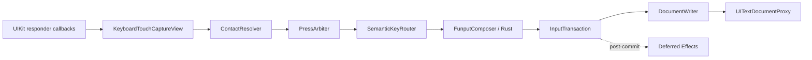
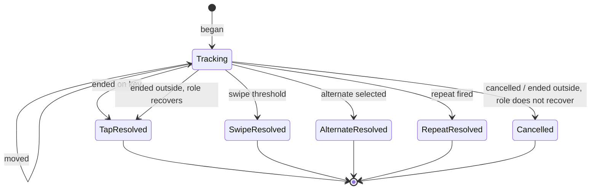

# Funput iOS Input Pipeline 2.0

> **Trạng thái:** Phase 1–5 đã hiện thực; production chỉ có một touch pipeline
> **Phạm vi:** Xử lý phím trong custom keyboard extension trên iOS/iPadOS  
> **Ngày:** 30/07/2026 (cập nhật 06/08/2026: §11.1 và §19.8 — mô hình commit)
> **Đã thay thế:** Touch ledger, orphan reconciliation và commit queue
> **Không thay thế:** Rust engine, layout definitions, theme renderer, settings và personal suggestion engine
>
> **Kế thừa:** [INPUT_PIPELINE_3_ARCHITECTURE.md](INPUT_PIPELINE_3_ARCHITECTURE.md) đề xuất thay `PressArbiter` + deadline scheduler bằng một journal không chặn. Tài liệu đó **chưa được hiện thực** — mọi mô tả dưới đây vẫn đúng với code hiện tại. Đọc 3.0 trước khi mở rộng tầng arbiter.

---

## 1. Tóm tắt quyết định

Funput sẽ thiết kế lại toàn bộ pipeline xử lý phím trên iOS theo các nguyên tắc:

1. Tin vào lifecycle chính thức của UIKit:
   `touchesBegan`, `touchesMoved`, `touchesEnded`, `touchesCancelled`.
2. Không suy luận lifecycle của một touch từ `UIEvent.allTouches`.
3. Mỗi contact có state machine độc lập; touch này không được xóa hoặc hoàn tất touch khác.
4. Không có global queue entry nào được phép chặn vô hạn các phím phía sau.
5. Layout và view hierarchy không được rebuild khi đang có active contact.
6. Mỗi semantic key action tạo đúng một document transaction.
7. Hot path chạy đồng bộ trên `MainActor`, không tạo `Task` hoặc thực hiện I/O theo từng phím.
8. Suggestion, persistence và presentation update phải diễn ra sau document commit và được coalesce.
9. Thiết bị thật là acceptance gate bắt buộc; simulator và synthetic touch không đủ để chứng minh rollover.

Kiến trúc mới giữ nguyên Rust engine làm nguồn sự thật cho Telex/VNI. Phần được thay thế chỉ nằm từ UIKit touch delivery đến document transaction.

---

## 2. Bối cảnh

### 2.1. Triệu chứng

Khi người dùng gõ tiếng Việt nhanh ở tốc độ con người, hai ngón có thể overlap:

```text
A down → B down → A up → B up
```

hoặc:

```text
A down → B down → B up → A up
```

Pipeline hiện tại đôi khi không phát một hoặc nhiều phím đã nhấn. Với Telex/VNI, mất hoặc đảo một phím còn có thể biểu hiện thành:

- chữ không xuất hiện;
- dấu không được áp dụng;
- modifier xuất hiện dưới dạng literal;
- nhiều phím phía sau cùng bị giữ;
- ký tự chỉ xuất hiện sau khi người dùng nhấn thêm một phím khác.

### 2.2. Những lần sửa trước

Code hiện tại đã lần lượt thêm:

- multi-touch surface;
- touch-down ordering;
- `KeyboardPressCommitQueue`;
- touch token ledger;
- orphan reconciliation;
- grace window cho terminal phase;
- commit một số phím khi system cancellation;
- stale `UITouch` object recovery.

Các thay đổi này xử lý được từng race riêng lẻ, nhưng làm lifecycle nội bộ phức tạp hơn lifecycle UIKit. Một touch hiện có trạng thái đồng thời trong:

- `KeyboardTouchOverlayView`;
- `KeyboardTouchTokenLedger`;
- `KeyboardSurfaceInteractionController.touches`;
- `KeyboardPressCommitQueue`;
- repeat/alternate controllers;
- renderer highlight state.

Khi các nguồn trạng thái lệch nhau, hệ thống phải suy đoán touch đã kết thúc hay chưa. Đây là nguyên nhân kiến trúc cần được loại bỏ.

### 2.3. Khoảng trống kiểm thử hiện tại

Ba nhóm test hiện tại đều hữu ích nhưng chưa đủ:

1. Stress tests dùng `UIControl.sendActions`, không đi qua UIKit touch dispatch thật.
2. Responder tests dùng `UITouch`/`UIEvent` giả và gọi thẳng callback.
3. UI test dùng sequential single-touch khoảng 3–5 phím/giây, không tạo rollover hai contact.

Vì vậy một test suite xanh không chứng minh pipeline hoạt động đúng khi UIKit dispatch nhiều touch phase gần nhau trên thiết bị thật.

---

## 3. Cơ sở từ Apple

Thiết kế này dựa trên các contract chính thức sau:

- UIKit tạo một `UITouch` cho mỗi finger và gọi các responder callbacks tương ứng với từng phase. View phải bật `isMultipleTouchEnabled` để nhận thêm touch:
  [Handling touches in your view](https://developer.apple.com/documentation/uikit/handling-touches-in-your-view).
- `UIEvent` được UIKit tái sử dụng trong một multi-touch sequence. Không giữ `UIEvent` hoặc object lấy từ event; nếu cần trạng thái lâu hơn callback, phải copy dữ liệu cần thiết:
  [UIEvent](https://developer.apple.com/documentation/uikit/uievent).
- `allTouches` trả về một `Set<UITouch>` có thể chứa touch thuộc nhiều view/window:
  [UIEvent.allTouches](https://developer.apple.com/documentation/uikit/uievent/alltouches).
- `UITouch.timestamp` cho biết thời điểm touch phát sinh hoặc được thay đổi và có thể dùng để so sánh thời gian:
  [UITouch.timestamp](https://developer.apple.com/documentation/uikit/uitouch/timestamp).
- Custom keyboard phải tương tác với host thông qua `UITextDocumentProxy`:
  [UIInputViewController](https://developer.apple.com/documentation/uikit/uiinputviewcontroller) và
  [Handling text interactions in custom keyboards](https://developer.apple.com/documentation/uikit/handling-text-interactions-in-custom-keyboards).
- Apple mô tả system keyboard là chuẩn kỳ vọng về tốc độ và độ phản hồi:
  [Custom Keyboard — App Extension Programming Guide](https://developer.apple.com/library/archive/documentation/General/Conceptual/ExtensibilityPG/CustomKeyboard.html).

Apple không cung cấp contract rằng thứ tự duyệt một `Set<UITouch>` là thứ tự người dùng nhấn. Vì vậy pipeline phải tự lưu intent timestamp và sequence ngay tại `touchesBegan`.

Capture layer sort batch theo `(timestamp, x, y)` trước khi cấp `ContactID`. Việc này **không** khôi phục thứ tự vật lý — nó chỉ làm một lần chạy có thể tái lập, để test và trace không phụ thuộc thứ tự hash của `Set`.

---

## 4. Mục tiêu

### 4.1. Mục tiêu bắt buộc

- Không mất hoặc duplicate character trong fast human rollover.
- Không đảo phím khi touch-down có thứ tự phân biệt được.
- Một touch lỗi hoặc giữ lâu không làm đứng toàn bộ keyboard.
- Không commit action hai lần sau cancellation hoặc lifecycle reset.
- Không rebuild layout trong lúc một finger vẫn đang được track.
- Telex, VNI và Advanced Telex dùng chung một semantic pipeline.
- Giữ hot path nhỏ, đồng bộ, đo được latency theo từng tầng.
- Không log nội dung người dùng.
- Hoạt động không cần Full Access.

### 4.2. Không phải mục tiêu

- Viết lại Rust composition engine.
- Thay đổi luật Telex/VNI.
- Viết lại keyboard layout hoặc theme system.
- Thêm swipe typing/dictionary prediction.
- Giả lập private behavior của system keyboard.
- Bảo đảm thứ tự vật lý cho hai contact có timestamp hoàn toàn giống nhau; UIKit không cung cấp đủ thông tin để suy ra thứ tự không tồn tại trong event data.

---

## 5. Invariants

Đây là contract bắt buộc của implementation mới.

### 5.1. Touch invariants

1. Mỗi `touchesBegan` hợp lệ tạo đúng một `ContactID`.
2. Một `ContactID` chỉ đi đến đúng một terminal outcome:
   `committed`, `cancelled`, `alternate`, `swiped`, hoặc `repeated`.
3. `touchesMoved`, `touchesEnded` hoặc `touchesCancelled` của touch chưa được track là no-op có telemetry counter; không được tác động touch khác.
4. Không đọc phase của touch ngoài tập `touches` được UIKit giao cho callback hiện tại.
5. Không giữ `UITouch` hoặc `UIEvent` sau khi callback kết thúc.
6. Mọi dữ liệu cần thiết phải được copy thành value type.

### 5.2. Ordering invariants

1. Hai tap nhanh có timestamp khác nhau được commit theo intent timestamp.
2. Nếu timestamp bằng nhau, pipeline chỉ bảo đảm exactly-once, không mất và không duplicate.
3. Một held touch không được block tap phía sau quá rollover window.
4. Không cần UI event tương lai để drain một completed action.
5. Arbiter luôn có cơ chế tiến triển độc lập với incoming touch event.

### 5.3. Document invariants

1. Mỗi semantic action tạo tối đa một `InputTransaction`.
2. Delete và insert của cùng transaction không được interleave với transaction khác.
3. Transaction được apply đồng bộ trên `MainActor`.
4. Suggestion và presentation không được chạy giữa delete và insert.
5. External document change làm đóng composition epoch nhưng không được replay transaction cũ.

### 5.4. Presentation invariants

1. Highlight/preview không quyết định semantic output.
2. Layout geometry dùng cho một active contact là immutable đến terminal outcome.
3. Layout-changing request được defer đến khi `activeContactCount == 0`.
4. Theme-only update không được reset touch state.

---

## 6. Kiến trúc tổng thể



### Trách nhiệm từng tầng

| Tầng | Trách nhiệm | Không được làm |
|---|---|---|
| `KeyboardTouchCaptureView` | Copy callback data thành value events | Hit-test semantic, gọi engine, đọc `allTouches` |
| `ContactResolver` | Theo dõi một finger, hit-test, tap/swipe/alternate/repeat | Gọi document proxy |
| `PressArbiter` | Exactly-once, rollover ordering, bounded progress | Biết Telex/VNI |
| `SemanticKeyRouter` | Chuyển resolved press thành key intent | Chạm UIKit touch |
| `FunputComposer` | Tạo composition result | Render UI |
| `DocumentWriter` | Apply transaction nguyên tử về mặt pipeline | Suggestion/theme work |
| `Deferred Effects` | Presentation, suggestion, analytics counters | Thay đổi transaction đã commit |

---

## 7. Touch Capture

### 7.1. Value events

Touch capture chuyển dữ liệu UIKit thành value type ngay trong callback:

```swift
struct ContactSample: Sendable {
    enum Phase: Sendable {
        case began
        case moved
        case ended
        case cancelled
    }

    let id: ContactID
    let phase: Phase
    let timestamp: TimeInterval
    let location: CGPoint
    let previousLocation: CGPoint
}
```

`ContactID` là monotonic ID nội bộ. Mapping từ `ObjectIdentifier(UITouch)` chỉ tồn tại trong capture layer và bị xóa đúng tại `ended/cancelled`.

### 7.2. Callback behavior

```swift
override func touchesBegan(_ touches: Set<UITouch>, with event: UIEvent?) {
    emit(copyBeganSamples(touches))
}

override func touchesMoved(_ touches: Set<UITouch>, with event: UIEvent?) {
    emit(copyMovedSamples(touches))
}

override func touchesEnded(_ touches: Set<UITouch>, with event: UIEvent?) {
    emit(copyEndedSamples(touches))
}

override func touchesCancelled(_ touches: Set<UITouch>, with event: UIEvent?) {
    emit(copyCancelledSamples(touches))
}
```

Không có:

- `event.allTouches`;
- reconcile callback;
- scan phase của touch ngoài callback set;
- stale terminal grace window;
- tự tạo `released` từ system cancellation;
- controller-wide `cancelAll()` khi presentation đổi.

Mỗi callback chạy ba pha theo đúng thứ tự:

```text
recognize  → presentation + gesture claim (onBegin / onMove)
commit     → pipeline consume sample
finish     → terminal bookkeeping (onEnd / onCancel)
```

Recognize phải đi trước commit: một swipe vượt ngưỡng ở move cuối cùng — move đó được giao kèm sample `.ended`. Nếu commit chạy trước, phím bên dưới đã vào document rồi gesture mới claim, nên spacebar chèn dấu cách và toggle ngôn ngữ mất. Finish đi sau cùng để controller chỉ tháo contact khi press của nó đã được tính.

Sau khi một contact bị gesture claim, resolver không còn track nó, nên các callback tiếp theo trả `unknownContact`. Đó là trạng thái mong đợi, không phải regression, và không được tính vào `resolverUnknownCallback`.

### 7.3. Vì sao vẫn dùng một unified touch view

Hai lựa chọn đã xem xét:

#### Một `UIControl` trên mỗi key

Ưu điểm:

- dùng target-action chuẩn UIKit;
- ít code tracking;
- accessibility tự nhiên.

Nhược điểm:

- khó xử lý finger trượt qua key khác;
- khó phân phối gap cho key gần nhất;
- alternate palette và space swipe phức tạp;
- rollover qua nhiều control phụ thuộc hit-test ownership ban đầu.

#### Một unified touch view

Ưu điểm:

- mọi contact đi qua một owner;
- hỗ trợ slide-to-correct, gap hit-testing, alternates và swipe;
- renderer keycaps không sở hữu semantic lifecycle.

Quyết định: tiếp tục dùng unified touch view, nhưng capture layer chỉ làm adapter UIKit mỏng và không tự reconcile lifecycle.

---

## 8. Contact Resolver

### 8.1. State machine



Mỗi resolver lưu:

```swift
struct ContactState {
    let id: ContactID
    let intentSequence: UInt64
    let beganAt: TimeInterval
    let initialKey: KeySpec
    let geometryRevision: UInt64
    var currentKey: KeySpec?
    var currentPoint: CGPoint
    var hasExceededTapSlop: Bool
    var mode: Mode
}
```

### 8.2. Geometry snapshot

Khi touch bắt đầu, resolver ghi `geometryRevision`. Revision đó phải còn hợp lệ đến khi contact kết thúc.

Nếu settings hoặc traits yêu cầu layout mới:

```text
request layout revision N+1
        ↓
active contacts > 0 ? defer : apply
```

Theme color hoặc pressed appearance có thể đổi mà không thay geometry. Mọi thay đổi làm đổi key identity, frame hoặc role phải chờ active contacts về 0.

### 8.3. Cancellation

`touchesCancelled` có nghĩa là interaction không hoàn tất. Resolver:

- xóa highlight;
- dừng repeat/alternate timer;
- phát `.cancelled`;
- không tự insert character.

Nếu thực tế cho thấy UIKit cancellation xảy ra trong một normal fast tap, đó phải là telemetry signal và được điều tra ở view lifecycle. Không biến cancellation thành success vì điều đó có thể tạo extra Backspace, Return hoặc character mà người dùng không định nhập.

### 8.4. Release recovery

Một tap nhanh bằng hai ngón cái hiếm khi nhấc đúng chỗ đã chạm. Hai trường hợp drift được xử lý như nhau — commit theo phím ngón đã chạm, không hủy press:

- **tap slop:** ngón trượt qua ngưỡng slop nhưng vẫn trên keycap;
- **release outside:** ngón nhấc ra ngoài tracked geometry (union keycap nới 12pt).

Trường hợp thứ hai trước đây bị hủy, và đó là đường mất phím im lặng còn lại trong touch layer. Đây **không** phải cancellation: `touchesEnded` nghĩa là người dùng đã hoàn tất intent, khác hẳn `touchesCancelled` ở §8.3.

Luật theo role nằm trong một value type:

```swift
public struct KeyboardTouchRecoveryPolicy: Equatable, Sendable {
    public let eligibleRoles: Set<KeyRole>
    public let tapSlopRecoveringRoles: Set<KeyRole>
    public let releaseOutsideRecoveringRoles: Set<KeyRole>
}
```

Thêm một luật recovery mới là thêm một property ở đây, không đổi signature của pipeline.

Telemetry: `endedOutside` đếm mọi release ngoài vùng, `recoveredReleaseOutside` đếm phần được giữ lại. Hai số này cho biết tần suất thật của drift trên thiết bị.

---

## 9. Press Arbiter

### 9.1. Lý do tồn tại

Với rollover:

```text
A down → B down → B up → A up
```

Nếu commit trực tiếp theo release order, output sẽ là `BA`. Arbiter cố gắng giữ intent order `AB` trong một cửa sổ nhỏ, nhưng không được phép giữ `B` vô hạn nếu `A` là hold/gesture.

### 9.2. Dữ liệu

```swift
struct ResolvedPress {
    let contactID: ContactID
    let intentSequence: UInt64
    let beganAt: TimeInterval
    let endedAt: TimeInterval
    let action: SemanticKeyAction
}
```

Arbiter có:

- active intent sequences;
- resolved presses;
- detached held contacts;
- một deadline scheduler dùng main run loop;
- giới hạn depth nhỏ và có telemetry.

### 9.3. Thuật toán

1. `began` đăng ký một intent sequence.
2. Terminal outcome đưa press vào resolved set.
3. Nếu press có sequence nhỏ nhất đã resolved, commit ngay và drain contiguous presses.
4. Nếu press phía sau resolved nhưng head vẫn active:
   - mở một rollover window ngắn;
   - nếu head terminal trong window, drain theo intent order;
   - nếu head vẫn active sau window, phân loại head là held/non-blocking;
   - commit các resolved tap phía sau;
   - held contact được commit theo terminal time khi nó thực sự kết thúc.
5. Deadline được schedule ngay khi phát hiện blocked resolved press; không chờ một UIKit event khác.

Giá trị rollover window không được hard-code theo cảm tính. Giá trị ban đầu cần được chọn sau khi thu signpost trên nhiều thiết bị 60 Hz và 120 Hz. Khoảng ứng viên để benchmark là 24–50 ms.

### 9.4. Progress guarantee

Với mọi resolved press:

```text
commitTime <= resolvedTime + rolloverWindow + schedulerJitter
```

Một unresolved contact chỉ được giữ quyền ordering trong rollover window. Sau đó nó không còn là global head blocker.

Khi bypass xảy ra, arbiter ghi `maximumBypassHoldSeconds` — thời gian head đã bị giữ tại thời điểm hết window. Đây là dữ liệu để chốt câu hỏi mở §19.1 và §19.2 bằng đo đạc thay vì cảm tính.

### 9.6. Teardown không được nuốt press đã resolved

> **Đã giải quyết (06/08/2026) — mục này chỉ còn giá trị lịch sử.**
>
> Bản trước mô tả `flushResolved()`: khi đổi layout thì phát trước những press mà ngón đã
> nhấc, rồi mới tháo dỡ. Tài liệu tự gọi đó là *"biện pháp tạm cho đến khi deferred layout
> gate ở §5.4.3 được hiện thực"*.
>
> Cách sửa đúng đã được làm thay vì flush: **đổi layout không còn tháo dỡ contact nào.**
> `presentationDidChange` giờ chỉ gọi `interactionController.suspendPresentation()` — xoá
> highlight, preview và timer alternate đang chờ, nhưng giữ nguyên danh tính `UITouch`,
> entry resolver và geometry snapshot riêng của từng contact. Ngón còn đang giữ vì thế
> commit đúng phím nó đã chạm, kể cả khi layout đã đổi bên dưới.
>
> Không còn press nào bị giữ qua teardown thì không còn gì để flush. `flushResolved()`,
> `flushResolvedPresses()` và counter `flushedOnLayoutChange` đã bị gỡ khỏi source.
>
> `reset()` giờ chỉ còn hai caller, và cả hai đều là kết thúc thật: keyboard rời window, và
> phiên diagnostics bắt đầu lại. Ngón chưa nhấc thì không được commit (§8.3) — bất biến này
> không đổi, và có test giữ cả hai chiều.
>
> Contact bị tháo dỡ mà chưa commit cũng chưa cancel giờ được đếm vào `contactsAbandoned`.
> Trước đây chúng biến mất im lặng, và đó là lý do lớp bug này khó tìm đến vậy.

### 9.5. Exact timestamp ties

Nếu nhiều `touchesBegan` trong cùng callback có cùng timestamp:

- gán sequence nội bộ để bảo đảm exactly-once;
- không tuyên bố sequence đó là physical order;
- test chỉ yêu cầu không mất/duplicate;
- telemetry ghi nhận tie frequency để biết trường hợp này có thực sự phổ biến trên thiết bị hay không.

---

## 10. Semantic Key Router

Arbiter chỉ phát semantic action:

```swift
enum SemanticKeyAction {
    case character(String)
    case modifier(String)
    case backspace
    case space
    case enter
    case alternate(KeyAlternate)
    case changeLayout(KeyboardLayoutMode)
    case toggleShift
    case toggleLanguage
    case systemInputMode
}
```

Router chịu trách nhiệm:

- chuyển label theo shift state;
- phân biệt document-mutating và UI-only action;
- gọi Rust composer cho character/modifier;
- đóng composition epoch khi space/punctuation/enter;
- tạo layout request thay vì rebuild ngay.

Router không biết `UITouch`, source frame hoặc preview.

---

## 11. Input Transaction và Document Writer

### 11.1. Transaction model

```swift
struct InputTransaction {
    let sequence: UInt64
    let mutations: [DocumentMutation]
    let resultingState: KeyboardInputState
}

enum DocumentMutation {
    case deleteBackward(count: Int)
    case insert(String)
}
```

Một composition result có thể tạo:

```text
deleteBackward(2)
insert("ồng")
```

Toàn bộ mutations của transaction phải được apply liền nhau.

Hai case của `DocumentMutation` mô tả mô hình commit **hiện tại**, không phải giới hạn của
iOS. `UITextDocumentProxy` có `setMarkedText(_:selectedRange:)`/`unmarkText()` từ iOS 13, nên
một `DocumentMutation.setMarked` là khả thi về mặt API. Xem mục *Áp kết quả vào document*
trong [ARCHITECTURE.md](ARCHITECTURE.md) để biết những gì còn chưa xác minh, và §19.8 dưới
đây. Tài liệu này không giả định mô hình commit nào là bắt buộc.

### 11.2. Writer

```swift
@MainActor
final class KeyboardDocumentWriter {
    let proxy: any UITextDocumentProxy

    func apply(_ transaction: InputTransaction) {
        // Apply all mutations synchronously.
    }
}
```

Writer chịu trách nhiệm:

- signpost transaction;
- gọi `deleteBackward`/`insertText`;
- copy snapshot từ proxy thành value type.

Writer không:

- đọc personal suggestion database;
- render toolbar;
- rebuild layout;
- tạo concurrency hop;
- giữ transaction để replay.

### 11.3. Document lifecycle

`textDidChange` và `selectionDidChange` vẫn là nguồn thông tin chính thức về external document changes.

Phân biệt:

- **authored mutation:** thay đổi do transaction Funput vừa apply;
- **external mutation:** người dùng/host app thay đổi document hoặc selection.

Host acknowledge một insertion qua **cả hai** callback: text đổi và caret dời. Khi gõ nhanh, các echo này tới sau phím kế tiếp, nên `selectionDidChange` mang context cũ hơn shadow. Vì vậy cả hai callback đều phải đi qua echo ledger; chỉ dùng ledger cho `textDidChange` sẽ khiến một selection echo trễ bị hiểu là external edit, `composer` bị clear giữa từ, và modifier tiếp theo rơi ra dạng literal — đúng triệu chứng ở §2.1.

Ngoại lệ: khi snapshot báo `hasSelection`, callback luôn được xử lý như external. Người dùng thật sự đang bôi đen thì composition phải đóng.

External mutation:

- đóng composition epoch;
- đồng bộ context;
- không hủy touch đang active;
- không replay transaction cũ.

---

## 12. Deferred Effects

Sau document commit, pipeline trả về `KeyboardPostCommitEffects`:

```swift
struct KeyboardPostCommitEffects {
    let presentationChanged: Bool
    let suggestionsChanged: Bool
}
```

Controller áp dụng effects đúng một lần sau khi `writer.apply` đã trả về.
Feedback của touch vẫn thuộc renderer và không chen vào mutation loop.

### 12.1. Suggestions

- Query chạy background như hiện tại.
- Main-thread UI updates được coalesce theo generation.
- Không gọi `updateSuggestions([])` nếu UI đã rỗng.
- Không rebuild toolbar theo từng character.
- Kết quả cũ bị bỏ bằng generation check.

### 12.2. Presentation

- Shift label update có thể apply sau transaction.
- Layout-changing update phải qua deferred layout gate.
- Theme update không được chạm contact state.
- Preview/highlight có thể update ngay nhưng chỉ là visual state.

### 12.3. Feedback

- Haptic/audio là best-effort.
- Feedback failure không được ảnh hưởng document commit.
- Đo riêng feedback latency để tránh che latency của touch và engine.

---

## 13. Concurrency model

```text
MainActor
├── UIKit touch capture
├── contact resolvers
├── press arbiter
├── semantic router
├── Rust composer call
├── document writer
└── presentation state

Background serial queue
├── personal suggestion query
├── persistence batching
└── optional diagnostics export
```

Không tạo `Task` theo từng key. Không gửi semantic key action sang background rồi quay lại main actor vì việc đó có thể reorder action.

Rust composer call tiếp tục đồng bộ. Nếu profiling chứng minh FFI vượt latency budget, tối ưu engine/bridge thay vì đưa composition ra background.

---

## 14. Telemetry và signposts

Không log:

- key label;
- document text;
- composition buffer;
- suggestion text.

Được phép log counter/metadata:

- contact began/ended/cancelled;
- unknown terminal callback;
- timestamp tie;
- resolved press;
- commit;
- duplicate prevented;
- arbiter depth;
- rollover wait duration;
- detached held contact;
- layout update deferred;
- document transaction duration;
- proxy insert/delete duration;
- engine duration.

Signpost flow:

```text
Contact(begin)
  → Resolve(end)
  → Arbiter(wait?)
  → Engine
  → DocumentTransaction
  → PostCommit
```

Mỗi stage dùng opaque numeric sequence, không chứa nội dung.

---

## 15. Test strategy

### 15.1. Pure state-machine tests

Sinh ngẫu nhiên event sequence với:

- 1–5 concurrent contacts;
- normal/reverse release;
- move across keys;
- cancellation;
- held contact;
- repeat;
- alternate;
- equal timestamps;
- layout request trong lúc touch active;
- terminal callback cho unknown contact.

Properties:

- no duplicate;
- no resolved press lost;
- bounded progress;
- no active contact invalidated by presentation;
- deterministic output khi timestamp order phân biệt được.

### 15.2. Arbiter tests

Các case bắt buộc:

```text
A↓ A↑                         => A
A↓ B↓ A↑ B↑                   => AB
A↓ B↓ B↑ A↑                   => AB
A↓ ...hold... B↓ B↑           => B trước khi A kết thúc
A↓ B↓ B↑ [không event mới]    => B vẫn tiến triển sau window
A↓ B↓ equal timestamps        => 2 actions, không mất/duplicate
```

### 15.3. Integration tests

Pipeline:

```text
ContactSample
→ Resolver
→ Arbiter
→ real FunputComposer
→ scripted document
```

Chạy paragraph Telex, Advanced Telex và VNI với:

- sequential;
- ordered rollover;
- reverse-release rollover;
- random overlap;
- stale document echo;
- external selection changes.

### 15.4. UIKit synthetic tests

Tiếp tục gọi responder callbacks với stubs để pin adapter behavior, nhưng không coi đây là bằng chứng về UIKit dispatch thật.

### 15.5. UI automation

Giữ sequential XCUITest để kiểm tra:

- extension activation;
- correct keyboard selected;
- accessibility labels;
- full document output;
- host app integration.

Không dùng sequential XCUITest làm rollover acceptance gate.

### 15.6. Thiết bị thật

Acceptance matrix tối thiểu:

| Nhóm | Biến thể |
|---|---|
| Refresh rate | 60 Hz, 120 Hz |
| OS | Minimum supported, current stable, next beta nếu đang hỗ trợ |
| Device size | compact phone, large phone, iPad |
| Host | Notes/TextEdit-like field, Messages-like field, Safari field, app harness |
| Input | VNI, Telex, Advanced Telex |
| Feedback | haptic on/off, sound on/off, preview on/off |
| Theme | solid, glass, custom image |
| Suggestions | on/off, Full Access on/off |

Mỗi run:

- gõ paragraph cố định;
- gõ tự do nhanh;
- alternating two-thumb rollover;
- reverse release có chủ đích;
- pause ngay sau rollover để bắt tail blocking;
- xuất privacy-safe signpost summary.

### 15.7. Acceptance thresholds

Ngưỡng ban đầu, cần hiệu chỉnh sau baseline:

- 0 lost key;
- 0 duplicated key;
- 0 reorder khi intent timestamps phân biệt được;
- 0 unresolved arbiter entry sau khi contacts kết thúc;
- touch-to-highlight trong cùng main-run-loop callback;
- internal key dispatch p99 dưới một frame 120 Hz, không tính latency host app;
- document transaction latency được báo riêng theo host.

---

## 16. Migration plan

### Phase 0 — Baseline

- Thêm privacy-safe counters cho pipeline hiện tại.
- Thu signpost trên thiết bị thật.
- Ghi lại failure traces chỉ bằng phase, sequence và timing.
- Không thay behavior.

### Phase 1 — Pure core

- Đã tạo `KeyboardTouchCore` và `PressArbiter`.
- Đã thêm deterministic/property tests cho ordering, exactly-once và bounded progress.
- Core không nối trực tiếp vào keyboard extension.

### Phase 2 — Shadow mode

- Đã thêm `ContactSample`, `ContactResolver` và module `KeyboardTouchUIKit`.
- Debug touch callbacks gửi value samples cho cả pipeline cũ và pipeline mới.
- Chỉ pipeline cũ commit document; Release không chạy shadow hot path.
- Shadow chỉ đối chiếu fast tap cho character, VNI, punctuation và space.
- Trace dùng geometry revision, ordinal và role; không log label hoặc document text.
- Layout change khi còn contact chỉ tạo diagnostic, chưa defer rebuild.

### Phase 2.5 — Real-device validation harness

- Debug app có route `-device-shadow-harness`, tách biệt với UI-test harness cũ.
- App tạo session 15 phút trước khi focus field; keyboard đọc session khi xuất hiện.
- VNI, Telex và Advanced Telex dùng cùng paragraph; raw sequence được tạo bởi
  Rust reverse encoder và replay qua `KeyboardInputCoordinator` trong test.
- Guided chia paragraph thành 7 cụm 2–5 từ: sai thì retry cụm hiện tại,
  đúng mới chuyển tiếp; free run mặc định 60 giây.
- Shadow metrics được coalesce tối đa một report mỗi 250 ms và ghi App Group
  trên serial queue riêng. Callback phím không encode hoặc thực hiện I/O.
- Session UUID và generation loại report/timer cũ. Finish chờ settlement tối đa
  1 giây và final-flush khi keyboard biến mất.
- Report chỉ có counters, trạng thái settle và metadata thiết bị không nhạy cảm;
  expected/actual text, key ID, label và document context không được persist.
- Cancellation được tách theo system, tap slop, duration và end ngoài geometry.
  Unknown callback được tách theo capture, resolver và out-of-scope; loại cuối
  chỉ là metadata, không tự động được tính thành shadow regression.
- Character, VNI modifier và punctuation vượt tap slop vẫn resolve theo key tại
  touch-up để hỗ trợ slide-to-correct khi gõ nhanh; counter `recoveredTapSlop`
  ghi nhận riêng. Space vượt slop vẫn cancel để không nhập nhầm khi swipe.
- Telemetry đo trực tiếp maximum concurrent contacts, maximum arbiter depth, số
  contact được bypass và độ trễ touch-up → shadow emission (>40 ms, >120 ms).
  Chỉ ngưỡng >120 ms được tính là shadow regression.
- Harness/reporter bị loại khỏi Release bằng conditional compilation.

### Phase 3A — Primary fast tap

- `KeyboardTouchPipeline` là implementation duy nhất cho resolver, geometry
  snapshot và arbiter; shadow và primary không fork thuật toán.
- Debug session chọn `.legacy` hoặc `.primaryFastTap`, mặc định primary trong
  device harness. Release vẫn khởi tạo `.legacy`.
- Primary commit character, VNI modifier và punctuation. Space, repeat,
  alternate, swipe và control keys tiếp tục đi qua legacy.
- Capture adapter cấp `ContactID` dùng chung cho pipeline và interaction
  controller; primary mode không dùng ledger hoặc `UIEvent.allTouches`.
- Contact-aware gate suppress legacy release sau primary commit. Gesture
  promotion hủy primary contact trước khi legacy phát action.
- UIKit system cancellation trong primary lane không được đổi thành release.

### Phase 3B — Full touch pipeline

- Pipeline mới nhận toàn bộ keycap role; normal tap không còn giới hạn 300 ms.
- Release dùng pipeline mới.
- Repeat Backspace/Space dùng lane riêng với timing 400/50 ms và suppress release.
- Alternate và Space swipe claim contact trước output rồi resolve qua cùng arbiter.
- Interaction controller chỉ giữ presentation và gesture recognition; document
  output thuộc touch coordinator.
- Manual device acceptance được dồn sau Phase 5; Phase 3B chỉ chạy automated
  regression, Debug/Release build và quality gates.

### Phase 3C — Single-pipeline cleanup

- Xóa mode switch và toàn bộ legacy keycap pipeline.
- Xóa `KeyboardTouchTokenLedger`, orphan reconciliation,
  `KeyboardPressCommitQueue` và system-cancellation-as-release workaround.
- `UIKitTouchCaptureAdapter` là nguồn identity duy nhất cho keycap touch.
- `KeyboardTouchContactRegistry` bảo vệ exactly-once trong một ownership lane.
- Toolbar và accessibility tiếp tục đi thẳng qua semantic router.
- Harness không còn lựa chọn pipeline.

### Phase 4 — Transaction writer

- Đã thay mutation API cũ bằng `InputTransaction` và
  `KeyboardDocumentWriting`; không có compatibility writer.
- `InputTransactionBuilder` coalesce mutations liền kề, sequence chỉ được cấp
  khi action thực sự có mutation.
- Coordinator stage toàn bộ mutation lên document shadow, tính resulting state,
  rồi gọi writer đúng một lần trên `MainActor`.
- `KeyboardDocumentWriter` là nơi duy nhất giữ `UITextDocumentProxy`; writer
  apply đồng bộ theo thứ tự và chỉ signpost metadata dạng số.
- Suggestion tracker, presentation, suggestion UI và emoji recents chỉ chạy sau
  khi writer hoàn thành.
- Lifecycle synchronization đọc snapshot chính thức từ writer và trả
  `KeyboardPostCommitEffects`.

### Phase 5 — Final cleanup và acceptance

- Production dùng `KeyboardTouchCoordinator` và `KeyboardTouchPipeline`.
- Debug không còn shadow comparator hoặc pipeline chạy song song.
- Route `-device-touch-acceptance` đọc trực tiếp production counters.
- Guided VNI hỗ trợ retry; Gesture check và Free Stress dùng session riêng.
- Report chỉ chứa số, UUID, timestamps và metadata thiết bị.

---

## 17. File organization

Phase 1–2.5 dùng hai module. `KeyboardTouchCore` không phụ thuộc UIKit, renderer,
layout hoặc Rust engine. `KeyboardTouchUIKit` chỉ phụ thuộc core và
`KeyboardLayout`. Mỗi thư mục có tối đa 5 Swift file:

```text
Packages/FunputKit/
├── Sources/KeyboardTouchCore/
│   ├── Model/
│   │   ├── ContactID.swift
│   │   ├── ContactPhase.swift
│   │   ├── ContactSample.swift
│   │   ├── PressArbiterConfiguration.swift
│   │   └── PressEmission.swift
│   ├── Arbitration/
│   │   ├── PressArbiter.swift
│   │   ├── PressArbiter+Drain.swift
│   │   └── PressArbiterDriver.swift
│   ├── Scheduling/
│   │   ├── DeadlineScheduling.swift
│   │   └── RunLoopDeadlineScheduler.swift
│   └── Resolution/              # resolver, result và configuration
├── Sources/KeyboardTouchUIKit/
│   ├── Capture/                 # UITouch → value samples
│   ├── Geometry/                # revisioned immutable snapshots
│   ├── Pipeline/                # shared resolver/arbiter và semantic actions
├── Sources/FunputShared/Persistence/
│   ├── Configuration/
│   ├── Diagnostics/             # Debug session, report, store, publisher
│   ├── Shared/
│   └── UserData/
├── Sources/KeyboardRenderer/Diagnostics/
│   └── ...                      # renderer-owned numeric snapshot
├── Tests/KeyboardTouchCoreTests/
│   ├── Arbitration/             # 5 files
│   ├── Driver/                  # 2 files
│   └── Resolution/              # 3 files
└── Tests/KeyboardTouchUIKitTests/
    ├── Capture/
    ├── Pipeline/
    └── Support/
```

Production routing nằm trong `KeyboardRenderer/Interaction/Touch`; tests tương
ứng nằm trong `KeyboardRendererTests/Touch`.

Các target app/extension được nhóm riêng:

```text
Funput/App/
├── Launch/
├── Shell/
└── TypingHarness/               # 5 file, gồm UI-test và device harness

Keyboard/
├── Controller/
├── Document/                    # concrete writer và numeric signpost
└── Diagnostics/                 # Debug reporter và mapper
```

Transaction boundary được nhóm riêng:

```text
Packages/FunputKit/
├── Sources/KeyboardInput/
│   ├── Coordinator/
│   ├── Transactions/
│   ├── Document/
│   ├── State/
│   ├── PersonalSuggestions/
│   ├── Configuration/
│   └── Diagnostics/
└── Tests/KeyboardInputTests/
    ├── Composition/
    ├── Transactions/
    ├── Document/
    ├── Coordinator/
    ├── Suggestions/
    └── Support/
```

Renderer được nhóm theo `Capture`, `Controller`, `Gestures`, `Touch`,
`Surface/Core`, `Surface/Presentation` và `Surface/Keys`. Boundary bắt buộc:

- touch không import engine;
- engine không import renderer;
- document writer không import suggestion worker;
- renderer không quyết định commit.

---

## 18. Rủi ro

### 18.1. Bounded arbiter thay đổi ordering cho held touch

Một finger giữ lâu rồi finger khác tap không còn được xem là rollover thông thường. Tap sau được phép bypass sau window.

Mitigation:

- đo rollover distribution trên thiết bị thật;
- chọn window dựa trên dữ liệu;
- test long-press/alternate/repeat riêng.

### 18.2. UIKit cancellation thực tế

Tuân theo Apple, cancellation không commit. Nếu device telemetry ghi nhận cancellation bất thường khi fast typing:

- kiểm tra view removal/layout rebuild;
- kiểm tra gesture recognizer cạnh tranh;
- kiểm tra system gesture/home indicator;
- không lập tức khôi phục workaround “cancel thành release”.

### 18.3. Host-specific proxy latency

`UITextDocumentProxy` có thể có latency khác nhau theo host app.

Mitigation:

- đo proxy riêng khỏi engine;
- local shadow tránh đọc proxy từng phím;
- không background hóa document mutation;
- không cho UI/suggestion work chen giữa transaction.

### 18.4. Acceptance diagnostics chỉ tồn tại trong Debug

Harness quan sát production counters và không sở hữu document commit. Release
không khởi tạo reporter hoặc đọc App Group diagnostics.

---

## 19. Các quyết định còn mở

Các mục này phải được giải quyết bằng prototype và đo thiết bị:

1. Rollover window tối ưu là bao nhiêu trên 60 Hz và 120 Hz?
2. Held contact được phân loại dựa trên duration đơn thuần hay kết hợp movement/role?
3. Đã khóa: Space/backspace repeat dùng repeat lane riêng.
4. Đã khóa: alternate giữ intent sequence trong bounded window; contact đã held
   thì commit theo terminal time.
5. Layout request nào có thể apply visual-only mà không tăng geometry revision?
6. Có cần tách `KeyboardTouch` thành SwiftPM target riêng hay chỉ là folder/boundary?
7. Device trace sẽ được xuất từ test harness bằng cách nào mà không yêu cầu Full Access?
8. Mô hình commit: giữ `deleteBackward`+`insertText`, hay chuyển sang marked text qua
   `setMarkedText(_:selectedRange:)`? Câu hỏi này **không** thuộc phạm vi Pipeline 2.0 —
   pipeline dừng ở ranh giới transaction — nhưng phải được ghi nhận vì tài liệu kiến trúc
   trước đây khẳng định sai rằng iOS không có marked-text API. Ba ẩn số phải đo trước khi
   quyết: marked text có nằm trong `documentContextBeforeInput` không, host nào tôn trọng
   nó, và chi phí viết lại `KeyboardDocumentSynchronizer`. Chi tiết trong
   [ARCHITECTURE.md](ARCHITECTURE.md).

Device acceptance cho các quyết định timing còn lại được dồn về Phase 5 theo
chiến lược triển khai nhanh. Git branch là rollback boundary; runtime không còn
giữ hai touch implementations.

---

## 20. Definition of Done

Input Pipeline 2.0 hoàn tất khi:

- invariants trong tài liệu được encode thành tests;
- production telemetry không có anomaly;
- device acceptance matrix đạt zero loss/duplicate;
- pause-after-rollover không còn giữ tail keys;
- layout/theme/suggestion changes không hủy active touch;
- document mutations có transaction signposts đầy đủ;
- pipeline cũ và workaround liên quan được xóa;
- architecture document chính được cập nhật trỏ sang tài liệu này;
- release build không log nội dung và không phụ thuộc Full Access.

---

## 21. Kết luận

Vấn đề cần giải không phải là thêm một điều kiện mới vào touch ledger. Vấn đề là pipeline hiện tại có nhiều nguồn sự thật cho cùng một touch và dùng event tương lai để sửa trạng thái quá khứ.

Input Pipeline 2.0 đưa hệ thống về một mô hình nhỏ hơn:

```text
UIKit lifecycle
→ per-contact state
→ bounded ordering
→ semantic action
→ engine transaction
→ document commit
```

Mọi tầng có ownership rõ, tiến triển có giới hạn và có thể kiểm chứng độc lập. Đây là nền tảng cần thiết để Funput iOS đạt độ mượt và độ tin cậy tương đương Android khi người dùng gõ nhanh.
