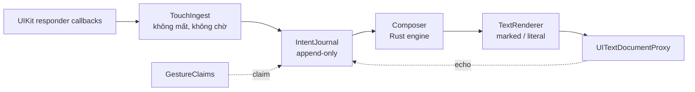

# Funput iOS Input Pipeline 3.0

> **Trạng thái:** Đề xuất kiến trúc — chưa hiện thực, chưa có số đo thiết bị
> **Phạm vi:** Từ UIKit touch delivery đến document commit trong keyboard extension
> **Ngày:** 06/08/2026
> **Thay thế:** `PressArbiter` + deadline scheduler của [Pipeline 2.0](INPUT_PIPELINE_2_ARCHITECTURE.md)
> **Giữ nguyên:** Rust engine, layout, theme renderer, suggestion engine, `ContactResolver`
> **Tham chiếu ngoài:** [azooKey](https://github.com/azooKey/azooKey) (MIT) — bộ gõ tiếng Nhật cho iOS, đã đọc source ở commit `main` ngày 03/08/2026

---

## 1. Tóm tắt quyết định

Pipeline 3.0 tách **nhận phím** khỏi **xử lý phím**, và chuyển việc sửa thứ tự từ *chờ trước khi hiển thị* sang *sửa sau khi hiển thị*.

1. **Ingest không bao giờ mất phím và không bao giờ chờ.** Mọi `touchesEnded` sinh ra đúng một `KeyIntent` được ghi vào journal. Không có nhánh nào trong tầng nhận được phép bỏ qua một cú nhả.
2. **Journal là nguồn sự thật duy nhất về thứ tự.** Append-only, giữ `downTime`/`upTime` thật của từng contact.
3. **Không có deadline, không có `Timer` trên hot path.** `PressArbiter` và `RunLoopDeadlineScheduler` bị xoá.
4. **Thứ tự được sửa hồi tố trong vùng marked text**, vốn chưa commit nên sửa được bằng đúng một lần ghi, không nhấp nháy.
5. **Vùng sửa hồi tố có biên cứng:** chỉ trong âm tiết đang mark. Đã `unmarkText` là đóng, không rewrite.
6. **Hai đường ghi document**, chọn bằng setting, theo mô hình đã được azooKey chứng minh trong production.
7. **Mọi ca mất phím đã biết đều được đóng ở tầng ingest**, độc lập với quyết định marked text.

Kết quả kỳ vọng: độ trễ thêm vào đường gõ thông thường = **0 ms**; thứ tự đúng trong ca hai ngón chồng nhau; không còn phím biến mất.

---

## 2. Vấn đề của 2.0

### 2.1. Chẩn đoán lại: "9 chặng" không phải nguyên nhân chậm

Với một cú tap một ngón, cả 9 chặng của 2.0 chạy **đồng bộ trong đúng một callback `touchesEnded`** — không `Task`, không hàng đợi, tính bằng micro giây. Số tầng code không phải số lần chờ.

Toàn pipeline chỉ có **một** chỗ cố tình chờ: `PressArbiter.drain` chặn khi head còn `.active` và có follower đã resolved ([PressArbiter+Drain.swift](../Packages/FunputKit/Sources/KeyboardTouchCore/Arbitration/PressArbiter+Drain.swift)).

### 2.2. Arbiter mua được rất ít

Phân tích luật chặn theo từng kịch bản:

| Kịch bản | Có bị chặn? |
|---|---|
| Một ngón | Không — hàng đợi chỉ một entry |
| A xuống → B xuống → A nhả → B nhả | Không — A là head và resolved trước |
| A xuống → B xuống → **B nhả** (A còn giữ) | **Có** |

Và ngay trong ca bị chặn: nếu A không nhả kịp `rolloverWindow`, A bị đẩy sang `detached`, B phát ra trước — **đúng bằng kết quả của việc không có arbiter, chỉ chậm hơn 40 ms**.

Giá trị thật gói gọn trong: *hai ngón chồng nhau, nhả đảo thứ tự, và ngón đầu nhả trong vòng 40 ms sau ngón sau*. Chi phí là một `Timer` trên `RunLoop.main` mode `.common` — cơ chế không đúng giờ; khi run loop bận render, hẹn 40 ms bắn ra 80–120 ms. Counter `emissionDelayedOver120Milliseconds` tồn tại đúng vì lý do đó.

Con số 40 ms chưa bao giờ được đo — §19.1 của 2.0 vẫn để mở, comment trong code tự nhận *"a starting point, not a measured value"*.

### 2.3. Ba ca mất phím thật, không ca nào do arbiter

Đã soi `resolve`/`cancel`/`reset`/`flushResolved`: arbiter **không** nuốt press nào mà ngón đã nhấc. Mất phím nằm ở tầng nhận:

| # | Ca | Trạng thái | Counter |
|---|---|---|---|
| L1 | Chạm vào khe giữa thanh gợi ý và hàng phím đầu | **Không phải bug.** `KeyboardTrackingBounds.resolve` đặt `minY = toolbar.maxY`, tức phím sở hữu trọn khoảng hở xuống hàng đầu; phần 12 pt bị cắt nằm *bên trong* toolbar và cắt nó là đúng. `beganOutside` chỉ tăng cho role ngoài `touchRoles`, mà role duy nhất thiếu (`.clipboard`) nằm trong toolbar chứ không trong `geometry.keys`. Bản nháp đầu của mục này khẳng định ngược lại — sai | — |
| L2 | UIKit tái sử dụng object `UITouch` | **Chưa xác minh.** `identities.begin` trả `stale` → sinh sample `.cancelled` → huỷ press đang chờ. Đường code có thật nhưng chưa có bằng chứng nó bắn trong thực tế; huỷ contact cũ là hợp lý khi terminal callback thật sự mất. Đã bật `captureStaleIdentity` để đo | `captureStaleIdentity` |
| L3 | Đổi layout (`?123`, `abc`, đổi Telex/VNI) khi ngón khác còn giữ | **Đã sửa (06/08/2026).** `presentationDidChange` giờ gọi `suspendPresentation()` thay vì tháo dỡ contact; xem §9.6 của [2.0](INPUT_PIPELINE_2_ARCHITECTURE.md) | `contactsAbandoned` |

Bài học đắt nhất của mục này: **L1 được đưa vào danh sách bằng suy luận, không bằng đo đạc, và nó sai.** Đó chính là lý do §12 đặt bộ đếm bất biến lên trước mọi tầng mới — một counter rẻ hơn nhiều so với một chương kiến trúc dựng trên chẩn đoán hỏng.

---

## 3. Học được gì từ azooKey

azooKey là bộ gõ kana-kanji cho iOS, MIT, còn hoạt động — cùng lớp bài toán: nhiều phím ghép một ký tự, buffer đang soạn, sống chung với `UITextDocumentProxy`.

### 3.1. Hai đường ghi, chọn bằng setting — đã chạy production

`DisplayedTextManager` giữ `isMarkedTextEnabled` là **user setting**, không phải per-host detection, không hardcode:

```swift
public init(isLiveConversionEnabled: Bool, isMarkedTextEnabled: Bool)
public func updateSettings(isLiveConversionEnabled: Bool, isMarkedTextEnabled: Bool)
```

Bật → `setMarkedText`/`unmarkText`. Tắt → `moveCursor` + `deleteBackward` + `insertText` theo diff `commonPrefix`.

Ý nghĩa: `setMarkedText` **đã được chứng minh dùng được trên App Store**. Nhưng việc một bộ gõ trưởng thành vẫn giữ đường thứ hai nói rằng nó chưa đủ tin cậy để làm đường duy nhất.

### 3.2. Call site chính xác

```swift
self.proxy?.setMarkedText(text, selectedRange: NSRange(location: cursorPosition, length: 0))
```

`length: 0` — `selectedRange` được dùng làm **vị trí caret trong vùng mark**, không phải vùng chọn. Khác với ví dụ trong tài liệu Apple. Đây là cách dùng nên bắt chước.

### 3.3. Echo tracker của họ mạnh hơn của chúng ta

`ExpectedEditTracker` lưu tối đa 32 cặp `(before, after)` với `ObservedTextState` là **bộ ba** `(left, center, right)`, và `consume` biết **nối chuỗi** nhiều edit liên tiếp:

```swift
while endIndex + 1 < expectedEdits.endIndex, currentAfter == expectedEdits[endIndex + 1].before {
    endIndex += 1
    currentAfter = expectedEdits[endIndex].after
    if currentAfter == after { ... return .matched(hasMoreEdits: ...) }
}
```

`KeyboardDocumentSynchronizer` của Funput chỉ lưu **context trái** theo epoch, và chỉ khớp một bước. Khi host gộp nhiều edit thành một echo, ledger của Funput trượt còn của azooKey vẫn khớp. **Đây là nâng cấp nên lấy bất kể có đổi sang marked text hay không.**

### 3.4. Ẩn số #1 — bằng chứng mâu thuẫn, phải tự đo

azooKey chứa hai đoạn hàm ý ngược nhau về việc marked text có xuất hiện trong `documentContextBeforeInput` không.

**Hàm ý CÓ** — họ dự đoán state sau `setMarkedText` bằng cách chèn marked text vào `left`/`right`, rồi dùng đúng dự đoán đó để khớp echo. Nếu sai, echo detection của họ sẽ hỏng:

```swift
private func observedStateByApplyingMarkedText(_ markedText: String, selectedRange: NSRange, to before: ObservedTextState) -> ObservedTextState {
    .init(left: before.left + leftMarkedText, center: "", right: rightMarkedText + before.right)
}
```

**Hàm ý KHÔNG** — hàm lấy context "không tính phần đang soạn" chỉ cắt bỏ composing text khi marked text **tắt**:

```swift
if ignoreComposition, !self.isMarkedTextEnabled {
    if leftText.hasSuffix(possibleSuffix) { return String(leftText.dropLast(possibleSuffix.count)) }
```

Nếu marked text nằm trong context, nhánh `isMarkedTextEnabled == true` cũng phải cắt — mà nó không cắt.

**Kết luận:** một trong hai là bug của azooKey. Bằng chứng từ echo tracker mạnh hơn (nó chạy mỗi phím, sai là hỏng ngay), nên **giả định làm việc: marked text CÓ xuất hiện trong context**. Nhưng đây vẫn là ẩn số phải đo — xem §9.

### 3.5. Hai vết thương iOS 16 họ ghi lại

- `rawDeleteForward` mang TODO: *"iOS16以降のテキストフィールドの仕様変更で動かなくなっている"* — đường không-marked-text đã xuống cấp từ iOS 16.
- `adjustLeftString` chỉ lấy dòng cuối sau `\n`, vì iOS 16 đổi cách `documentContextBeforeInput` trả về.

### 3.6. Điều azooKey **không** giải: rollover

Mỗi phím là một view SwiftUI riêng với `DragGesture(minimumDistance: .zero)`, commit ở `.onEnded`. Không có tầng nào sắp thứ tự giữa các phím. Hamster và KeyboardKit cũng vậy.

**Không dự án mã nguồn mở nào xử lý rollover đa ngón.** Không có gì để chép cho phần này — nhưng cũng xác nhận độ phức tạp của Funput không phải tự bày ra.

---

## 4. Mục tiêu và không phải mục tiêu

### 4.1. Bắt buộc

- Mỗi `touchesEnded` trên vùng bàn phím sinh đúng một `KeyIntent`. Không ngoại lệ.
- Độ trễ thêm vào bởi pipeline ở đường gõ thông thường: **0 ms**, không hẹn giờ.
- Thứ tự đầu ra khớp thứ tự chạm xuống, trong phạm vi vùng chưa commit.
- Đổi layout / theme / suggestion không huỷ contact đang hoạt động.
- Không commit hai lần sau cancel hoặc reset.
- Hot path đồng bộ trên `MainActor`, không `Task`, không I/O theo từng phím.
- Không log nội dung người dùng; không cần Full Access.

### 4.2. Không phải mục tiêu

- Viết lại Rust engine hoặc luật Telex/VNI.
- Bảo đảm thứ tự vật lý cho hai contact có `timestamp` bằng nhau — UIKit không cung cấp đủ thông tin.
- Sửa thứ tự vượt qua ranh giới đã commit.
- Swipe typing, dictionary prediction.
- Giả lập hành vi private của bàn phím hệ thống.

---

## 5. Invariants

### 5.1. Ingest

- **I1.** Với mọi contact đã `began` trong `trackingRegion`: có đúng một terminal event (`ended` hoặc `cancelled`) sinh ra đúng một bản ghi journal.
- **I2.** Không nhánh nào trong ingest được `return` im lặng khi gặp contact lạ. Contact lạ ở phase `ended` phải được phục hồi hoặc đếm, không được bỏ.
- **I3.** Danh tính contact sống sót qua thay đổi layout, theme và geometry.

### 5.2. Journal

- **J1.** Append-only. Không sửa `downTime`, `upTime`, `key` sau khi ghi.
- **J2.** `intentSeq` đơn điệu tăng, không tái sử dụng.
- **J3.** Journal bị cắt (prune) chỉ khi vùng tương ứng đã commit.

### 5.3. Ordering

- **O1.** Buffer engine luôn là kết quả của việc chạy journal theo thứ tự `downTime` tăng dần (tie-break bằng `intentSeq`).
- **O2.** Nếu một intent được chèn vào vị trí sớm hơn intent đã áp dụng, và toàn bộ vùng ảnh hưởng còn chưa commit, buffer được tính lại và ghi lại bằng **một** lần ghi document.
- **O3.** Nếu vùng ảnh hưởng đã commit, intent được nối vào cuối. Không rewrite.

### 5.4. Document

- **D1.** Mỗi lần drain sinh tối đa một lần ghi document.
- **D2.** Mọi lần ghi đều được ghi vào echo ledger trước khi trả điều khiển.
- **D3.** Echo từ host không bao giờ được phép clear composer nếu nó khớp một chuỗi edit đã ghi.

---

## 6. Kiến trúc



| Tầng | Trách nhiệm | Cấm |
|---|---|---|
| `TouchIngest` | UITouch → `ContactSample`, hit-test, cấp danh tính | Chờ, bỏ qua contact, gọi engine |
| `IntentJournal` | Thứ tự, exactly-once, biên commit | Biết Telex/VNI, chạm UIKit |
| `GestureClaims` | Vuốt, giữ, lặp phím | Ghi document trực tiếp |
| `Composer` | Chạy journal qua engine, sinh buffer | Render UI |
| `TextRenderer` | Buffer → marked text hoặc delete/insert | Suggestion, theme |

Khác biệt cốt lõi so với 2.0: **`PressArbiter` biến mất**. Nơi giữ thứ tự không còn là một hàng đợi có thể chặn, mà là một journal không bao giờ chặn.

---

## 7. TouchIngest — trạng thái các ca mất phím

### 7.1. L1 — không phải bug, đã loại

Bản nháp đầu của mục này đề xuất "chia đôi khoảng hở" giữa toolbar và hàng phím đầu, dựa trên giả định có vùng chết. Kiểm chứng lại: **không có vùng chết.** `KeyboardTrackingBounds.resolve` đặt `minY = toolbar.maxY`, nên phím đã sở hữu trọn khoảng hở; phần bị cắt nằm bên trong toolbar, và cắt nó là đúng — nếu không thì slack của phím sẽ nuốt mép dưới của mọi gợi ý.

Không sửa gì. Giữ mục này lại làm bản ghi để không ai đề xuất lại.

### 7.2. L2 — `UITouch` bị tái sử dụng (chờ số đo)

`identities.begin` trả `stale` và ingest sinh một sample `.cancelled` — huỷ press đang chờ của contact cũ. Đường code có thật, nhưng chưa có bằng chứng nó bắn trong thực tế, và huỷ contact cũ là hợp lý khi terminal callback thật sự mất.

Đã bật counter `captureStaleIdentity` thay vì đổi chính sách theo suy đoán. Nếu số đo cho thấy nó bắn thật, 3.0 sẽ đổi: contact cũ đã có bản ghi trong journal thì bản ghi đó **giữ nguyên**; sample `.cancelled` chỉ dọn state của tầng nhận. Một object `UITouch` tái sinh không phải bằng chứng người dùng huỷ phím trước đó.

### 7.3. L3 — đã sửa (06/08/2026)

Ca duy nhất được xác nhận, và đã đóng **không cần đến journal**.

`presentationDidChange` trước đây gọi ba việc liền nhau: `forgetTrackedTouches()`, `cancelAll()`, `resetTouchPipeline(flushingResolvedPresses: true)`. Giờ chỉ còn `interactionController.suspendPresentation()` + `rebuildKeys()`.

Nguyên tắc đã áp dụng — tách **geometry** khỏi **danh tính**:

- Danh tính contact (`ObjectIdentifier(UITouch) → ContactID`) không bị xoá bởi thay đổi presentation. Chỉ xoá khi contact kết thúc thật, hoặc khi keyboard rời window.
- Mỗi contact giữ geometry snapshot của thời điểm nó bắt đầu — cơ chế `geometries[id]` vốn đã có, chỉ cần ngừng xoá.
- Ngón nhấc sau khi layout đổi vẫn commit vào phím nó đã chạm.

Hệ quả đã thực hiện: `flushResolvedPresses()`, `PressArbiter.flushResolved()` và counter `flushedOnLayoutChange` **đã bị gỡ khỏi source**. Không còn press nào bị giữ qua teardown thì không còn gì để flush.

**Đáng chú ý cho phần còn lại của tài liệu này:** L3 được đóng bằng cách gỡ bỏ một lệnh tháo dỡ, không phải bằng cách thêm tầng. Trước khi dựng `IntentJournal` ở §8, nên hỏi lại xem số đo có thật sự đòi hỏi nó không.

---

## 8. IntentJournal — thứ tự không cần chờ

### 8.1. Dữ liệu

```swift
struct KeyIntent: Sendable {
    let intentSeq: UInt64
    let contactID: ContactID
    let downTime: TimeInterval      // UITouch.timestamp lúc began
    let upTime: TimeInterval        // UITouch.timestamp lúc ended
    let key: KeySpec
    let outcome: Outcome            // .released | .alternate(_) | .swiped(_) | .repeated
}

struct IntentJournal {
    private(set) var applied: [KeyIntent]     // đã đi qua engine
    private(set) var committedBoundary: Int   // chỉ số đầu tiên còn sửa được
}
```

`committedBoundary` là ranh giới cứng: mọi intent trước nó đã `unmarkText`, không rewrite.

### 8.2. Thuật toán

1. Contact `ended` → tạo `KeyIntent` → **phát ngay**, không điều kiện, không chờ.
2. So `downTime` của intent mới với intent cuối trong `applied`:
   - `downTime` lớn hơn → nối vào cuối, chạy engine tăng dần. Đường thông thường.
   - `downTime` **nhỏ hơn** → có đảo thứ tự. Sang bước 3.
3. Tìm vị trí chèn đúng theo `downTime`. Nếu vị trí đó `>= committedBoundary`:
   - chèn, **replay** journal từ `committedBoundary` qua engine,
   - ghi lại bằng đúng một `setMarkedText`.
   
   Nếu vị trí đó `< committedBoundary`: nối vào cuối, tăng `reorderRefused`. Không rewrite.
4. Gặp ranh giới từ (space, dấu câu, Enter): `unmarkText()`, đặt `committedBoundary = applied.count`, prune.

Không có deadline ở bất kỳ bước nào. Không có `Timer`.

### 8.3. Vì sao replay là rẻ

Engine Rust chạy lại một âm tiết là vài chục thao tác trên buffer ngắn — bậc micro giây, đã có benchmark trong `app/benchmarks`. Replay chỉ chạy khi thật sự có đảo thứ tự, tức là hiếm. Đường thông thường không replay lần nào.

### 8.4. Vì sao không nhấp nháy

`setMarkedText` **thay thế toàn bộ vùng mark** bằng một lời gọi. Không `deleteBackward` rồi `insertText`. Người dùng không thấy bước trung gian — khác hẳn việc sửa thứ tự trên văn bản đã commit.

**Đây là lý do 3.0 phụ thuộc marked text.** Nếu chạy ở chế độ literal, reorder phải tắt (xem §10.2).

---

## 9. TextRenderer — hai đường ghi

### 9.1. Đường marked text (mặc định đề xuất)

```swift
proxy.setMarkedText(buffer, selectedRange: NSRange(location: caretUTF16, length: 0))
```

- `caretUTF16` tính bằng `NSString.length` của phần trước caret — **không** dùng `String.count`. azooKey dùng `NSString`; UTF-16 là đơn vị của `NSRange`, và tiếng Việt tổ hợp sẽ lệch nếu dùng `Character`.
- Ranh giới từ → `unmarkText()`.
- Đổi field / mất focus / có selection → `unmarkText()` rồi reset.

### 9.2. Đường literal (fallback)

Giữ nguyên `InputTransaction` của 2.0. Reorder bị **tắt** ở chế độ này — §8.2 bước 3 luôn rơi vào nhánh "nối vào cuối". Ghi rõ trong UI setting rằng chế độ này không sửa được thứ tự.

### 9.3. Chọn đường

Theo azooKey: **user setting**, không phải per-host detection. Lý do: chưa có dữ liệu host nào hỏng, và dựng `CompositionCompatibilityPolicy` kiểu Android khi chưa biết gì là đoán mò. Khi có dữ liệu thật từ người dùng, mới thêm danh sách host.

### 9.4. Echo ledger — nâng cấp theo azooKey

Thay `KeyboardDocumentSynchronizer` epoch/context-trái hiện tại bằng mô hình bộ ba:

```swift
struct ObservedTextState: Equatable { let left, center, right: String }
```

- Ghi `(before, after)` quanh **mọi** lần ghi document, tối đa 32 cặp.
- `consume` hỗ trợ **nối chuỗi**: khi host gộp nhiều edit thành một echo, dò tiếp qua các cặp liên tiếp thay vì bỏ cuộc.
- Trả `.matched(hasMoreEdits:)` để caller biết còn echo đang trên đường.

Nâng cấp này **độc lập với marked text** và nên làm trước, vì nó đóng đúng nhóm bug "composer bị clear giữa từ" ở §2.1 của 2.0.

---

## 10. Rủi ro

### 10.1. Marked text có thể không nằm trong `documentContextBeforeInput`

Bằng chứng trong azooKey mâu thuẫn (§3.4). Nếu marked text **không** xuất hiện trong context:

- invariant "buffer engine là hậu tố của context trước caret" mất nghĩa ở chế độ marked;
- echo ledger phải so sánh trên state đã trừ vùng mark;
- personal suggestion đọc `documentContextBeforeInput` sẽ không thấy từ đang gõ.

**Không được viết một dòng code v3 nào trước khi đo xong việc này.** Đây là điều kiện tiên quyết, không phải rủi ro nền.

### 10.2. Reorder chỉ chạy được ở chế độ marked

Người dùng chọn chế độ literal sẽ mất tính năng sửa thứ tự. Chấp nhận, nhưng phải nói rõ trong Settings — không được để hai chế độ trông như nhau mà hành vi khác.

### 10.3. Host không tôn trọng `setMarkedText`

Chưa có dữ liệu. Mitigation là setting ở §9.3 cộng với một counter đếm số lần `documentContextBeforeInput` không khớp dự đoán sau khi ghi marked text.

### 10.4. Bỏ arbiter đổi hành vi ở ca ngón tì lâu

2.0 §18.1 đã ghi nhận. 3.0 đổi theo hướng khác: thay vì bypass sau 40 ms, intent được phát ngay rồi sửa sau nếu cần. Ca xấu nhất của 3.0 (đảo thứ tự vượt biên commit) tương đương ca thường của 2.0 sau khi hết window.

### 10.5. Replay có thể lộ ra bug engine

Chạy lại cùng chuỗi phím phải cho cùng kết quả. Đây là tính chất đã có hạ tầng kiểm chứng: bộ differential testing 70k chuỗi phím trong `app/benchmarks`. Thêm một property test: replay journal cho kết quả bằng với gõ tuần tự.

---

## 11. Kế hoạch triển khai

Ba phase độc lập. **Phase 0 phải xong và xanh trước khi bắt đầu Phase 2.**

### Phase 0 — Đóng các ca mất phím *(không phụ thuộc gì)* — **ĐÃ XONG 06/08/2026**

- ~~Sửa `KeyboardTrackingBounds` (L1)~~ — không phải bug, đã loại khỏi phạm vi (§7.1).
- L2 — đổi chính sách stale `UITouch`: **hoãn**, bật `captureStaleIdentity` để đo trước (§7.2).
- L3 — tách danh tính khỏi geometry trong `presentationDidChange`: **đã sửa** bằng
  `suspendPresentation()`; test hồi quy đỏ trên HEAD rồi mới xanh.
- Bộ đếm bất biến `contactsAbandoned` + `captureStaleIdentity`, có trong `hasRegression`
  và trong báo cáo harness.
- Dọn kèm: `flushResolvedPresses()`, `PressArbiter.flushResolved()`, counter
  `flushedOnLayoutChange` và các thư mục rỗng còn sót từ Phase 3C của 2.0.

Còn lại: xác nhận trên thiết bị thật (giữ một ngón, bấm `?123`, đọc `contactsAbandoned`).

Bài học: hai trong ba ca ban đầu **không đứng vững khi kiểm chứng**. Phase 0 đáng giá không
phải vì nó sửa được ba thứ, mà vì nó thay ba suy đoán bằng một bản sửa có bằng chứng và hai
counter.

### Phase 1 — Nâng cấp echo ledger *(không phụ thuộc marked text)*

- `ObservedTextState` bộ ba + `consume` nối chuỗi, theo §9.4.
- Giữ nguyên đường ghi literal.
- Test: dựng lại các ca echo trễ ở §11.3 của 2.0.

### Phase 2 — Prototype marked text *(cổng quyết định)*

Trả lời ba câu, trên thiết bị thật, trong Notes / Safari / Messages / Zalo / Messenger:

1. `documentContextBeforeInput` có chứa vùng mark không?
2. Host nào không tôn trọng `setMarkedText`?
3. `unmarkText` ở ranh giới từ có để lại đúng văn bản không?

**Nếu (1) trả lời là "không chứa"**, dừng lại và thiết kế lại §9.4 trước khi đi tiếp.

### Phase 3 — Journal + xoá arbiter

- Hiện thực `IntentJournal`, xoá `PressArbiter`, `PressArbiterDriver`, `RunLoopDeadlineScheduler`.
- Đường literal giữ nguyên hành vi, reorder tắt.
- Test: property test replay; device harness đo lại toàn bộ counter.

---

## 12. Telemetry

Đã gỡ (06/08/2026, cùng bản sửa L3): `flushedOnLayoutChange`.

Bỏ khi xoá arbiter: `arbiterBypassCount`, `maximumBypassHoldMilliseconds`, `staleTimerCallback`, `emissionDelayedOver40Milliseconds`, `emissionDelayedOver120Milliseconds`.

Giữ: `beganOutside`, `captureUnknownCallback`, `systemCancelled`, `ownershipViolation`, `gestureConflict`, `layoutChangedWhileActive`.

Đã thêm (06/08/2026): `contactsAbandoned`, `captureStaleIdentity` — xem §7.

Còn lại phải thêm:

| Counter | Đo gì | Ngưỡng chấp nhận |
|---|---|---|
| `intentsRecorded` / `terminalCallbacks` | Bất biến I1 | phải bằng nhau, tuyệt đối |
| `reorderApplied` | Số lần replay vì đảo thứ tự | dữ liệu, không có ngưỡng |
| `reorderRefused` | Đảo thứ tự vượt biên commit | dữ liệu |
| `markedTextContextMismatch` | Context sau ghi không khớp dự đoán | 0 |
| `maximumIngestToWriteMicroseconds` | Trễ hot path | không có `Timer` nên phải rất nhỏ |

`hasRegression` mới: `intentsRecorded != terminalCallbacks || captureUnknownCallback > 0 || systemCancelled > 0 || ownershipViolation > 0 || markedTextContextMismatch > 0`.

---

## 13. Definition of Done

- Ba ca mất phím có test tái hiện được, và test đó đỏ trước khi sửa.
- `intentsRecorded == terminalCallbacks` trên toàn bộ device acceptance matrix.
- Không còn `Timer` nào trên đường đi từ chạm tới ghi document.
- `PressArbiter` và scheduler bị xoá khỏi cây source, không còn dead code.
- Ẩn số §10.1 đã có câu trả lời bằng đo đạc, và tài liệu này được cập nhật theo câu trả lời đó.
- [ARCHITECTURE.md](ARCHITECTURE.md) và [INPUT_PIPELINE_2_ARCHITECTURE.md](INPUT_PIPELINE_2_ARCHITECTURE.md) trỏ sang tài liệu này.

---

## 14. Các quyết định còn mở

1. Vùng chết ở §7.1: chia đôi khoảng hở, hay để toolbar tự thu hitbox của nó?
2. Journal có nên giữ cả intent đã commit để phục vụ retone sau Backspace, hay tiếp tục dùng `Engine::adopt`?
3. Reorder ở chế độ literal: tắt hẳn, hay cho phép khi vùng ảnh hưởng ngắn hơn N ký tự?
4. Setting marked text nên mặc định bật hay tắt ở bản phát hành đầu?
5. Có nên đưa `IntentJournal` thành SwiftPM target riêng như `KeyboardTouchCore`, hay chỉ là folder?

---

## 15. Kết luận

Pipeline 2.0 đúng ở chỗ tách ownership và làm mỗi tầng kiểm chứng được độc lập. Chỗ nó sai là **cách giữ thứ tự**: nó chờ trước khi hiển thị, nên phải có deadline, nên phải có `Timer`, nên phải có `flushResolved` khi teardown — một chuỗi hệ quả bắt đầu từ giả định rằng văn bản đã hiển thị thì không sửa được.

Giả định đó chỉ đúng khi ghi bằng `insertText`. Với marked text, nó sai.

3.0 lật lại: **nhận hết, hiện ngay, sửa sau trong vùng chưa chốt.** Đúng như yêu cầu "Funput phải nhận phím đầy đủ, sau đó mới xử lý".

Nhưng phần lớn nỗi đau hiện tại không nằm ở đó. Nó nằm ở ba ca mất phím trong Phase 0 — sửa được ngay, không cần chờ quyết định kiến trúc nào.
