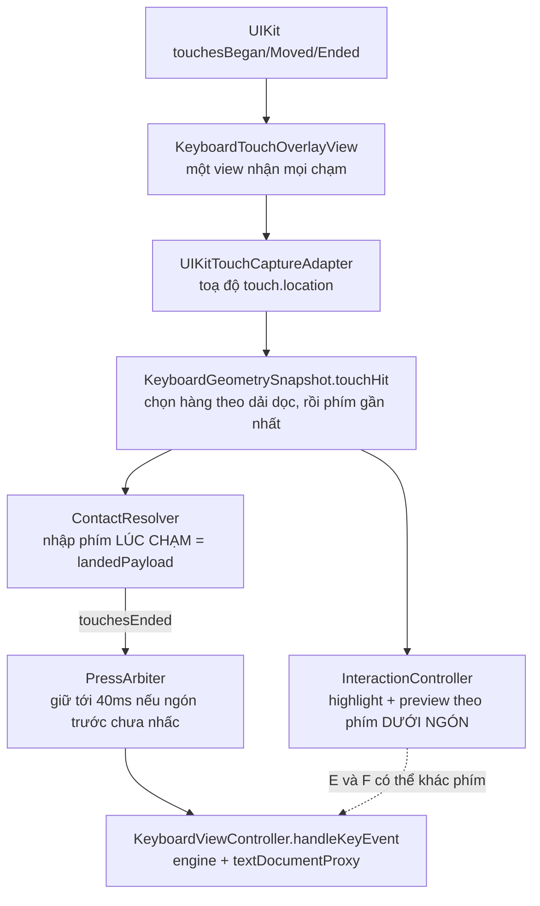

# Điều tra: phím iOS không nhạy và gõ nhầm phím

> **Trạng thái:** Điều tra xong. §7.1–7.4 đã hiện thực trên nhánh `fix/ios-system-key-recognition` (§7.5).
> **Ngày:** 16/09/2026
> **Phạm vi:** Từ lúc ngón tay chạm màn hình đến lúc Funput quyết định phím nào được nhập, trong keyboard extension iOS.
> **Liên quan:** [INPUT_PIPELINE_2_ARCHITECTURE.md](INPUT_PIPELINE_2_ARCHITECTURE.md) và [INPUT_PIPELINE_3_ARCHITECTURE.md](INPUT_PIPELINE_3_ARCHITECTURE.md) chỉ bàn về *mất phím* và *thứ tự phím*, không bàn *đúng phím*. Xem §6.

---

## 1. Tóm tắt

**Báo cáo:** người dùng chuyển từ bàn phím hệ thống (Telex/VNI) sang Funput thấy phím "không nhạy" và "không ra đúng phím mình bấm". Maintainer dùng Funput hằng ngày và xác nhận triệu chứng.

**Nguyên nhân chính (đã đo):** Funput nhận diện phím **khác cơ chế của bàn phím hệ thống**.

| | Bàn phím iOS | Funput hiện tại |
|---|---|---|
| Phím được nhập | Phím dưới ngón **lúc nhấc** | Phím dưới ngón **lúc chạm xuống** |
| Trượt từ "h" sang "j" rồi thả | ra **j** | ra **h** |
| Chỗ đổi phím khi trượt | Ngay khi qua ranh giới vùng chạm, không có vùng đệm | Không đổi |
| Highlight / bóng phím phóng to khi trượt | Theo phím sẽ được nhập | Theo phím dưới ngón, **khác** phím được nhập |

Người quen iOS thấy chữ sai trên bóng phím thì trượt sang phím đúng rồi thả. Trên Funput cú trượt đó không có tác dụng, và bóng phím còn hiện chữ khác với chữ được nhập.

**Giải pháp đề xuất làm ngay (§7):** đổi cơ chế nhận diện phím về giống iOS. Nhập phím dưới ngón lúc nhấc, highlight và preview đi cùng một quyết định. Kèm 3 chỉnh nhỏ rủi ro thấp: phím cách lấn hàng trên, ưu tiên chạm ở mép màn hình, mốc nhấn giữ. Không cần đo với người dùng trước khi làm.

---

## 2. Cách điều tra

| Nguồn | Làm gì |
|---|---|
| Code | Đọc toàn bộ đường đi chạm → phím trên `main` (khoảng 3.500 dòng trong `KeyboardTouchCore`, `KeyboardTouchUIKit`, `KeyboardRenderer/Interaction`). |
| Thí nghiệm | XCUITest điều khiển **bàn phím hệ thống iOS 27** và **Funput** với cùng thao tác (§3). Probe là file tạm, đã xoá, không commit. |
| Đo hình học | Chụp và đo từng phím của bàn phím Telex/VNI iOS và Funput trên máy 402/420/440pt (đợt đo cho PR [#395](https://github.com/Funput/Funput/pull/395)). |
| Tài liệu Apple | `UIInputViewController`, *Creating/Configuring a custom keyboard*, HIG *Virtual keyboards*, `UITouch`, `UIEvent.coalescedTouches`, `preferredScreenEdgesDeferringSystemGestures`, `UIInputViewAudioFeedback`. |
| Nghiên cứu ngoài | Patent của Apple về vùng chạm dự đoán; Holz & Baudisch, *Understanding Touch* (CHI 2011). |
| Lịch sử | Các commit sửa lỗi chạm từ 07/2026; tài liệu Pipeline 2.0/3.0; nhánh chưa merge `fix/ios-spacebar-touch-reach`. |

Tài liệu công khai của Apple **không mô tả** cách bàn phím hệ thống chọn phím. Hành vi ở §3 là quan sát trực tiếp bàn phím hệ thống, không suy ra từ tài liệu.

---

## 3. Bàn phím hệ thống chọn phím thế nào — kết quả đo

**Điều kiện đo:**
- iPhone 17 simulator, iOS 27, bàn phím tiếng Anh hệ thống. Không dùng Telex vì bộ ghép dấu làm nhiễu kết quả; cơ chế chọn phím giống nhau.
- Ô nhập là harness gõ phím (`-uitest-typing-harness`), đã tắt autocorrect.
- XCUITest tổng hợp chạm: chạm tâm phím, giữ 50ms, kéo tới đích, nhấc.
- Vùng accessibility của "h" rộng 39,7 × 54pt, tức phủ cả khoảng hở giữa các phím. Ranh giới h/j ở tâm "h" + 19,8pt.

### 3.1. Trượt ngón

| Thao tác từ tâm "h" | iOS | Funput |
|---|---|---|
| Chạm tại chỗ | h | h |
| Trượt +8pt / +14pt / +18pt | h | h |
| Trượt +19pt | **j** | h |
| Trượt +20 / +21 / +22 / +23pt | **j** | h |
| Trượt tới tâm "j" | **j** | h |
| Trượt lên tâm "y" (hàng trên) | **y** | h |

**Kết luận:** iOS nhập phím dưới điểm nhấc, kể cả khi điểm đó ở hàng khác. Phím đổi ngay khi qua ranh giới vùng chạm (khoảng 19pt từ tâm, trong khi ranh giới vùng là 19,8pt). **Không có vùng đệm chống lăn ngón.**

### 3.2. Nhấn giữ nguyên âm (bảng dấu)

| Thao tác trên "e" | iOS |
|---|---|
| Giữ 0,3 / 0,45 / 0,6 / 1,0s rồi thả tại chỗ | e |
| Giữ 1s, lăn 14pt rồi thả | e |
| Giữ 1s, kéo xa khỏi phím và bảng dấu rồi thả | **không nhập gì** |

**Kết luận:** thả ngoài bảng dấu thì iOS huỷ. Funput làm giống vậy ([KeyboardAlternatePaletteLayout.swift:88](../Packages/FunputKit/Sources/KeyboardRenderer/Keys/Preview/KeyboardAlternatePaletteLayout.swift)), **không phải lỗi**. Thí nghiệm này chưa xác định được iOS mở bảng sau bao lâu.

---

## 4. Đường đi của một cú chạm trong Funput

**Tìm phím:** [KeyboardGeometrySnapshot.swift](../Packages/FunputKit/Sources/KeyboardTouchUIKit/Geometry/KeyboardGeometrySnapshot.swift) và [KeyboardRowBands.swift](../Packages/FunputKit/Sources/KeyboardTouchUIKit/Geometry/KeyboardRowBands.swift).
- Chọn hàng theo dải dọc, khoảng hở giữa hai hàng chia đôi.
- Trong hàng, chọn phím gần nhất.
- Vùng chạm vì vậy phủ kín khoảng hở, **giống iOS** (vùng accessibility 39,7 × 54pt ở §3). Phần này không cần đổi.

**Quyết định phím:** [ContactResolver.swift](../Packages/FunputKit/Sources/KeyboardTouchCore/Resolution/ContactResolver.swift).
- Lưu `landedPayload` lúc chạm (dòng 20).
- Luôn trả về nó khi nhấc (dòng 108).
- Vị trí nhấc chỉ quyết định *có* nhập hay không.

**Phản hồi hình ảnh:** [KeyboardSurfaceInteractionController+Tracking.swift:134-142](../Packages/FunputKit/Sources/KeyboardRenderer/Interaction/Controller/KeyboardSurfaceInteractionController+Tracking.swift) đổi `currentKey`, highlight và preview sang phím dưới ngón.
- Riêng phím có cử chỉ vuốt ngang (phím cách) thì giữ phím ban đầu.

**Tham số:** [KeyboardTouchConfiguration.swift](../Packages/FunputKit/Sources/KeyboardRenderer/Interaction/Touch/KeyboardTouchConfiguration.swift).
- Mọi vai trò phím đều được "cứu" khi trượt quá 16pt hoặc nhấc ra ngoài vùng bàn phím.
- Không giới hạn thời gian nhấn.
- Cửa sổ rollover 40ms.

---

## 5. Phát hiện

### F1. Funput nhập phím lúc chạm, iOS nhập phím lúc nhấc — *Đã đo, nguyên nhân chính*

**Lịch sử:**
- Hành vi có từ commit `6ad62a37` (29/08/2026, *commit the key a press landed on, not the one it lifted over*).
- Commit đó sửa báo cáo của một người gõ không nhìn phím: "h" sau "k" ra "j", "s"/"f" ra "d". Lập luận là ngón lăn khi nhấc, nên điểm nhấc là lúc nhiễu nhất.
- Commit đảo ngược test `slideToCorrectUsesTerminalHit`, tức **trước đó Funput có hành vi giống iOS**.

**Vì sao nay nên quay lại hành vi iOS:**
- Người dùng Funput đến từ bàn phím iOS. Phản xạ "thấy sai, trượt sang phím đúng rồi thả" đã hình thành qua nhiều năm, và Funput đang phạt đúng phản xạ đó.
- iOS chấp nhận rủi ro lăn ngón mà không thêm vùng đệm (§3.1). Muốn cảm giác giống iOS thì phải chấp nhận cùng đánh đổi.
- Ca lỗi 29/08 không tái hiện được bằng hình học hiện tại. Ranh giới h/j cách tâm "h" khoảng 20pt, nên lệch 12pt từ tâm vẫn ra "h" dù dùng mô hình nào. Ca đó nhiều khả năng do ngón đáp lệch tâm, cũng là loại lỗi mà iOS có.

### F2. Highlight và key preview không khớp phím được nhập — *Code*

- **Hiện tượng:** ngón lăn từ "h" sang "j", bóng phím hiện **J**, chữ nhập ra **h**. Giao diện nói một đằng, kết quả một nẻo.
- **Tự khớp lại:** khi F1 chuyển sang nhập phím lúc nhấc, highlight và preview đang đi theo phím dưới ngón nên sẽ khớp với phím được nhập mà không cần sửa riêng.

### F3. Kích thước, khoảng cách hàng khác iOS — *Đã đo, đang xử lý ở PR #395*

| | iOS Telex | iOS VNI | Funput 100% |
|---|---|---|---|
| Bước hàng | 56 / 54pt | ~53 / ~51pt | ~50pt |
| Khoảng cách dọc | 11pt | 11pt | 7pt |
| Hàng số | không có | 0,85 hàng chữ | bằng hàng chữ |
| Khoảng cách ngang | 6pt | 6pt | 5pt |

PR #395 thêm "Kích thước phím: Giống hệ thống", khớp iOS trong khoảng 1pt mỗi hàng. Mặc định vẫn là "Funput".

### F4. Phím cách ăn vào hàng chữ phía trên (space→n) — *Đã sửa, chưa merge*

- **Nhánh:** `fix/ios-spacebar-touch-reach` (29/08/2026).
  - `KeyboardSpaceReach` cho phím cách lấn trọn khoảng hở + 4pt vào hàng chữ. Có test.
  - Cùng nhánh có bộ đo vị trí chạm `KeyboardAimTally`. Bộ này thêm trường cấu hình nên xung đột schema v13 của PR #395.
- **Liên quan F1:** phím cách có cử chỉ vuốt nên vẫn giữ phím lúc chạm sau khi đổi F1. Ca space→n thuần là hình học ở điểm chạm, và `KeyboardSpaceReach` giải đúng ca đó.

### F5. Chạm gần mép màn hình có thể bị hệ thống giữ lại — *Giả thuyết, sửa rẻ*

- **Hiện tượng đã biết:** hệ thống ưu tiên cử chỉ ở mép màn hình và có thể trì hoãn giao chạm cho app. Đã có báo cáo độ trễ này ở bàn phím bên thứ ba.
- **API Apple:** `preferredScreenEdgesDeferringSystemGestures` cho view controller khai báo mép nào cử chỉ của app được ưu tiên. `UIInputViewController` là một `UIViewController`.
- **Funput:** chưa khai báo thuộc tính này. Các phím sát mép (q, a, p, l, Shift, Xoá, 123, Enter) là ứng viên bị trễ.

### F6. `PressArbiter` giữ phím tới 40ms khi hai ngón chồng nhau — *Code, để sau*

- **Luật:** ngón chạm sau đã nhấc phải chờ ngón chạm trước tối đa 40ms ([PressArbiter+Drain.swift:18](../Packages/FunputKit/Sources/KeyboardTouchCore/Arbitration/PressArbiter+Drain.swift)).
- **Chưa có số đo:** comment trong code tự nhận 40ms là giá trị khởi điểm. Chưa biết bàn phím hệ thống xử lý chồng ngón thế nào.
- **Không nên gộp:** việc bỏ arbiter (Pipeline 3.0) lớn và độc lập với việc chữa sai phím.

### F7. Mốc nhấn giữ 0,35s — *Code*

- **Luật:** `a e i o u y d` mở bảng dấu sau 0,35s, và phím cách bắt đầu chế độ di con trỏ cũng sau 0,35s ([KeyHoldController.swift:20](../Packages/FunputKit/Sources/KeyboardRenderer/Interaction/Alternates/KeyHoldController.swift)).
- **So với UIKit:** mặc định của `UILongPressGestureRecognizer.minimumPressDuration` là 0,5s.
- **Rủi ro:** mốc sớm làm bảng dấu bật lên khi người dùng chỉ nhấn hơi chậm. Nếu ngón lăn xa lúc nhấc, phím bị huỷ (giống iOS, §3.2), nhưng trên Funput ca này dễ gặp hơn vì bảng mở sớm.

### F8. Không bù lệch điểm chạm, không có vùng chạm theo ngữ cảnh — *Để sau*

- **Apple:** patent US 8,232,973 mô tả phóng to *vô hình* vùng chạm của phím có khả năng được gõ tiếp. Bàn phím bên thứ ba không có API nào lấy được cơ chế này.
- **Nghiên cứu:** Holz & Baudisch cho thấy điểm chạm thô lệch có hệ thống khỏi điểm người dùng nhắm.
- **Hướng làm:** prior âm tiết tiếng Việt trong `funput-core`, chỉ áp ở dải sát biên phím. Đây là cải tiến *vượt* iOS, làm sau khi đã giống iOS.

---

## 6. Tình trạng các tài liệu cũ

| Tài liệu | Còn đúng | Lỗi thời / chưa làm |
|---|---|---|
| [INPUT_PIPELINE_2_ARCHITECTURE.md](INPUT_PIPELINE_2_ARCHITECTURE.md) | Mô tả `ContactResolver`, `PressArbiter`, recovery policy khớp code | Không bàn độ chính xác phím hay so sánh với iOS |
| [INPUT_PIPELINE_3_ARCHITECTURE.md](INPUT_PIPELINE_3_ARCHITECTURE.md) | Phase 0 (đóng 3 ca mất phím) đã xong | Phase 1–3 (echo ledger, marked text, xoá arbiter) chưa hiện thực |
| [ARCHITECTURE.md](ARCHITECTURE.md) | Nguyên tắc chung về hot path | Không có mục về độ chính xác chạm |

Các lần sửa trước (rollover, echo cũ, bỏ rơi chạm của UIKit) đều nhằm **mất phím**. Báo cáo lần này là **ra phím khác**, một vấn đề riêng.

---

## 7. Giải pháp làm ngay

Mục tiêu: **nhận diện phím giống bàn phím hệ thống.** Một PR, 4 thay đổi, xếp theo tác động.

### 7.1. Nhập phím dưới ngón lúc nhấc (F1, F2)

**Hành vi mới**, khớp §3.1:

| Tình huống | Phím được nhập |
|---|---|
| Nhấc trong vùng bàn phím | Phím dưới điểm nhấc, kể cả phím ở hàng khác |
| Nhấc ngoài vùng bàn phím (trượt lên vùng văn bản) | Phím lúc chạm. Giữ chính sách "cứu" hiện tại vì Funput không có dữ liệu iOS cho ca này và cứu tốt hơn mất phím |
| Phím có cử chỉ vuốt ngang (phím cách) | Phím lúc chạm, như hiện tại, để vuốt đổi ngôn ngữ và chống space→n |
| Bảng dấu đang mở | Theo bảng dấu, như hiện tại (§3.2) |

**Chỗ sửa:**
- `ContactResolver.end`: trả về `currentPayload` khi còn trong vùng, rơi về `landedPayload` khi `currentPayload == nil`. Cập nhật doc comment đầu struct cho đúng mô hình mới.
- **Chung một phím:** pipeline dùng hàm `eligibleHit(at:in:)` với cùng snapshot hình học mà overlay đã mượn, còn highlight/preview đọc `resolvedHit(at:)` trên đúng snapshot đó. Hai bên cho cùng một phím.
- **Khoá phím có cử chỉ:** phím có `horizontalSwipeAction` phải được khoá ở **pipeline** chứ không chỉ ở controller. Cách sạch nhất là pipeline không đổi `currentPayload` sang phím khác khi phím lúc chạm có cử chỉ vuốt, tương đương `lockedHit` cũ đã xoá ở `6ad62a37`.

**Test:**
- Khôi phục `slideToCorrectUsesTerminalHit`.
- Sửa các test đang chốt "landed".
- Thêm test phím cách không đổi sang "n" khi trượt lên.
- Thêm UI test Funput lặp lại đúng bảng §3.1: trượt +18pt ra "h", +22pt ra "j", tới "y" ra "y".

### 7.2. Phím cách lấn hàng trên (F4)

- **Lấy gì:** cherry-pick riêng `KeyboardSpaceReach` và test của nó từ `fix/ios-spacebar-touch-reach` (commit `7c562e87`).
- **Để lại:** phần bộ đo vị trí chạm (`6ebf0ac5`), vì phần đó đổi cấu hình và xung đột PR #395.

### 7.3. Ưu tiên chạm ở mép màn hình (F5)

- **Chỗ sửa:** `KeyboardViewController` override `preferredScreenEdgesDeferringSystemGestures` trả về `[.left, .right, .bottom]`.
- **Chi phí:** một thuộc tính, không ảnh hưởng logic.
- **Chỉ thử được trên máy thật:** simulator không tái hiện cử chỉ hệ thống. Sau khi cài, kiểm tra cảm giác phím q/a/p/l so với bản cũ. Vuốt Home vẫn hoạt động vì Apple không cho app chặn cử chỉ đó.

### 7.4. Mốc nhấn giữ 0,5s cho bảng dấu (F7)

- **Chỗ sửa:** bảng dấu chờ 0,5s, bằng mặc định long-press của UIKit.
- **Không đổi:** phím cách vẫn giữ 0,35s để vào chế độ di con trỏ. Nhấn chậm trên phím cách vẫn ra dấu cách nên không mất gì, còn đổi sang 0,5s sẽ làm cử chỉ này chậm đi và phá `SmartGestureUITests`, vốn giữ phím cách 0,45s rồi kéo.
- **Test:** test bảng dấu dùng scheduler giả (`runNext`) nên không phụ thuộc mốc thời gian.

### Không làm trong PR này

| Việc | Lý do |
|---|---|
| Bỏ hoặc hạ `PressArbiter` 40ms (F6) | Chưa biết iOS xử lý chồng ngón thế nào; thay đổi lớn, tách riêng |
| Bù lệch điểm chạm, prior ngôn ngữ (F8) | Vượt phạm vi "giống iOS"; làm sau |
| Đổi mặc định sang kích thước giống hệ thống (F3) | Quyết định sản phẩm, xem PR #395 |

### Rủi ro và cách kiểm

- **Rủi ro chính:** người gõ nhanh không nhìn phím có thể gặp lại ca lăn ngón của 29/08. Đây đúng là hành vi iOS và chấp nhận có chủ đích. Nếu có phản hồi, có thể thêm vùng đệm vài pt sau này mà không phải đổi lại mô hình.
- **Kiểm trước khi merge:**
  - test FunputKit và FunputTests;
  - UI test trượt ngón;
  - `KeyboardEdgeHitUITests`, `SmartGestureUITests`, `VietnameseTypingUITests`;
  - maintainer gõ thử trên máy thật.

---

### 7.5. Đã hiện thực

Nhánh `fix/ios-system-key-recognition`, tách từ `feat/ios-app-enhance` (PR #395):

| Commit | Mục |
|---|---|
| `docs(ios): investigate key accuracy against the stock keyboard` | Tài liệu này |
| `fix(ios): commit the key under the finger at lift, like the stock keyboard` | §7.1 |
| `fix(ios): wait for a real long press before opening the accent palette` | §7.4 |
| `fix(ios): let keyboard touches win at the screen edges` | §7.3 |
| `fix(ios): give the spacebar reach into the letter row above it` (cherry-pick `7c562e87`) | §7.2 |
| `test(ios): pin slide-to-correct against the stock keyboard` | UI test `KeyboardSlideToCorrectUITests` |

Chưa kiểm được trên simulator: tác dụng thật của §7.3 (cử chỉ hệ thống ở mép) và cảm giác gõ bằng ngón tay thật. Cần thử trên máy thật trước khi phát hành.

---

## 8. Quyết định đã chốt (16/09/2026)

1. **Không đo với người dùng trước.** Maintainer dùng Funput hằng ngày và xác nhận lỗi; thí nghiệm §3 đủ để sửa.
2. **Phạm vi:** làm cả 4 mục §7.1–7.4 trong một nhánh.
3. **Nhấc ngoài vùng bàn phím:** giữ "cứu" phím lúc chạm.
4. **Mốc nhấn giữ:** 0,5s cho bảng dấu, giữ 0,35s cho phím cách.

---

## 9. Nguồn

**Apple**

- [UIInputViewController](https://developer.apple.com/documentation/uikit/uiinputviewcontroller)
- [Creating a custom keyboard](https://developer.apple.com/documentation/uikit/creating-a-custom-keyboard)
- [Configuring a custom keyboard interface](https://developer.apple.com/documentation/uikit/configuring-a-custom-keyboard-interface)
- [Human Interface Guidelines — Virtual keyboards](https://developer.apple.com/design/human-interface-guidelines/virtual-keyboards)
- [UITouch.majorRadius](https://developer.apple.com/documentation/uikit/uitouch/1618106-majorradius), [UITouch.timestamp](https://developer.apple.com/documentation/uikit/uitouch/timestamp)
- [UIEvent.coalescedTouches(for:)](https://developer.apple.com/documentation/uikit/uievent/coalescedtouches(for:))
- [preferredScreenEdgesDeferringSystemGestures](https://developer.apple.com/documentation/uikit/uiviewcontroller/preferredscreenedgesdeferringsystemgestures)
- [UIInputViewAudioFeedback](https://developer.apple.com/documentation/uikit/uiinputviewaudiofeedback)

**Nghiên cứu, patent, ghi nhận cộng đồng**

- Holz & Baudisch, [Understanding Touch](https://static.siplab.org/papers/chi2011-understanding_touch.pdf), CHI 2011
- AppleInsider, [Apple granted patent for predictive text input UI](https://appleinsider.com/articles/12/07/31/apple_granted_patent_for_predictive_text_input_ui) (US 8,232,973)
- R0uter, [Delayed touches at screen edges in a keyboard extension](https://www.logcg.com/en/archives/3094.html)
- Igor Kulman, [Why iOS gestures lag at the screen edges](https://blog.kulman.sk/why-ios-gestures-lag-at-the-screen-edges/)

**Trong repo**

- Commit `6ad62a37` (nhập phím lúc chạm), `4c48bf7e` (chọn hàng trước phím gần nhất), `fb295de3`, `347e4ea6`, `db0cd74c`
- Nhánh `fix/ios-spacebar-touch-reach` (`7c562e87` phím cách, `6ebf0ac5` bộ đo vị trí chạm)
- PR [#395](https://github.com/Funput/Funput/pull/395): kích thước phím giống hệ thống, kèm số đo iOS 27
